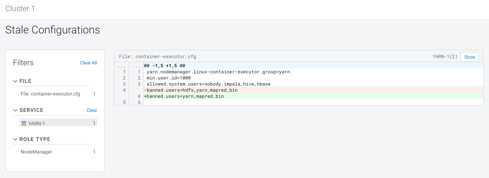
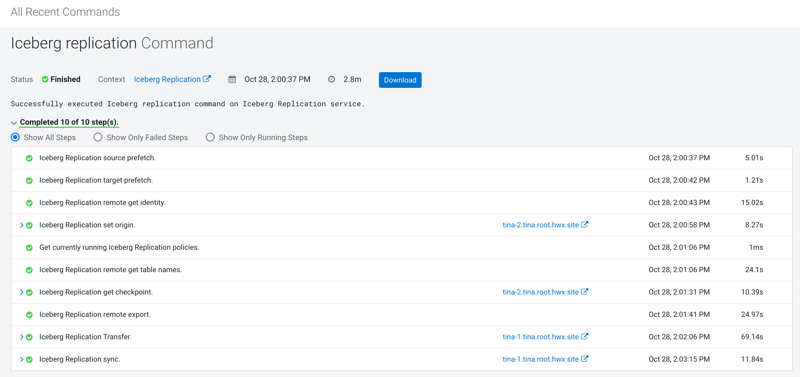

# Iceberg replication using Cloudera Replication Manager
{: .no_toc }

- TOC
{:toc}

---

## 1. Introduction to the test environment

|Source Cluster Name: pvc-base |CDP PvC Base 7.1.9.0   Cloudera Manager 7.11.3   Secured by kerberos with the same KDC Server |
|Target Cluster Name: Cluster 1 |CDP PvC Base 7.1.9.0   Cloudera Manager 7.11.3   Secured by kerberos with the same KDC Server |

## 2. Basic Concept

- Replication Manager is a service in Cloudera Manager. You can create replication policies in this service to replicate HDFS data/Hive tables/Iceberg tables/Ozone buckets/Ranger Policies across data centers. You can also create HDFS, HBase, or Ozone snapshot policies to take snapshots of HDFS directories, HBase tables, or Ozone buckets respectively.

- Iceberg replication policies replicate Iceberg tables between CDP Private Cloud Base 7.1.9 or higher clusters using Cloudera Manager 7.11.3 or higher versions. Iceberg replication policies can:
    - replicate metadata and catalog from the source cluster Hive Metastore (HMS) to target cluster HMS. The catalog is an HDFS file that has a list of data files and manifest files to copy from the source cluster to the target cluster. The manifest files contain the metadata for the data files.
    - replicate data files in the HDFS storage system from the source cluster to the target cluster. The Iceberg replication policy can replicate only between HDFS storage systems. 
    - replicate all the snapshots from the source cluster by default. This allows you to run time travel queries on the target cluster.

## 3. Prerequisites

- It is recommended that the source cluster and target cluster use the same DNS server and KDC server.

- Ensure that the source cluster and target cluster versions are CDP Private Cloud Base 7.1.9 or higher using Cloudera Manager version 7.11.3 or higher versions.

- Enable iceberg feature flag in CORE_SETTINGS configuration on both the clusters.

- Add the Iceberg Replication service on both the clusters.

- Add `dfs.nfs.keytab.file` in core-site.xml safety valves on both the clusters. Note: iceberg replication jobs run the distcp command by the `hdfs` user.
    - Name: dfs.nfs.keytab.file
    - Value: {{CMF_CONF_DIR}}/hdfs.keytab

- The container_executor_banned_users is set as [hdfs, yarn, mapred, bin] by default, this means that the HDFS user is banned to bring up containers. So you have to remove ${hdfs_process_user} from container_executor_banned_users in YARN service of the target cluster.

## 4. Creating Iceberg replication policy

- Login to the CM of the Target Cluster, where you want to replicate the Iceberg table(s) from the Source Cluster. Add Replication Peer by navigating to Replication->select Peers->Click on Add

    - Note: Please tick the checkbox "Create User With Admin Role" which means to add the peer as an admin peer. This option is mandatory to create Ranger replication policies.

- Go to the Cloudera Manager > Replication > Replication Policies page in the target cluster where the peer is set up. 

- Click Create Replication Policy > Iceberg Replication Policy. The Create Iceberg Replication Policy wizard appears.

- Configure the following options on the General tab.

- The options on the Resources tab can remain as default. Click Save. 

- The replication policy appears on the Replication Policies page. Because we selected Immediate in the Schedule field, the replication job starts replicating after clicking Save Policy.

- After the replication is completed, let's compare the number of records for table `tiger_airlines.countries_kafka_iceberg` on both the clusters. The results are both 252. It shows that `tiger_airlines.countries_kafka_iceberg` is the only table that meets the filter conditions and has been successfully synchronized to the target cluster.

## 5. High-level steps during the replication process

- Click Actions > Show History for a replication policy on the Replication Policies page to view the Replication History page.

- We can see the high-level steps on the All Recent Commands window.
    - Determines the tables to replicate depending on the choice you made during the Iceberg replication policy creation process.
    - Reads the table names to fetch the checkpoint for the tables from the target cluster HMS. A checkpoint is the metadata about the latest Iceberg snapshot for a table on the target cluster and is saved in an HDFS file.
    - Initiates the exportCLI command in the source cluster to generate a list of files (manifest files, data files, and delete files) to copy from the source cluster to the target cluster.
    - Copies the files from the source cluster to the target cluster using DistCp jobs which takes advantage of the transfer bandwidth of the target cluster.
    - The job copies the data files directly to the target data root directory, and it copies the metadata files to a temporary staging location where it is further processed as explained in the next step.
    - Transforms the copied manifest files to point to the correct manifest files pointers and data files on the target cluster, deletes the pre-transformed manifest files, and updates the target HMS with the latest snapshot.

- The following graph is the low Level Architecture.

## 6. Conclusion

- Iceberg replication policies replicate Iceberg tables between CDP Private Cloud Base 7.1.9 or higher clusters using Cloudera Manager 7.11.3 or higher versions.
- Current Limitations:
    - Iceberg replication does not support tables stored on ozone
    - A bug exists when there are tables saved as ozone on the source & target cluster
    - Iceberg replication from many source to a target cluster is also not supported
