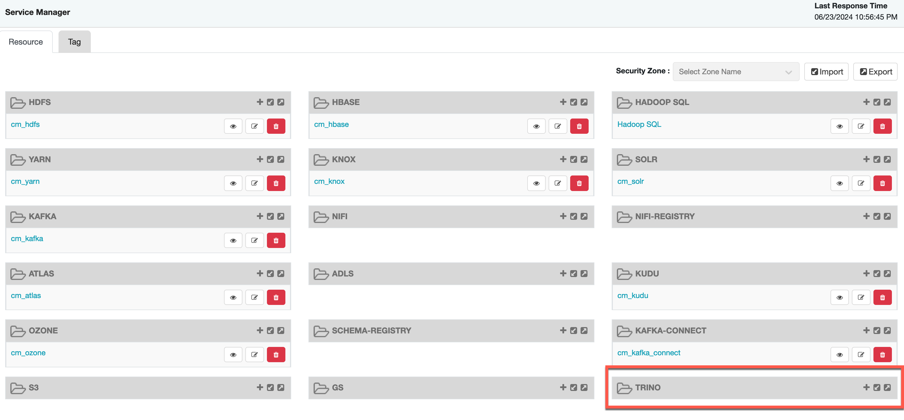
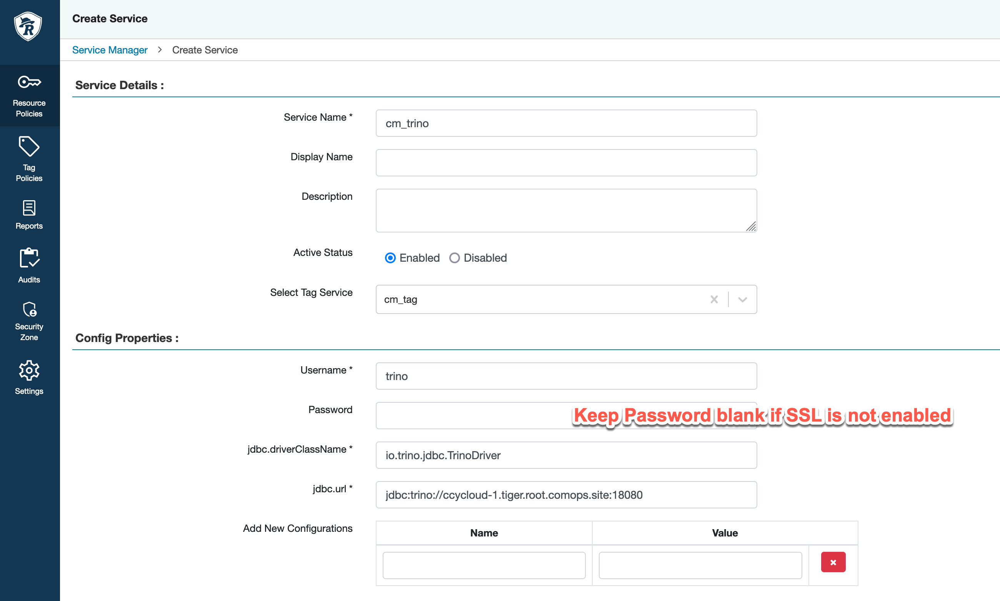

# Integrate Trino with Apache Ranger in CDP
{: .no_toc }

- TOC
{:toc}

---

## 1. Introduction to the test environment

|CDP Runtime version |CDP PvC Base 7.1.9.14|
|CM version |Cloudera Manager 7.11.3.9|
|Trino |3.8.9|
|Apache Ranger |2.4.0|
|OS version |Redhat 8.8|
|Whether to enable Kerberos |Yes|
|Whether to enable TLS |No|
|Kerberos |FreeIPA|
|Install Method |Internet|

## 2. Basic Concept

- Trino (previously PrestoSQL) is a SQL query engine that you can use to run queries on data sources such as HDFS, object storage, relational databases, and NoSQL databases. It eliminates the need to migrate data into a central location and allows you to query the data from whenever it sits.

- The Apache Ranger plugin for Trino supports all the functionality of the Trino query engine that is protected by fine-grained access control. This includes database, table, column level access controls and row filtering and data masking. Apache Ranger policies can include grant policies and deny policies to users and groups. 

## 3. Prerequisites

- You have kerberized CDP Base 7.1.9 cluster and Trino-389 server.
    - Trino-389 is the last release which supports Java 11, with a minimum required version of 11.0.15. 

- The Hive catalog allows Trino querying data stored in hive tables.
    - Trino installation: `/opt/trino`
    - Ranger plugin: `/opt/trino/plugin/ranger`
    - Ranger policy sync location: `/etc/ranger/cm_trino`

## 4. Build trino plugin

- The installation of Apache Maven is a simple process of extracting the archive and adding the bin directory with the mvn command to the PATH.

```bash
wget https://mirrors.tuna.tsinghua.edu.cn/apache/maven/maven-3/3.9.8/binaries/apache-maven-3.9.8-bin.tar.gz --no-check-certificate
tar -xf apache-maven-3.9.8-bin.tar.gz -C /usr/local/  

vi ~/.bash_profile
# adding the following three lines
export PATH=$PATH:/usr/local/apache-maven-3.9.8/bin/
export JAVA_HOME=/usr/lib/jvm/java-11/
export PATH=$JAVA_HOME/bin:$PATH

source ~/.bash_profile
yum install git gcc -y  
```

- Confirm with mvn -v in a new shell.
```bash
mvn -v
Apache Maven 3.9.8 (36645f6c9b5079805ea5009217e36f2cffd34256)
Maven home: /usr/local/apache-maven-3.9.8
Java version: 11.0.23, vendor: Red Hat, Inc., runtime: /usr/lib/jvm/java-11-openjdk-11.0.23.0.9-3.el8.x86_64
Default locale: en_US, platform encoding: ANSI_X3.4-1968
OS name: "linux", version: "5.4.243-1.el7.elrepo.x86_64", arch: "amd64", family: "unix"
```

- The Ranger version in CDP Base 7.1.9 cluster is 2.4.0, so we need to download Apache ranger 2.4.0 and compile it to get the trino-ranger-plugin.
```bash
wget https://github.com/apache/ranger/archive/release-ranger-2.4.0.tar.gz
tar zxvf release-ranger-2.4.0.tar.gz
cd ranger-release-ranger-2.4.0
```

- You have to disable the distro linux profile and pick a few modules manually to make it work:
```bash
nohup mvn clean package -DskipTests -P ranger-trino-plugin,-linux -am -pl distro,plugin-trino,ranger-trino-plugin-shim,agents-installer,credentialbuilder
```


- You can see the package `ranger-2.4.0-trino-plugin.tar.gz` in the `target` directory.
```bash
ls -l ~/ranger-release-ranger-2.4.0/target
total 57156
drwxr-xr-x 2 root root     4096 Jun 22 07:59 antrun
drwxr-xr-x 3 root root     4096 Jun 22 07:59 maven-shared-archive-resources
-rw-r--r-- 1 root root 58510888 Jun 22 08:00 ranger-2.4.0-trino-plugin.tar.gz
-rw-r--r-- 1 root root        5 Jun 22 07:59 version
```


## 5. Install trino-ranger-plugin

- SSH to the first master node of your CDP cluster where Trino coordinator is installed as trino user.

- Navigate to trino-ranger-plugin package `ranger-2.4.0-trino-plugin.tar.gz`.
```bash
tar xfzv ranger-2.4.0-trino-plugin.tar.gz
```

- Update the following entries in the install.properties file.

```bash
cd ~/ranger-2.4.0-trino-plugin
cp install.properties install.properties.orig

vi ~/ranger-2.4.0-trino-plugin/install.properties
# modify the following five lines
# Note the value of REPOSITORY_NAME as it is needed later.
POLICY_MGR_URL=http://ccycloud-1.tiger.root.comops.site:6080
REPOSITORY_NAME=cm_trino
COMPONENT_INSTALL_DIR_NAME=/opt/trino
CUSTOM_GROUP=trino
XAAUDIT.SUMMARY.ENABLE=false
```

- Run the enable-trino-plugin.sh script as the root user.
```bash
./enable-trino-plugin.sh
Custom user is available, using custom user and default group.
INFO: Creating /opt/trino/plugin/ranger
+ Sun Jun 23 07:39:14 PDT 2024 : trino: lib folder=/opt/trino/plugin/ranger conf folder=/opt/trino/etc
+ Sun Jun 23 07:39:14 PDT 2024 : Saving current config file: /opt/trino/etc/ranger-policymgr-ssl.xml to /opt/trino/etc/.ranger-policymgr-ssl.xml.20240623-073914 ...
+ Sun Jun 23 07:39:15 PDT 2024 : Saving current config file: /opt/trino/etc/ranger-trino-audit.xml to /opt/trino/etc/.ranger-trino-audit.xml.20240623-073914 ...
+ Sun Jun 23 07:39:15 PDT 2024 : Saving current config file: /opt/trino/etc/ranger-trino-security.xml to /opt/trino/etc/.ranger-trino-security.xml.20240623-073914 ...
+ Sun Jun 23 07:39:16 PDT 2024 : Saving current JCE file: /etc/ranger/cm_trino/cred.jceks to /etc/ranger/cm_trino/.cred.jceks.20240623073916 ...
Property -Dlogback.configurationFile added successfully with : '/opt/trino/etc/trino-ranger-plugin-logback.xml'
Add or Update properties file: [/opt/trino/etc/access-control.properties] ...
sed: can't read /opt/trino/etc/access-control.properties: No such file or directory
Property access-control.name added successfully with : 'ranger'
Linking config files
Ranger Plugin for trino has been enabled. Please restart trino to ensure that changes are effective.
```

- Navigate to the Trino config directory /etc/trino/conf. Update the access-control.properties file by adding the following entries.
```bash
vi /opt/trino/etc/access-control.properties
access-control.name=ranger
#add the following two lines
ranger.principal=trino@TIGER.COM
ranger.keytab=/opt/trino/connector/hive/trino.keytab
```

- You have to copy the `core-site.xml` to the ranger plugin conf folder `/opt/trino/etc` for kerberos requirements.
```bash
cp /etc/hive/conf/core-site.xml /opt/trino/etc
```

## 6. install the Trino service definition

- Access Apache Ranger UI. Change the role of the `Trino` user to Admin. Admin role is required to download policies.


- SSH into the Apache Ranger Admin server. 

- We need to create a plugin directory for trino and place three jar files: `ranger-trino-plugin-2.4.0.jar`, `trino-jdbc-389.jar`, `trino-spi-389.jar`.
```bash
mkdir /opt/cloudera/parcels/CDH/lib/ranger-admin/ews/webapp/WEB-INF/classes/ranger-plugins/trino
cp -p /opt/trino/plugin/ranger/ranger-trino-plugin-impl/ranger-trino-plugin-2.4.0.jar /opt/cloudera/parcels/CDH/lib/ranger-admin/ews/webapp/WEB-INF/classes/ranger-plugins/trino/
wget -O /opt/cloudera/parcels/CDH/lib/ranger-admin/ews/webapp/WEB-INF/classes/ranger-plugins/trino/trino-jdbc-389.jar https://repo1.maven.org/maven2/io/trino/trino-jdbc/389/trino-jdbc-389.jar
wget -O /opt/cloudera/parcels/CDH/lib/ranger-admin/ews/webapp/WEB-INF/classes/ranger-plugins/trino/trino-spi-389.jar https://repo1.maven.org/maven2/io/trino/trino-spi/389/trino-spi-389.jar
```

- Uninstall the Trino server plugin, if it exists. Run the following command. If this errors out with a Service not found error, this means the Trino server plugin wasn't installed on your server. Proceed to the next step.
```bash
curl -f -u *<admin users login>*:*_<_**_password_ **_for_** _ranger admin user_**_>_* -X DELETE -k 'https://*<RANGER SERVER ADDRESS>*:6182/service/public/v2/api/servicedef/name/trino'
```

- Download the service definition and Apache Ranger Admin server plugin. In a temporary directory, download the service definition. This service definition is supported by Ranger 2.4 versions.
```bash
wget https://raw.githubusercontent.com/apache/ranger/ranger-2.4/agents-common/src/main/resources/service-defs/ranger-servicedef-trino.json
```

- Register the Apache Trino service definition for CDP Base cluster.
```bash
curl -u *<admin users login>*:*_<_**_password_ **_for_** _ranger admin user_**_>_* -X POST -d @ranger-servicedef-trino.json \
-H "Accept: application/json" \
-H "Content-Type: application/json" \
-k 'https://*<RANGER SERVER ADDRESS>*:6180/service/public/v2/api/servicedef'
```


- If this command runs successfully, you see a new service in your Ranger Admin UI called TRINO, as shown in the following image.



- Add a new service under Trino using the same service name you provided as the repository name in `install.properties`.
```bash
service name: cm_trino
username: trino
jdbc.driverClassName: io.trino.jdbc.TrinoDriver
jdbc.url: jdbc:trino://ccycloud-1.tiger.root.comops.site:18080
```



- Click the Test Connection button.


- You can see the default 9 policies in the service `cm_trino`.


- Please restart Trino coordinator which is installing trino-ranger-plugin. You can see ranger plugin working well in `server.log`.


## 7. Conclusion

- Trino can be perfectly integrated with the ranger in the CDP Base 7.1.9 cluster.

