# Add Cloudera Data Engineering service and demo it
{: .no_toc }

- TOC
{:toc}

---

## 1. Introduction to the test environment

|CDP Runtime version |CDP PvC Base 7.1.7 SP1|
|CM version |Cloudera Manager 7.6.5|
|ECS version |CDP PvC DataServices 1.4.0|
|Whether to enable Kerberos |Yes|
|Whether to enable TLS |Yes|
|Auto-TLS |No, using manual TLS|

|IP addresss |hostname |description|
|10.113.207.140	|feng-base.sme-feng.athens.cloudera.com |CDP Base cluster, only a single node|
|10.113.207.141	|feng-ws1.sme-feng.athens.cloudera.com |ECS master node 1|
|10.113.207.142	|feng-ws2.sme-feng.athens.cloudera.com |ECS worker node 1|
|10.113.207.143	|feng-ws3.sme-feng.athens.cloudera.com |ECS worker node 2|

## 2. Enable new CDE service

- Log into the CDP Private Cloud console as the local administrator `admin`

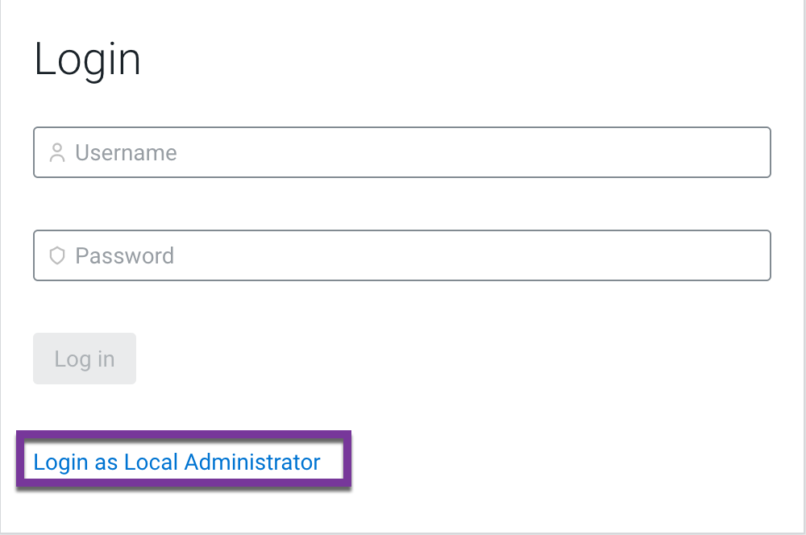

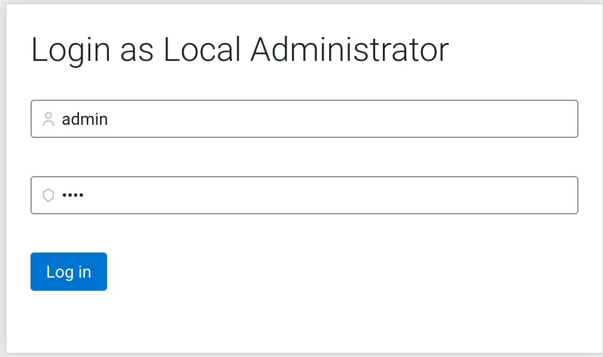

- Navigate to the Cloudera Data Engineering Overview page by clicking the Data Engineering tile in the CDP Private Cloud console.

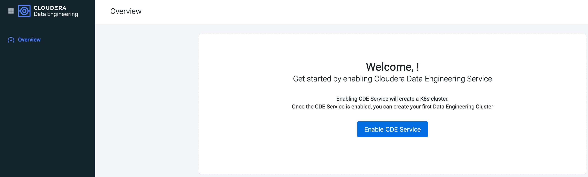

- Click the `Enable CDE Service` button to enable CDE for an environment. Enter a Name for the CDE service you are creating. In the Environment text box, select the correct environment and click Enable.

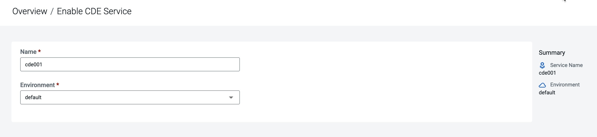

- The CDE service initialization is ready.

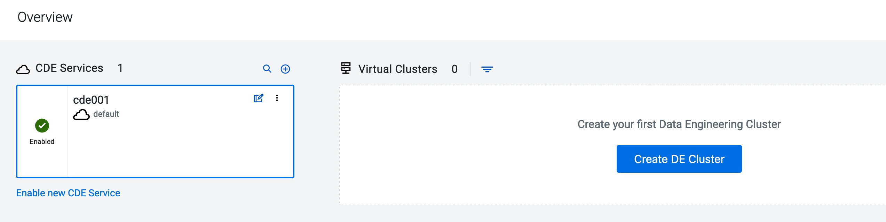


## 3. Create a Virtual Cluster

- Click the `Create DE Cluster` button to create a virtual cluster for an environment.
   - Enter a Cluster Name. Cluster names must begin with a letter, be between 3 and 30 characters (inclusive) and contain only alphanumeric characters and hyphens
   - Select the CDE Service to create the virtual cluster in.
   - Select the Spark Version to use in the virtual cluster.
   - Click Create.

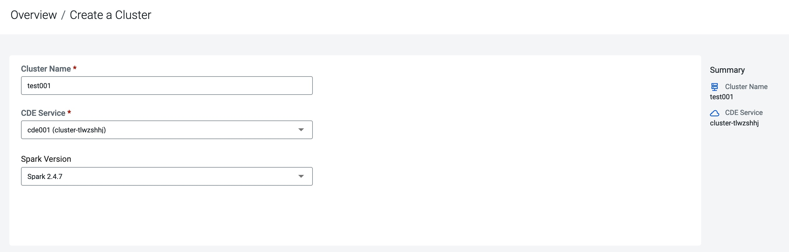

- The CDE virtual cluster is ready.

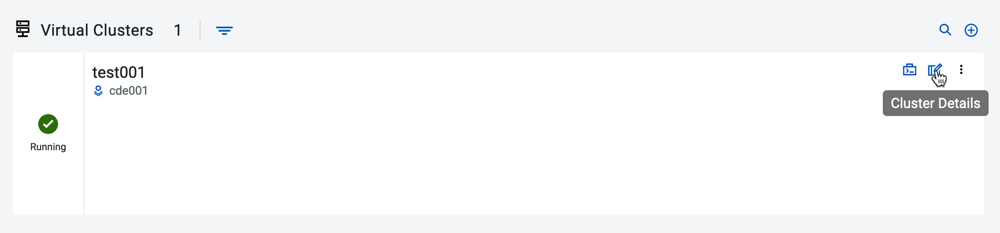

- Click Cluster Details. Click JOBS API URL to copy the URL to your clipboard. In this case JOBS API URL is `https://zpfflxrf.cde-tlwzshhj.apps.ecs-lb.sme-feng.athens.cloudera.com/dex/api/v1`

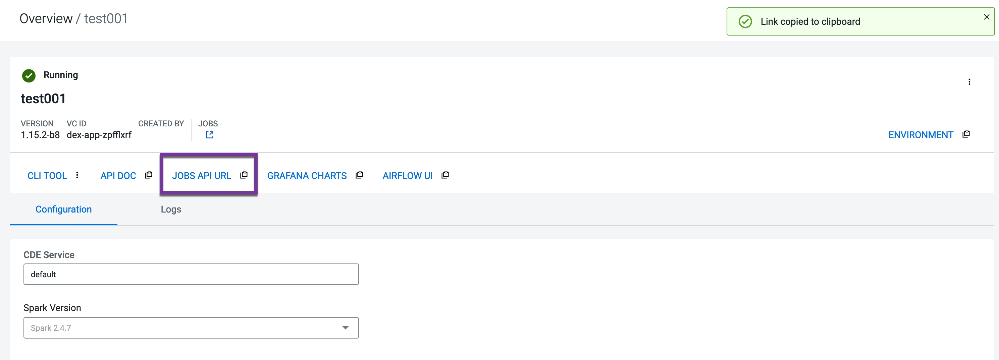

- Open SSH terminal for ECS server node and download cdp-cde-utils.sh
```bash
mkdir -p /tmp/cde-1.4.0 && cd /tmp/cde-1.4.0
wget https://docs.cloudera.com/data-engineering/1.3.4/cdp-cde-utils.sh
chmod +x cdp-cde-utils.sh
```

- Create a filename containing the user principal, and generate a keytab or copy keytab from other hosts. In this case the files are `dexuser.principal` and `dexuser.keytab`

```bash
$ cat /home/centos/dexuser.principal
dexuser@ATHENS.CLOUDERA.COM

$ klist -kt /home/centos/dexuser.keytab
Keytab name: FILE:dexuser.keytab
KVNO Timestamp         Principal
---- ----------------- --------------------------------------------------------
   1 01/01/70 00:00:00 dexuser@ATHENS.CLOUDERA.COM
```
 
-  Configure TLS for Cluster's Jobs API

```bash
# export host=zpfflxrf.cde-tlwzshhj.apps.ecs-lb.sme-feng.athens.cloudera.com

# cd /tmp/cde-1.4.0

# ./cdp-cde-utils.sh init-virtual-cluster -h $host -a
........
INFO : Creating secrets out of TLS certs
INFO : Running command: bash -c "kubectl create secret tls tls-dex-base --cert=/tmp/cdp-cde-utils-tmp/certs/ssl.crt --key=/tmp/cdp-cde-utils-tmp/certs/ssl.key -o yaml --dry-run | kubectl apply -f - -n dex-base-tlwzshhj"
W0626 07:30:49.568860    1813 helpers.go:557] --dry-run is deprecated and can be replaced with --dry-run=client.
secret/tls-dex-base created
........
INFO : Exit code = 0
```

- Add backend user `dexuser` which is allowed to run Jobs

```bash
# export host=zpfflxrf.cde-tlwzshhj.apps.ecs-lb.sme-feng.athens.cloudera.com

# cd /tmp/cde-1.4.0

# ./cdp-cde-utils.sh init-user-in-virtual-cluster -h $host -u admin -p /home/centos/dexuser.principal -k /home/centos/dexuser.keytab
INFO : Deleting old secrets in dex-app-zpfflxrf..
INFO : Running command: bash -c "kubectl delete --ignore-not-found=true secret admin-krb5-secret    -n dex-app-zpfflxrf"
INFO : Exit code = 0
INFO : Running command: bash -c "kubectl delete --ignore-not-found=true secret admin-krb5-principal -n dex-app-zpfflxrf"
INFO : Exit code = 0
INFO : Temporarily copying files to desired names..
INFO : Running command: bash -c "cp /home/centos/dexuser.keytab    admin-krb5-secret"
INFO : Exit code = 0
INFO : Running command: bash -c "cp /home/centos/dexuser.principal admin-krb5-principal"
INFO : Exit code = 0
INFO : Creating new secrets in dex-app-zpfflxrf..
INFO : Running command: bash -c "kubectl create secret generic admin-krb5-principal --from-file=./admin-krb5-principal -n dex-app-zpfflxrf"
secret/admin-krb5-principal created
INFO : Exit code = 0
INFO : Running command: bash -c "kubectl create secret generic admin-krb5-secret    --from-file=./admin-krb5-secret     -n dex-app-zpfflxrf"
secret/admin-krb5-secret created
INFO : Exit code = 0
INFO : Deleting temporary files..
INFO : Running command: bash -c "rm admin-krb5-secret admin-krb5-principal"
INFO : Exit code = 0

# ./cdp-cde-utils.sh init-user-in-virtual-cluster -h $host -u feng.xu -p /home/centos/dexuser.principal -k /home/centos/dexuser.keytab
......
```

## 3. Configure the CDE CLI client

**_NOTE:_** The CDE CLI can only be accessed by AD/LDAP users, so the Local admin account wont work here. You need to make sure your ad/ldap account is setup as a PowerUser.

- In the Virtual Clusters column on the right, click the Cluster Details icon on the virtual cluster.


- Click the link under CLI TOOL to download the CLI client

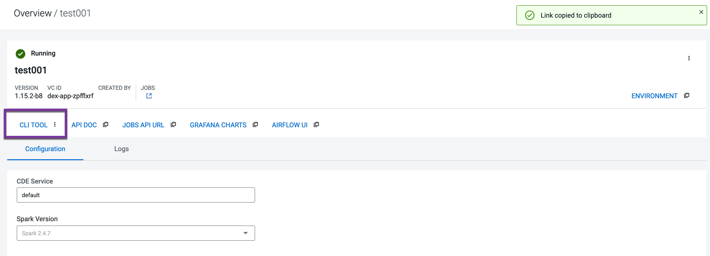

- Open terminal on your computer and move cde binary to ~/cde
```bash
$ mkdir -p ~/cde/bin
$ cd ~/cde/bin
$ file cde
cde: Mach-O 64-bit executable x86_64
$ chmod +x ~/cde/bin/cde
$ echo 'export PATH="~/cde/bin:$PATH"' >> ~/.bash_profile
$ source ~/.bash_profile
```

- Create a /.cde directory and config ~/.cde/config.yaml.
```bash
export host=zpfflxrf.cde-tlwzshhj.apps.ecs-lb.sme-feng.athens.cloudera.com
export user=feng.xu
echo "user: $user
vcluster-endpoint: https://$host/dex/api/v1" > ~/.cde/config.yaml
```

- test cde cli
```bash
$ cde job list --tls-insecure
WARN: Plaintext or insecure TLS connection requested, take care before continuing. Continue? yes/no [no]: yes
API User Password:
[
  {
    "name": "access-logs-ETL",
    "type": "spark",
    "created": "2022-06-26T08:48:20Z",
    "modified": "2022-06-26T08:48:20Z",
    "retentionPolicy": "keep_indefinitely",
......
]
```bash

## 4. Demo1: Create a Job by CDE UI

- Download file `access-logs-ETL.py` and `access-log.txt`.
```bash
wget https://www.cloudera.com/content/dam/www/marketing/tutorials/cdp-getting-started-with-cloudera-data-engineering/tutorial-files.zip
```

- Open file `access-logs-ETL.py` and modify input_path ='/tmp/access-log.txt'. Change to access data on hdfs not s3.
```bash
# vi access-logs-ETL.py
......
input_path ='/tmp/access-log.txt'
......
```

- Open SSH terminal for CDP Base master node and upload file to HDFS 
```bash
kinit -kt dexuser.keytab dexuser
hdfs dfs -put access-log.txt /tmp
```

- Log in to Ranger Admin UI. Navigate to the Service Manager > Hadoop_SQL Policies > Access section, and provide `dexuser` user
permission to the `all-database` policy name.

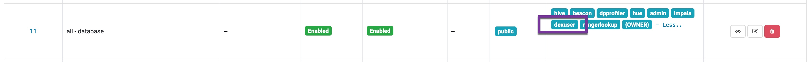

- In the Virtual Clusters column on the right, click the View Jobs icon on the virtual cluster.

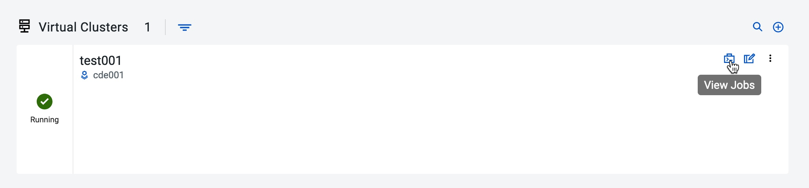


- In the left hand menu, click Resources. and then click the Create Resource button.
   - Resource Name - testjob1
   - Type - file

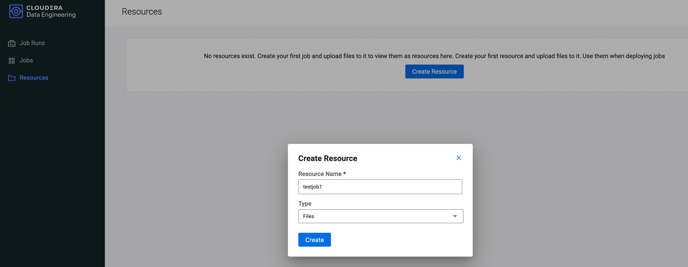

- Click Upload Files button and select `access-logs-ETL.py` from your computer.

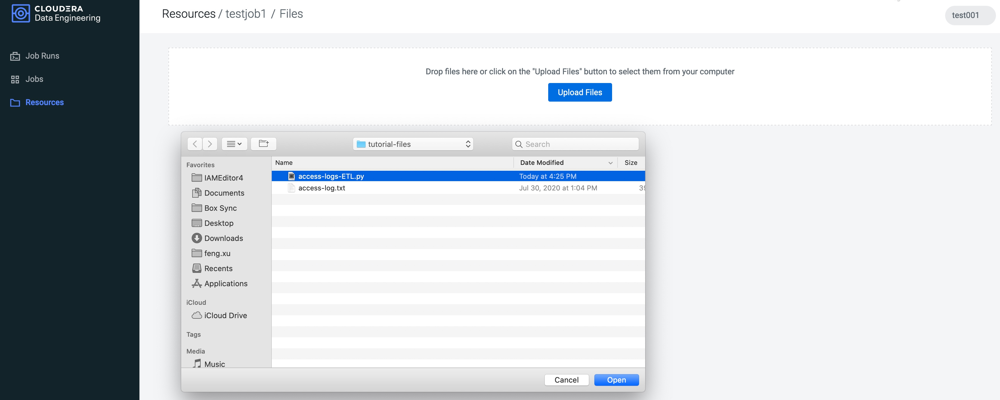

- Resource `testjob1` is ready.

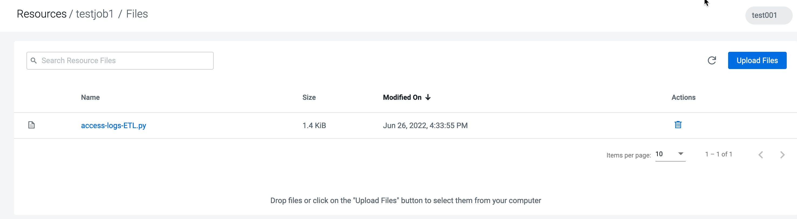

- In the left hand menu, click Jobs. and then click the Create Job button.

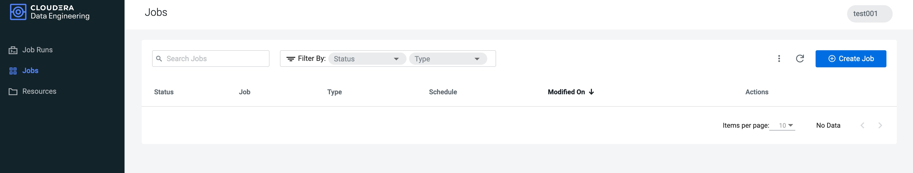

- Provide the Job Details:
   - Select Spark for the job type -  Spark 2.4.7
   - Specify the Name - access-logs-ETL
   - Select from Resource - access-logs-ETL.py
   - Select Python 3
   - Turn off Schedule
   - Create and Run

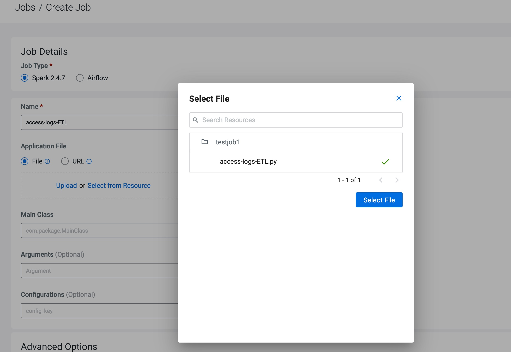

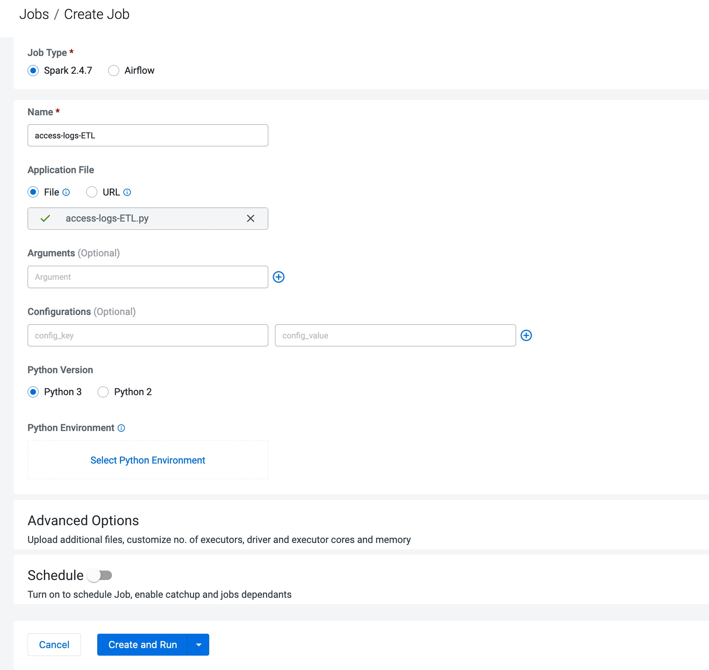

- Job `access-logs-ETL` is ready and run successfully.


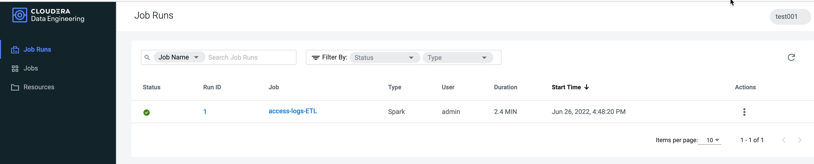

- If your CDW is running, open up HUE and verify the `retail` db and `tokenized_accesss_logs` table data that was prepped by your CDE job.


## 5. Demo2: Create a Job by CDE CLI

- Download file `access-logs-ETL.py` and `access-log.txt`.
```bash
wget https://www.cloudera.com/content/dam/www/marketing/tutorials/cdp-using-cli-api-to-automate-access-to-cloudera-data-engineering/tutorial-files.zip
```

- modify file `Data_Extraction_Sub_150k.py` and `Data_Extraction_Over_150k.py`. Change to access data on hdfs not s3.
```console

# in *Sub_150k.py
- input_path ='s3a://usermarketing-cdp-demo/tutorial-data/data-engineering/PPP-Sub-150k-TX.csv'
+ input_path = '/tmp/PPP-Sub-150k-TX.csv'

# in *Over_150k.py
- input_path ='s3a://usermarketing-cdp-demo/tutorial-data/data-engineering/PPP-Over-150k-ALL.csv'
+ input_path = '/tmp/PPP-Over-150k-ALL.csv'

# A sed script will fix up the files
sed -i '' 's?s3a://usermarketing-cdp-demo/tutorial-data/data-engineering?/tmp?g' *.py
```

- Open SSH terminal for CDP Base master node and upload file to HDFS 
```bash
kinit -kt dexuser.keytab dexuser
hdfs dfs -put *.csv /tmp
```

- Open terminal on your computer and create a resource
```bash
cde resource create --name "cde_ETL"  --tls-insecure
cde resource upload --local-path "Data_Extraction*.py" --name "cde_ETL" --tls-insecure
cde resource describe --name "cde_ETL" --tls-insecure
```

- Run adhoc spark job
```bash
cde spark submit --conf "spark.pyspark.python=python3" Data_Extraction_Sub_150k.py --tls-insecure
```

- Check Job Status
```bash
cde run describe --tls-insecure --id #, where # is the job id
cde run logs --type "submitter/jobs_api" --tls-insecure --id #, where # is the job id
```

- If your CDW is running, open up HUE and verify the `texasapp` db and `loan_data` table data that was prepped by your CDE job.

- create job and schedule
```bash
cde job create --name "Over_150K_ETL" \
          --type spark \
          --conf "spark.pyspark.python=python3" \
          --application-file "Data_Extraction_Over_150k.py" \
          --cron-expression "0 */1 * * *" \
          --schedule-enabled "true" \
          --schedule-start "2022-06-26" \
          --schedule-end "2022-06-29" \
          --mount-1-resource "cde_ETL" \
          --tls-insecure
```

- Confirm scheduling
```bash
cde job list --filter 'name[like]%ETL%' --tls-insecure
```

- View Job Runs
```bash
cde run list --filter 'job[like]%ETL%' --tls-insecure
```

## 6. Demo3: Orchestrate CDE jobs by Airflow
