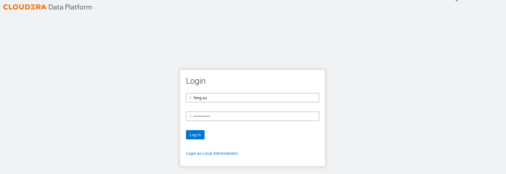

# Add Cloudera Data Engineering service and demo it
{: .no_toc }

- TOC
{:toc}

---

## 1. Introduction to the test environment

|CDP Runtime version |CDP PvC Base 7.1.7 SP1|
|CM version |Cloudera Manager 7.6.5|
|ECS version |CDP PvC DataServices 1.4.0|
|OS version |Centos 7.9|
|K8S version |RKE 1.21|
|Whether to enable Kerberos |Yes|
|Whether to enable TLS |Yes|
|Auto-TLS |No, using manual TLS|
|Kerberos |AD|
|LDAP |AD|
|DB Configuration |External Postgres 12|
|Vault |Embedded|
|Docker registry |Embedded|
|Install Method |Internet|

|IP addresss |hostname |description|
|192.168.8.140	|ds00.ecs.openstack.com |CDP Base cluster, only a single node|
|192.168.8.141	|ds01.ecs.openstack.com |ECS master node 1|
|192.168.8.142	|ds02.ecs.openstack.com |ECS worker node 1|
|192.168.8.143	|ds03.ecs.openstack.com |ECS worker node 2|

## 2. Enable new CDE service

- Log into the CDP Private Cloud console as the local administrator `admin`


- Navigate to the Cloudera Data Engineering Overview page by clicking the Data Engineering tile in the CDP Private Cloud console.


- Click the `Enable CDE Service` button to enable CDE for an environment. Enter a Name for the CDE service you are creating. In the Environment text box, select the correct environment and click Enable.


- The CDE service initialization is now complete.


## 3. Create a Virtual Cluster

- Click the `Create DE Cluster` button to create a virtual cluster for an environment.
   - Enter a Cluster Name. Cluster names must begin with a letter, be between 3 and 30 characters (inclusive) and contain only alphanumeric characters and hyphens
   - Select the CDE Service to create the virtual cluster in.
   - Select the Spark Version to use in the virtual cluster.
   - Click `Create`.


- The CDE virtual cluster is ready.


- Click `Cluster Details`, and then click `JOBS API URL` to copy the URL to your clipboard. In this case JOBS API URL is `https://zpfflxrf.cde-tlwzshhj.apps.ecs-lb.ecs.openstack.com/dex/api/v1`


- Open SSH terminal for ECS server node and download cdp-cde-utils.sh
```bash
mkdir -p /tmp/cde-1.4.0 && cd /tmp/cde-1.4.0
wget https://docs.cloudera.com/data-engineering/1.3.4/cdp-cde-utils.sh
chmod +x cdp-cde-utils.sh
```

- Create a filename containing the user principal, and generate a keytab or copy keytab from other hosts. In this case the files are `dexuser.principal` and `dexuser.keytab`

```bash
$ cat /home/centos/dexuser.principal
dexuser@ECS.OPENSTACK.COM

$ klist -kt /home/centos/dexuser.keytab
Keytab name: FILE:dexuser.keytab
KVNO Timestamp         Principal
---- ----------------- --------------------------------------------------------
   1 01/01/70 00:00:00 dexuser@ECS.OPENSTACK.COM
```
 
-  Configure TLS for Cluster's Jobs API

```bash
# export host=zpfflxrf.cde-tlwzshhj.apps.ecs-lb.ecs.openstack.com

# cd /tmp/cde-1.4.0

# ./cdp-cde-utils.sh init-virtual-cluster -h $host -a
........
INFO : Creating secrets out of TLS certs
INFO : Running command: bash -c "kubectl create secret tls tls-dex-base --cert=/tmp/cdp-cde-utils-tmp/certs/ssl.crt --key=/tmp/cdp-cde-utils-tmp/certs/ssl.key -o yaml --dry-run | kubectl apply -f - -n dex-base-tlwzshhj"
W0626 07:30:49.568860    1813 helpers.go:557] --dry-run is deprecated and can be replaced with --dry-run=client.
secret/tls-dex-base created
........
INFO : Exit code = 0
```

- Add backend user `dexuser` which is allowed frontend user `admin` & `feng.xu` to run Jobs.

```bash
# export host=zpfflxrf.cde-tlwzshhj.apps.ecs-lb.ecs.openstack.com

# cd /tmp/cde-1.4.0

# ./cdp-cde-utils.sh init-user-in-virtual-cluster -h $host -u admin -p /home/centos/dexuser.principal -k /home/centos/dexuser.keytab
INFO : Deleting old secrets in dex-app-zpfflxrf..
INFO : Running command: bash -c "kubectl delete --ignore-not-found=true secret admin-krb5-secret    -n dex-app-zpfflxrf"
INFO : Exit code = 0
INFO : Running command: bash -c "kubectl delete --ignore-not-found=true secret admin-krb5-principal -n dex-app-zpfflxrf"
INFO : Exit code = 0
INFO : Temporarily copying files to desired names..
INFO : Running command: bash -c "cp /home/centos/dexuser.keytab    admin-krb5-secret"
INFO : Exit code = 0
INFO : Running command: bash -c "cp /home/centos/dexuser.principal admin-krb5-principal"
INFO : Exit code = 0
INFO : Creating new secrets in dex-app-zpfflxrf..
INFO : Running command: bash -c "kubectl create secret generic admin-krb5-principal --from-file=./admin-krb5-principal -n dex-app-zpfflxrf"
secret/admin-krb5-principal created
INFO : Exit code = 0
INFO : Running command: bash -c "kubectl create secret generic admin-krb5-secret    --from-file=./admin-krb5-secret     -n dex-app-zpfflxrf"
secret/admin-krb5-secret created
INFO : Exit code = 0
INFO : Deleting temporary files..
INFO : Running command: bash -c "rm admin-krb5-secret admin-krb5-principal"
INFO : Exit code = 0

# ./cdp-cde-utils.sh init-user-in-virtual-cluster -h $host -u feng.xu -p /home/centos/dexuser.principal -k /home/centos/dexuser.keytab
......
```

## 4. Assign CDE resources to end user

- Log out the CDP Private Cloud console and then login as user `feng.xu`




- User `feng.xu` cannot see any CDE objects because it is not assigned any roles or resources. 


- You have to login as the local administrator `admin` again.

- Navigate to Management Console > Environments, and select environment `default` by clicking on it.


- The Environment Clusters page appears. Click Actions. Click Manage Access in the dropdown list.


- In the Access tab, enter the name of the user in the Select group or user text box.


- The Update Resource Roles window appears. Select the resource role `DEUser`. Click Update Roles.


- User `feng.xu` can access CDW objects now.


## 5. Configure the CDE CLI client

> The CDE CLI can only be accessed by AD/LDAP users, so the Local admin account wont work here. You need to make sure your ad/ldap account is setup as a PowerUser.

- In the Virtual Clusters column on the right, click the `Cluster Details` icon on the virtual cluster.


- Click the link under `CLI TOOL` to download the CLI client.


- Open terminal on your computer and move cde client binary to `~/cde/bin`.
```bash
$ mkdir -p ~/cde/bin
$ cd ~/cde/bin
$ file cde
cde: Mach-O 64-bit executable x86_64
$ chmod +x ~/cde/bin/cde
$ echo 'export PATH="~/cde/bin:$PATH"' >> ~/.bash_profile
$ source ~/.bash_profile
```

- Create a `/.cde` directory and config `~/.cde/config.yaml`.
```bash
export host=zpfflxrf.cde-tlwzshhj.apps.ecs-lb.ecs.openstack.com
export user=feng.xu
echo "user: $user
vcluster-endpoint: https://$host/dex/api/v1" > ~/.cde/config.yaml
```

- test cde cli

```bash
$ cde job list --tls-insecure
WARN: Plaintext or insecure TLS connection requested, take care before continuing. Continue? yes/no [no]: yes
API User Password:
[
  {
    "name": "access-logs-ETL",
    "type": "spark",
    "created": "2022-06-26T08:48:20Z",
    "modified": "2022-06-26T08:48:20Z",
    "retentionPolicy": "keep_indefinitely",
.....
```

## 6. Setup CDE REST API

- In contrast to the CDE CLI client, REST API can run on any server and does not require a cde client binary.

- In the Virtual Clusters column on the right, click the `Cluster Details` icon on the virtual cluster.


- Click `GRAFANA CHARTS` to copy the URL to your clipboard. In this case GRAFANA CHARTS is `https://service.cde-tlwzshhj.apps.ecs-lb.ecs.openstack.com/grafana/d/0Oq0WmQWk/instance-metrics?orgId=1&refresh=5s&var-virtual_cluster_name=test001`.


- Click `JOBS API URL` to copy the URL to your clipboard. In this case JOBS API URL is `https://zpfflxrf.cde-tlwzshhj.apps.ecs-lb.ecs.openstack.com/dex/api/v1`


- Get CDE API access token and job api url.

```bash
yum install epel-release
yum -y install jq
export workload_user=feng.xu
export grafana_charts='https://service.cde-tlwzshhj.apps.ecs-lb.ecs.openstack.com/grafana/d/0Oq0WmQWk/instance-metrics?orgId=1&refresh=5s&var-virtual_cluster_name=test001'
export CDE_TOKEN=$(curl -u ${workload_user} -k $(echo ${grafana_charts} | cut -d'/' -f1-3 | awk '{print $1"/gateway/authtkn/knoxtoken/api/v1/token"}') | jq -r '.access_token')
export CDE_JOB_URL='https://zpfflxrf.cde-tlwzshhj.apps.ecs-lb.ecs.openstack.com/dex/api/v1'
```

- The command needed to make any REST API call is:
```bash
curl -H "Authorization: Bearer ${CDE_TOKEN}" -k -X <request_method> "${CDE_JOB_URL}/<api_command>" <api_options> | jq .
```
    - &lt;request_method&gt; is DELETE, GET, PATCH, POST or PUT; depending on your request
    - &lt;api_command&gt; is the command youd like to execute from [API DOC](https://docs.cloudera.com/data-engineering/1.4.0/jobs-rest-api-reference/index.html)
    - &lt;api_options&gt; are the required options for requested command


## 7. Demo1: Run Spark job by CDE UI

- Download file `tutorial-files.zip` and unzip it.
```bash
wget https://www.cloudera.com/content/dam/www/marketing/tutorials/cdp-getting-started-with-cloudera-data-engineering/tutorial-files.zip
unzip tutorial-files.zip
```

- Open file `access-logs-ETL.py` and change to access data on hdfs not s3.

```bash
# in access-logs-ETL.py
- input_path ='s3a://usermarketing-cdp-demo/tutorial-data/data-engineering'
+ input_path = '/tmp/access-log.txt'

# A sed script will fix up the files.
sed -i '' 's?s3a://usermarketing-cdp-demo/tutorial-data/data-engineering?/tmp/access-log.txt?g' access-logs-ETL.py
```

- Open SSH terminal for CDP Base master node and upload file to HDFS.
```bash
kinit -kt dexuser.keytab dexuser
hdfs dfs -put access-log.txt /tmp
```

- Log in to Ranger Admin UI. Navigate to the Service Manager > Hadoop_SQL Policies > Access section, and provide `dexuser` user
permission to the `all-database` policy name.


- In the Virtual Clusters column on the right, click the `View Jobs` icon on the virtual cluster.


- In the left hand menu, click Resources. and then click the `Create Resource` button.
   - Resource Name - `testjob1`
   - Type - `File`


- Click `Upload Files` button and select `access-logs-ETL.py` from your computer.


- Resource `testjob1` is ready.


- In the left hand menu, click Jobs. and then click the `Create Job` button.


- Provide the Job Details:
   - Select Spark for the job type -  `Spark 2.4.7`
   - Specify the Name - `access-logs-ETL`
   - Select from Resource - `access-logs-ETL.py`
   - Select `Python 3`
   - Turn off Schedule
   - Create and Run


- Job `access-logs-ETL` is ready and run successfully.


- If your CDW is running, open up HUE and verify the `retail` db and `tokenized_accesss_logs` table data that was prepped by your CDE job.


## 8. Demo2: Run Spark job by CDE CLI & API

### 8.1 Prerequisites

- Download file `tutorial-files.zip` and unzip it.
```bash
wget https://www.cloudera.com/content/dam/www/marketing/tutorials/cdp-using-cli-api-to-automate-access-to-cloudera-data-engineering/tutorial-files.zip
unzip tutorial-files.zip
```

- modify file `Data_Extraction_Sub_150k.py` and `Data_Extraction_Over_150k.py`. Change to access data on hdfs not s3.

```bash
# in Data_Extraction_Sub_150k.py
- input_path ='s3a://usermarketing-cdp-demo/tutorial-data/data-engineering/PPP-Sub-150k-TX.csv'
+ input_path = '/tmp/PPP-Sub-150k-TX.csv'

# in Data_Extraction_Over_150k.py
- input_path ='s3a://usermarketing-cdp-demo/tutorial-data/data-engineering/PPP-Over-150k-ALL.csv'
+ input_path = '/tmp/PPP-Over-150k-ALL.csv'

# A sed script will fix up the files
sed -i '' 's?s3a://usermarketing-cdp-demo/tutorial-data/data-engineering?/tmp?g' *.py
```

- Open SSH terminal for CDP Base master node and upload file to HDFS 
```bash
kinit -kt dexuser.keytab dexuser
hdfs dfs -put *.csv /tmp
```

### 8.2 Run spark job only once by CDE CLI

- Open terminal on your computer and use the spark submit command.
```bash
cde spark submit --conf "spark.pyspark.python=python3" Data_Extraction_Sub_150k.py --tls-insecure
```

- Check Job Status and review the output.
```bash
export JOB_ID=1
cde run describe --tls-insecure --id ${JOB_ID}
cde run logs --type "submitter/jobs_api" --tls-insecure --id ${JOB_ID}
```

- If your CDW is running, open up HUE and verify the `texasapp` db and `loan_data` table data that was prepped by your CDE job.

### 8.3 Run spark job repeatedly by CDE CLI

- If you plan to run the same job several times, it is a good idea to create and upload the resource at first.
```bash
cde resource create --name "cde_ETL"  --tls-insecure
cde resource upload --local-path "Data_Extraction*.py" --name "cde_ETL" --tls-insecure
cde resource describe --name "cde_ETL" --tls-insecure
```

- Create job and schedule
```bash
cde job create --name "Over_150K_ETL" \
          --type spark \
          --conf "spark.pyspark.python=python3" \
          --application-file "Data_Extraction_Over_150k.py" \
          --cron-expression "0 */1 * * *" \
          --schedule-enabled "true" \
          --schedule-start "2022-06-26" \
          --schedule-end "2022-06-29" \
          --mount-1-resource "cde_ETL" \
          --tls-insecure
```

- Confirm scheduling by CDE CLI
```bash
cde job list --filter 'name[like]%ETL%' --tls-insecure
```

- View Job Runs by CDE CLI
```bash
cde run list --filter 'job[like]%ETL%' --tls-insecure
```

- View job Runs by CDE UI


### 8.4 Run spark job repeatedly by REST API

- Create a resource `cde_REPORTS`
```bash
curl -H "Authorization: Bearer ${CDE_TOKEN}" -k -X POST "${CDE_JOB_URL}/resources" -H "Content-Type: application/json" -d "{ \"name\": \"cde_REPORTS\"}"
curl -H "Authorization: Bearer ${CDE_TOKEN}" -k -X PUT "${CDE_JOB_URL}/resources/cde_REPORTS/Create_Reports.py" -F 'file=@/root/Create_Reports.py'
curl -H "Authorization: Bearer ${CDE_TOKEN}" -k -X GET "${CDE_JOB_URL}/resources/cde_REPORTS" | jq .
```

- Schedule a job `Create_Report` to run every thirty minutes past the hour
```bash
export workload_user=feng.xu
curl -H "Authorization: Bearer ${CDE_TOKEN}" -k -X POST "${CDE_JOB_URL}/jobs" -H "accept: application/json" -H "Content-Type: application/json" -d "{ \"name\": \"Create_Report\", \"type\": \"spark\", \"retentionPolicy\": \"keep_indefinitely\", \"mounts\": [ { \"dirPrefix\": \"/\", \"resourceName\": \"cde_REPORTS\" } ], \"spark\": { \"file\": \"Create_Reports.py\", \"conf\": { \"spark.pyspark.python\": \"python3\" } }, \"schedule\": { \"enabled\": true, \"user\": \"${workload_user}\", \"cronExpression\": \"30 */1 * * *\", \"start\": \"2022-06-27\", \"end\": \"2022-06-28\" } }"
```

- Take a look at the most recent job execution
```bash
curl -H "Authorization: Bearer ${CDE_TOKEN}" -k -X GET "${CDE_JOB_URL}/jobs?latestjob=true&filter=name%5Beq%5DCreate_Report&limit=20&offset=0&orderby=name&orderasc=true" | jq .
```

- Review the job output.
```bash
export JOB_ID=16
curl -H "Authorization: Bearer ${CDE_TOKEN}" -k -X GET "${CDE_JOB_URL}/job-runs/${JOB_ID}/logs?type=submitter%2Fstderr"
```

## 9. Demo3: Run Spark Job w/o Resource

### 9.1 Prerequisites

- Download assets from [cdescript URL](https://github.com/fxu1024/fxu1024.github.io/tree/main/assets/cdescript). The required files are as follows:
   - pyspark_wordcount.py
   - scala-wordcount-hdfs-read-write.py
   - word_count_templates.txt
   - wordcount.txt
   - wordcount_input_1.txt

- Open SSH terminal for CDP Base master node and upload file to HDFS 
```bash
kinit -kt dexuser.keytab dexuser
hdfs dfs -put /home/centos/cdescript/wordcount.txt /tmp
```

### 9.2 Without Resource

- You can select URL option for Application File, so that the CDE job does not need any resources.


- Here is a sample REST API:

```bash
export job=scala-wordcount-hdfs-read-job
curl -H "Authorization: Bearer ${CDE_TOKEN}" -k -X DELETE "${CDE_JOB_URL}/jobs/${job}"

export file=http://qe-repo.s3.amazonaws.com/dex/app-jar/spark-examples_2.11-2.4.4.jar
curl -H "Authorization: Bearer ${CDE_TOKEN}" -k -X POST "${CDE_JOB_URL}/jobs" -H "Content-Type: application/json" -d "{ \"name\": \"${job}\", \"spark\": {     \"args\":     [         \"hdfs:///tmp/wordcount.txt\"     ],     \"className\": \"org.apache.spark.examples.HdfsTest\",     \"conf\":     {         \"spark.dynamicAllocation.minExecutors\": \"1\",         \"spark.dynamicAllocation.maxExecutors\": \"50\",         \"spark.dynamicAllocation.initialExecutors\": \"1\",         \"dex.safariEnabled\": \"true\"     },     \"driverCores\": 1,     \"driverMemory\": \"1g\",     \"executorCores\": 1,     \"executorMemory\": \"1g\",     \"logLevel\": \"INFO\",     \"file\": \"${file}\",     \"pyFiles\":     [],     \"jars\":     [],     \"files\":     [] }, \"mounts\": [], \"schedule\": {     \"catchup\": false,     \"cronExpression\": \"\",     \"dependsOnPast\": false,     \"enabled\": false,     \"paused\": true,     \"start\": \"\",     \"end\": \"\" }, \"type\": \"spark\"}"
curl -H "Authorization: Bearer ${CDE_TOKEN}" -k -X POST "${CDE_JOB_URL}/jobs/${job}/run"
curl -H "Authorization: Bearer ${CDE_TOKEN}" -k -X GET "${CDE_JOB_URL}/job-runs?filter=job%5Beq%5D${job}&offset=0"
```

### 9.3  Single Resource

- You can select File option for Application File. This is the most common way, and you need to create the resource in advance


- Here is a sample REST API:

```bash
export job=scala-wordcount-hdfs-read-write-job
curl -H "Authorization: Bearer ${CDE_TOKEN}" -k -X DELETE "${CDE_JOB_URL}/jobs/${job}"

export path=/home/centos/cdescript
export file=scala-wordcount-hdfs-read-write.py
export resource=AutoResource-hdfs-read-write-job
curl -H "Authorization: Bearer ${CDE_TOKEN}" -k -X DELETE "${CDE_JOB_URL}/resources/${resource}"
curl -H "Authorization: Bearer ${CDE_TOKEN}" -k -X POST "${CDE_JOB_URL}/resources" -H "Content-Type: application/json" -d "{\"name\": \"${resource}\", \"hidden\": false, \"type\": \"files\"}"
curl -H "Authorization: Bearer ${CDE_TOKEN}" -k -X PUT "${CDE_JOB_URL}/resources/${resource}/${file}" -F "file=@${path}/${file}"

curl -H "Authorization: Bearer ${CDE_TOKEN}" -k -X POST "${CDE_JOB_URL}/jobs" -H "Content-Type: application/json" -d "{ \"name\": \"${job}\", \"spark\": { \"args\": [     \"hdfs:///tmp/wordcount.txt\",     \"hdfs:///tmp/output_00001\" ], \"className\": \"\", \"conf\": {     \"spark.pyspark.python\": \"python3\",     \"spark.dynamicAllocation.maxExecutors\": \"50\",     \"dex.safariEnabled\": \"false\" }, \"driverCores\": 1, \"executorCores\": 1, \"logLevel\": \"INFO\", \"file\": \"${file}\", \"pyFiles\": [], \"jars\": [], \"files\": [], \"executorMemory\": \"1g\", \"driverMemory\": \"1g\" }, \"mounts\": [ {     \"resourceName\": \"${resource}\",     \"dirPrefix\": \"\" } ], \"schedule\": { \"catchup\": false, \"cronExpression\": \"\", \"dependsOnPast\": false, \"enabled\": false, \"paused\": true, \"start\": \"\", \"end\": \"\" }, \"type\": \"spark\" }"
curl -H "Authorization: Bearer ${CDE_TOKEN}" -k -X POST "${CDE_JOB_URL}/jobs/${job}/run"
curl -H "Authorization: Bearer ${CDE_TOKEN}" -k -X GET "${CDE_JOB_URL}/job-runs?filter=job%5Beq%5D${job}&offset=0"
```

### 9.4  Multiple Resources

- You can create multiple resources, one resource is used as `Application File`, and the other resources are used as `Arguments`.


- Here is a sample REST API:

```bash
export job=spark_wordcount_resources_job
curl -H "Authorization: Bearer ${CDE_TOKEN}" -k -X DELETE "${CDE_JOB_URL}/jobs/${job}"

export path=/home/centos/cdescript
export file=pyspark_wordcount.py
export resource=resource-spark-apps
curl -H "Authorization: Bearer ${CDE_TOKEN}" -k -X DELETE "${CDE_JOB_URL}/resources/${resource}"
curl -H "Authorization: Bearer ${CDE_TOKEN}" -k -X POST "${CDE_JOB_URL}/resources" -H "Content-Type: application/json" -d "{\"name\": \"${resource}\", \"hidden\": false, \"type\": \"files\"}"
curl -H "Authorization: Bearer ${CDE_TOKEN}" -k -X PUT "${CDE_JOB_URL}/resources/${resource}/${file}" -F "file=@${path}/${file}"

export path=/home/centos/cdescript
export file=wordcount_input_1.txt
export resource=resource-data-sets
curl -H "Authorization: Bearer ${CDE_TOKEN}" -k -X DELETE "${CDE_JOB_URL}/resources/${resource}"
curl -H "Authorization: Bearer ${CDE_TOKEN}" -k -X POST "${CDE_JOB_URL}/resources" -H "Content-Type: application/json" -d "{\"name\": \"${resource}\", \"hidden\": false, \"type\": \"files\"}"
curl -H "Authorization: Bearer ${CDE_TOKEN}" -k -X PUT "${CDE_JOB_URL}/resources/${resource}/${file}" -F "file=@${path}/${file}"

export path=/home/centos/cdescript
export file=word_count_templates.txt
export resource=resource-output-templates
curl -H "Authorization: Bearer ${CDE_TOKEN}" -k -X DELETE "${CDE_JOB_URL}/resources/${resource}"
curl -H "Authorization: Bearer ${CDE_TOKEN}" -k -X POST "${CDE_JOB_URL}/resources" -H "Content-Type: application/json" -d "{\"name\": \"${resource}\", \"hidden\": false, \"type\": \"files\"}"
curl -H "Authorization: Bearer ${CDE_TOKEN}" -k -X PUT "${CDE_JOB_URL}/resources/${resource}/${file}" -F "file=@${path}/${file}"

curl -H "Authorization: Bearer ${CDE_TOKEN}" -k -X POST "${CDE_JOB_URL}/jobs" -H "Content-Type: application/json" -d "{ \"name\": \"${job}\", \"spark\": {     \"args\":     [         \"file:///app/mount/wordcount_input_1.txt\",         \"file:///app/mount/word_count_templates.txt\"     ],     \"className\": \"\",     \"conf\":     {         \"spark.pyspark.python\": \"python3\",         \"spark.dynamicAllocation.maxExecutors\": \"4\",         \"dex.safariEnabled\": \"false\"     },     \"driverCores\": 1,     \"executorCores\": 1,     \"logLevel\": \"INFO\",     \"file\": \"pyspark_wordcount.py\",     \"pyFiles\":     [],     \"jars\":     [],     \"files\":     [],     \"executorMemory\": \"1g\",     \"driverMemory\": \"1g\" }, \"mounts\": [     {         \"resourceName\": \"resource-spark-apps\",         \"dirPrefix\": \"\"     },     {         \"resourceName\": \"resource-data-sets\",         \"dirPrefix\": \"\"     },     {         \"resourceName\": \"resource-output-templates\",         \"dirPrefix\": \"\"     } ], \"schedule\": {     \"catchup\": false,     \"cronExpression\": \"\",     \"dependsOnPast\": false,     \"enabled\": false,     \"paused\": true,     \"start\": \"\",     \"end\": \"\" }, \"type\": \"spark\" }"
curl -H "Authorization: Bearer ${CDE_TOKEN}" -k -X POST "${CDE_JOB_URL}/jobs/${job}/run"
curl -H "Authorization: Bearer ${CDE_TOKEN}" -k -X GET "${CDE_JOB_URL}/job-runs?filter=job%5Beq%5D${job}&offset=0"
```

- Here is a sample CDE CLI:

```bash
cde job delete --name spark_wordcount_resources_job --tls-insecure

cde resource delete --name resource-spark-apps --tls-insecure
cde resource create --name resource-spark-apps --tls-insecure
cde resource upload --name resource-spark-apps --local-path pyspark_wordcount.py --tls-insecure

cde resource delete --name resource-data-sets --tls-insecure
cde resource create --name resource-data-sets --tls-insecure
cde resource upload --name resource-data-sets --local-path wordcount_input_1.txt --tls-insecure

cde resource delete --name resource-output-templates --tls-insecure
cde resource create --name resource-output-templates --tls-insecure
cde resource upload --name resource-output-templates --local-path word_count_templates.txt --tls-insecure

cde job create --name spark_wordcount_resources_job --type spark \
    --application-file pyspark_wordcount.py \
    --num-executors 4 \
    --mount-1-resource resource-spark-apps \
    --mount-2-resource resource-data-sets \
    --mount-3-resource resource-output-templates \
    --arg "file:///app/mount/wordcount_input_1.txt" \
    --arg "file:///app/mount/word_count_templates.txt" \
    --conf spark.pyspark.python=python3 \
    --tls-insecure    
cde job run --name spark_wordcount_resources_job --tls-insecure
```


## 10. Demo4: Run simple Airflow job

- CDE enables you to automate a workflow or data pipeline using Apache Airflow Python DAG files. Each CDE virtual cluster includes an embedded instance of Apache Airflow.
   - CDE on CDP Private Cloud currently supports only the CDE job run operator.
   - You can deploy Airflow tasks using CDE UI, CDE CLI, REST API.

### 10.1 Prerequisites   
   
- Download assets from [cdescript URL](https://github.com/fxu1024/fxu1024.github.io/tree/main/assets/cdescript). The required files are as follows:
   - cdeoperator.py
   - spark-examples_2.11-2.4.4.jar  

### 10.2 Using CDE UI

- Create a Resouce named `resource-scala-pi` and upload a file named `spark-examples_2.11-2.4.4.jar`


- Create a Spark CDE job.
   - Select Spark for the job type -  `Spark 2.4.7`
   - Specify the Name - `spark-scala-pi-job`
   - Application File - Click Select from Resource to select `spark-examples_2.11-2.4.4.jar` from Resource `resource-scala-pi`
   - Main Class - `org.apache.spark.examples.SparkPi`
   - Arguments - `22`
   - Turn on Spark Analysis
   - Log Level - `INFO`
   - Turn off Schedule


- Create a Resouce named `AutoResource-cde-operator` and upload a file named `cdeoperator.py`


- Create a Airflow CDE job.
    - Select the Airflow job type - `Airflow`
    - Specify the Name - `cdeoperator-job`
    - DAG File -  Click Select from Resource to select `cdeoperator.py` from Resource `AutoResource-cde-operator`.


- Click `Create and Run` button.

- Navigate to Jobs > cdeoperator-job > Airflow UI for DAG info. Two tasks are run successively through CDEJobRunOperator, namely ingest and data_prep.


### 10.3 Using CDE REST API

**_NOTE:_**  This section implements the same operation through the REST API

- Create a Spark CDE job named `spark-scala-pi-job`

```bash
export job=spark-scala-pi-job
curl -H "Authorization: Bearer ${CDE_TOKEN}" -k -X DELETE "${CDE_JOB_URL}/jobs/${job}"

export path=/home/centos/cdescript
export file=spark-examples_2.11-2.4.4.jar
export resource=resource-scala-pi
curl -H "Authorization: Bearer ${CDE_TOKEN}" -k -X DELETE "${CDE_JOB_URL}/resources/${resource}"
curl -H "Authorization: Bearer ${CDE_TOKEN}" -k -X POST "${CDE_JOB_URL}/resources" -H "Content-Type: application/json" -d "{\"name\": \"${resource}\", \"hidden\": false, \"type\": \"files\"}"
curl -H "Authorization: Bearer ${CDE_TOKEN}" -k -X PUT "${CDE_JOB_URL}/resources/${resource}/${file}" -F "file=@${path}/${file}"

curl -H "Authorization: Bearer ${CDE_TOKEN}" -k -X POST "${CDE_JOB_URL}/jobs" -H "Content-Type: application/json" -d "{ \"name\": \"${job}\", \"spark\": {     \"args\":     [         \"22\"     ],     \"className\": \"org.apache.spark.examples.SparkPi\",     \"conf\":     {         \"spark.dynamicAllocation.minExecutors\": \"1\",         \"spark.dynamicAllocation.maxExecutors\": \"50\",         \"spark.dynamicAllocation.initialExecutors\": \"1\",         \"dex.safariEnabled\": \"true\"     },     \"driverCores\": 1,     \"driverMemory\": \"1g\",     \"executorCores\": 1,     \"executorMemory\": \"1g\",     \"logLevel\": \"INFO\",     \"file\": \"${file}\",     \"pyFiles\":     [],     \"jars\":     [],     \"files\":     [] }, \"mounts\": [{     \"resourceName\": \"${resource}\",     \"dirPrefix\": \"\" } ], \"schedule\": {     \"catchup\": false,     \"cronExpression\": \"\",     \"dependsOnPast\": false,     \"enabled\": false,     \"paused\": true,     \"start\": \"\",     \"end\": \"\" }, \"type\": \"spark\" }"
```

- Create a Airflow CDE job named `cdeoperator-job`

```bash
export job=cdeoperator-job
curl -H "Authorization: Bearer ${CDE_TOKEN}" -k -X DELETE "${CDE_JOB_URL}/jobs/${job}"

export path=/home/centos/cdescript
export file=cdeoperator.py
export resource=AutoResource-cde-operator
curl -H "Authorization: Bearer ${CDE_TOKEN}" -k -X DELETE "${CDE_JOB_URL}/resources/${resource}"
curl -H "Authorization: Bearer ${CDE_TOKEN}" -k -X POST "${CDE_JOB_URL}/resources" -H "Content-Type: application/json" -d "{\"name\": \"${resource}\", \"hidden\": false, \"type\": \"files\"}"
curl -H "Authorization: Bearer ${CDE_TOKEN}" -k -X PUT "${CDE_JOB_URL}/resources/${resource}/${file}" -F "file=@${path}/${file}"

curl -H "Authorization: Bearer ${CDE_TOKEN}" -k -X POST "${CDE_JOB_URL}/jobs" -H "Content-Type: application/json" -d "{ \"name\": \"${job}\", \"airflow\": {     \"dagFile\": \"${file}\" }, \"mounts\": [     {         \"resourceName\": \"${resource}\",         \"dirPrefix\": \"\"     } ], \"type\": \"airflow\" }"
curl -H "Authorization: Bearer ${CDE_TOKEN}" -k -X GET "${CDE_JOB_URL}/job-runs?filter=job%5Beq%5D${job}&offset=0"
```

## 11. Demo5: Run complex Airflow job

- CDE enables you to automate a workflow or data pipeline using Apache Airflow Python DAG files. Each CDE virtual cluster includes an embedded instance of Apache Airflow.
   - CDE on CDP Private Cloud currently supports only the CDE job run operator.
   - You can deploy Airflow tasks using CDE UI, CDE CLI, REST API.

- Download assets from [cdescript URL](https://github.com/fxu1024/fxu1024.github.io/tree/main/assets/cdescript). The required files are as follows:
   - complex-dag.py
   - execute_sql_queries.py

```bash
export job=spark_sql_shell_mimic
curl -H "Authorization: Bearer ${CDE_TOKEN}" -k -X DELETE "${CDE_JOB_URL}/jobs/${job}"

export path=/home/centos/cdescript
export file=execute_sql_queries.py
export resource=AutoResource-spark-sql-shell-job
curl -H "Authorization: Bearer ${CDE_TOKEN}" -k -X DELETE "${CDE_JOB_URL}/resources/${resource}"
curl -H "Authorization: Bearer ${CDE_TOKEN}" -k -X POST "${CDE_JOB_URL}/resources" -H "Content-Type: application/json" -d "{\"name\": \"${resource}\", \"hidden\": false, \"type\": \"files\"}"
curl -H "Authorization: Bearer ${CDE_TOKEN}" -k -X PUT "${CDE_JOB_URL}/resources/${resource}/${file}" -F "file=@${path}/${file}"

curl -H "Authorization: Bearer ${CDE_TOKEN}" -k -X POST "${CDE_JOB_URL}/jobs" -H "Content-Type: application/json" -d "{ \"name\": \"${job}\", \"spark\": {     \"args\":     [         \"{ spark_queries }\"     ],     \"className\": \"\",     \"conf\":     {         \"spark.pyspark.python\": \"python3\",         \"spark.dynamicAllocation.maxExecutors\": \"50\",         \"dex.safariEnabled\": \"false\"     },     \"driverCores\": 1,     \"executorCores\": 1,     \"logLevel\": \"INFO\",     \"file\": \"execute_sql_queries.py\",     \"pyFiles\":     [],     \"jars\":     [],     \"files\":     [],     \"executorMemory\": \"1g\",     \"driverMemory\": \"1g\" }, \"mounts\": [     {         \"resourceName\": \"${resource}\",         \"dirPrefix\": \"\"     } ], \"schedule\": {     \"catchup\": false,     \"cronExpression\": \"\",     \"dependsOnPast\": false,     \"enabled\": false,     \"paused\": true,     \"start\": \"\",     \"end\": \"\" }, \"type\": \"spark\" }"

export job=complex-dag-job
curl -H "Authorization: Bearer ${CDE_TOKEN}" -k -X DELETE "${CDE_JOB_URL}/jobs/${job}"

export path=/home/centos/cdescript
export file=complex-dag.py
export resource=AutoResource-complex-dag
curl -H "Authorization: Bearer ${CDE_TOKEN}" -k -X DELETE "${CDE_JOB_URL}/resources/${resource}"
curl -H "Authorization: Bearer ${CDE_TOKEN}" -k -X POST "${CDE_JOB_URL}/resources" -H "Content-Type: application/json" -d "{\"name\": \"${resource}\", \"hidden\": false, \"type\": \"files\"}"
curl -H "Authorization: Bearer ${CDE_TOKEN}" -k -X PUT "${CDE_JOB_URL}/resources/${resource}/${file}" -F "file=@${path}/${file}"

curl -H "Authorization: Bearer ${CDE_TOKEN}" -k -X POST "${CDE_JOB_URL}/jobs" -H "Content-Type: application/json" -d "{ \"name\": \"${job}\", \"airflow\": {     \"dagFile\": \"${file}\" }, \"mounts\": [     {         \"resourceName\": \"${resource}\",         \"dirPrefix\": \"\"     } ], \"type\": \"airflow\" }"
curl -H "Authorization: Bearer ${CDE_TOKEN}" -k -X GET "${CDE_JOB_URL}/job-runs?filter=job%5Beq%5D${job}&offset=0"
```


