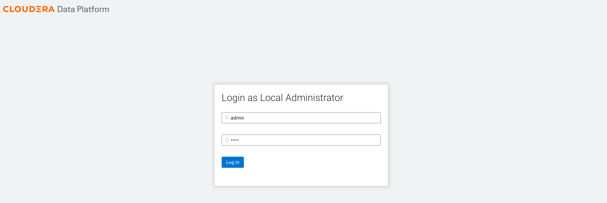
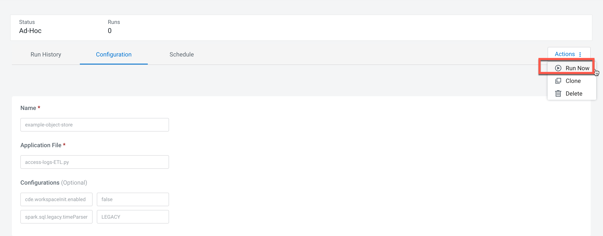
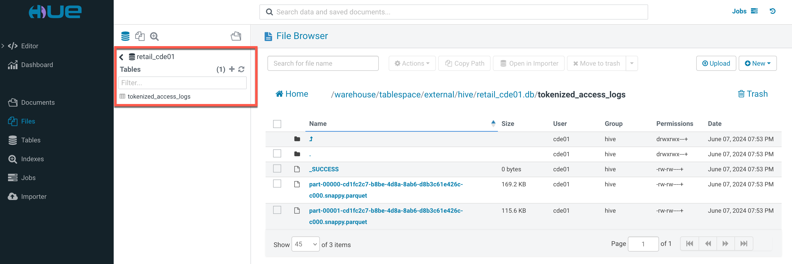

# Add Cloudera Data Engineering service and demo it
{: .no_toc }

- TOC
{:toc}

---

## 1. Introduction to the test environment

|CDP Runtime version |CDP PvC Base 7.1.9.4|
|CM version |Cloudera Manager 7.11.3.9|
|ECS version |CDP PvC DataServices 1.5.4|
|OS version |Centos 8.4|
|K8S version |RKE 1.27|
|Whether to enable Kerberos |Yes|
|Whether to enable TLS |No|
|Auto-TLS |No|
|Kerberos |FreeIPA|
|LDAP |FreeIPA|
|DB Configuration |Embedded|
|Vault |Embedded|
|Docker registry |Embedded|
|Install Method |Internet|

|IP addresss |hostname |description|
|192.168.8.140	|ds00.ecs.openstack.com |CDP Base cluster, only a single node|
|192.168.8.141	|ds01.ecs.openstack.com |ECS master node 1|
|192.168.8.142	|ds02.ecs.openstack.com |ECS worker node 1|
|192.168.8.143	|ds03.ecs.openstack.com |ECS worker node 2|

Note: please set ozone.server.default.replication=1 and ozone.replication=1 for one-node deployment.

## 2. Enable new CDE service

- Log into the CDP Private Cloud console as the local administrator `admin`




- Navigate to the Cloudera Data Engineering Overview page by clicking the Data Engineering tile in the CDP Private Cloud console.


- Click the `Enable CDE Service` button to enable CDE for an environment. Enter a Name for the CDE service you are creating. In the Environment text box, select the correct environment. select the name of the resource pool that you want to enable CDE service for. click Enable.


- The CDE service initialization is now complete.


## 3. Create a Virtual Cluster

- Please wait for 1 minute. A default virtual cluster will be created automatically after enabling a CDE service. 

- You can also click the `Create a Virtual Cluster` button to create a virtual cluster for an environment.
   - Enter a Cluster Name. Cluster names must begin with a letter, be between 3 and 30 characters (inclusive) and contain only alphanumeric characters and hyphens
   - Select the CDE Service to create the virtual cluster in.
   - Select the Spark Version to use in the virtual cluster.
   - Click `Create`.


- The CDE virtual cluster is ready.


- Click `Cluster Details`, and then click `JOBS API URL` to copy the URL to your clipboard. In this case JOBS API URL is `https://wwlblwjc.cde-pppvh92k.apps.ecscloud.iopscloud.cloudera.com/dex/api/v1`


- Open SSH terminal for ECS server node and download cdp-cde-utils.sh
```bash
mkdir -p /tmp/cde-1.5.4 && cd /tmp/cde-1.5.4
curl -O https://<paywall_user>:<<paywall_password>@archive.cloudera.com/p/dex/cde/1.20.2/cde-utils.sh
chmod +x cde-utils.sh
```

- Create a filename containing the user principal, and generate a keytab or copy keytab from other hosts. In this case the files are `cde01.principal` and `cde01.keytab`

```bash
$ cat cde01.principal
cde01@TIGER.COM

$ klist -kt cde01.keytab
Keytab name: FILE:cde01.keytab
KVNO Timestamp         Principal
---- ----------------- --------------------------------------------------------
   3 06/07/24 09:39:04 cde01@TIGER.COM
```
 
-  Configure TLS for Cluster's Jobs API

```bash
cd /tmp/cde-1.5.4
export host=wwlblwjc.cde-pppvh92k.apps.ecscloud.iopscloud.cloudera.com
./cde-utils.sh init-virtual-cluster -h $host -a
./cde-utils.sh init-user-in-virtual-cluster -h $host -u admin -p ~/cde01.principal -k ~/cde01.keytab
./cde-utils.sh init-user-in-virtual-cluster -h $host -u cde01 -p ~/cde01.principal -k ~/cde01.keytab
```

## 4. Assign CDE resources to end user

- Log out the CDP Private Cloud console and then login as user `cde01`


- User `cde01` cannot see any CDE objects because it is not assigned any roles or resources. 


- You have to login as the local administrator `admin` again.

- Navigate to Management Console > Environments, and select environment `ecscloud` by clicking on it.


- The Environment Clusters page appears. Click Actions. Click Manage Access in the dropdown list.


- In the Access tab, enter the name of the user in the Select group or user text box.


- The Update Resource Roles window appears. Select the resource role `DEUser`. Click Update Roles.


- User `cde01` can access CDE objects now.


- Click `Jobs` on the left navigation menu. Select Load Example Jobs from the two options that appear.


- A dialog box appears explaining the example jobs and sample data. Click Confirm to load example jobs and sample data.


- Below is the list of the different [example jobs](https://docs.cloudera.com/data-engineering/1.5.3/manage-jobs/topics/cde-load-example-jobs.html).


## 5. Configure the CDE CLI client

> The CDE CLI can only be accessed by AD/LDAP users, so the Local admin account wont work here. You need to make sure your ad/ldap account is setup as a PowerUser.

- In the Virtual Clusters column on the right, click the `Cluster Details` icon on the virtual cluster.


- Click the link under `CLI TOOL` to download the CLI client.


- Open terminal on your computer and move cde client binary to `~/cde/bin`.
```bash
$ mkdir -p ~/cde/bin
$ cd ~/cde/bin
$ file cde
cde: Mach-O 64-bit executable x86_64
$ chmod +x ~/cde/bin/cde
$ echo 'export PATH="~/cde/bin:$PATH"' >> ~/.zprofile
$ source ~/.zprofile
```

- Create a `/.cde` directory and config `~/.cde/config.yaml`.
```bash
export host=wwlblwjc.cde-pppvh92k.apps.ecscloud.iopscloud.cloudera.com
export user=cde01
export CDE_AUTH_PASS_FILE=~/.cde/passfile
echo "$user's password" > ~/.cde/passfile
echo "user: $user
vcluster-endpoint: https://$host/dex/api/v1
tls-insecure: true" > ~/.cde/config.yaml
```

- test cde cli to show the 6 example jobs

```bash
$ echo yes|cde job list
WARN: Plaintext or insecure TLS connection requested, take care before continuing. Continue? yes/no [no]: yes
[
  {
    "name": "example-cdeoperator",
    "type": "airflow",
    "created": "2024-06-07T11:18:04Z",
    "modified": "2024-06-07T11:18:04Z",
    "retentionPolicy": "keep_indefinitely",
    "mounts": [
      {
        "resourceName": "example-files"
      }
    ],
    "airflow": {
      "dagID": "example-cdeoperator",
      "dagFile": "cdeoperator.py"
    },
    "schedule": {
      "enabled": true,
      "user": "cde01",
      "cronExpression": "@once",
      "start": "Wed, 11 May 2022 20:20:04 GMT"
    }
  },
  {
    "name": "example-object-store",
    "type": "spark",
    "created": "2024-06-07T11:18:13Z",
    "modified": "2024-06-07T11:18:13Z",
    "retentionPolicy": "keep_indefinitely",
    "mounts": [
      {
        "resourceName": "example-files"
      }
    ],
    "spark": {
      "file": "access-logs-ETL.py",
      "driverMemory": "1g",
      "driverCores": 1,
      "executorMemory": "1g",
      "executorCores": 1,
      "conf": {
        "cde.workspaceInit.enabled": "false",
        "dex.safariEnabled": "false",
        "spark.dynamicAllocation.maxExecutors": "50",
        "spark.pyspark.python": "python3",
        "spark.sql.legacy.timeParserPolicy": "LEGACY"
      },
      "logLevel": "INFO"
    },
    "schedule": {
      "enabled": false,
      "user": "cde01",
      "start": "2024-06-07T19:18:13.361Z"
    }
  },
  {
    "name": "example-resources",
    "type": "spark",
    "created": "2024-06-07T11:17:42Z",
    "modified": "2024-06-07T11:17:42Z",
    "retentionPolicy": "keep_indefinitely",
    "mounts": [
      {
        "resourceName": "example-data"
      },
      {
        "resourceName": "example-files"
      }
    ],
    "spark": {
      "file": "pyspark_wordcount.py",
      "args": [
        "file:///app/mount/wordcount_input_1.txt",
        "file:///app/mount/word_count_templates.txt"
      ],
      "driverMemory": "1g",
      "driverCores": 1,
      "executorMemory": "1g",
      "executorCores": 1,
      "conf": {
        "cde.workspaceInit.enabled": "false",
        "dex.safariEnabled": "false",
        "spark.dynamicAllocation.maxExecutors": "4",
        "spark.pyspark.python": "python3"
      },
      "logLevel": "INFO"
    },
    "schedule": {
      "enabled": false,
      "user": "cde01",
      "start": "2024-06-07T19:17:42.436Z"
    }
  },
  {
    "name": "example-resources-scheduled",
    "type": "spark",
    "created": "2024-06-07T11:17:43Z",
    "modified": "2024-06-07T11:17:43Z",
    "retentionPolicy": "keep_indefinitely",
    "mounts": [
      {
        "resourceName": "example-data"
      },
      {
        "resourceName": "example-files"
      }
    ],
    "spark": {
      "file": "pyspark_wordcount.py",
      "args": [
        "file:///app/mount/wordcount_input_1.txt",
        "file:///app/mount/word_count_templates.txt"
      ],
      "driverMemory": "1g",
      "driverCores": 1,
      "executorMemory": "1g",
      "executorCores": 1,
      "conf": {
        "cde.workspaceInit.enabled": "false",
        "dex.safariEnabled": "false",
        "spark.dynamicAllocation.maxExecutors": "4",
        "spark.pyspark.python": "python3"
      },
      "logLevel": "INFO"
    },
    "schedule": {
      "enabled": true,
      "user": "cde01",
      "cronExpression": "4 5 * * *",
      "start": "2024-06-07T19:17:42.516Z",
      "nextExecution": "2024-06-08T05:04:00.000000Z",
      "paused": true,
      "pausedUponCreation": true
    }
  },
  {
    "name": "example-scala-pi",
    "type": "spark",
    "created": "2024-06-07T11:18:04Z",
    "modified": "2024-06-07T11:18:04Z",
    "retentionPolicy": "keep_indefinitely",
    "spark": {
      "file": "http://qe-repo.s3.amazonaws.com/dex/app-jar/spark-examples_2.11-2.4.4.jar",
      "className": "org.apache.spark.examples.SparkPi",
      "args": [
        "22"
      ],
      "driverMemory": "1g",
      "driverCores": 1,
      "executorMemory": "1g",
      "executorCores": 1,
      "conf": {
        "cde.workspaceInit.enabled": "false",
        "dex.safariEnabled": "true",
        "spark.dynamicAllocation.initialExecutors": "1",
        "spark.dynamicAllocation.maxExecutors": "50",
        "spark.dynamicAllocation.minExecutors": "1"
      },
      "logLevel": "INFO"
    },
    "schedule": {
      "enabled": false,
      "user": "cde01",
      "start": "2024-06-07T19:18:03.648Z"
    }
  },
  {
    "name": "example-virtual-env",
    "type": "spark",
    "created": "2024-06-07T11:17:42Z",
    "modified": "2024-06-07T11:17:42Z",
    "retentionPolicy": "keep_indefinitely",
    "mounts": [
      {
        "resourceName": "example-files"
      }
    ],
    "spark": {
      "file": "pyspark-batch-job.py",
      "driverMemory": "1g",
      "driverCores": 1,
      "executorMemory": "1g",
      "executorCores": 1,
      "pythonEnvResourceName": "example-virtual-env",
      "conf": {
        "cde.workspaceInit.enabled": "false",
        "dex.safariEnabled": "false",
        "spark.dynamicAllocation.maxExecutors": "50",
        "spark.pyspark.python": "python3"
      },
      "logLevel": "INFO"
    },
    "schedule": {
      "enabled": false,
      "user": "cde01",
      "start": "2024-06-07T19:17:42.315Z"
    }
  }
]
```

```bash
echo yes|cde resource list
WARN: Plaintext or insecure TLS connection requested, take care before continuing. Continue? yes/no [no]: yes
[
  {
    "name": "example-data",
    "type": "files",
    "status": "ready",
    "signature": "66ef832a8d6f6ec72d49fea709ab1daf7117bb1a",
    "created": "2024-06-07T11:17:41Z",
    "modified": "2024-06-07T11:17:42Z",
    "retentionPolicy": "keep_indefinitely"
  },
  {
    "name": "example-files",
    "type": "files",
    "status": "ready",
    "signature": "19c88e4db3df7e525c928c24c1fe2b412c0784e2",
    "created": "2024-06-07T11:17:39Z",
    "modified": "2024-06-07T11:17:40Z",
    "retentionPolicy": "keep_indefinitely"
  },
  {
    "name": "example-virtual-env",
    "type": "python-env",
    "status": "ready",
    "signature": "6481d4287240b3f1d7953dfea5fbb42fdd48dd7a",
    "created": "2024-06-07T11:17:40Z",
    "modified": "2024-06-07T11:17:41Z",
    "retentionPolicy": "keep_indefinitely",
    "pythonEnv": {
      "pythonVersion": "python3",
      "type": "python-env"
    },
    "pythonEnvInfo": {
      "statusReason": "Build completed",
      "sizeMb": 111,
      "buildDurationSeconds": 199,
      "numberOfFiles": 4915,
      "numberOfPackages": 5
    }
  }
]
```

## 6. Setup CDE REST API

- In contrast to the CDE CLI client, REST API can run on any server and does not require a cde client binary.

- In the Virtual Clusters column on the right, click the `Cluster Details` icon on the virtual cluster.


- Click `GRAFANA CHARTS` to copy the URL to your clipboard. In this case GRAFANA CHARTS is `https://service.cde-pppvh92k.apps.ecscloud.iopscloud.cloudera.com/grafana/d/0Oq0WmQWk/instance-metrics?orgId=1&refresh=5s&var-virtual_cluster_name=Default-VC-pppvh92k`.


- Click `JOBS API URL` to copy the URL to your clipboard. In this case JOBS API URL is `https://wwlblwjc.cde-pppvh92k.apps.ecscloud.iopscloud.cloudera.com/dex/api/v1`

- Get CDE API access token and job api url.

```bash
brew install jq
export workload_user=cde01
export grafana_charts='https://service.cde-pppvh92k.apps.ecscloud.iopscloud.cloudera.com/grafana/d/0Oq0WmQWk/instance-metrics?orgId=1&refresh=5s&var-virtual_cluster_name=Default-VC-pppvh92k'
export CDE_TOKEN=$(curl -u ${workload_user} -k $(echo ${grafana_charts} | cut -d'/' -f1-3 | awk '{print $1"/gateway/authtkn/knoxtoken/api/v1/token"}') | jq -r '.access_token')
export CDE_JOB_URL='https://wwlblwjc.cde-pppvh92k.apps.ecscloud.iopscloud.cloudera.com/dex/api/v1'
```

- The command needed to make any REST API call is:
```bash
curl -H "Authorization: Bearer ${CDE_TOKEN}" -k -X <request_method> "${CDE_JOB_URL}/<api_command>" <api_options> | jq .
```
    - &lt;request_method&gt; is DELETE, GET, PATCH, POST or PUT; depending on your request
    - &lt;api_command&gt; is the command youd like to execute from [API DOC](https://docs.cloudera.com/data-engineering/1.5.4/jobs-rest-api-reference/index.html)
    - &lt;api_options&gt; are the required options for requested command


## 7. Demo1: Run Job `example-object-store`

- Job `example-object-store` shows how to access and write data to object store on different form factors: S3, ADLS, and HDFS. This example reads data already staged to object store and makes changes and then saves back the transformed data to object store. The output of the query ran on the object store table can be viewed in the driver stderr log.

### 7.1 Prerequisites

- Log in to Ranger Admin UI. Navigate to the Service Manager > Hadoop_SQL Policies > Access section, and provide user `cde01` permission to HDFS URL 'hdfs://ip-10-129-80-141.iopscloud.cloudera.com:8020/warehouse/tablespace/external/hive/retail_cde01.db'.


### 7.2 Run Spark job by CDE UI

- Navigate to the Cloudera Data Engineering page. In the left hand menu, click Resources. and then click the file `access-logs-ETL.py` under the directory `example-files`. It will automatically trigger downloading so that you can see the python script.


- In the left hand menu, click Jobs. and select the job `example-object-store` and click `Configuration`.


- You can see the Job Details. Click Run Now.



- Job `example-object-store` ran successfully.


- Open up HUE and verify the `retail` db and `tokenized_accesss_logs` table data that was prepped by your CDE job.



### 7.3 Run Spark job by CDE CLI

- Using the `cde spark submit` command is a quick and efficient way of testing a spark job, as it spares you the task of creating and uploading resources and job definitions before running the job, and cleaning up after running the job. This command is recommended only for JAR or Python files that need to be run just once, because the the file is removed from Spark at the end of the run. To manage jobs that need to be run more than once, or that contain schedules, use `cde job run` instead of `cde spark submit`.

- If the data source is  CSV/JSON and following functions unix_timestamp, date_format, to_unix_timestamp, from_unixtime, to_date, to_timestamp is performed with patterns specified by users for parsing and formatting, then strict checking of Input is performed. Refactor the code to correct pattern matching for Input OR  set spark.sql.legacy.timeParserPolicy to LEGACY to restore the behavior, OR set it to CORRECTED and treat it as an invalid datetime string.

- Open terminal on your computer and use the spark submit command.
```bash
cde spark submit --conf "cde.workspaceInit.enabled=false" --conf "spark.pyspark.python=python3" --conf "spark.dynamicAllocation.maxExecutors=50" --conf "spark.sql.legacy.timeParserPolicy=LEGACY" $HOME/access-logs-ETL.py
```


- You can get RUN_ID from the CDE Job Runs Page. Check Job Status and review the output.
```bash
export RUN_ID=19
cde run describe --id ${RUN_ID}
cde run logs --type "submitter/jobs_api" --id ${RUN_ID}
```

- Open terminal on your computer and use the job run command.
```bash
export JOB_NAME=example-object-store
cde job run --wait --name ${JOB_NAME}
```

- You can get RUN_ID from the command console. Check Job Status and review the output.
```bash
export RUN_ID=20
cde run describe --id ${RUN_ID}
cde run logs --type "submitter/jobs_api" --id ${RUN_ID}
```

### 7.4 Run Spark job by REST API

- Open terminal on your computer and run job using the API.
```bash
export JOB_NAME=example-object-store
curl -H "Authorization: Bearer ${CDE_TOKEN}" -k -X POST "${CDE_JOB_URL}/jobs/${JOB_NAME}/run"
```

- You can get RUN_ID from the command console. Review the job output.
```bash
export RUN_ID=21
curl -H "Authorization: Bearer ${CDE_TOKEN}" -k -X GET "${CDE_JOB_URL}/job-runs/${RUN_ID}/logs?type=submitter%2Fstderr"
```

## 8. Demo2: Run Job `example-resources`

- Job `example-resources` shows CDE job configuration utilizing file-based resource type. Resources are mounted on Spark driver and executor pods. This example uses an input file as a data source for a word-count Spark app. The driver stderr log contains the word count.

### 8.1 Run Spark job by CDE UI

- Navigate to the Cloudera Data Engineering page. In the left hand menu, click Resources. and then click the file `wordcount_input_1.txt` under the directory `example-data`. It will automatically trigger downloading so that you can see the data file.
    - Please download `word_count_templates.txt` and `pyspark_wordcount.py` under the directory `example-files`.

- In the left hand menu, click Jobs. and select the job `example-resources` and click `Configuration`.


- You can see the Job Details. Click Run Now. Job `example-resources` ran successfully.

### 8.3 Run Spark job by CDE CLI

- We can attach the resource using the --file flag and refer it later from the location `file:///app/mount/`.

- Open terminal on your computer and use the spark submit command.
```bash
cde spark submit --conf "cde.workspaceInit.enabled=false" --conf "spark.pyspark.python=python3" --conf "spark.dynamicAllocation.maxExecutors=4" --conf "dex.safariEnabled=false" --file $HOME/wordcount_input_1.txt --file $HOME/word_count_templates.txt $HOME/pyspark_wordcount.py file:///app/mount/wordcount_input_1.txt file:///app/mount/word_count_templates.txt
```


- You can get RUN_ID from the CDE Job Runs Page. Check Job Status and review the output.
```bash
export RUN_ID=26
cde run describe --id ${RUN_ID}
cde run logs --type "submitter/jobs_api" --id ${RUN_ID}
```


### 8.4 Run Spark job by REST API

- Open terminal on your computer and run job using the API.
```bash
export JOB_NAME=example-resources
curl -H "Authorization: Bearer ${CDE_TOKEN}" -k -X POST "${CDE_JOB_URL}/jobs/${JOB_NAME}/run"
```

- You can get RUN_ID from the command console. Review the job output.
```bash
export RUN_ID=28
curl -H "Authorization: Bearer ${CDE_TOKEN}" -k -X GET "${CDE_JOB_URL}/job-runs/${RUN_ID}/logs?type=submitter%2Fstderr"
```

### 8.5 Recreate Spark job by CDE CLI

```bash
echo yes|cde job delete --name spark_wordcount_resources_job

echo yes|cde resource delete --name resource-spark-apps
echo yes|cde resource create --name resource-spark-apps
echo yes|cde resource upload --name resource-spark-apps --local-path pyspark_wordcount.py

echo yes|cde resource delete --name resource-data-sets
echo yes|cde resource create --name resource-data-sets
echo yes|cde resource upload --name resource-data-sets --local-path wordcount_input_1.txt

echo yes|cde resource delete --name resource-output-templates
echo yes|cde resource create --name resource-output-templates
echo yes|cde resource upload --name resource-output-templates --local-path word_count_templates.txt

echo yes|cde job create --name spark_wordcount_resources_job --type spark \
    --application-file pyspark_wordcount.py \
    --num-executors 4 \
    --mount-1-resource resource-spark-apps \
    --mount-2-resource resource-data-sets \
    --mount-3-resource resource-output-templates \
    --arg "file:///app/mount/wordcount_input_1.txt" \
    --arg "file:///app/mount/word_count_templates.txt" \
    --conf spark.pyspark.python=python3 \
    --conf cde.workspaceInit.enabled=false

echo yes|cde job run --name spark_wordcount_resources_job
```

### 8.6 Recreate Spark job by REST API

```bash
export job=spark_wordcount_resources_job
curl -H "Authorization: Bearer ${CDE_TOKEN}" -k -X DELETE "${CDE_JOB_URL}/jobs/${job}"

export mypath=$HOME
export myfile=pyspark_wordcount.py
export resource=resource-spark-apps
curl -H "Authorization: Bearer ${CDE_TOKEN}" -k -X DELETE "${CDE_JOB_URL}/resources/${resource}"
curl -H "Authorization: Bearer ${CDE_TOKEN}" -k -X POST "${CDE_JOB_URL}/resources" -H "Content-Type: application/json" -d "{\"name\": \"${resource}\", \"hidden\": false, \"type\": \"files\"}"
curl -H "Authorization: Bearer ${CDE_TOKEN}" -k -X PUT "${CDE_JOB_URL}/resources/${resource}/${myfile}" -F "file=@${mypath}/${myfile}"

export myfile=wordcount_input_1.txt
export resource=resource-data-sets
curl -H "Authorization: Bearer ${CDE_TOKEN}" -k -X DELETE "${CDE_JOB_URL}/resources/${resource}"
curl -H "Authorization: Bearer ${CDE_TOKEN}" -k -X POST "${CDE_JOB_URL}/resources" -H "Content-Type: application/json" -d "{\"name\": \"${resource}\", \"hidden\": false, \"type\": \"files\"}"
curl -H "Authorization: Bearer ${CDE_TOKEN}" -k -X PUT "${CDE_JOB_URL}/resources/${resource}/${myfile}" -F "file=@${mypath}/${myfile}"

export myfile=word_count_templates.txt
export resource=resource-output-templates
curl -H "Authorization: Bearer ${CDE_TOKEN}" -k -X DELETE "${CDE_JOB_URL}/resources/${resource}"
curl -H "Authorization: Bearer ${CDE_TOKEN}" -k -X POST "${CDE_JOB_URL}/resources" -H "Content-Type: application/json" -d "{\"name\": \"${resource}\", \"hidden\": false, \"type\": \"files\"}"
curl -H "Authorization: Bearer ${CDE_TOKEN}" -k -X PUT "${CDE_JOB_URL}/resources/${resource}/${myfile}" -F "file=@${mypath}/${myfile}"

curl -H "Authorization: Bearer ${CDE_TOKEN}" -k -X POST "${CDE_JOB_URL}/jobs" -H "Content-Type: application/json" -d "{ \"name\": \"${job}\", \"spark\": {     \"args\":     [         \"file:///app/mount/wordcount_input_1.txt\",         \"file:///app/mount/word_count_templates.txt\"     ],     \"className\": \"\",     \"conf\":     {         \"spark.pyspark.python\": \"python3\",         \"spark.dynamicAllocation.maxExecutors\": \"4\",         \"dex.safariEnabled\": \"false\"     },     \"driverCores\": 1,     \"executorCores\": 1,     \"logLevel\": \"INFO\",     \"file\": \"pyspark_wordcount.py\",     \"pyFiles\":     [],     \"jars\":     [],     \"files\":     [],     \"executorMemory\": \"1g\",     \"driverMemory\": \"1g\" }, \"mounts\": [     {         \"resourceName\": \"resource-spark-apps\",         \"dirPrefix\": \"\"     },     {         \"resourceName\": \"resource-data-sets\",         \"dirPrefix\": \"\"     },     {         \"resourceName\": \"resource-output-templates\",         \"dirPrefix\": \"\"     } ], \"schedule\": {     \"catchup\": false,     \"cronExpression\": \"\",     \"dependsOnPast\": false,     \"enabled\": false,     \"paused\": true,     \"start\": \"\",     \"end\": \"\" }, \"type\": \"spark\" }"
curl -H "Authorization: Bearer ${CDE_TOKEN}" -k -X POST "${CDE_JOB_URL}/jobs/${job}/run"
curl -H "Authorization: Bearer ${CDE_TOKEN}" -k -X GET "${CDE_JOB_URL}/job-runs?filter=job%5Beq%5D${job}&offset=0"
```

## 9. Demo3: Run Job `example-resources-scheduled`

- Job `example-resources-scheduled` shows scheduling functionality for Spark job in CDE. This example schedules a job to run at 5:04am UTC each day. 


- It can be derived from Job `example-resources` as the following steps.

### 9.1  update Job `spark_wordcount_resources_job` as scheduled by CDE CLI

As the above created job `spark_wordcount_resources_job` stays in CDE permanently until you delete it, you can schedule it to run regularly at a predefined time. This example schedules your job to run daily at midnight, starting from January 1, 2025:

```bash
echo yes|cde job update \
  --name spark_wordcount_resources_job \
  --schedule-enabled=true \
  --schedule-start 2025-01-01T00:00:00Z \
  --every-days 1 \
  --for-minutes-of-hour 0 \
  --for-hours-of-day 0
```

## 10. Demo4: Run Job `example-spark-pi`

- Job `example-spark-pi` shows how to define a CDE job. It runs a SparkPi using a scala example jar located on a s3 bucket. You cannot run this job in an air-gapped environment. The driver stderr log contains the value of pi.


### 10.1 How to create job `example-spark-pi` in an air-gapped environment

- This section is a sample CDE CLI script:

```bash
curl -O http://qe-repo.s3.amazonaws.com/dex/app-jar/spark-examples_2.11-2.4.4.jar
cde spark submit $HOME/spark-examples_2.11-2.4.4.jar --class org.apache.spark.examples.SparkPi 22

echo yes|cde job delete --name spark-scala-pi-job

echo yes|cde resource delete --name resource-scala-pi
echo yes|cde resource create --name resource-scala-pi
echo yes|cde resource upload --name resource-scala-pi --local-path spark-examples_2.11-2.4.4.jar

echo yes|cde job create --name spark-scala-pi-job --type spark \
    --application-file spark-examples_2.11-2.4.4.jar \
    --class org.apache.spark.examples.SparkPi \
    --arg 22 \
    --mount-1-resource resource-spark-apps \
    --conf cde.workspaceInit.enabled=false \
    --conf dex.safariEnabled=true 
    
echo yes|cde job run --name spark-scala-pi-job
```


- This section implements the same operation through the REST API

```bash
export job=spark-scala-pi-job
curl -H "Authorization: Bearer ${CDE_TOKEN}" -k -X DELETE "${CDE_JOB_URL}/jobs/${job}"

export mypath=$HOME
export myfile=spark-examples_2.11-2.4.4.jar
export resource=resource-scala-pi
curl -H "Authorization: Bearer ${CDE_TOKEN}" -k -X DELETE "${CDE_JOB_URL}/resources/${resource}"
curl -H "Authorization: Bearer ${CDE_TOKEN}" -k -X POST "${CDE_JOB_URL}/resources" -H "Content-Type: application/json" -d "{\"name\": \"${resource}\", \"hidden\": false, \"type\": \"files\"}"
curl -H "Authorization: Bearer ${CDE_TOKEN}" -k -X PUT "${CDE_JOB_URL}/resources/${resource}/${myfile}" -F "file=@${mypath}/${myfile}"

curl -H "Authorization: Bearer ${CDE_TOKEN}" -k -X POST "${CDE_JOB_URL}/jobs" -H "Content-Type: application/json" -d "{ \"name\": \"${job}\", \"spark\": {     \"args\":     [         \"22\"     ],     \"className\": \"org.apache.spark.examples.SparkPi\",     \"conf\":     {         \"spark.dynamicAllocation.minExecutors\": \"1\",         \"spark.dynamicAllocation.maxExecutors\": \"50\",         \"spark.dynamicAllocation.initialExecutors\": \"1\",         \"dex.safariEnabled\": \"true\"     },     \"driverCores\": 1,     \"driverMemory\": \"1g\",     \"executorCores\": 1,     \"executorMemory\": \"1g\",     \"logLevel\": \"INFO\",     \"file\": \"${myfile}\",     \"pyFiles\":     [],     \"jars\":     [],     \"files\":     [] }, \"mounts\": [{     \"resourceName\": \"${resource}\",     \"dirPrefix\": \"\" } ], \"schedule\": {     \"catchup\": false,     \"cronExpression\": \"\",     \"dependsOnPast\": false,     \"enabled\": false,     \"paused\": true,     \"start\": \"\",     \"end\": \"\" }, \"type\": \"spark\" }"

curl -H "Authorization: Bearer ${CDE_TOKEN}" -k -X POST "${CDE_JOB_URL}/jobs/${job}/run"
curl -H "Authorization: Bearer ${CDE_TOKEN}" -k -X GET "${CDE_JOB_URL}/job-runs?filter=job%5Beq%5D${job}&offset=0"
```


## 11. Demo5: Run Job `example-cdeoperator`

- Job `example-cdeoperator` uses a custom CDE Operator to run two Spark jobs in sequence, mimicking a pipeline composed of data ingestion and data processing.
   - CDE enables you to automate a workflow or data pipeline using Apache Airflow Python DAG files. Each CDE virtual cluster includes an embedded instance of Apache Airflow.
   - CDE on CDP Private Cloud currently supports only the CDE job run operator.
   - You can deploy Airflow tasks using CDE UI, CDE CLI, REST API.

- Navigate to Job Runs page, job `example-cdeoperator` ran successfully.


- Navigate to Jobs > cdeoperator-job > Airflow UI for DAG info. Two tasks are run successively through CDEJobRunOperator, namely ingest and data_prep.


### 11.1 Recreate Airflow job Using CDE REST API

- Create a Airflow CDE job named `cdeoperator-job`

```bash
export job=cdeoperator-job
curl -H "Authorization: Bearer ${CDE_TOKEN}" -k -X DELETE "${CDE_JOB_URL}/jobs/${job}"

export mypath=$HOME
export myfile=cdeoperator.py
export resource=AutoResource-cde-operator
curl -H "Authorization: Bearer ${CDE_TOKEN}" -k -X DELETE "${CDE_JOB_URL}/resources/${resource}"
curl -H "Authorization: Bearer ${CDE_TOKEN}" -k -X POST "${CDE_JOB_URL}/resources" -H "Content-Type: application/json" -d "{\"name\": \"${resource}\", \"hidden\": false, \"type\": \"files\"}"
curl -H "Authorization: Bearer ${CDE_TOKEN}" -k -X PUT "${CDE_JOB_URL}/resources/${resource}/${myfile}" -F "file=@${mypath}/${myfile}"

curl -H "Authorization: Bearer ${CDE_TOKEN}" -k -X POST "${CDE_JOB_URL}/jobs" -H "Content-Type: application/json" -d "{ \"name\": \"${job}\", \"airflow\": {     \"dagFile\": \"${myfile}\" }, \"mounts\": [     {         \"resourceName\": \"${resource}\",         \"dirPrefix\": \"\"     } ], \"type\": \"airflow\" }"
curl -H "Authorization: Bearer ${CDE_TOKEN}" -k -X GET "${CDE_JOB_URL}/job-runs?filter=job%5Beq%5D${job}&offset=0"
```

## 12. Demo6: Run Job `example-virtual-env`

- Job `example-virtual-env` shows CDE job configuration that utilizes Python Environment resource type to expand pyspark features via custom virtual env. This example adds pandas support. Note: You cannot run this job in an air-gapped environment.

