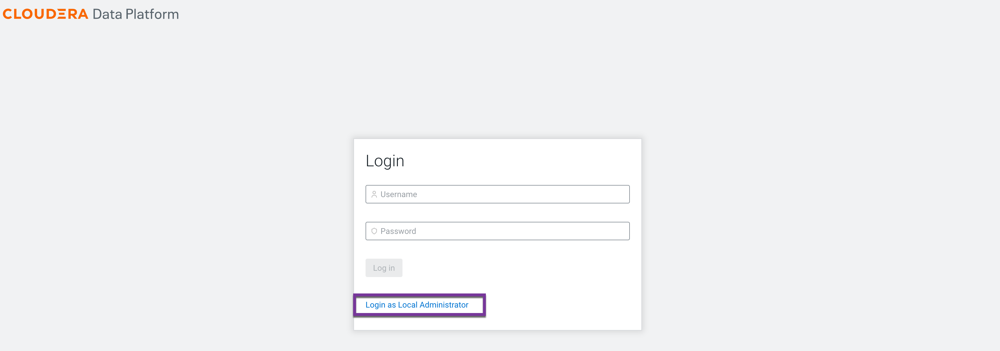
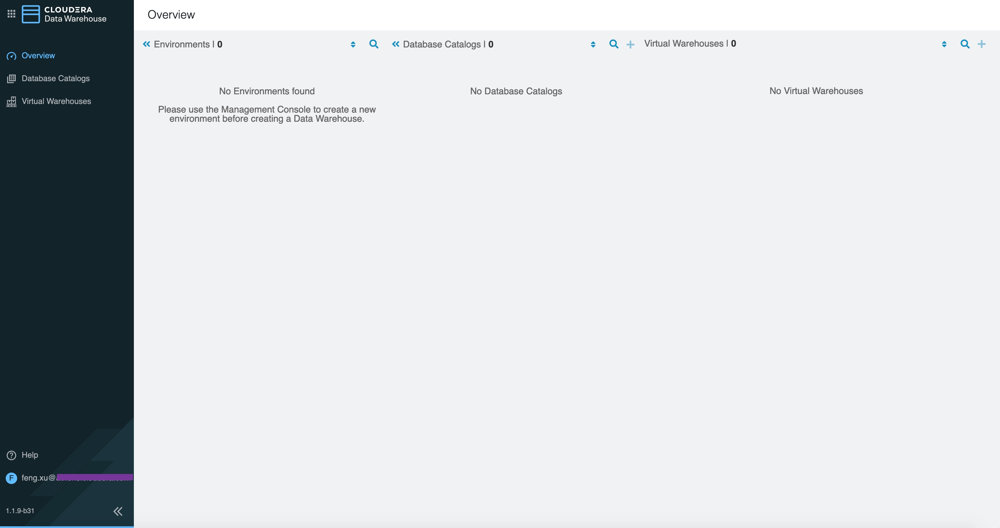
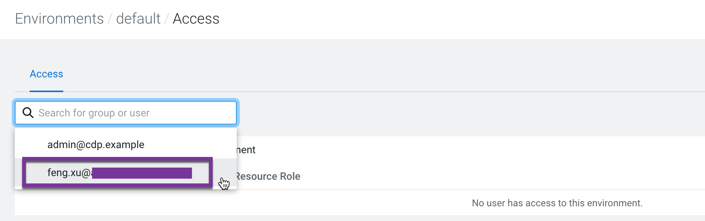
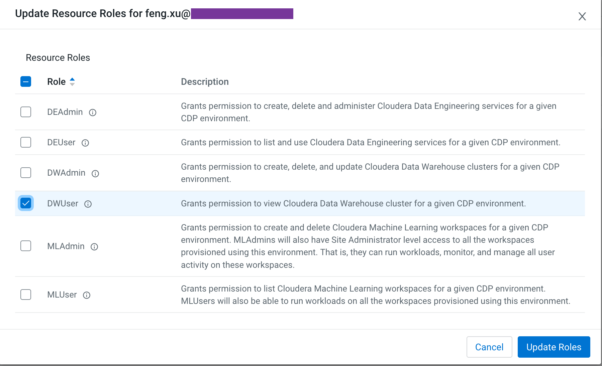
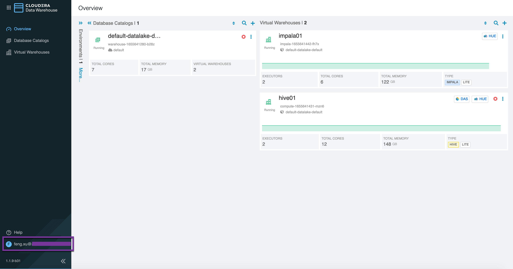
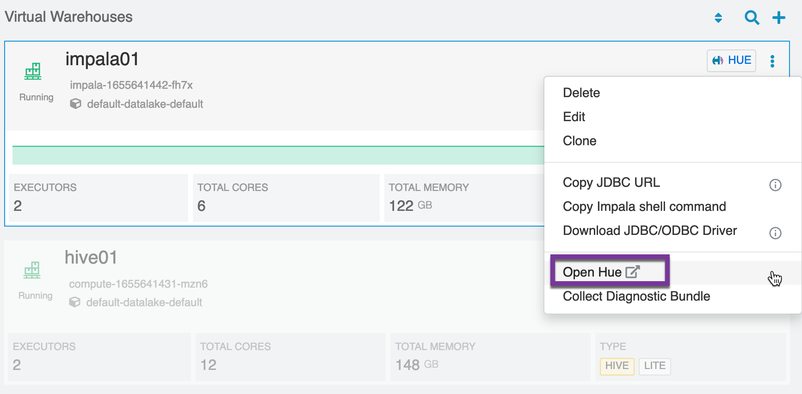
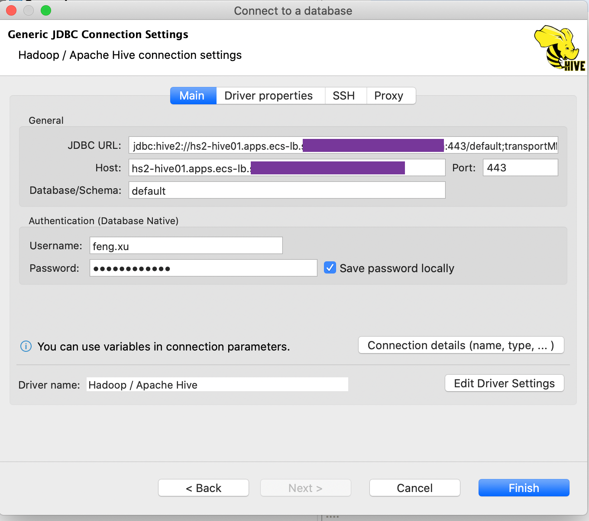
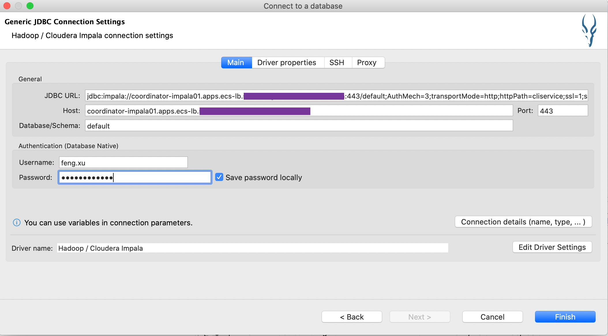
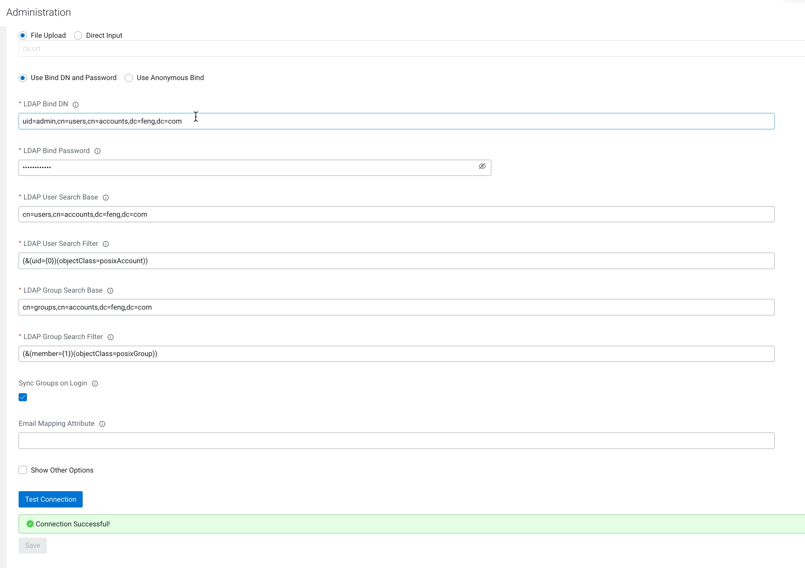

# Add Cloudera Data Warehouse service and demo it
{: .no_toc }

- TOC
{:toc}

---

## 1. Introduction to the test environment

|CDP Runtime version |CDP PvC Base 7.1.7|
|CM version |Cloudera Manager 7.5.5|
|ECS version |CDP PvC DataServices 1.3.4|
|OS version |Centos 7.9|
|K8S version |RKE 1.21|
|Whether to enable Kerberos |Yes|
|Whether to enable TLS |Yes|
|Auto-TLS |No, using manual TLS|
|Kerberos |AD|
|LDAP |AD|
|DB Configuration |External Postgres 12|
|Vault |Embedded|
|Docker registry |Embedded|
|Install Method |Internet|

|IP addresss |hostname |description|
|192.168.8.140	|ds00.ecs.openstack.com |CDP Base cluster, only a single node|
|192.168.8.141	|ds01.ecs.openstack.com |ECS master node 1|
|192.168.8.142	|ds02.ecs.openstack.com |ECS master node 2|
|192.168.8.143	|ds03.ecs.openstack.com |ECS master node 3|
|192.168.8.144	|ds04.ecs.openstack.com |ECS worker node 1|
|192.168.8.145	|ds05.ecs.openstack.com |ECS worker node 2|
|192.168.8.146	|ds06.ecs.openstack.com |ECS worker node 3|

## 2. Provision the virtual warehouses

- Log into the CDP Private Cloud console as the local administrator `admin`




- Configure LDAP authentication for CDW
    1. On the Management Console home page, select Administration>Authentication.
    2. Configure the following settings for LDAP authentication.
    3. Click Test Connection to verify whether the LDAP information you have provided is valid.
    4. Click Save. 

|LDAP URL |ldaps://ad-server.ecs.openstack.com:3269|
|CA Certificate for Secure LDAP |Choose file:  $HOME/adserver-ca.pem|
|LDAP Bind DN |CN=sme-ad-bind,OU=test-demo,DC=ecs,DC=openstack,DC=com|
|LDAP Bind Password |password|
|LDAP User Search Base |DC=ecs,DC=openstack,DC=com|
|LDAP User Search Filter |(&(sAMAccountName={0})(objectClass=person))|
|LDAP Group Search Base |DC=ecs,DC=openstack,DC=com|
|LDAP Group Search Filter |(&(member={1})(objectClass=group))|
|Sync Groups on Logon |enable|


- Recreate external postgres database `db-das` and `db-hue`

```bash
sudo -u postgres psql << EOF
DROP DATABASE IF EXISTS "db-das";
DROP DATABASE IF EXISTS "db-hue";
CREATE DATABASE "db-das" OWNER pvc  ENCODING 'UTF8';
CREATE DATABASE "db-hue" OWNER pvc  ENCODING 'UTF8';
EOF
```

- Activate the default Database Catalog
    1. In the CDW service, expand the Environments column by clicking the More menu on the left side of the page.
    2. In the Environments column, locate the environment that you want to activate.
    3. When you locate the environment, click the activation icon to launch the Activation Settings dialog box.
    4. In the Activation Settings dialog box.
        1. Specify Delegation Username and Delegation Password to impersonate authorization requests from Hue to the Impala engine.
        2. If you are using an external database on your base cluster and want to use a default Database Catalog, then you must specify custom database name for DAS and Hue in the Pre-created database names for default database catalog field.
        3. enable low resource mode if required.
    5. Click `ACTIVATE`.


- build Hive VW
    1. In the Data Warehouse service, click Virtual Warehouses in the left navigation panel.
    2. On the Virtual Warehouses page, click Add New.
    3. In the New Virtual Warehouse dialog box, specify a Virtual Warehouse name, the Type `Hive`, which Database Catalog it queries, and the size.
    4. Configure auto-scaling settings.
    5. Click Create to create the new Virtual Warehouse.


- Build Impala VW


- Both Hive VW an Impala VW are green


## 3. Assign CDW resources to end user

- Log out the CDP Private Cloud console and then login as user `feng.xu`


- User `feng.xu` cannot see any CDW objects because it is not assigned any roles or resources. 



- You have to login as the local administrator `admin` again.

- Navigate to Management Console > Environments, and select environment `default` by clicking on it.


- The Environment Clusters page appears. Click Actions. Click Manage Access in the dropdown list.


- In the Access tab, enter the name of the user in the Select group or user text box.



- The Update Resource Roles window appears. Select the resource role `DWUser`. Click Update Roles.




- User `feng.xu` can access CDW objects now.




## 4. Set the Ranger policy for end user

- Log in to Ranger Admin UI. Navigate to the Service Manager > Hadoop_SQL Policies > Access section, and provide `feng.xu` user
permission to the `all-database, table, column` policy name.


## 5. Demo1: Submit Hive queries with Hue

- On the Overview page under Virtual Warehouses, click the options menu in the upper right corner of an Hive Virtual Warehouse tile, and select `Open Hue`.


- The Hue query editor is displayed. However there are no entries found under database `default`.


- Navigate to `Administrater Server` in the lower left corner of Hue query editor. Click `Step3: Example` to install some data examples.


- Run `Sample: Top salary` in Saved Queries.


- The sample query returns 28 records successfully.


# 6. Demo2: Submit Impala queries with Hue

- On the Overview page under Virtual Warehouses, click the options menu in the upper right corner of an Impala Virtual Warehouse tile, and select `Open Hue`.



- Navigate to `Administrater Server` in the lower left corner of Hue query editor. Click `Step3: Example` to install some data examples.


- Run `Sample: Top salary` in Saved Queries and return 28 records successfully.


# 7. Demo3: Submit Hive queries with Beeline

- click the options menu in the upper right corner of an Hive Virtual Warehouse tile, and select `Copy JDBC URL`. In this case JDBC URL is `jdbc:hive2://hs2-hive01.apps.ecs-lb.ecs.openstack.com/default;transportMode=http;httpPath=cliservice;ssl=true;retries=3`


- Open SSH terminal for CDP Base worker node and run the command: `beeline -u 'jdbc:hive2://hs2-hive01.apps.ecs-lb.ecs.openstack.com/default;transportMode=http;httpPath=cliservice;ssl=false;retries=3' -n feng.xu -p`

```bash
[centos@ds00 ~]$ beeline -u 'jdbc:hive2://hs2-hive01.apps.ecs-lb.ecs.openstack.com/default;transportMode=http;httpPath=cliservice;ssl=false;retries=3' -n feng.xu -p
SLF4J: Class path contains multiple SLF4J bindings.
SLF4J: Found binding in [jar:file:/opt/cloudera/parcels/CDH-7.1.7-1.cdh7.1.7.p78.21656418/jars/log4j-slf4j-impl-2.17.1.jar!/org/slf4j/impl/StaticLoggerBinder.class]
SLF4J: Found binding in [jar:file:/opt/cloudera/parcels/CDH-7.1.7-1.cdh7.1.7.p78.21656418/jars/slf4j-log4j12-1.7.30.jar!/org/slf4j/impl/StaticLoggerBinder.class]
SLF4J: See http://www.slf4j.org/codes.html#multiple_bindings for an explanation.
SLF4J: Actual binding is of type [org.apache.logging.slf4j.Log4jLoggerFactory]
WARNING: Use "yarn jar" to launch YARN applications.
SLF4J: Class path contains multiple SLF4J bindings.
SLF4J: Found binding in [jar:file:/opt/cloudera/parcels/CDH-7.1.7-1.cdh7.1.7.p78.21656418/jars/log4j-slf4j-impl-2.17.1.jar!/org/slf4j/impl/StaticLoggerBinder.class]
SLF4J: Found binding in [jar:file:/opt/cloudera/parcels/CDH-7.1.7-1.cdh7.1.7.p78.21656418/jars/slf4j-log4j12-1.7.30.jar!/org/slf4j/impl/StaticLoggerBinder.class]
SLF4J: See http://www.slf4j.org/codes.html#multiple_bindings for an explanation.
SLF4J: Actual binding is of type [org.apache.logging.slf4j.Log4jLoggerFactory]
Connecting to jdbc:hive2://hs2-hive01.apps.ecs-lb.ecs.openstack.com/default;transportMode=http;httpPath=cliservice;ssl=false;retries=3;user=feng.xu
Enter password for jdbc:hive2://hs2-hive01.apps.ecs-lb.ecs.openstack.com/default: ************
Connected to: Apache Hive (version 3.1.3000.2021.0.6-b96)
Driver: Hive JDBC (version 3.1.3000.7.1.7.78-12)
Transaction isolation: TRANSACTION_REPEATABLE_READ
Beeline version 3.1.3000.7.1.7.78-12 by Apache Hive
0: jdbc:hive2://hs2-hive01.apps.ecs-lb.sme-fe> 
```

- Run `Sample: Salary growth ` in Saved Queries

```bash
0: jdbc:hive2://hs2-hive01.apps.ecs-lb.sme-fe> use default;
WARN  : WARNING! Query command could not be redacted.java.lang.IllegalStateException: Error loading from /opt/cloudera/parcels/CDH-7.1.7-1.cdh7.1.7.p78.21656418/bin/../lib/hive/conf/redaction-rules.json: java.io.FileNotFoundException: /opt/cloudera/parcels/CDH-7.1.7-1.cdh7.1.7.p78.21656418/bin/../lib/hive/conf/redaction-rules.json (No such file or directory)
INFO  : Compiling command(queryId=hive_20220619140148_30871325-40b6-4d35-b947-8f4619dc36e7): use default
INFO  : Semantic Analysis Completed (retrial = false)
INFO  : Created Hive schema: Schema(fieldSchemas:null, properties:null)
INFO  : Completed compiling command(queryId=hive_20220619140148_30871325-40b6-4d35-b947-8f4619dc36e7); Time taken: 0.132 seconds
INFO  : Executing command(queryId=hive_20220619140148_30871325-40b6-4d35-b947-8f4619dc36e7): use default
INFO  : Starting task [Stage-0:DDL] in serial mode
INFO  : Completed executing command(queryId=hive_20220619140148_30871325-40b6-4d35-b947-8f4619dc36e7); Time taken: 0.013 seconds
INFO  : OK
No rows affected (0.262 seconds)
0: jdbc:hive2://hs2-hive01.apps.ecs-lb.sme-fe> SELECT s07.description, s07.salary, s08.salary,
. . . . . . . . . . . . . . . . . . . . . . .>   s08.salary - s07.salary
. . . . . . . . . . . . . . . . . . . . . . .> FROM
. . . . . . . . . . . . . . . . . . . . . . .>   sample_07 s07 JOIN sample_08 s08
. . . . . . . . . . . . . . . . . . . . . . .> ON ( s07.code = s08.code)
. . . . . . . . . . . . . . . . . . . . . . .> WHERE
. . . . . . . . . . . . . . . . . . . . . . .>  s07.salary < s08.salary
. . . . . . . . . . . . . . . . . . . . . . .> ORDER BY s08.salary-s07.salary DESC;
WARN  : WARNING! Query command could not be redacted.java.lang.IllegalStateException: Error loading from /opt/cloudera/parcels/CDH-7.1.7-1.cdh7.1.7.p78.21656418/bin/../lib/hive/conf/redaction-rules.json: java.io.FileNotFoundException: /opt/cloudera/parcels/CDH-7.1.7-1.cdh7.1.7.p78.21656418/bin/../lib/hive/conf/redaction-rules.json (No such file or directory)
INFO  : Compiling command(queryId=hive_20220619140217_5217ae0e-7d49-4187-8aad-13938649b91b): SELECT s07.description, s07.salary, s08.salary,
......
----------------------------------------------------------------------------------------------
        VERTICES      MODE        STATUS  TOTAL  COMPLETED  RUNNING  PENDING  FAILED  KILLED
----------------------------------------------------------------------------------------------
Map 1 ..........      llap     SUCCEEDED      1          1        0        0       0       0
Map 2 ..........      llap     SUCCEEDED      1          1        0        0       0       0
Reducer 3 ......      llap     SUCCEEDED      1          1        0        0       0       0
----------------------------------------------------------------------------------------------
VERTICES: 03/03  [==========================>>] 100%  ELAPSED TIME: 1.13 s
----------------------------------------------------------------------------------------------
+----------------------------------------------------+-------------+-------------+--------+
|                  s07.description                   | s07.salary  | s08.salary  |  _c3   |
+----------------------------------------------------+-------------+-------------+--------+
| Dentists, all other specialists                    | 120360      | 142070      | 21710  |
| Surgeons                                           | 191410      | 206770      | 15360  |
| Oral and maxillofacial surgeons                    | 178440      | 190420      | 11980  |
| Natural sciences managers                          | 113170      | 123140      | 9970   |
| Physicians and surgeons, all other                 | 155150      | 165000      | 9850   |
| Orthodontists                                      | 185340      | 194930      | 9590   |
| Internists, general                                | 167270      | 176740      | 9470   |
| Political scientists                               | 90050       | 99320       | 9270   |
| Obstetricians and gynecologists                    | 183600      | 192780      | 9180   |
| Chief executives                                   | 151370      | 160440      | 9070   |
| Rotary drill operators, oil and gas                | 45560       | 54370       | 8810   |
| Pediatricians, general                             | 145210      | 153370      | 8160   |
| Sociologists                                       | 67330       | 75460       | 8130   |
| Family and general practitioners                   | 153640      | 161490      | 7850   |
| Medical scientists, except epidemiologists         | 74160       | 81870       | 7710   |
| Athletes and sports competitors                    | 71920       | 79460       | 7540   |
```

- (optional) beeline works with ssl enabled.

```bash
export host=hs2-hive01.apps.ecs-lb.ecs.openstack.com
export file=pvc134_hive
rm -f $file.jks $file.pem
openssl s_client -showcerts -connect $host:443 -servername $host </dev/null 2>/dev/null|openssl x509 -outform PEM > $file.pem
keytool -import -alias $host -file $file.pem -keystore $file.jks
beeline -u 'jdbc:hive2://hs2-hive01.apps.ecs-lb.ecs.openstack.com/default;transportMode=http;httpPath=cliservice;ssl=true;retries=3;sslTrustStore=pvc134_hive.jks;trustStorePassword=123456' -n feng.xu -p
```


# 8. Demo4: Submit Impala queries with Impala Shell

- click the options menu in the upper right corner of an Impala Virtual Warehouse tile, and select `Copy Impala shell command`. In this case JDBC URL is `impala-shell --protocol='hs2-http' --ssl -i "coordinator-impala01.apps.ecs-lb.ecs.openstack.com:443" -u  -l`


- Open SSH terminal for CDP Base worker node and run the command: `impala-shell --protocol='hs2-http' --ssl -i "coordinator-impala01.apps.ecs-lb.ecs.openstack.com:443" -u feng.xu -l`

```bash
[centos@ds00 ~]$ impala-shell --protocol='hs2-http' --ssl -i "coordinator-impala01.apps.ecs-lb.ecs.openstack.com:443" -u feng.xu -l
/usr/bin/impala-shell: line 47: warning: setlocale: LC_CTYPE: cannot change locale (UTF-8): No such file or directory
/usr/bin/impala-shell: line 47: warning: setlocale: LC_CTYPE: cannot change locale (UTF-8): No such file or directory
Starting Impala Shell using LDAP-based authentication
SSL is enabled. Impala server certificates will NOT be verified (set --ca_cert to change)
LDAP password for feng.xu:
Warning: --connect_timeout_ms is currently ignored with HTTP transport.
Opened TCP connection to coordinator-impala01.apps.ecs-lb.ecs.openstack.com:443
Connected to coordinator-impala01.apps.ecs-lb.ecs.openstack.com:443
Server version: impalad version 4.1.0-SNAPSHOT RELEASE (build a39038d2c3f87fe87e58f73d13bc3e623403a0ee)
***********************************************************************************
Welcome to the Impala shell.
(Impala Shell v3.4.0-SNAPSHOT (fbac23b) built on Wed Feb  2 19:06:37 UTC 2022)

After running a query, type SUMMARY to see a summary of where time was spent.
***********************************************************************************
[coordinator-impala01.apps.ecs-lb.ecs.openstack.com:443] default>
```

- Run `Sample: Salary growth ` in Saved Queries

```bash
[coordinator-impala01.apps.ecs-lb.ecs.openstack.com:443] default> use default;
Query: use default
[coordinator-impala01.apps.ecs-lb.ecs.openstack.com:443] default> SELECT s07.description, s07.salary, s08.salary,
                                                                           >   s08.salary - s07.salary
                                                                           > FROM
                                                                           >   sample_07 s07 JOIN sample_08 s08
                                                                           > ON ( s07.code = s08.code)
                                                                           > WHERE
                                                                           >  s07.salary < s08.salary
                                                                           > ORDER BY s08.salary-s07.salary DESC;
Query: SELECT s07.description, s07.salary, s08.salary,
  s08.salary - s07.salary
FROM
  sample_07 s07 JOIN sample_08 s08
ON ( s07.code = s08.code)
WHERE
 s07.salary < s08.salary
ORDER BY s08.salary-s07.salary DESC
Query submitted at: 2022-06-19 14:14:29 (Coordinator: http://coordinator-0:25000)
Query progress can be monitored at: http://coordinator-0:25000/query_plan?query_id=cf4f894edb3ea4f6:31df12a500000000
+-----------------------------------------------------------------------------------------------------------+--------+--------+-------------------------+
| description                                                                                               | salary | salary | s08.salary - s07.salary |
+-----------------------------------------------------------------------------------------------------------+--------+--------+-------------------------+
| Dentists, all other specialists                                                                           | 120360 | 142070 | 21710                   |
| Surgeons                                                                                                  | 191410 | 206770 | 15360                   |
| Oral and maxillofacial surgeons                                                                           | 178440 | 190420 | 11980                   |
| Natural sciences managers                                                                                 | 113170 | 123140 | 9970                    |
| Physicians and surgeons, all other                                                                        | 155150 | 165000 | 9850                    |
| Orthodontists                                                                                             | 185340 | 194930 | 9590                    |
| Internists, general                                                                                       | 167270 | 176740 | 9470                    |
| Political scientists                                                                                      | 90050  | 99320  | 9270                    |
| Obstetricians and gynecologists                                                                           | 183600 | 192780 | 9180                    |
| Chief executives                                                                                          | 151370 | 160440 | 9070                    |
```

- (optional) Impala-shell works with ssl enabled. 

**_NOTE:_** Please copy client certificate from /var/lib/rancher/rke2/server/tls/client-ca.crt on any ECS hosts.

```bash
impala-shell --protocol='hs2-http' --ssl --ca_cert client-ca.crt -i "coordinator-impala01.apps.ecs-lb.ecs.openstack.com:443" -u feng.xu -l
```


# 9. Demo5: Connect to Hive Virtual Warehouses from DBeaver

- click the options menu in the upper right corner of an Hive Virtual Warehouse tile

    - select `Download JDBC JAR`. The `HiveJDBC41.jar` and `ImpalaJDBC41.jar` used by DBeaver are recommended to be downloaded from here.

    
    
    - select `Copy JDBC URL`. In this case JDBC URL is `jdbc:hive2://hs2-hive01.apps.ecs-lb.ecs.openstack.com/default;transportMode=http;httpPath=cliservice;ssl=true;retries=3`

    

- Generate jks file for Hive VW (def keystore password is 123456)

```bash
export host=hs2-hive01.apps.ecs-lb.ecs.openstack.com
export file=pvc134_hive
rm -f $file.jks $file.pem
openssl s_client -showcerts -connect $host:443 -servername $host </dev/null 2>/dev/null|openssl x509 -outform PEM > $file.pem
keytool -import -alias $host -file $file.pem -keystore $file.jks
```

- Start DBeaver and navigate to File > New > DBeaver > Database Connection


- Select Apache Hive JDBC


- Generic JDBC Connection Settings

|JDBC URL: |Automatically updated from other fields| 
|Host: |hs2-hive01.apps.ecs-lb.ecs.openstack.com|
|Port: |443|
|Database: |default|
|Username: |feng.xu|
|Password: |your password|



- Click `Edit Driver Settings` and go to menu `Settings`

|Class Name: |Automatically updated from other fields|
|URL Tempalte: |jdbc:hive2://{host}[:{port}][/{database}];transportMode=http;httpPath=cliservice;ssl=1;retries=3;sslTrustStore=/Users/feng.xu/projects/pvc134_hive.jks;trustStorePassword=123456|


- Switch to menu `Libraries`
    - Delete the default lib file
    - Click `Add File` and select `HiveJDBC41.jar`
    - Click `Find Class` and select `com.cloudera.hive.jdbc41.HS2Driver`


- The final JDBC URL is `jdbc:hive2://hs2-hive01.apps.ecs-lb.ecs.openstack.com/default;transportMode=http;httpPath=cliservice;ssl=1;retries=3;sslTrustStore=/Users/feng.xu/projects/pvc134_hive.jks;trustStorePassword=123456`, Click `Finish`

- Click `Test Connection` and get the corresponding server and Driver version.


- Run sample query in SQL Console


# 10. Demo6: Connect to Impala Virtual Warehouses from DBeaver

- click the options menu in the upper right corner of an Impala Virtual Warehouse tile, and select `Copy JDBC URL`. In this case JDBC URL is `jdbc:impala://coordinator-impala01.apps.ecs-lb.ecs.openstack.com:443/default;AuthMech=3;transportMode=http;httpPath=cliservice;ssl=1;UID=USERNAME;PWD=PASSWORD`


- Generate keystore file (def keystore password 123456)

```bash
export host=coordinator-impala01.apps.ecs-lb.ecs.openstack.com
export file=pvc134_impala
rm -f $file.jks $file.pem
openssl s_client -showcerts -connect $host:443 -servername $host </dev/null 2>/dev/null|openssl x509 -outform PEM > $file.pem
keytool -import -alias $host -file $file.pem -keystore $file.jks
```

- Start DBeaver and navigate to File > New > DBeaver > Database Connection


- Select Cloudera Impala JDBC


- Generic JDBC Connection Settings

|JDBC URL: |Automatically updated from other fields| 
|Host: |coordinator-impala01.apps.ecs-lb.ecs.openstack.com|
|Port: |443|
|Database: |default|
|Username: |feng.xu|
|Password: |your password|



- Click `Edit Driver Settings` and go to menu `Settings`

|Class Name: |Automatically updated from other fields|
|URL Tempalte: |jdbc:impala://{host}:{port}/{database};AuthMech=3;transportMode=http;httpPath=cliservice;ssl=1;sslTrustStore=/Users/feng.xu/projects/pvc134_impala.jks;trustStorePassword=123456|


- Switch to menu `Libraries`
    - Delete the default lib file
    - Click `Add File` and select `ImpalaJDBC41.jar`
    - Click `Find Class` and select `com.cloudera.impala.jdbc41.Driver`


- The final JDBC URL is `jdbc:impala://coordinator-impala01.apps.ecs-lb.ecs.openstack.com:443/default;AuthMech=3;transportMode=http;httpPath=cliservice;ssl=1;sslTrustStore=/Users/feng.xu/projects/pvc134_impala.jks;trustStorePassword=123456`, Click `Finish`

- Click `Test Connection` and get the corresponding server and Driver version.


- Run sample query in SQL Console


# 11. Demo7: Register the hive UDF in the Hive Virtual Warehouse

- Upload udf jar file to HDFS
 
```bash
kinit -kt /var/run/cloudera-scm-agent/process/`ls -l /var/run/cloudera-scm-agent/process/ | grep -i NAMENODE |awk '{print $9}' | sort -n | tail -n 1`/hdfs.keytab hdfs/`hostname -f`@ECS.OPENSTACK.COM && klist
hdfs dfs -mkdir -p /user/feng.xu/udfs
wget https://github.com/romainr/hadoop-tutorials-examples/raw/master/hive-udf/myudfs.jar
hdfs dfs -put myudfs.jar /user/feng.xu/udfs
hdfs dfs -chown -R hive:hadoop /user/feng.xu/udfs
```
 
- Set up UDF access by three Ranger policy as follows
 
    - hdfs  /user/feng.xu/udfs/

    
 
    - hadoop sql - all - url     
    - hadoop sql - all - database, udf

    

- Registry hive udf in the Hive Virtual Warehouse and call it.
     
```bash
beeline -u 'jdbc:hive2://hs2-hive01.apps.ecs-lb.ecs.openstack.com/default;transportMode=http;httpPath=cliservice;ssl=false;retries=3' -n feng.xu -p
 
CREATE function myUpper AS 'org.hue.udf.MyUpper' USING JAR  'hdfs:///user/feng.xu/udfs/myudfs.jar'; 
show functions LIKE '%myUpper%';
select myUpper(description),description FROM sample_07 limit 10;
```

```console
[centos@ds00 ~]$ beeline -u 'jdbc:hive2://hs2-hive01.apps.ecs-lb.ecs.openstack.com/default;transportMode=http;httpPath=cliservice;ssl=false;retries=3' -n feng.xu -p
Connecting to jdbc:hive2://hs2-hive01.apps.ecs-lb.ecs.openstack.com/default;transportMode=http;httpPath=cliservice;ssl=false;retries=3;user=feng.xu
Enter password for jdbc:hive2://hs2-hive01.apps.ecs-lb.ecs.openstack.com/default: ************
Connected to: Apache Hive (version 3.1.3000.2021.0.6-b96)
Driver: Hive JDBC (version 3.1.3000.7.1.7.78-12)
Transaction isolation: TRANSACTION_REPEATABLE_READ
Beeline version 3.1.3000.7.1.7.78-12 by Apache Hive
0: jdbc:hive2://hs2-hive01.apps.ecs-lb.sme-fe> CREATE function myUpper AS 'org.hue.udf.MyUpper' USING JAR  'hdfs:///user/feng.xu/udfs/myudfs.jar';
WARN  : WARNING! Query command could not be redacted.java.lang.IllegalStateException: Error loading from /opt/cloudera/parcels/CDH-7.1.7-1.cdh7.1.7.p78.21656418/bin/../lib/hive/conf/redaction-rules.json: java.io.FileNotFoundException: /opt/cloudera/parcels/CDH-7.1.7-1.cdh7.1.7.p78.21656418/bin/../lib/hive/conf/redaction-rules.json (No such file or directory)
INFO  : Compiling command(queryId=hive_20220622032224_6b52d54e-881a-453b-ac0f-e83d10495376): CREATE function myUpper AS 'org.hue.udf.MyUpper' USING JAR  'hdfs:///user/feng.xu/udfs/myudfs.jar'
INFO  : Semantic Analysis Completed (retrial = false)
INFO  : Created Hive schema: Schema(fieldSchemas:null, properties:null)
INFO  : Completed compiling command(queryId=hive_20220622032224_6b52d54e-881a-453b-ac0f-e83d10495376); Time taken: 3.351 seconds
INFO  : Executing command(queryId=hive_20220622032224_6b52d54e-881a-453b-ac0f-e83d10495376): CREATE function myUpper AS 'org.hue.udf.MyUpper' USING JAR  'hdfs:///user/feng.xu/udfs/myudfs.jar'
INFO  : Starting task [Stage-0:DDL] in serial mode
INFO  : Added [/tmp/eec64eed-2606-468a-98e6-0f3925ef1314_resources/myudfs.jar] to class path
INFO  : Added resources: [hdfs:///user/feng.xu/udfs/myudfs.jar]
INFO  : Completed executing command(queryId=hive_20220622032224_6b52d54e-881a-453b-ac0f-e83d10495376); Time taken: 0.675 seconds
INFO  : OK
No rows affected (4.494 seconds)
0: jdbc:hive2://hs2-hive01.apps.ecs-lb.sme-fe> show functions LIKE '%myUpper%';
WARN  : WARNING! Query command could not be redacted.java.lang.IllegalStateException: Error loading from /opt/cloudera/parcels/CDH-7.1.7-1.cdh7.1.7.p78.21656418/bin/../lib/hive/conf/redaction-rules.json: java.io.FileNotFoundException: /opt/cloudera/parcels/CDH-7.1.7-1.cdh7.1.7.p78.21656418/bin/../lib/hive/conf/redaction-rules.json (No such file or directory)
INFO  : Compiling command(queryId=hive_20220622032245_2d5faf81-1a95-4ab6-a01f-c64f823b8fc0): show functions LIKE '%myUpper%'
INFO  : Semantic Analysis Completed (retrial = false)
INFO  : Created Hive schema: Schema(fieldSchemas:[FieldSchema(name:tab_name, type:string, comment:from deserializer)], properties:null)
INFO  : Completed compiling command(queryId=hive_20220622032245_2d5faf81-1a95-4ab6-a01f-c64f823b8fc0); Time taken: 0.153 seconds
INFO  : Executing command(queryId=hive_20220622032245_2d5faf81-1a95-4ab6-a01f-c64f823b8fc0): show functions LIKE '%myUpper%'
INFO  : Starting task [Stage-0:DDL] in serial mode
INFO  : Completed executing command(queryId=hive_20220622032245_2d5faf81-1a95-4ab6-a01f-c64f823b8fc0); Time taken: 0.013 seconds
INFO  : OK
+------------------+
|     tab_name     |
+------------------+
| default.myupper  |
+------------------+
1 row selected (0.711 seconds)
0: jdbc:hive2://hs2-hive01.apps.ecs-lb.sme-fe> select myUpper(description),description FROM sample_07 limit 10;
WARN  : WARNING! Query command could not be redacted.java.lang.IllegalStateException: Error loading from /opt/cloudera/parcels/CDH-7.1.7-1.cdh7.1.7.p78.21656418/bin/../lib/hive/conf/redaction-rules.json: java.io.FileNotFoundException: /opt/cloudera/parcels/CDH-7.1.7-1.cdh7.1.7.p78.21656418/bin/../lib/hive/conf/redaction-rules.json (No such file or directory)
INFO  : Compiling command(queryId=hive_20220622032252_7f696846-23c6-4b74-ac10-04de84b5a537): select myUpper(description),description FROM sample_07 limit 10
INFO  : Semantic Analysis Completed (retrial = false)
INFO  : Created Hive schema: Schema(fieldSchemas:[FieldSchema(name:_c0, type:string, comment:null), FieldSchema(name:description, type:string, comment:null)], properties:null)
INFO  : Completed compiling command(queryId=hive_20220622032252_7f696846-23c6-4b74-ac10-04de84b5a537); Time taken: 2.588 seconds
INFO  : Executing command(queryId=hive_20220622032252_7f696846-23c6-4b74-ac10-04de84b5a537): select myUpper(description),description FROM sample_07 limit 10
INFO  : Completed executing command(queryId=hive_20220622032252_7f696846-23c6-4b74-ac10-04de84b5a537); Time taken: 0.053 seconds
INFO  : OK
+-----------------------------------------+--------------------------------------+
|                   _c0                   |             description              |
+-----------------------------------------+--------------------------------------+
| ALL OCCUPATIONS-gg                      | All Occupations                      |
| MANAGEMENT OCCUPATIONS-gg               | Management occupations               |
| CHIEF EXECUTIVES-gg                     | Chief executives                     |
| GENERAL AND OPERATIONS MANAGERS-gg      | General and operations managers      |
| LEGISLATORS-gg                          | Legislators                          |
| ADVERTISING AND PROMOTIONS MANAGERS-gg  | Advertising and promotions managers  |
| MARKETING MANAGERS-gg                   | Marketing managers                   |
| SALES MANAGERS-gg                       | Sales managers                       |
| PUBLIC RELATIONS MANAGERS-gg            | Public relations managers            |
| ADMINISTRATIVE SERVICES MANAGERS-gg     | Administrative services managers     |
+-----------------------------------------+--------------------------------------+
10 rows selected (4.1 seconds)
```

- (optional) You can register hive udf in the CDP Base cluster as well. CDW can also use existing hive UDFs in CDP Base.

```bash
beeline -u 'jdbc:hive2://ds00.ecs.openstack.com:10000/default;principal=hive/ds00.ecs.openstack.com@ECS.OPENSTACK.COM;ssl=true;sslTrustStore=/opt/cloudera/security/pki/truststore.jks'
CREATE function myUpper AS 'org.hue.udf.MyUpper' USING JAR  'hdfs:///user/feng.xu/udfs/myudfs.jar'; 
show functions LIKE '%myUpper%';
```
 
# 12. Demo8: Configure a Cloudera ODBC Driver for Impala Data Source on Linux

- Download the [Cloudera ODBC Driver for Impala](https://www.cloudera.com/downloads/connectors/impala/odbc/2-6-7.html)


- Install unixODBC and verify it

```bash
# yum install unixODBC -y

# odbcinst -j
unixODBC 2.3.1
DRIVERS............: /etc/odbcinst.ini
SYSTEM DATA SOURCES: /etc/odbc.ini
FILE DATA SOURCES..: /etc/ODBCDataSources
USER DATA SOURCES..: /root/.odbc.ini
SQLULEN Size.......: 8
SQLLEN Size........: 8
SQLSETPOSIROW Size.: 8
```

- Install the Cloudera ODBC Driver for Impala and verify it

```bash
# rpm -ivh /home/centos/ClouderaImpalaODBC-2.6.7.1007-1.x86_64.rpm
Preparing...                          ################################# [100%]
Updating / installing...
   1:ClouderaImpalaODBC-2.6.7.1007-1  ################################# [100%]
   
# ll /opt/cloudera/impalaodbc
total 680
-rwxr-xr-x. 1 root root 577882 Aug 26  2019 Cloudera-ODBC-Driver-for-Impala-Install-Guide.pdf
drwxr-xr-x. 3 root root     19 Jun 22 05:34 ErrorMessages
-rwxr-xr-x. 1 root root  12003 Aug 26  2019 EULA.txt
drwxr-xr-x. 3 root root     16 Jun 22 05:34 lib
-rwxr-xr-x. 1 root root  14244 Aug 26  2019 Release-Notes-Impala-ODBC.txt
drwxr-xr-x. 2 root root     42 Jun 22 05:34 Setup
-rwxr-xr-x. 1 root root  83667 Aug 26  2019 third-party-licenses.txt   
```
- Set Library Path

```bash
# echo "export LD_LIBRARY_PATH=/usr/local/lib:/opt/cloudera/impalaodbc/lib/64" >> ~/.bash_profile
# source ~/.bash_profile
```

- Create setting Files and verify it

**_NOTE:_** Please download `TrustedCerts` from `/var/lib/rancher/rke2/server/tls/client-ca.crt` on any ECS hosts.

|HOST |coordinator-impala01.apps.ecs-lb.ecs.openstack.com|
|PORT |443|
|Database |default|
|TransportMode |http|
|HttpPath |cliservice|
|AuthMech |3|
|UseSASL |1|
|UID |feng.xu|
|PWD |password|
|TrustedCerts|/home/centos/client-ca.crt|

```bash
cat > /etc/odbc.ini  << EOF
[ODBC]
# Specify any global ODBC configuration here such as ODBC tracing.

[ODBC Data Sources]
ImpalaCDW=Cloudera ODBC Driver for Impala 64-bit on CDW

[ImpalaCDW]
Description=Cloudera ODBC Driver for Impala (64-bit) DSN
Driver=/opt/cloudera/impalaodbc/lib/64/libclouderaimpalaodbc64.so
HOST=coordinator-impala01.apps.ecs-lb.ecs.openstack.com
PORT=443
Database=default
TransportMode=http
HttpPath=cliservice
AuthMech=3
UseSASL=1
UID=feng.xu
PWD=password
SSL=1
AllowSelfSignedServerCert=1
CAIssuedCertNamesMismatch=1
TrustedCerts=/home/centos/client-ca.crt
TSaslTransportBufSize=1000
RowsFetchedPerBlock=10000
SocketTimeout=0
StringColumnLength=32767
UseNativeQuery=0
EOF

# isql -v ImpalaCDW
+---------------------------------------+
| Connected!                            |
|                                       |
| sql-statement                         |
| help [tablename]                      |
| quit                                  |
|                                       |
+---------------------------------------+
SQL> select * from default.sample_07 limit 1;
+-------------------------------------------------------------------------------------------------------------------------------------------------------------------------------------------------------------------------------------------------------------------------------------------------------------+-------------------------------------------------------------------------------------------------------------------------------------------------------------------------------------------------------------------------------------------------------------------------------------------------------------+------------+------------+
| code                                                                                                                                                                                                                                                                                                        | description                                                                                                                                                                                                                                                                                                 | total_emp  | salary     |
+-------------------------------------------------------------------------------------------------------------------------------------------------------------------------------------------------------------------------------------------------------------------------------------------------------------+-------------------------------------------------------------------------------------------------------------------------------------------------------------------------------------------------------------------------------------------------------------------------------------------------------------+------------+------------+
| 00-0000                                                                                                                                                                                                                                                                                                     | All Occupations                                                                                                                                                                                                                                                                                             | 134354250  | 40690      |
+-------------------------------------------------------------------------------------------------------------------------------------------------------------------------------------------------------------------------------------------------------------------------------------------------------------+-------------------------------------------------------------------------------------------------------------------------------------------------------------------------------------------------------------------------------------------------------------------------------------------------------------+------------+------------+
SQLRowCount returns -1
1 rows fetched
```

# 13. Where Freeipa is different with AD

- Configure LDAP authentication for CDW
    1. On the Management Console home page, select Administration>Authentication.
    2. Configure the following settings for LDAP authentication.
    3. Click Test Connection to verify whether the LDAP information you have provided is valid.
    4. Click Save. 

|LDAP URL |ldaps://cb01.ecs.ycloud.com:636|
|CA Certificate for Secure LDAP |Choose file:  /etc/ipa/ca.crt|
|LDAP Bind DN |uid=admin,cn=users,cn=accounts,dc=feng,dc=com|
|LDAP Bind Password |password|
|LDAP User Search Base |cn=users,cn=accounts,dc=feng,dc=com|
|LDAP User Search Filter |(&(uid={0})(objectClass=posixAccount))|
|LDAP Group Search Base |DC=ecs,DC=openstack,DC=com|
|LDAP Group Search Filter |(&(member={1})(objectClass=posixGroup))|
|Sync Groups on Logon |enable|


