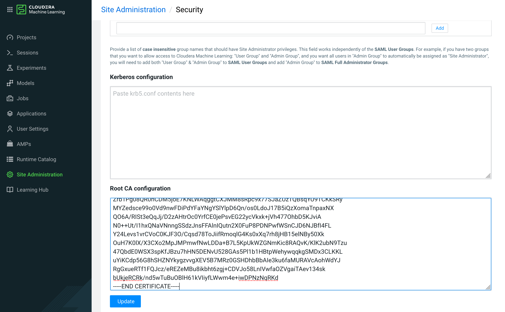
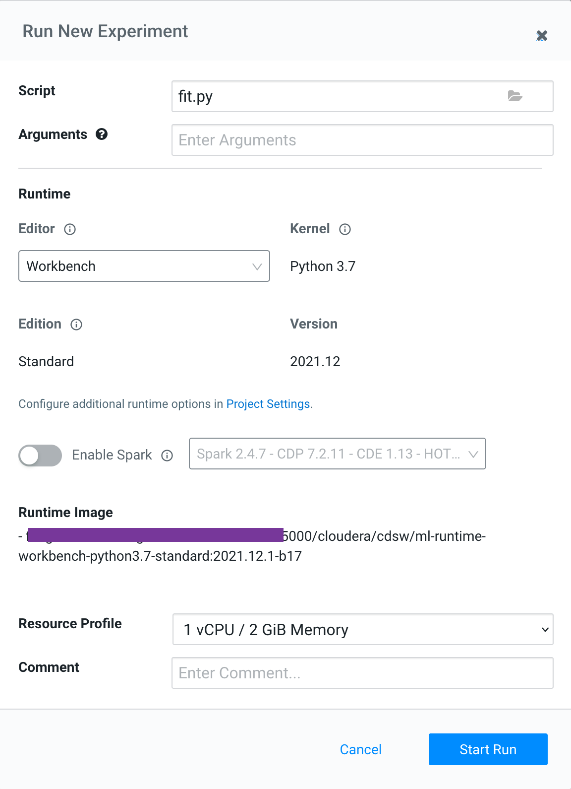
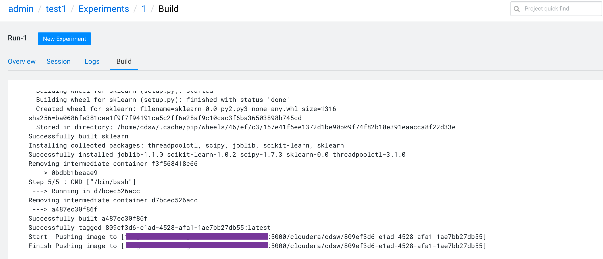
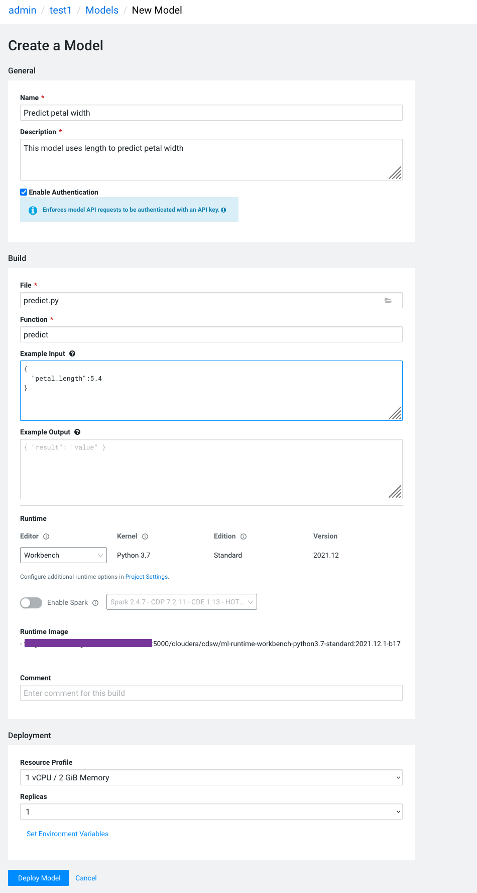
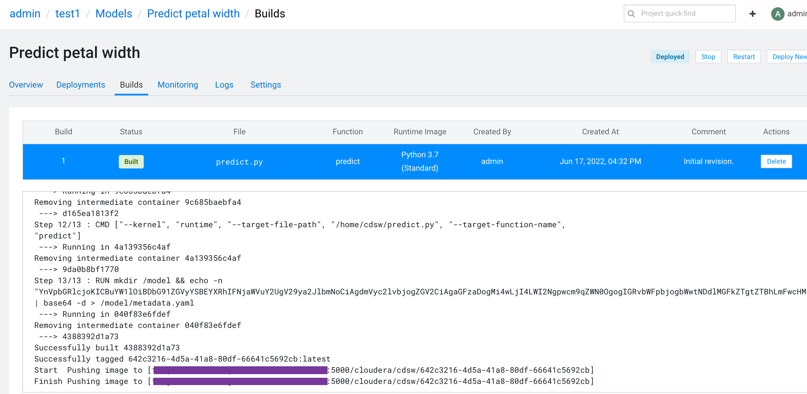
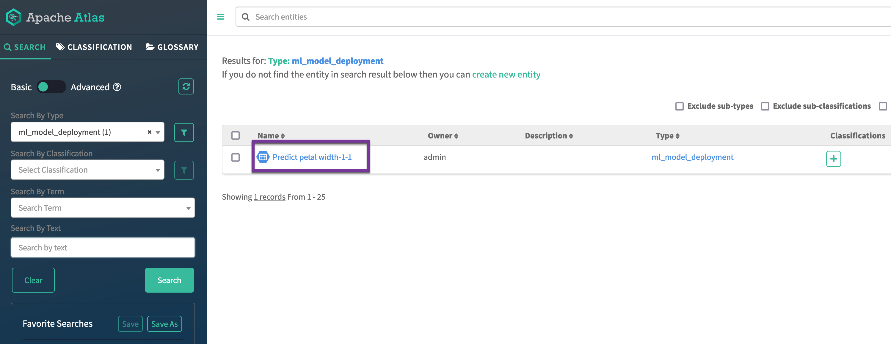
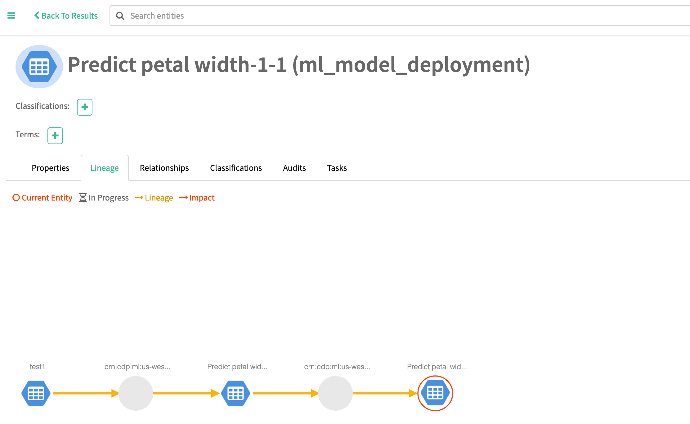

# Add Cloudera Machine Learning service and demo it
{: .no_toc }

- TOC
{:toc}

---

## 1. Introduction to the test environment

|CDP Runtime version |CDP PvC Base 7.1.7|
|CM version |Cloudera Manager 7.5.5|
|ECS version |CDP PvC DataServices 1.3.4|
|OS version |Centos 7.9|
|K8S version |RKE 1.21|
|Whether to enable Kerberos |Yes|
|Whether to enable TLS |Yes|
|Auto-TLS |No, using manual TLS|
|Kerberos |AD|
|LDAP |AD|
|DB Configuration |External Postgres 12|
|Vault |Embedded|
|Docker registry |Embedded|
|Install Method |Internet|

|IP addresss |hostname |description|
|192.168.8.140	|ds00.ecs.openstack.com |CDP Base cluster, only a single node|
|192.168.8.141	|ds01.ecs.openstack.com |ECS master node 1|
|192.168.8.142	|ds02.ecs.openstack.com |ECS master node 2|
|192.168.8.143	|ds03.ecs.openstack.com |ECS master node 3|
|192.168.8.144	|ds04.ecs.openstack.com |ECS worker node 1|
|192.168.8.145	|ds05.ecs.openstack.com |ECS worker node 2|
|192.168.8.146	|ds06.ecs.openstack.com |ECS worker node 3|

## 2. Provision the ML Workspace

- Log into the CDP Private Cloud console as the local administrator `admin`


- Click the `Machince Learning` button.


- Follow the procedure Provisioning ML Workspaces.
    - Ensure you select Enable Governance.
    - Ensure you select Enable Model Metrics.
    - Ensure you select Enable TLS.
    - Ensure you select Enable Monitoring.


- Finish installing ML workspace.


- Get the certificate URL of ML workspace from your browser. In this case `https://ml-47e0ade8-e0a.apps.ecs-lb.ecs.openstack.com/`


- Open SSH terminal for CM server and generate CSR for ML workspace

```bash
# export host=ml-47e0ade8-e0a.apps.ecs-lb.ecs.openstack.com
# openssl req -new -newkey rsa:3072 -nodes -keyout ${host}.key -subj "/CN=${host}/OU=PS/O=Cloudera, Inc./ST=CA/C=US" -out ${host}.csr
# openssl req -in ${host}.csr -text -verify
```

- Sign CSR with Root CA (def password is password)

```bash
# echo "[default]
subjectAltName = @alt_names

[alt_names]
DNS.1 = *.${host}
DNS.2 = ${host}" > cml.ext

# openssl x509 -req -extfile cml.ext -days 365 -in ${host}.csr -CA /ca/certs/ca.cert.pem -CAkey /ca/private/ca.key.pem -CAcreateserial -out ${host}.crt
Signature ok
subject=/CN=ml-47e0ade8-e0a.apps.ecs-lb.ecs.openstack.com/OU=PS/O=Cloudera, Inc./ST=CA/C=US
Getting CA Private Key
Enter pass phrase for /ca/private/ca.key.pem:

# openssl x509 -noout -text -in ${host}.crt
```

- Copy to ECS server node (copy the signed cert (.crt), the key file (.key), root CA certificate (chain.pem) )

```bash
# scp ${host}.crt ${host}.key cloudera@ds01.ecs.openstack.com:~
cloudera@ds01.ecs.openstack.com's password:
ml-47e0ade8-e0a.apps.ecs-lb.ecs.openstack.com.crt                                                                                                                                            100% 1927     1.4MB/s   00:00
ml-47e0ade8-e0a.apps.ecs-lb.ecs.openstack.com.key                                                                                                                                            100% 2484     1.1MB/s   00:00

# scp /opt/cloudera/security/pki/chain.pem cloudera@ds01.ecs.openstack.com:~
cloudera@ds01.ecs.openstack.com's password:
chain.pem                                                                                                                                                                                               100% 3984     2.7MB/s   00:00
```

- Open SSH terminal for ECS server node and create a Kubernetes secret inside the previously provisioned ML workspace namespace, and name the secret cml-tls-secret.

```bash
# export host=ml-47e0ade8-e0a.apps.ecs-lb.ecs.openstack.com
# mv /home/cloudera/$host.* ~/

# kubectl delete secret/cml-tls-secret -n cml01
# kubectl create secret tls cml-tls-secret --cert=${host}.crt --key=${host}.key -o yaml --dry-run | kubectl -n cml01 create -f -
```

- In Site Administration > Security > Root CA configuration, paste the root CA certificate (chain.pem) to the workspace.




## 3. Set Hadoop Authentication credentials

- In User Settings > Hadoop Authentication, input your principal and credentials


## 4. Demo1: Start a python session (disable spark)

- Create a project `test1` using python template


- Start session without enabling spark. In this case using `analysis.py`


- Install dependent packages


- Run the script


## 5. Demo2: Start a pyspark session (enable spark)

- Create a project `test2` using pyspark template


- Start session with enabling spark. In this case using `pagerank.py`


- Wait until CML Engine is ready 


- Run the script


- Terminal Access is also available


## 6. Demo3: Run Experiments

- Click `Run Experiment` button and choose `fit.py` from the previous project `test1`



- In Experiment > 1 > Build, view the logs of building images



- Experiment completed successfully


- In Experiment > 1 > Overview, select model.pkl, then Add to Project.


## 7. Demo4: Run Models

- Switch to `Models` module


- Click `New Model` button and choose `predict.py` from the previous project `test1`



- In Models > Predict petal width > Builds, view the logs of building images



- Model deployment completed successfully


- In User Settings > API Keys, Select an expiry date for the Model API Key, and click Create API keys. An API key is generated along with a Key ID. If you do not specify an expiry date, then the generated key is active for one year from the current date


- In Models > Predict petal width > Overview, paste the above API Key and click `Test` button

 

## 8. Demo5: View lineage for a model deployment in Atlas

- Ensure that lineage.yaml file exists in project `test1`.


- Navigate to CM > Clusters > PVC-Base > Atlas > Atlas Web UI


- Search for `ml_model_deployment`. Click the model deployment listed in the right plane.



- Click the Lineage tab to see a visualization of lineage information for the particular model deployment and trace it back to the specific data that was used to train the model.



