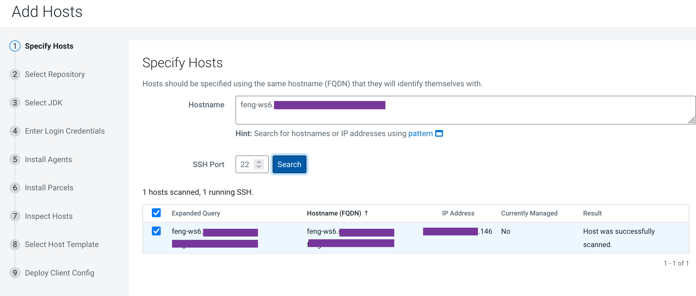
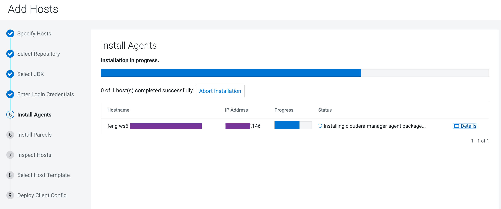
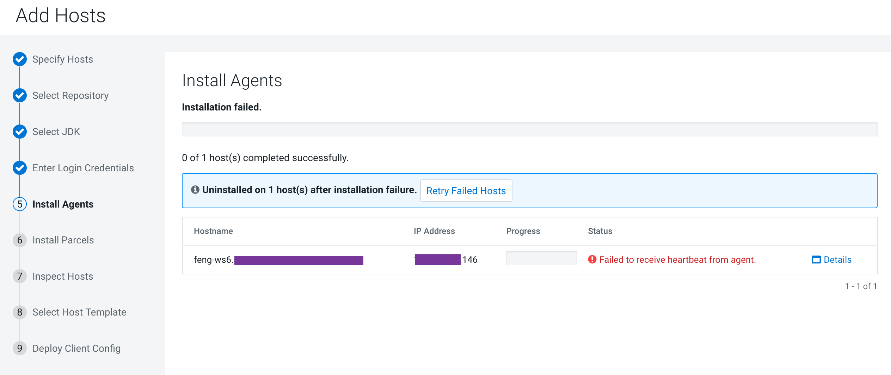
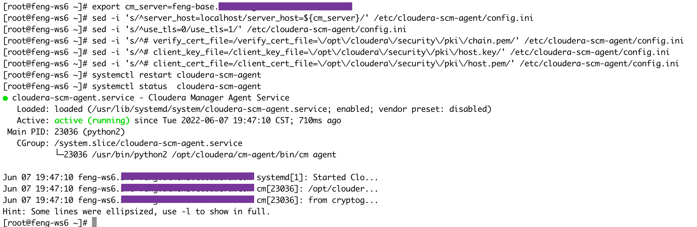
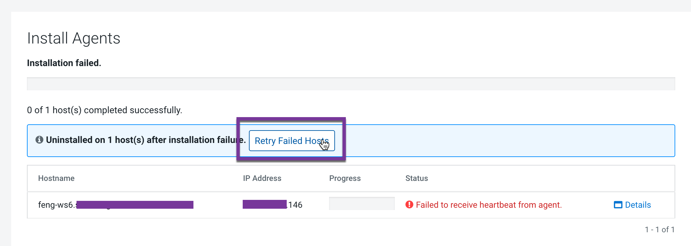
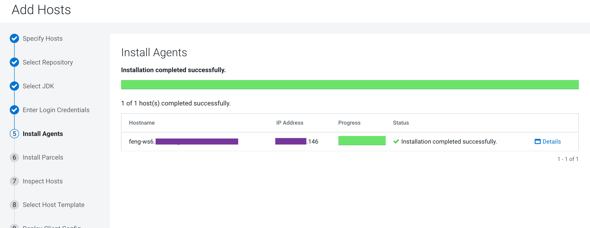
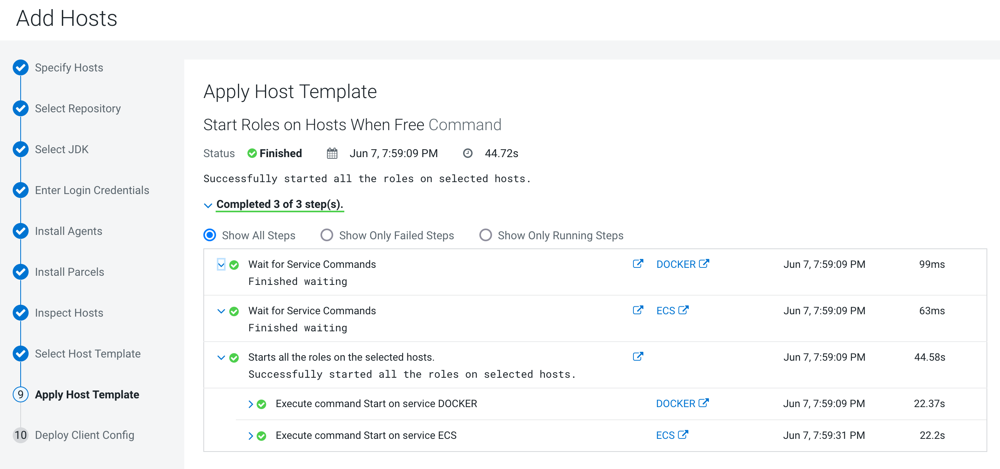
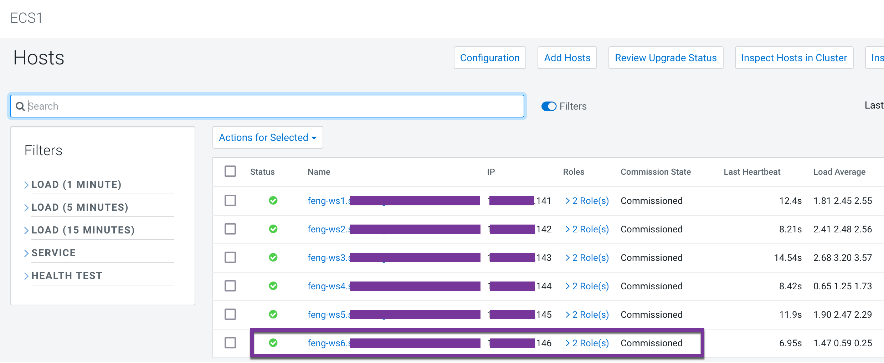
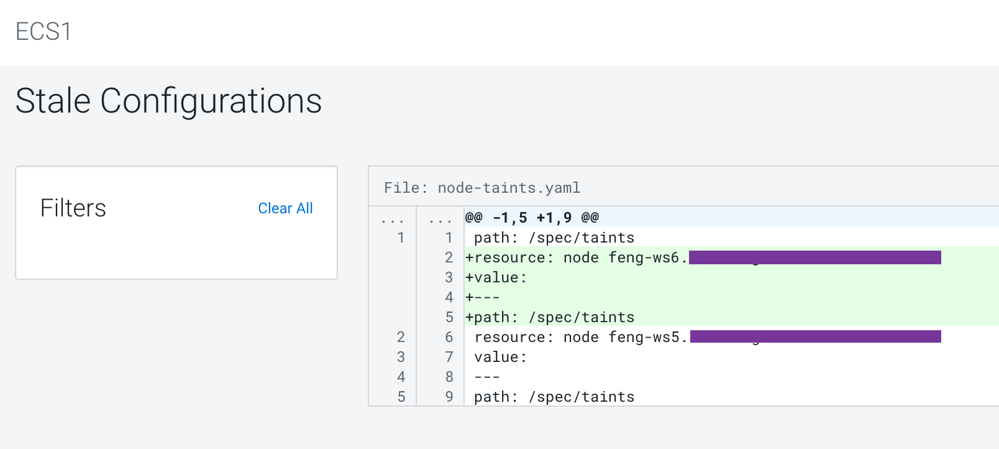
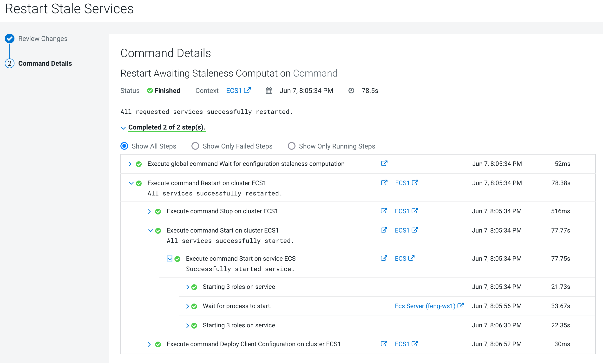

# Add new worker node to the existing ECS cluster
{: .no_toc }

- TOC
{:toc}

---

## 1. Introduction to the test environment

|CDP Runtime version |CDP PvC Base 7.1.7|
|CM version |Cloudera Manager 7.5.5|
|ECS version |CDP PvC DataServices 1.3.4|
|OS version |Centos 7.9|
|K8S version |RKE 1.21|
|Whether to enable Kerberos |Yes|
|Whether to enable TLS |Yes|
|Auto-TLS |No, using manual TLS|
|Kerberos |AD|
|LDAP |AD|
|DB Configuration |External Postgres 12|
|Vault |Embedded|
|Docker registry |Embedded|
|Install Method |Internet|

|IP addresss |hostname |description|
|192.168.8.140	|ds00.ecs.openstack.com |CDP Base cluster, only a single node|
|192.168.8.141	|ds01.ecs.openstack.com |ECS master node 1|
|192.168.8.142	|ds02.ecs.openstack.com |ECS master node 2|
|192.168.8.143	|ds03.ecs.openstack.com |ECS master node 3|
|192.168.8.144	|ds04.ecs.openstack.com |ECS worker node 1|
|192.168.8.145	|ds05.ecs.openstack.com |ECS worker node 2|
|192.168.8.146	|ds06.ecs.openstack.com |ECS worker node 3|

## 2. Create new worker node

- Ensure that ECS master node is up and running. Create a new virtual machine with CentOS-7.9 as base image with the same ip address. Use below commands on openstack plateform.
```bash
openstack server create \
  --image CentOS-7.9 \
  --flavor  m5.4xlarge \
  --security-group default \
  --availability-zone SE_PERF \
  --key-name id_rsa \
  --port=osft-nw-port-192.168.8-146 \
  --user-data files/user-data.sh \
  ds06
```
We will use this machine as the new worker node. 

- Open SSH terminal for new worker node and set the same hostname as your failed node. 
```bash
hostnamectl set-hostname ds06.ecs.openstack.com
```

- Create a new user to run commands on worker node. Give sudo access to this user. Give same username as master node.
```bash
useradd cloudera
echo cloudera > passwd.txt
echo cloudera >> passwd.txt
passwd cloudera < passwd.txt
echo "cloudera   ALL=(ALL)    NOPASSWD: ALL" >> /etc/sudoers
sed -i 's/^#PasswordAuthentication/PasswordAuthentication/' /etc/ssh/sshd_config
systemctl restart sshd
```

- Add the worker node as a new DNS entry into AD domain.

- Modify the resolv.conf file
```bash
chattr -i /etc/resolv.conf
echo "search ecs.openstack.com
nameserver 192.168.2.31" > /etc/resolv.conf
chattr +i /etc/resolv.conf
```

- Mount the additional disk /dev/vdc
```bash
mkfs.xfs -f /dev/vdc
blkid /dev/vdc
echo "/dev/vdc    /mnt2   xfs defaults    0   0" >> /etc/fstab
mkdir -p /mnt2
mount -a
lsblk
```


## 3. Setting Linux Kernel Parameter

- Set the default timezone
```bash
timedatectl set-timezone "Asia/Shanghai"
```
- Disable selinux
```bash
setenforce 0
sed -i 's/SELINUX=.*/SELINUX=disabled/' /etc/selinux/config
```

- Set the value of the vm.swappiness parameter for minimum swapping
```bash
sysctl -a | grep vm.swappiness
echo 1 > /proc/sys/vm/swappiness
sysctl vm.swappiness=1
```

- Disable Transparent Hugepages (THP)
```bash
echo never > /sys/kernel/mm/transparent_hugepage/enabled
echo never > /sys/kernel/mm/transparent_hugepage/defrag
echo "echo never > /sys/kernel/mm/transparent_hugepage/enabled" >> /etc/rc.d/rc.local
echo "echo never > /sys/kernel/mm/transparent_hugepage/defrag" >> /etc/rc.d/rc.local
```

- Increase entropy by installing rng-tools and starting the rngd service
```bash
yum -y install rng-tools
rngd -f -v
systemctl restart rngd
systemctl status rngd
systemctl enable rngd
```
- You can check the available entropy by running the following command
```bash
cat /proc/sys/kernel/random/entropy_avail
```

- change the default soft or hard limit for the number of users processes
```bash
sed -i 's/4096/65536/' /etc/security/limits.d/20-nproc.conf
```
- Install 'iscsi' for longhorn storage
```bash
yum -y install iscsi-initiator-utils
systemctl enable iscsid
systemctl start iscsid
```

## 4. Configuring TLS Authentication of CM Agent to the CM Server

- You can skip this section if you are using Auto-TLS which will automatically generate TLS certificates.

- Each new host needs to have a private key and a Cert Signing Request (CSR) created. 
Those CSRs must get signed by the CA on Cloudera Manager if you used ClouderaDeploy playbook initially, if not still need new csrs & a new key for the host, but you will have their own process to get the csr signed. Otherwise you could use self-signed certs, thats not covered here and is least desirable option

- Open SSH terminal for CM server and generate CSR for the new worker node
```bash
cd /opt/cloudera/security/pki
export host=ds06.ecs.openstack.com
rm -f csr.cnf.${host} ${host}.csr ${host}.key ${host}.pem
sed s/ds00.ecs.openstack.com/${host}/ csr.cnf > csr.cnf.${host}
openssl req -new -config csr.cnf.${host} -sha256 -newkey rsa:2048 -nodes -keyout ${host}.key -out ${host}.csr -subj "/CN=${host}/OU=PS/O=Cloudera, Inc./ST=CA/C=US"
openssl req -text -in ${host}.csr -noout -verify
```

- delete the old entry in index.txt if you are generating a certificate for a hostname that used to exist
```bash
vi /ca/intermediate/index.txt
```

- Sign CSRs with intermediate CA (def password is password)
```bash
openssl ca -config /ca/intermediate/openssl.cnf -extensions cloudera_req -out ${host}.pem -infiles ${host}.csr
openssl x509 -in ${host}.pem -text -noout
```

- Copy to the worker node (copy the signed cert (.pem), the key file (.key) and the trust store file (chain.pem), dont need to copy the csr file, dont need to copy any jks file)
```bash
scp chain.pem ${host}.pem ${host}.key cloudera@${host}:/tmp
```

- Open SSH terminal for worker node and move the above files to pki dir 
```bash
export host=ds06.ecs.openstack.com
mkdir -p /opt/cloudera/security/pki/
mv /tmp/chain.pem /opt/cloudera/security/pki/
mv /tmp/${host}.key /opt/cloudera/security/pki/
mv /tmp/${host}.pem /opt/cloudera/security/pki/
rm -f /opt/cloudera/security/pki/host.key /opt/cloudera/security/pki/host.pem
ln -s /opt/cloudera/security/pki/${host}.key /opt/cloudera/security/pki/host.key
ln -s /opt/cloudera/security/pki/${host}.pem /opt/cloudera/security/pki/host.pem
```

- Verify the files under the pki dir 
```bash
ll /opt/cloudera/security/pki
total 16
-rw-r--r--. 1 cloudera cloudera 3984 Mar 17 16:32 chain.pem
-rw-r--r--. 1 cloudera cloudera 1704 Mar 17 16:32 ds06.ecs.openstack.com.key
-rw-r--r--. 1 cloudera cloudera 5734 Mar 17 16:32 ds06.ecs.openstack.com.pem
lrwxrwxrwx. 1 root     root       68 Mar 17 16:34 host.key -> /opt/cloudera/security/pki/ds06.ecs.openstack.com.key
lrwxrwxrwx. 1 root     root       68 Mar 17 16:34 host.pem -> /opt/cloudera/security/pki/ds06.ecs.openstack.com.pem
```

**_NOTE:_** The following step can only be done after installing the Cloudera Manager Agent.

- Adapt /etc/cloudera-scm-agent/config.ini & then restart the agent 
```bash
export cm_server=ds00.ecs.openstack.com
sed -i 's/^server_host=localhost/server_host=${cm_server}/' /etc/cloudera-scm-agent/config.ini
sed -i 's/^use_tls=0/use_tls=1/' /etc/cloudera-scm-agent/config.ini
sed -i 's/^# verify_cert_file=/verify_cert_file=\/opt\/cloudera\/security\/pki\/chain.pem/' /etc/cloudera-scm-agent/config.ini
sed -i 's/^# client_key_file=/client_key_file=\/opt\/cloudera\/security\/pki\/host.key/' /etc/cloudera-scm-agent/config.ini
sed -i 's/^# client_cert_file=/client_cert_file=\/opt\/cloudera\/security\/pki\/host.pem/' /etc/cloudera-scm-agent/config.ini
systemctl restart cloudera-scm-agent
systemctl status  cloudera-scm-agent
```

## 5. Add Host to the Existing ECS Cluster

- Open SSH terminal for worker node and install java
```bash
yum -y install java-11-openjdk
```

- create the yum repository for Cloudera Manager
```bash 
echo "[cloudera-manager]
baseurl = https://archive.cloudera.com/p/cm7/7.5.5/redhat7/yum/
enabled = 1
gpgcheck = 1
gpgkey = https://archive.cloudera.com/p/cm7/7.5.5/redhat7/yum/RPM-GPG-KEY-cloudera
name = Cloudera Manager
password = xxx
username = xxx" > /etc/yum.repos.d/cloudera-manager.repo
yum clean all
```

- Click the Add Hosts button and Select Add hosts to cluster


- Select the cluster `ECS1`. Click Continue.


- On the Specify Hosts page, enter the host name to search for new hosts to add to the cluster. Select the hosts that you want to add. Click Continue.



- Select the Repository Location where Cloudera Manager can find the software to install on the new hosts. Click Continue.


- Select the Manually manage JDK option because JDK 11 has been installed manually on the host


- Enter Login Credentials: Select user `cloudera` that has password-less sudo privileges.


- The Install Agents page displays and Cloudera Manager installs the Agent software on the new hosts. 



- The installation will fail, which is expected behavior, because there is no certificates configured in /etc/cloudera-scm-agent/config.ini.



- Follow the following steps to add three certificates.



- Click the `Retry Failed Host` button



- When the agent installation finishes, click Continue.



- Cloudera Manager begins to install the ECS parcels. When the parcel installation finishes, click Continue.


- The Host Inspector runs and displays any problems with the hosts. Correct the problems before continuing.


- After correcting any problems, click Continue.

- To create a new host template `ecs`, click the Create... button. The Create New Host Template screen opens. See Host Templates for details on how you select the role groups that define the roles that should run on a host. After you have created the template, it will appear in the list of host templates from which you can choose.


- Select the host template you want to use.


- By default Cloudera Manager will automatically start the roles specified in the host template on your newly added hosts. 




- When the wizard is finished, you can verify the Agent is connecting properly with the Cloudera Manager Server by clicking the Hosts tab and checking the health status for the new host. If the Health Status is Good and the value for the Last Heartbeat is recent, then the Agent is connecting properly with the Cloudera Manager Server.



## 6. (Optional) Restart ECS cluster

- The ECS services prompts you to restart the stale service. Please follow the restart steps when the cluster is idle,







**_NOTE:_** Run `unseal vault` after restarting the ECS service


