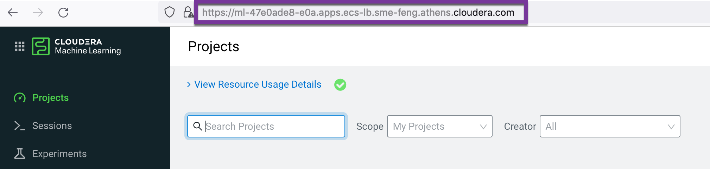
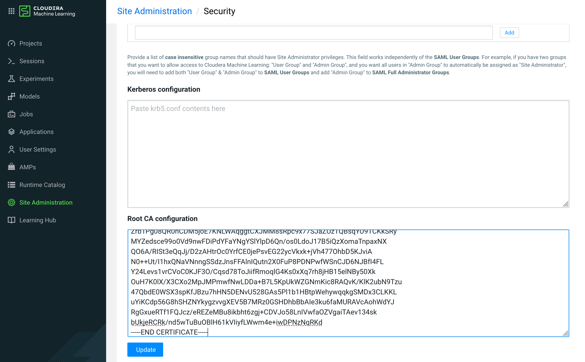

# Sign CSR with AutoTLS Managed CA for ML Workspace
{: .no_toc }

- TOC
{:toc}

---

## 1. Introduction to the test environment

|CDP Runtime version |CDP PvC Base 7.1.7 SP1|
|CM version |Cloudera Manager 7.6.5|
|ECS version |CDP PvC DataServices 1.4.0|
|OS version |Centos 7.9|
|K8S version |RKE 1.21|
|Whether to enable Kerberos |Yes|
|Whether to enable TLS |Yes|
|Auto-TLS |Yes|
|Kerberos |FreeIPA|
|LDAP |FreeIPA|
|DB Configuration |PostgreSQL 10.21 or Oracle 19.3|
|Vault |Embedded|
|Docker registry |Embedded|
|Install Method |Internet|


|IP addresss |hostname |description|
|192.168.6.201  |cb01.ecs.ycloud.com |CDP Base master node 1 , PostgreSQL server|
|192.168.6.202  |cb02.ecs.ycloud.com |CDP Base worker node 1|
|192.168.6.203  |cb03.ecs.ycloud.com |CDP Base worker node 2|
|192.168.6.204  |cb04.ecs.ycloud.com |CDP Base worker node 3|
|192.168.6.205  |orcl.ecs.ycloud.com |Oracle Server         |
|192.168.8.141	|ds01.ecs.openstack.com |ECS master node 1|
|192.168.8.142	|ds02.ecs.openstack.com |ECS worker node 1|
|192.168.8.143	|ds03.ecs.openstack.com |ECS worker node 2|
|192.168.8.144	|ds04.ecs.openstack.com |ECS worker node 3|

## 2. ML Workspace certificate requirements

- You can provision an ML workspace with TLS enabled, so that it can be accessed via https.

- The certificate URL is generally of the form: &lt;workspaceid&gt;
.&lt;cluster&gt;
.&lt;domain&gt;
.com. Assuming an example URL for the certificate of ml-47e0ade8-e0a.cluster.yourcompany.com, check that the certificate correctly shows the corresponding Common Name (CN) and Subject Alternative Names (SAN):
    - CN: ml-47e0ade8-e0a.cluster.yourcompany.com
    - SAN: *.ml-47e0ade8-e0a.cluster.yourcompany.com
    - SAN: ml-47e0ade8-e0a.cluster.yourcompany.com

- Given a certificate (ca-cert.pem) and its private key (ca-key.pem), You can use OpenSSL to sign a provided CSR (host.csr) and generate a certificate for ML workspace (host.crt). For the AutoTLS enabled CDP cluster:
    - ca-cert.pem is `/var/lib/cloudera-scm-agent/agent-cert/cm-auto-in_cluster_ca_cert.pem`
    - ca-key.pem is `/var/lib/cloudera-scm-server/certmanager/CMCA/private/ca_key.pem`, which is hidden in the CM backend database
    - host.csr is generate by `openssl req` command with the corresponding Common Name (CN) tag
    - host.crt is the target ML Workspace certificate

## 3. Export AutoTLS CMCA package from CM database

### 3.1 PostgreSQL

- Blob data can be easily exported by the `copy` command.

```bash
psql -U scm -h cb01.ecs.ycloud.com -p 5432 -d scm -c "\copy (SELECT encode(CERTTAR, 'hex') from CERTIFICATES) to STDOUT" | while read -N2 code; do printf "\x$code"; done > ~/cmca.tar.gz
mkdir -p /var/lib/cloudera-scm-server/certmanager
tar zxvf ~/cmca.tar.gz -C /var/lib/cloudera-scm-server/certmanager
```

### 3.2 Oracle

- Open SSH terminal for Oracle server and create a directory for export BLOB data.

```bash
su - oracle
mkdir -p /home/oracle/blobs

sqlplus / as sysdba
SQL>create or replace directory BLOBS as '/home/oracle/blobs/';
SQL>grant read,write on directory BLOBS to scm;
SQL>grant create procedure to scm;
SQL>exit
```

- Open SSH terminal for Oracle client (e.g. CM server). Please create a procedure and execute it.

```bash
su - oracle
sqlplus scm/password@orcl

SQL>CREATE OR REPLACE PROCEDURE blob_to_file (p_blob      IN  BLOB,
                                          p_dir       IN  VARCHAR2,
                                          p_filename  IN  VARCHAR2)
AS
  l_file      UTL_FILE.FILE_TYPE;
  l_buffer    RAW(32767);
  l_amount    BINARY_INTEGER := 32767;
  l_pos       INTEGER := 1;
  l_blob_len  INTEGER;
BEGIN
  l_blob_len := DBMS_LOB.getlength(p_blob);
  
  -- Open the destination file.
  l_file := UTL_FILE.fopen(p_dir, p_filename,'wb', 32767);

  -- Read chunks of the BLOB and write them to the file until complete.
  WHILE l_pos <= l_blob_len LOOP
    DBMS_LOB.read(p_blob, l_amount, l_pos, l_buffer);
    UTL_FILE.put_raw(l_file, l_buffer, TRUE);
    l_pos := l_pos + l_amount;
  END LOOP;
  
  -- Close the file.
  UTL_FILE.fclose(l_file);
  
EXCEPTION
  WHEN OTHERS THEN
    -- Close the file if something goes wrong.
    IF UTL_FILE.is_open(l_file) THEN
      UTL_FILE.fclose(l_file);
    END IF;
    RAISE;
END blob_to_file;
/

SQL>DECLARE
  l_blob  BLOB;
BEGIN
  -- Get LOB locator
  select CERTTAR
  INTO   l_blob
  from scm.CERTIFICATES 
  where CERTIFICATE_ID=1546340689;

  blob_to_file(p_blob     => l_blob,
               p_dir      => 'BLOBS',
               p_filename => 'cmca.tar.gz');
END;
/

SQL>exit
```

- Open SSH terminal for Oracle server and copy file 'cmca.tar.gz' to CM server.

```bash
scp /home/oracle/blobs/cmca.tar.gz root@cb01.ecs.ycloud.com:~
```

-  Open SSH terminal for CM server and unzip files into the target directory `/var/lib/cloudera-scm-server/certmanager`.

```bash
mkdir -p /var/lib/cloudera-scm-server/certmanager
tar zxvf ~/cmca.tar.gz -C /var/lib/cloudera-scm-server/certmanager
```

## 4. Decode password for ca_key.pem

- The private key (ca-key.pem) is under directory /var/lib/cloudera-scm-server/certmanager/CMCA/private.

```bash
# ll /var/lib/cloudera-scm-server/certmanager
total 24
drwx------ 4 cloudera-scm cloudera-scm 4096 Aug 10 23:26 CMCA
-rw-r----- 1 cloudera-scm cloudera-scm  107 Aug 10 23:26 frozen_config.ini
-rwxr-xr-x 1 cloudera-scm cloudera-scm  140 Aug 10 23:26 generate_host_cert
drwx------ 3 cloudera-scm cloudera-scm 4096 Aug 10 23:26 hosts-key-store
drwx------ 2 cloudera-scm cloudera-scm 4096 Aug 10 23:26 private
drwxr-xr-x 2 cloudera-scm cloudera-scm 4096 Aug 10 23:26 trust-store
```

- Get obfuscated password from file .ca_key_password

```bash
# cat /var/lib/cloudera-scm-server/certmanager/CMCA/private/.ca_key_password

e298a3f09f92a3e298a0 1 Zglpbged7QHSzeJnPveIjclBk7l7nR1uAqOXXNoPpZ2 //k2XHb3l26V5eSYWbeWdBIC0nqWmaR1fUOOn6tJNTPRxyVoHQPjAycEYA==
```

- Prepare python script for decoding password. Note: please paste the above content for the variable `obfuscated_password`.

```bash
cat > tmp.py  << EOF
import hashlib
from subprocess import Popen, PIPE, STDOUT
def hex_str(byteArr):
 return ''.join(format(ord(x), '02x') for x in byteArr)
obfuscated_password ='e298a3f09f92a3e298a0 1 Zglpbged7QHSzeJnPveIjclBk7l7nR1uAqOXXNoPpZ2 //k2XHb3l26V5eSYWbeWdBIC0nqWmaR1fUOOn6tJNTPRxyVoHQPjAycEYA=='
hdr, version, random, enc = obfuscated_password.split()
OBFUSCATION_SECRET="f09f998ff09f93bff09fa49e"
OBFUSCATION_HEADER="e298a3f09f92a3e298a0"
m=hashlib.sha512()
m.update(random)
m.update(OBFUSCATION_SECRET)
m2 = m.copy()
m.update("IV")
iv = m.digest()[:16] # 128 bits for IV
m2.update("KEY")
key = m2.digest()[:32] # 256 bits for key
p = Popen(["openssl", "enc", "-d", "-aes-256-ofb",
 "-K", hex_str(key),
 "-iv", hex_str(iv),
 "-a", "-A",
 ],
 stdin=PIPE, stdout=PIPE, stderr=PIPE)
stdout, stderr = p.communicate(enc)
print (stdout)
EOF
```

## 5. Generate CSR for ML workspace and sign it with AutoTLS managed CA

- Get the certificate URL of ML workspace from your browser. In this case `https://ml-47e0ade8-e0a.apps.ecs-lb.ecs.openstack.com/`



- Open SSH terminal for CM server and create a CSR(Certificate Signing Request).

```bash
export host=ml-47e0ade8-e0a.apps.ecs-lb.ecs.openstack.com
openssl req -new -newkey rsa:3072 -nodes -keyout ${host}.key -subj "/CN=${host}/OU=PS/O=Cloudera, Inc./ST=CA/C=US" -out ${host}.csr
openssl req -in ${host}.csr -text -verify
```

- Sign CSR

```bash
echo "[default]
subjectAltName = @alt_names

[alt_names]
DNS.1 = *.${host}
DNS.2 = ${host}" > cml.ext

openssl x509 -req -extfile cml.ext -days 365 -in ${host}.csr -CA /var/lib/cloudera-scm-agent/agent-cert/cm-auto-in_cluster_ca_cert.pem -CAkey /var/lib/cloudera-scm-server/certmanager/CMCA/private/ca_key.pem -CAcreateserial -out ${host}.crt -passin pass:$(python tmp.py)
openssl x509 -in ${host}.crt -text -noout
```

- Copy to ECS server node (copy the signed cert (.crt), the key file (.key))

```bash
# scp ${host}.crt ${host}.key cloudera@ds01.ecs.openstack.com:~
ml-47e0ade8-e0a.apps.ecs-lb.ecs.openstack.com 100% 1749   795.9KB/s   00:00
ml-47e0ade8-e0a.apps.ecs-lb.ecs.openstack.com 100% 2484     1.9MB/s   00:00
```

## 6. Upload certificate into CML workspace

- Open SSH terminal for ECS server node and create a Kubernetes secret inside the previously provisioned ML workspace namespace, and name the secret cml-tls-secret.

```bash
# export host=ml-47e0ade8-e0a.apps.ecs-lb.ecs.openstack.com
# mv /home/cloudera/$host.* ~/

# kubectl delete secret/cml-tls-secret -n cml01
# kubectl create secret tls cml-tls-secret --cert=${host}.crt --key=${host}.key -o yaml --dry-run | kubectl -n cml01 create -f -
```

- In Site Administration > Security > Root CA configuration, paste the root CA certificate (/var/lib/cloudera-scm-agent/agent-cert/cm-auto-in_cluster_ca_cert.pem) to the workspace.




