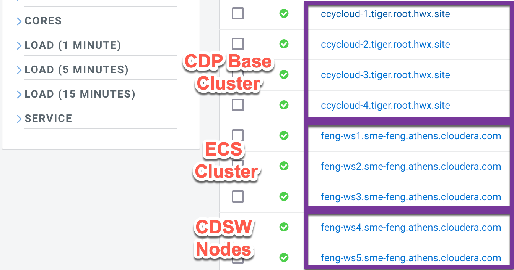
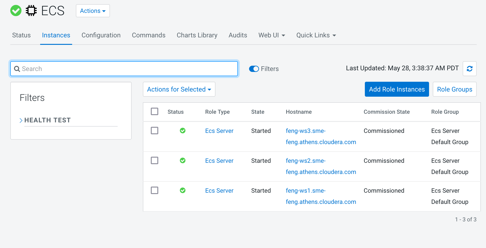
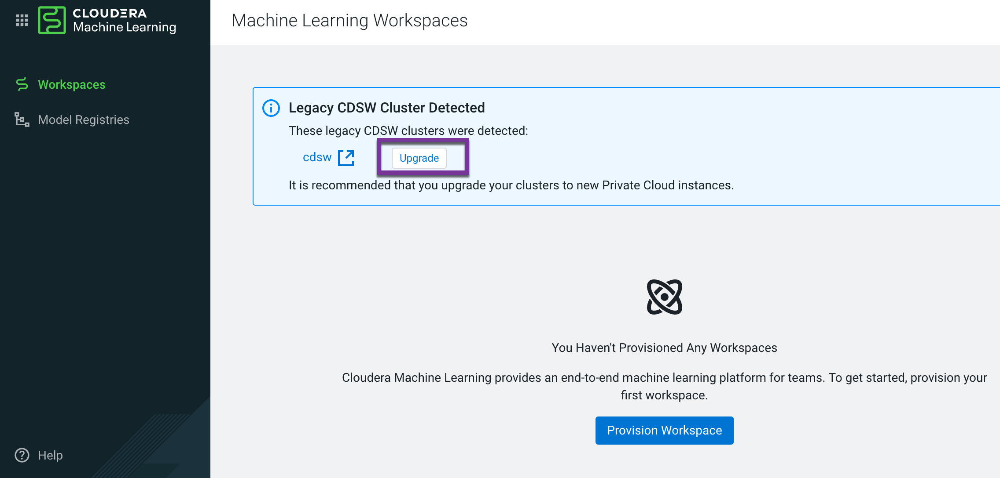
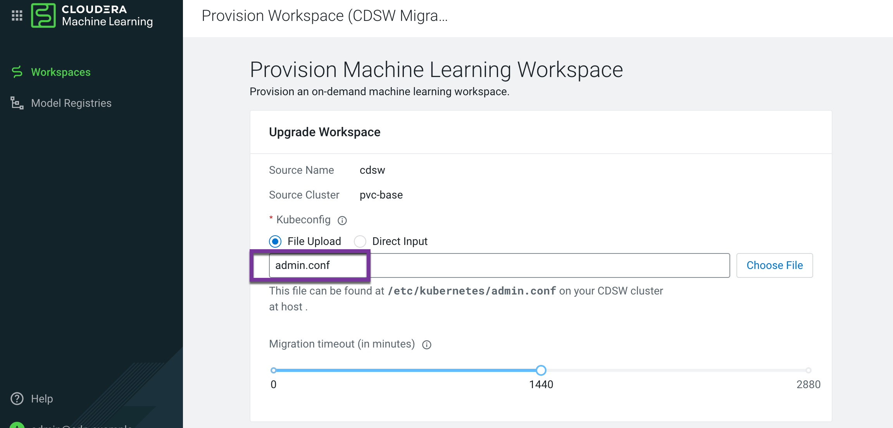
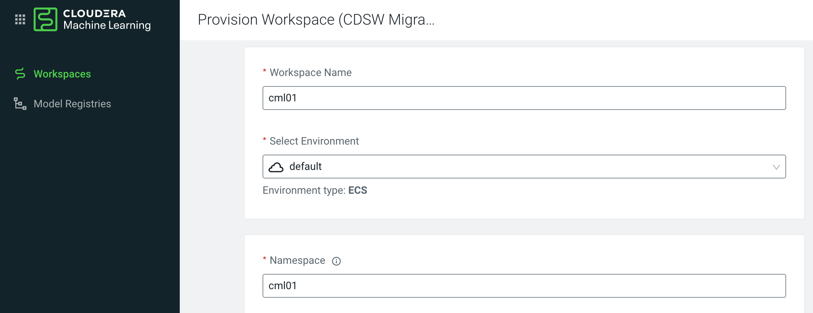
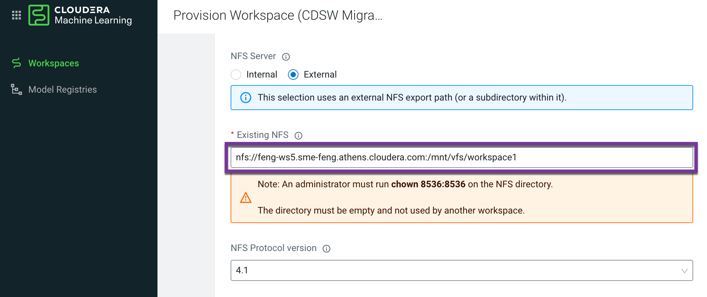
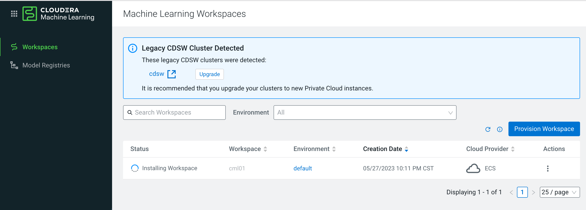
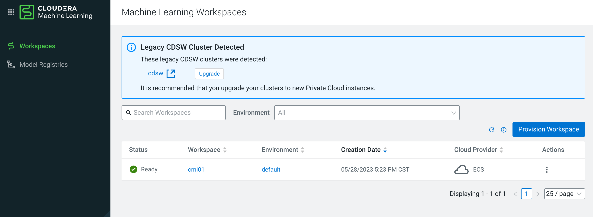

# CDSW > CML Migration
{: .no_toc }

- TOC
{:toc}

---

- The CDSW service is deployed on the gateway nodes of the CDP Base cluster, while the CML is deployed on the ECS cluster which is attached to the CDP Base cluster. Therefore, the migration of CDSW to CML is not equivalent. A seperate ECS cluster must be built at first and require at least 3 HA master nodes in production environment. 

|CDSW size |ECS Cluster initial size|Comment|
|1 CDSW master |1 ECS master|only for PoC|
|1 CDSW master + 1 CDSW worker |3 ECS master|Repurposing CDP Base Nodes for ECS cluster|
|1 CDSW master + 2 CDSW worker |3 ECS master|Repurposing CDP Base Nodes for ECS cluster|
|1 CDSW master + 3 CDSW worker |3 ECS master|Repurposing CDSW worker Nodes for ECS cluster|
|1 CDSW master + 4 CDSW worker |3 ECS master + 1 ECS worker|Repurposing CDSW worker Nodes for ECS cluster|
|1 CDSW master + 5 CDSW worker |3 ECS master + 2 ECS worker|Repurposing CDSW worker Nodes for ECS cluster|

- Note: If there are no more than 3 CDSW worker nodes, CDP Base nodes have to be repurposed for side-car CDSW migration.



- The following demonstration is the migration steps from 2 CDSW nodes to 3 ECS master nodes.


## 1. Introduction to the test environment

|CDP Runtime version |CDP PvC Base 7.1.7 SP2|
|CM version |Cloudera Manager 7.9.5|
|ECS version |CDP PvC DataServices 1.5.0|
|OS version |Centos 7.9|
|K8S version |RKE 1.21|
|Whether to enable Kerberos |Yes|
|Whether to enable TLS |Yes|
|Auto-TLS |Yes|
|Kerberos |FreeIPA|
|LDAP |FreeIPA|
|DB Configuration |PostgreSQL 10.21|
|Vault |Embedded|
|Docker registry |Embedded|
|Install Method |Internet|
|CDSW version|1.10.3|


## 2. CDSW Migration

### 2.1 Repurpose CDP Base nodes for ECS Cluster

- Please decommission 3 datanodes from the CDP Base Cluster. Please see [Repurposing CDP Private Cloud Base Nodes for CDP Private Cloud Data Services on ECS](https://docs.cloudera.com/cdp-private-cloud-data-services/1.5.0/repurposing-nodes/topics/cdppvc-data-services-repurposing-nodes.html).

### 2.2 Install ECS Cluster

- The ECS Cluster requires at least 3 master nodes for HA purpose, and no worker nodes are required, because the master nodes can also serve as worker nodes. Please see [Installing ECS HA cluster](https://fxu1024.github.io/docs/ds/freshinstall/)



- Note: You have to manually cleanup the taint policy on ECS master nodes after installation.
```bash
kubectl taint nodes <ECS Master01 Hostname> node-role.kubernetes.io/control-plane=true:NoSchedule-
kubectl taint nodes <ECS Master02 Hostname> node-role.kubernetes.io/control-plane=true:NoSchedule-
kubectl taint nodes <ECS Master03 Hostname> node-role.kubernetes.io/control-plane=true:NoSchedule-
```


### 2.3 Use the CDSW to CML migration tool

- Log into CDP Private Cloud 1.5.0, and navigate to Cloudera Machine Learning > Workspaces. The system detects the presence of your legacy CDSW installation. Click Upgrade.



- Click File Upload > Choose File, go to /etc/kubernetes/admin.conf on the CDSW cluster host, and select the Kubeconfig file.
    - In Migration timeout, accept the default 1440 minutes (24 hours) timeout, or if your CDSW workload is hundreds of gigabytes, increase the migration time up to 2880 minutes (2 days). Increasing the migration timeout value does not cause a delay in the migration of a small workload.



- In Workspace Name, type an arbitrary name. In Select Environment, select your CDP environment. Accept default values for other options, and click Provision Workspace.



- Execute the following script to create external nfs for CML

```bash
mkdir -p /mnt/vfs
echo "/mnt/vfs *(rw,sync,no_root_squash,no_all_squash,no_subtree_check)" > /etc/exports
exportfs -rv
showmount -e

mkdir /mnt/vfs/workspace1
chown 8536:8536 /mnt/vfs/workspace1
chmod g+srwx /mnt/vfs/workspace1

yum install nfs-utils.x86_64 -y
systemctl start nfs-server.service
systemctl enable nfs-server.service
mkdir -p /mnt/nfs
mount -t nfs -o vers=4.1 feng-ws5.sme-feng.athens.cloudera.com:/mnt/vfs/workspace1 /mnt/nfs
nfsstat -m|grep /mnt/nfs
```



- Accept default values for other options, and click Provision Workspace

- CML installation begins, and the CDSW to CML migration follows automatically. Status indicators show the progress of the installation and migration. During the migration, you cannot access the CDSW cluster. The migration process stops CDSW pods to prevent data corruption. 



- After migration, the CDSW returns to a working state. The CML workspace is ready.




## 3. Conclusion

- If there are no more than 3 CDSW worker nodes, CDP Base nodes have to be repurposed for side-car CDSW migration. CDSW and ECS clusters must run side-by-side during migration.
- ECS Cluster requires at least 3 master nodes for HA purpose, and no worker nodes are required, because the master nodes can also serve as worker nodes by disabling taint policy.
- Limitations of CDSW to CML migration in PvC 1.5.0:
	- Migration to CDP Private Cloud OpenShift Container Platform (OCP) is not supported.
	- Incremental Migration of projects is not supported.
	- CDSW cluster version >= 1.10.0
	- CML with internal NFS Storage is not recommended. Large file operations are more suitable for external NFS storage.
	- The size of the disk where CML's external nfs storage is located must not be less than the size of the disk where the directory /var/lib/cdsw of CDSW is located
