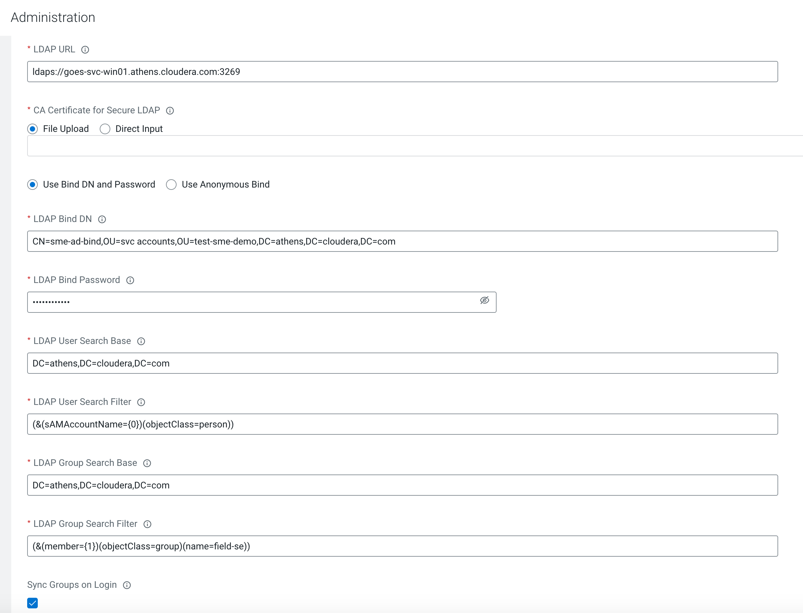
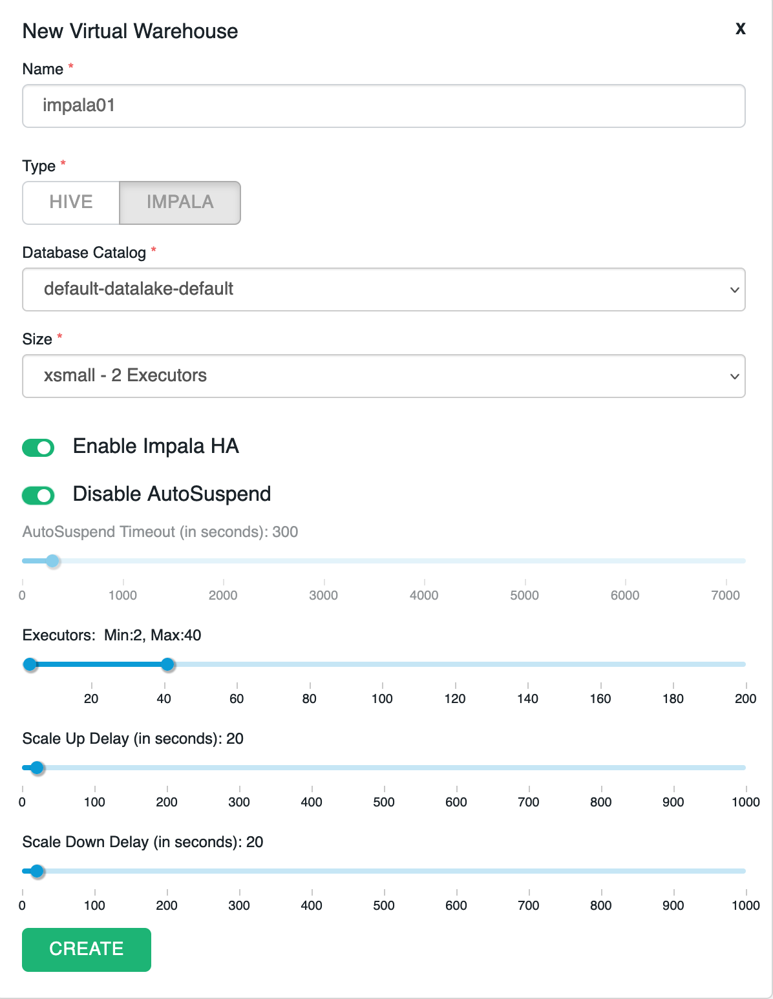

# node crash demo 
{: .no_toc }

- TOC
{:toc}

---

## 1. Introduction to the test environment

|CDP Runtime version |CDP PvC Base 7.1.7|
|CM version |Cloudera Manager 7.5.5|
|ECS version |CDP PvC DataServices 1.3.4|
|Whether to enable Kerberos |Yes|
|Whether to enable TLS |Yes|
|Auto-TLS |No, using manual TLS|

|IP addresss |hostname |description|
|10.113.207.140	|feng-base.sme-feng.athens.cloudera.com |CDP Base cluster only a single node|
|10.113.207.141	|feng-ws1.sme-feng.athens.cloudera.com |ECS master node 1|
|10.113.207.142	|feng-ws2.sme-feng.athens.cloudera.com |ECS master node 2|
|10.113.207.143	|feng-ws3.sme-feng.athens.cloudera.com |ECS master node 3|
|10.113.207.144	|feng-ws4.sme-feng.athens.cloudera.com |ECS worker node 1|
|10.113.207.145	|feng-ws5.sme-feng.athens.cloudera.com |ECS worker node 2|
|10.113.207.146	|feng-ws6.sme-feng.athens.cloudera.com |ECS worker node 3|

## 2. Create a Hive VW and Impala VW






## 3. get node status

```bash
# kubectl get node
NAME                                    STATUS   ROLES                       AGE    VERSION
feng-ws1.sme-feng.athens.cloudera.com   Ready    control-plane,etcd,master   3d1h   v1.21.8+rke2r2
feng-ws2.sme-feng.athens.cloudera.com   Ready    control-plane,etcd,master   3d1h   v1.21.8+rke2r2
feng-ws3.sme-feng.athens.cloudera.com   Ready    control-plane,etcd,master   3d1h   v1.21.8+rke2r2
feng-ws4.sme-feng.athens.cloudera.com   Ready    <none>                      3d1h   v1.21.8+rke2r2
feng-ws5.sme-feng.athens.cloudera.com   Ready    <none>                      3d1h   v1.21.8+rke2r2
feng-ws6.sme-feng.athens.cloudera.com   Ready    <none>                      3d1h   v1.21.8+rke2r2
```

## 4. get pod list on feng-ws6

```bash
# kubectl get pods -A -o wide --field-selector spec.nodeName=feng-ws6.sme-feng.athens.cloudera.com
NAMESPACE                   NAME                                                              READY   STATUS    RESTARTS   AGE     IP               NODE                                    NOMINATED NODE   READINESS GATES
compute-1655286395-b88k     das-webapp-0                                                      1/1     Running   0          9m53s   10.42.4.87       feng-ws6.sme-feng.athens.cloudera.com   <none>           <none>
compute-1655286395-b88k     hiveserver2-0                                                     1/1     Running   0          9m52s   10.42.4.91       feng-ws6.sme-feng.athens.cloudera.com   <none>           <none>
compute-1655286395-b88k     huebackend-0                                                      1/1     Running   0          9m52s   10.42.4.88       feng-ws6.sme-feng.athens.cloudera.com   <none>           <none>
compute-1655286395-b88k     huefrontend-c86776c6d-w86rw                                       1/1     Running   0          9m52s   10.42.4.89       feng-ws6.sme-feng.athens.cloudera.com   <none>           <none>
compute-1655286395-b88k     query-coordinator-0-0                                             1/1     Running   0          9m45s   10.42.4.93       feng-ws6.sme-feng.athens.cloudera.com   <none>           <none>
compute-1655286395-b88k     query-coordinator-0-1                                             1/1     Running   0          9m45s   10.42.4.94       feng-ws6.sme-feng.athens.cloudera.com   <none>           <none>
compute-1655286395-b88k     standalone-compute-operator-0                                     1/1     Running   0          9m53s   10.42.4.86       feng-ws6.sme-feng.athens.cloudera.com   <none>           <none>
compute-1655286395-b88k     usage-monitor-5fc8d9f456-npcsx                                    1/1     Running   0          9m52s   10.42.4.90       feng-ws6.sme-feng.athens.cloudera.com   <none>           <none>
impala-1655286630-v4d2      catalogd-6fb8457b59-twpzn                                         1/1     Running   0          5m56s   10.42.4.96       feng-ws6.sme-feng.athens.cloudera.com   <none>           <none>
impala-1655286630-v4d2      impala-autoscaler-6dffd9b4d5-j5cqc                                1/1     Running   0          5m56s   10.42.4.95       feng-ws6.sme-feng.athens.cloudera.com   <none>           <none>
impala-1655286630-v4d2      impala-executor-000-1                                             1/1     Running   0          4m4s    10.42.4.98       feng-ws6.sme-feng.athens.cloudera.com   <none>           <none>
infra-prometheus            infra-prometheus-operator-1-1655024696-prometheus-node-expmlgp7   1/1     Running   1          3d      10.113.207.146   feng-ws6.sme-feng.athens.cloudera.com   <none>           <none>
kube-system                 kube-proxy-feng-ws6.sme-feng.athens.cloudera.com                  1/1     Running   0          29h     10.113.207.146   feng-ws6.sme-feng.athens.cloudera.com   <none>           <none>
kube-system                 nvidia-device-plugin-daemonset-8f6gg                              1/1     Running   1          3d      10.42.4.62       feng-ws6.sme-feng.athens.cloudera.com   <none>           <none>
kube-system                 rke2-canal-7znlf                                                  2/2     Running   2          3d1h    10.113.207.146   feng-ws6.sme-feng.athens.cloudera.com   <none>           <none>
longhorn-system             engine-image-ei-d4c780c6-dzclh                                    1/1     Running   1          3d1h    10.42.4.67       feng-ws6.sme-feng.athens.cloudera.com   <none>           <none>
longhorn-system             instance-manager-e-02473d29                                       1/1     Running   0          29h     10.42.4.64       feng-ws6.sme-feng.athens.cloudera.com   <none>           <none>
longhorn-system             instance-manager-r-d9323b0a                                       1/1     Running   0          29h     10.42.4.68       feng-ws6.sme-feng.athens.cloudera.com   <none>           <none>
longhorn-system             longhorn-csi-plugin-glzkk                                         2/2     Running   2          3d1h    10.42.4.66       feng-ws6.sme-feng.athens.cloudera.com   <none>           <none>
longhorn-system             longhorn-manager-6klq2                                            1/1     Running   1          3d1h    10.42.4.61       feng-ws6.sme-feng.athens.cloudera.com   <none>           <none>
shared-services             log-router-l9sd4                                                  2/2     Running   2          2d9h    10.42.4.65       feng-ws6.sme-feng.athens.cloudera.com   <none>           <none>
shared-services             openshift-idling-controller-manager-0                             1/1     Running   0          29h     10.42.4.63       feng-ws6.sme-feng.athens.cloudera.com   <none>           <none>
warehouse-1655286088-44sn   das-event-processor-0                                             1/1     Running   0          15m     10.42.4.83       feng-ws6.sme-feng.athens.cloudera.com   <none>           <none>
warehouse-1655286088-44sn   metastore-0                                                       1/1     Running   0          15m     10.42.4.85       feng-ws6.sme-feng.athens.cloudera.com   <none>           <none>
```

## 5. shutdown feng-ws6 on Platform9


## 6. Most of pods on Node feng-ws6 are keeping in terminating state after 5 mins

```bash
# kubectl get pods -A -o wide --field-selector spec.nodeName=feng-ws6.sme-feng.athens.cloudera.com
NAMESPACE                   NAME                                                              READY   STATUS        RESTARTS   AGE    IP               NODE                                    NOMINATED NODE   READINESS GATES
compute-1655286395-b88k     das-webapp-0                                                      1/1     Terminating   0          21m    10.42.4.87       feng-ws6.sme-feng.athens.cloudera.com   <none>           <none>
compute-1655286395-b88k     hiveserver2-0                                                     1/1     Terminating   0          21m    10.42.4.91       feng-ws6.sme-feng.athens.cloudera.com   <none>           <none>
compute-1655286395-b88k     huebackend-0                                                      1/1     Terminating   0          21m    10.42.4.88       feng-ws6.sme-feng.athens.cloudera.com   <none>           <none>
compute-1655286395-b88k     huefrontend-c86776c6d-w86rw                                       1/1     Terminating   0          21m    10.42.4.89       feng-ws6.sme-feng.athens.cloudera.com   <none>           <none>
compute-1655286395-b88k     query-coordinator-0-0                                             1/1     Terminating   0          21m    10.42.4.93       feng-ws6.sme-feng.athens.cloudera.com   <none>           <none>
compute-1655286395-b88k     query-coordinator-0-1                                             1/1     Terminating   0          21m    10.42.4.94       feng-ws6.sme-feng.athens.cloudera.com   <none>           <none>
compute-1655286395-b88k     standalone-compute-operator-0                                     1/1     Terminating   0          21m    10.42.4.86       feng-ws6.sme-feng.athens.cloudera.com   <none>           <none>
compute-1655286395-b88k     usage-monitor-5fc8d9f456-npcsx                                    1/1     Terminating   0          21m    10.42.4.90       feng-ws6.sme-feng.athens.cloudera.com   <none>           <none>
impala-1655286630-v4d2      catalogd-6fb8457b59-twpzn                                         1/1     Terminating   0          17m    10.42.4.96       feng-ws6.sme-feng.athens.cloudera.com   <none>           <none>
impala-1655286630-v4d2      impala-autoscaler-6dffd9b4d5-j5cqc                                1/1     Terminating   0          17m    10.42.4.95       feng-ws6.sme-feng.athens.cloudera.com   <none>           <none>
impala-1655286630-v4d2      impala-executor-000-1                                             1/1     Terminating   0          15m    10.42.4.98       feng-ws6.sme-feng.athens.cloudera.com   <none>           <none>
infra-prometheus            infra-prometheus-operator-1-1655024696-prometheus-node-expmlgp7   1/1     Running       1          3d1h   10.113.207.146   feng-ws6.sme-feng.athens.cloudera.com   <none>           <none>
kube-system                 kube-proxy-feng-ws6.sme-feng.athens.cloudera.com                  1/1     Running       0          29h    10.113.207.146   feng-ws6.sme-feng.athens.cloudera.com   <none>           <none>
kube-system                 nvidia-device-plugin-daemonset-8f6gg                              1/1     Running       1          3d1h   10.42.4.62       feng-ws6.sme-feng.athens.cloudera.com   <none>           <none>
kube-system                 rke2-canal-7znlf                                                  2/2     Running       2          3d1h   10.113.207.146   feng-ws6.sme-feng.athens.cloudera.com   <none>           <none>
longhorn-system             engine-image-ei-d4c780c6-dzclh                                    1/1     Running       1          3d1h   10.42.4.67       feng-ws6.sme-feng.athens.cloudera.com   <none>           <none>
longhorn-system             instance-manager-e-02473d29                                       1/1     Terminating   0          29h    10.42.4.64       feng-ws6.sme-feng.athens.cloudera.com   <none>           <none>
longhorn-system             instance-manager-r-d9323b0a                                       1/1     Terminating   0          29h    10.42.4.68       feng-ws6.sme-feng.athens.cloudera.com   <none>           <none>
longhorn-system             longhorn-csi-plugin-glzkk                                         2/2     Running       2          3d1h   10.42.4.66       feng-ws6.sme-feng.athens.cloudera.com   <none>           <none>
longhorn-system             longhorn-manager-6klq2                                            1/1     Running       1          3d1h   10.42.4.61       feng-ws6.sme-feng.athens.cloudera.com   <none>           <none>
shared-services             log-router-l9sd4                                                  2/2     Running       2          2d9h   10.42.4.65       feng-ws6.sme-feng.athens.cloudera.com   <none>           <none>
shared-services             openshift-idling-controller-manager-0                             1/1     Terminating   0          29h    10.42.4.63       feng-ws6.sme-feng.athens.cloudera.com   <none>           <none>
warehouse-1655286088-44sn   das-event-processor-0                                             1/1     Terminating   0          26m    10.42.4.83       feng-ws6.sme-feng.athens.cloudera.com   <none>           <none>
warehouse-1655286088-44sn   metastore-0                                                       1/1     Terminating   0          26m    10.42.4.85       feng-ws6.sme-feng.athens.cloudera.com   <none>           <none>
```

## 7. CDW UI shows error flag

 