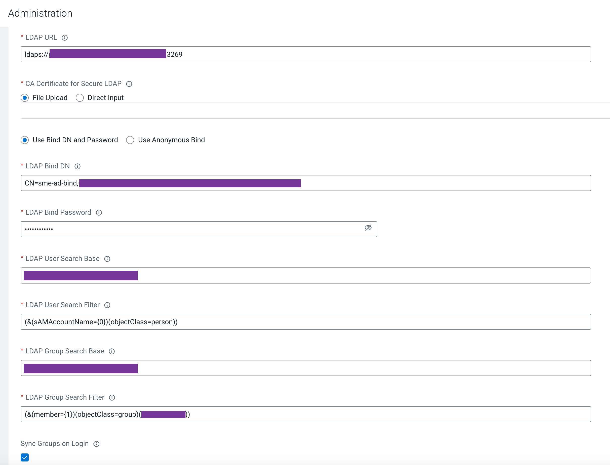
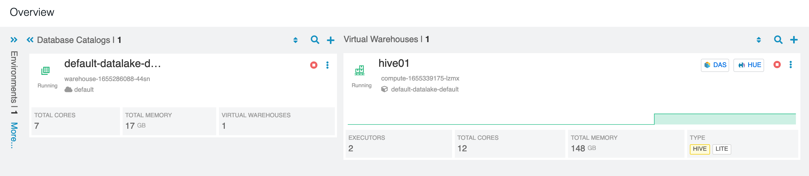
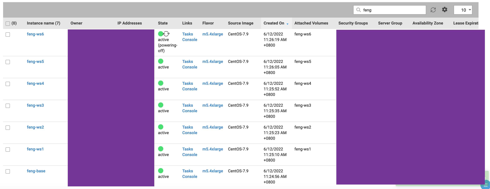
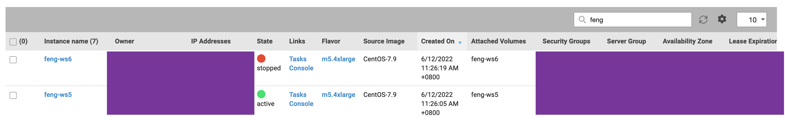
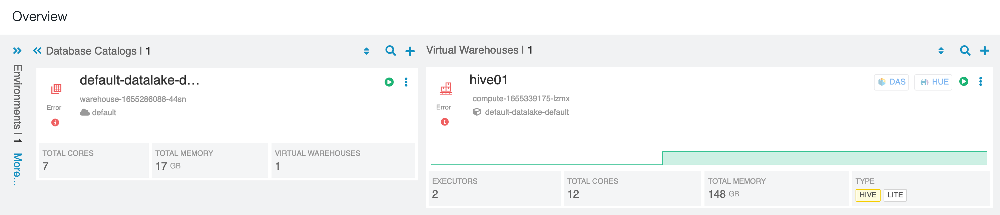

# Node crash demo 
{: .no_toc }

- TOC
{:toc}

---

## 1. Introduction to the test environment

|CDP Runtime version |CDP PvC Base 7.1.7|
|CM version |Cloudera Manager 7.5.5|
|ECS version |CDP PvC DataServices 1.3.4|
|OS version |Centos 7.9|
|K8S version |RKE 1.21|
|Whether to enable Kerberos |Yes|
|Whether to enable TLS |Yes|
|Auto-TLS |No, using manual TLS|
|Kerberos |AD|
|LDAP |AD|
|DB Configuration |External Postgres 12|
|Vault |Embedded|
|Docker registry |Embedded|
|Install Method |Internet|

|IP addresss |hostname |description|
|192.168.8.140	|ds00.ecs.openstack.com |CDP Base cluster, only a single node|
|192.168.8.141	|ds01.ecs.openstack.com |ECS master node 1|
|192.168.8.142	|ds02.ecs.openstack.com |ECS master node 2|
|192.168.8.143	|ds03.ecs.openstack.com |ECS master node 3|
|192.168.8.144	|ds04.ecs.openstack.com |ECS worker node 1|
|192.168.8.145	|ds05.ecs.openstack.com |ECS worker node 2|
|192.168.8.146	|ds06.ecs.openstack.com |ECS worker node 3|

## 2. remove taints of all master nodes 

```bash
# kubectl taint nodes ds01.ecs.openstack.com node-role.kubernetes.io/control-plane=true:NoSchedule-
node/ds01.ecs.openstack.com untainted
# kubectl taint nodes ds02.ecs.openstack.com node-role.kubernetes.io/control-plane=true:NoSchedule-
node/ds02.ecs.openstack.com untainted
# kubectl taint nodes ds03.ecs.openstack.com node-role.kubernetes.io/control-plane=true:NoSchedule-
node/ds03.ecs.openstack.com untainted
```

## 3. Create a Hive VW

- set LDAP auth rules



- Activate DBC


- build Hive VW


- Hive VW is green



## 4. get node status and ds06 is Ready

```bash
# kubectl get node
NAME                                    STATUS   ROLES                       AGE     VERSION
ds01.ecs.openstack.com   Ready    control-plane,etcd,master   3d15h   v1.21.8+rke2r2
ds02.ecs.openstack.com   Ready    control-plane,etcd,master   3d15h   v1.21.8+rke2r2
ds03.ecs.openstack.com   Ready    control-plane,etcd,master   3d15h   v1.21.8+rke2r2
ds04.ecs.openstack.com   Ready    <none>                      3d15h   v1.21.8+rke2r2
ds05.ecs.openstack.com   Ready    <none>                      3d15h   v1.21.8+rke2r2
ds06.ecs.openstack.com   Ready    <none>                      3d15h   v1.21.8+rke2r2
```

## 5. get pod list on ds06

```bash
# kubectl get pods -A -o wide --field-selector spec.nodeName=ds06.ecs.openstack.com
NAMESPACE                   NAME                                                              READY   STATUS    RESTARTS   AGE     IP               NODE                                    NOMINATED NODE   READINESS GATES
compute-1655339175-lzmx     das-webapp-0                                                      1/1     Running   0          4m57s   10.42.4.118      ds06.ecs.openstack.com   <none>           <none>
compute-1655339175-lzmx     hiveserver2-0                                                     1/1     Running   0          4m56s   10.42.4.122      ds06.ecs.openstack.com   <none>           <none>
compute-1655339175-lzmx     huebackend-0                                                      1/1     Running   0          4m56s   10.42.4.120      ds06.ecs.openstack.com   <none>           <none>
compute-1655339175-lzmx     huefrontend-5748485bdc-lzcls                                      1/1     Running   0          4m56s   10.42.4.119      ds06.ecs.openstack.com   <none>           <none>
compute-1655339175-lzmx     query-coordinator-0-0                                             1/1     Running   0          4m55s   10.42.4.124      ds06.ecs.openstack.com   <none>           <none>
compute-1655339175-lzmx     query-coordinator-0-1                                             1/1     Running   0          4m55s   10.42.4.123      ds06.ecs.openstack.com   <none>           <none>
compute-1655339175-lzmx     standalone-compute-operator-0                                     1/1     Running   0          5m1s    10.42.4.117      ds06.ecs.openstack.com   <none>           <none>
compute-1655339175-lzmx     usage-monitor-f7f98f4d-s2tfn                                      1/1     Running   0          4m56s   10.42.4.121      ds06.ecs.openstack.com   <none>           <none>
infra-prometheus            infra-prometheus-operator-1-1655024696-prometheus-node-expmlgp7   1/1     Running   2          3d15h   192.168.8.146   ds06.ecs.openstack.com   <none>           <none>
kube-system                 kube-proxy-ds06.ecs.openstack.com                  1/1     Running   0          15m     192.168.8.146   ds06.ecs.openstack.com   <none>           <none>
kube-system                 nvidia-device-plugin-daemonset-8f6gg                              1/1     Running   2          3d15h   10.42.4.104      ds06.ecs.openstack.com   <none>           <none>
kube-system                 rke2-canal-7znlf                                                  2/2     Running   4          3d15h   192.168.8.146   ds06.ecs.openstack.com   <none>           <none>
longhorn-system             engine-image-ei-d4c780c6-dzclh                                    1/1     Running   2          3d15h   10.42.4.99       ds06.ecs.openstack.com   <none>           <none>
longhorn-system             instance-manager-e-02473d29                                       1/1     Running   0          13m     10.42.4.110      ds06.ecs.openstack.com   <none>           <none>
longhorn-system             instance-manager-r-d9323b0a                                       1/1     Running   0          14m     10.42.4.109      ds06.ecs.openstack.com   <none>           <none>
longhorn-system             longhorn-csi-plugin-glzkk                                         2/2     Running   4          3d15h   10.42.4.102      ds06.ecs.openstack.com   <none>           <none>
longhorn-system             longhorn-manager-6klq2                                            1/1     Running   2          3d15h   10.42.4.103      ds06.ecs.openstack.com   <none>           <none>
shared-services             log-router-l9sd4                                                  2/2     Running   4          3d      10.42.4.100      ds06.ecs.openstack.com   <none>           <none>
warehouse-1655286088-44sn   das-event-processor-0                                             1/1     Running   0          14m     10.42.4.105      ds06.ecs.openstack.com   <none>           <none>
warehouse-1655286088-44sn   metastore-0                                                       1/1     Running   0          14m     10.42.4.106      ds06.ecs.openstack.com   <none>           <none>
```

## 6. shutdown ds06 on Platform9






## 7. get node status and ds06 is NotReady

```bash
# kubectl get node
NAME                                    STATUS     ROLES                       AGE     VERSION
ds01.ecs.openstack.com   Ready      control-plane,etcd,master   3d15h   v1.21.8+rke2r2
ds02.ecs.openstack.com   Ready      control-plane,etcd,master   3d15h   v1.21.8+rke2r2
ds03.ecs.openstack.com   Ready      control-plane,etcd,master   3d15h   v1.21.8+rke2r2
ds04.ecs.openstack.com   Ready      <none>                      3d15h   v1.21.8+rke2r2
ds05.ecs.openstack.com   Ready      <none>                      3d15h   v1.21.8+rke2r2
ds06.ecs.openstack.com   NotReady   <none>                      3d15h   v1.21.8+rke2r2
```

## 8. Most of pods on Node ds06 are keeping in terminating state after 5 mins

```bash
# kubectl get pods -A -o wide --field-selector spec.nodeName=ds06.ecs.openstack.com
NAMESPACE                   NAME                                                              READY   STATUS        RESTARTS   AGE     IP               NODE                                    NOMINATED NODE   READINESS GATES
compute-1655339175-lzmx     das-webapp-0                                                      1/1     Terminating   0          12m     10.42.4.118      ds06.ecs.openstack.com   <none>           <none>
compute-1655339175-lzmx     hiveserver2-0                                                     1/1     Terminating   0          12m     10.42.4.122      ds06.ecs.openstack.com   <none>           <none>
compute-1655339175-lzmx     huebackend-0                                                      1/1     Terminating   0          12m     10.42.4.120      ds06.ecs.openstack.com   <none>           <none>
compute-1655339175-lzmx     huefrontend-5748485bdc-lzcls                                      1/1     Terminating   0          12m     10.42.4.119      ds06.ecs.openstack.com   <none>           <none>
compute-1655339175-lzmx     query-coordinator-0-0                                             1/1     Terminating   0          12m     10.42.4.124      ds06.ecs.openstack.com   <none>           <none>
compute-1655339175-lzmx     query-coordinator-0-1                                             1/1     Terminating   0          12m     10.42.4.123      ds06.ecs.openstack.com   <none>           <none>
compute-1655339175-lzmx     standalone-compute-operator-0                                     1/1     Terminating   0          12m     10.42.4.117      ds06.ecs.openstack.com   <none>           <none>
compute-1655339175-lzmx     usage-monitor-f7f98f4d-s2tfn                                      1/1     Terminating   0          12m     10.42.4.121      ds06.ecs.openstack.com   <none>           <none>
infra-prometheus            infra-prometheus-operator-1-1655024696-prometheus-node-expmlgp7   1/1     Running       2          3d15h   192.168.8.146   ds06.ecs.openstack.com   <none>           <none>
kube-system                 kube-proxy-ds06.ecs.openstack.com                  1/1     Running       0          22m     192.168.8.146   ds06.ecs.openstack.com   <none>           <none>
kube-system                 nvidia-device-plugin-daemonset-8f6gg                              1/1     Running       2          3d15h   10.42.4.104      ds06.ecs.openstack.com   <none>           <none>
kube-system                 rke2-canal-7znlf                                                  2/2     Running       4          3d15h   192.168.8.146   ds06.ecs.openstack.com   <none>           <none>
longhorn-system             engine-image-ei-d4c780c6-dzclh                                    1/1     Running       2          3d15h   10.42.4.99       ds06.ecs.openstack.com   <none>           <none>
longhorn-system             instance-manager-e-02473d29                                       1/1     Terminating   0          21m     10.42.4.110      ds06.ecs.openstack.com   <none>           <none>
longhorn-system             instance-manager-r-d9323b0a                                       1/1     Terminating   0          21m     10.42.4.109      ds06.ecs.openstack.com   <none>           <none>
longhorn-system             longhorn-csi-plugin-glzkk                                         2/2     Running       4          3d15h   10.42.4.102      ds06.ecs.openstack.com   <none>           <none>
longhorn-system             longhorn-manager-6klq2                                            1/1     Running       2          3d15h   10.42.4.103      ds06.ecs.openstack.com   <none>           <none>
shared-services             log-router-l9sd4                                                  2/2     Running       4          3d      10.42.4.100      ds06.ecs.openstack.com   <none>           <none>
warehouse-1655286088-44sn   das-event-processor-0                                             1/1     Terminating   0          21m     10.42.4.105      ds06.ecs.openstack.com   <none>           <none>
warehouse-1655286088-44sn   metastore-0                                                       1/1     Terminating   0          21m     10.42.4.106      ds06.ecs.openstack.com   <none>           <none>
```

## 9. CDW UI shows error flag

 
