# CDW Quota Management Testing
{: .no_toc }

- TOC
{:toc}

---

## 1. Introduction to the test environment

|CDP Runtime version |CDP PvC Base 7.1.7 SP2|
|CM version |Cloudera Manager 7.11.3.2|
|ECS version |CDP PvC DataServices 1.5.2|
|OS version |Centos 7.9|
|K8S version |RKE 1.25.14|
|Whether to enable Kerberos |Yes|
|Whether to enable TLS |Yes|
|Auto-TLS |Yes|
|Kerberos |FreeIPA|
|LDAP |FreeIPA|
|DB Configuration |Embedded|
|Vault |Embedded|
|Docker registry |Embedded|
|Install Method |Internet|

## 2. Basic Concept

- By enabling quota management in Cloudera Data Warehouse (CDW) on Private Cloud, you can assign quota-managed resource pools for environments, Data Catalogs, Virtual Warehouses, and Data Visualization instances.

## 3. Know more about resource pools 

- Navigate to Cloduera Management Console > Resource Utilization > Quotas, you can see four-level resource pools: root ->  root.default -> root.default.ecstest-c51569f2 -> root.default.ecstest-c51569f2.monitoring-namespace.


- You can query the backend database for more details.

```bash
kubectl exec -it cdp-embedded-db-0 -n cdp -- bash
psql -P pager=off -d db-resourcepoolmanager

db-resourcepoolmanager=# select path,metadata from pools order by created_at;
```

- There are five built-in pools post DS environment initiation. 
    - Note: The top resource pool is root which have unrestricted access to all resources available within your cluster.
    - Note: quota_cpu=2000 means 2 CPU cores, quota_memory=1000000000 means 1GB memory.

|No.|PATH|quota_cpu|quota_memory|validity|distribution|order|queueing|clusterId|namespace|
|1|root|null|null|null|ELASTIC|FIFO|false|||
|2|root.default|1000000000000000000|1000000000000000000|-1|ELASTIC|UNSET|false|||
|3|root.default.observability|2000|1000000000|-1|ELASTIC|FIFO|false||observability|
|4|root.default.ecstest-c51569f2|4000|30000000000|-1|ELASTIC|FIFO|true|liftie-8wqkf202||
|5|root.default.ecstest-c51569f2.monitoring-namespace|4000|30000000000|-1|ELASTIC|FIFO|true|liftie-8wqkf202|ecstest-c51569f2-monitoring-platform|

- Add three new pools for CDW workloads. 
    - Note: please keep advanced properties no changed. 

|No.|PATH|quota_cpu|quota_memory|validity|distribution|order|queueing|clusterId|namespace|
|1|root.default.high|48|200GB||ELASTIC|FIFO|true|||
|2|root.default.medium|24|100GB||ELASTIC|FIFO|true|||
|3|root.default.low|12|50GB||ELASTIC|FIFO|true|||


## 4. Test quotas in CDW

- Log in to CDW as user `admin`. Go to Advanced Configuration and select the Enable quota management option. Click Update.
    - Note: You must enable this feature before activating an environment in CDW. You cannot enable this feature in existing environments; you will need to deactivate the environment in CDW, enable the quota management feature, and then reactivate the environment.

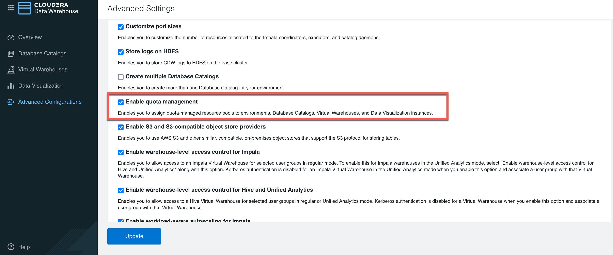

- Activate the environment.

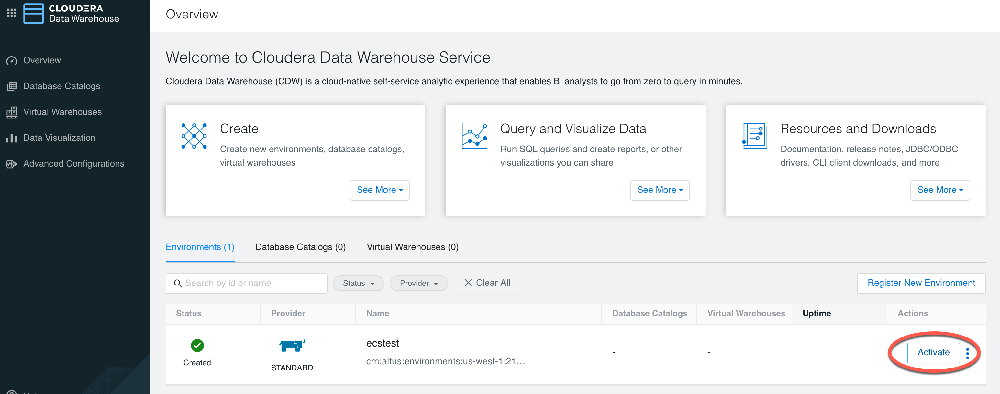

- Select the resource pool `root.default.high`.
    - Note: If you enable the quota management feature, you must select a resource pool while activating the environment.

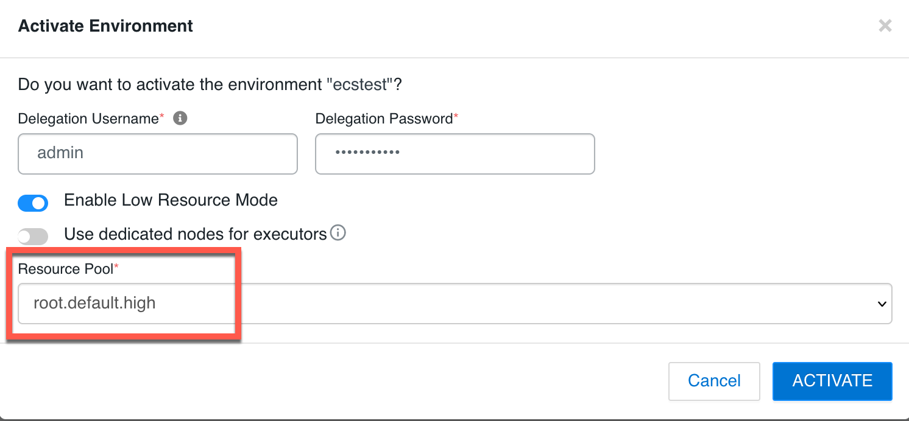

- Turn back to the resource pool UI. the resource pool `root.default.high` has two new level 4 branches, namely `root.default.high.ecstest-c51569f2-log-router` and `root.default.high.warehouse-ecstest`.

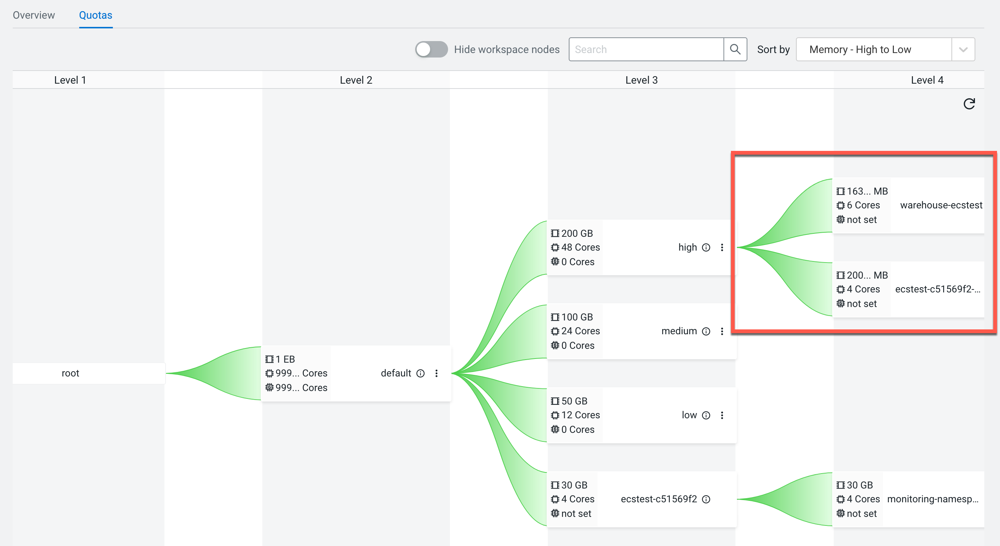

- `ecstest-c51569f2-log-router` and `warehouse-ecstest` are the new namespaces added by the activation environment step.
    - The pool `root.default.high.ecstest-c51569f2-log-router` consumed 4 cores, 2GB memory.
    - The pool `root.default.high.warehouse-ecstest`consumed 6 cores, 16GB memory.
    - Total cpu and memory consumption is below quota, so there are no warnings so far.

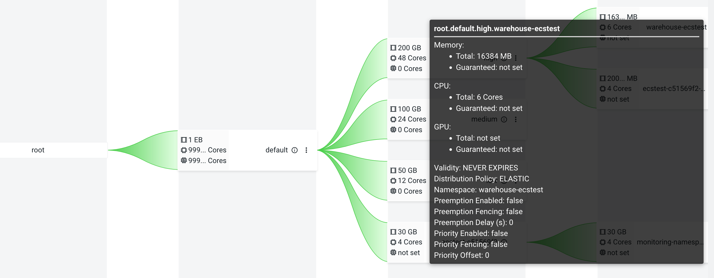
 
- Create new virtual warehouse `hive01`.

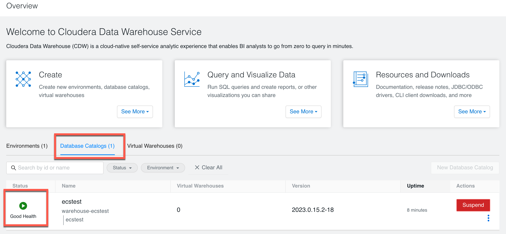

- The resource pool has only one option `root.default.high`, indicating that it is inherited from environment.

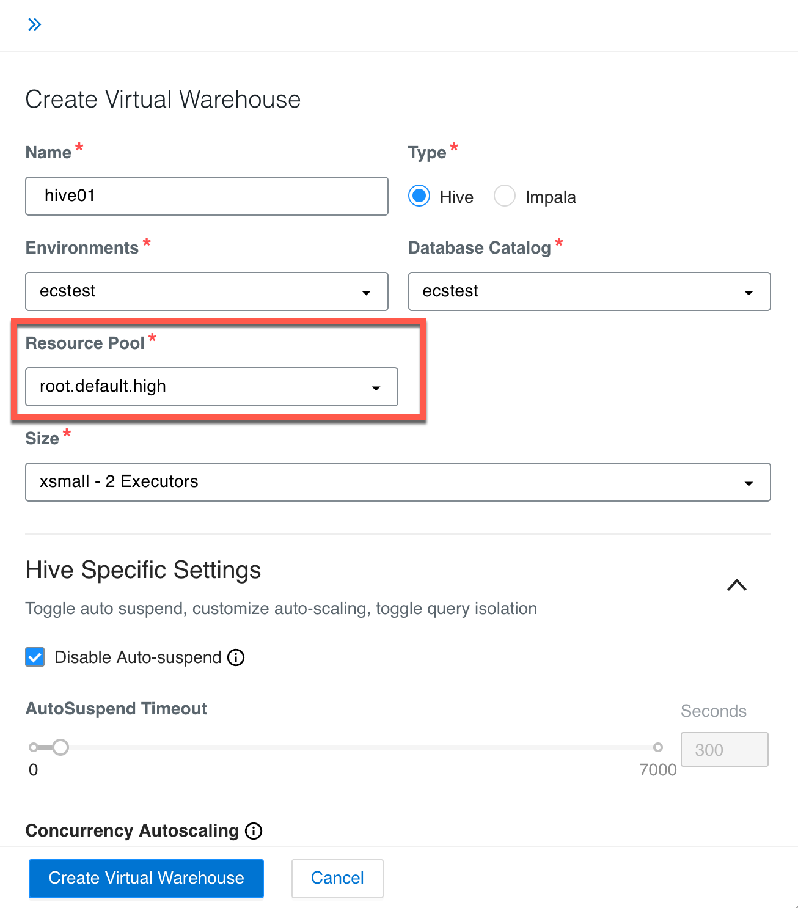

- Turn back to the resource pool UI. We can see the new resource pool `root.default.high.compute-hive01`.

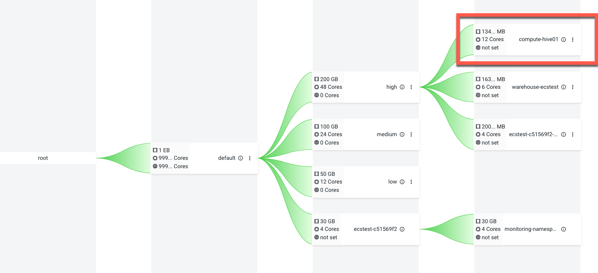

- `compute-hive01`is the namespace of hive virtual warehouse.
    - The pool `root.default.high.compute-hive01` consumed 12 cores, 128GB memory.
    - Total cpu and memory consumption is still below quota, so there are no warnings so far.

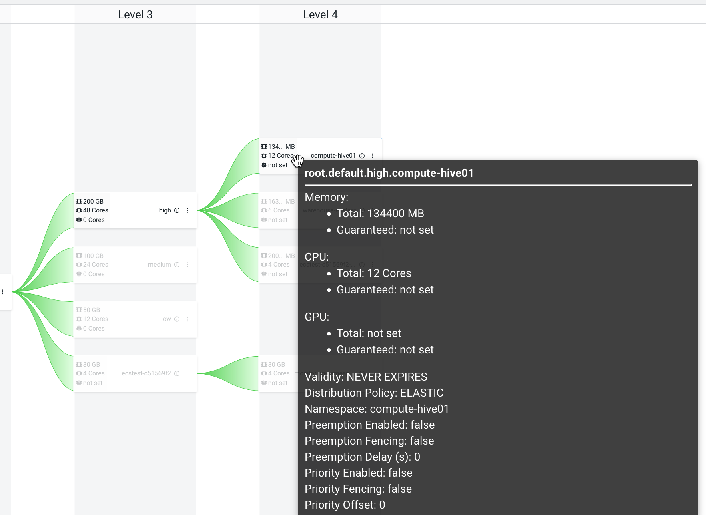

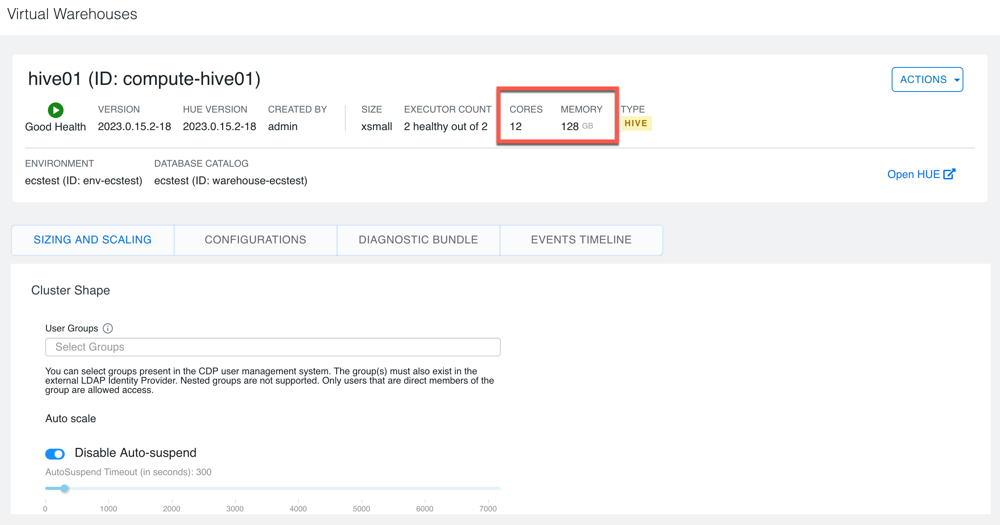

- Create another virtual warehouse `hive02`. It got stuck in the provisioning process with the warning message: `query-executor-0-0 pod in compute-hive02 namespace can NOT be scheduled: 0/4 nodes are available: 4 Pod is not ready for scheduling.  Error Code : undefined`.

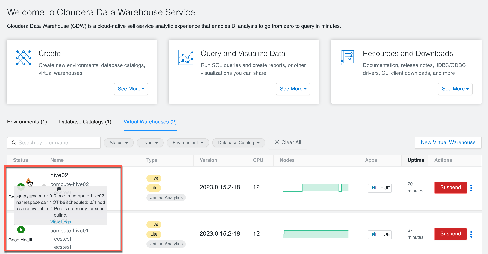

- The pod logs showed the root cause `compute-hive02/query-executor-0-0 is queued and waiting for allocation`.

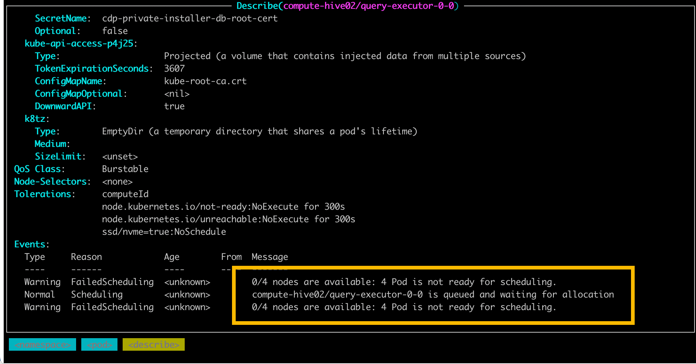

- Turn back to the resource pool UI. We can see the new resource pool `root.default.high.compute-hive02`.
    - `compute-hive02`is the namespace of hive virtual warehouse.
    - The pool `root.default.high.compute-hive02` consumed 12 cores, 128GB memory.
    - Total cpu and memory consumption exceeds the quota of the parent resource pool `root.default.high`.

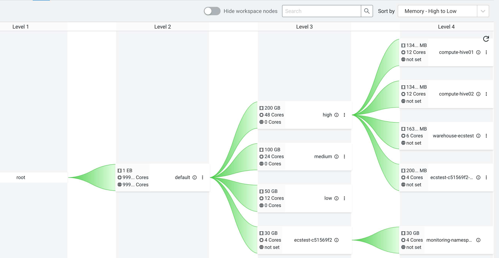

- Let's increase the memory quota from 200GB to 300GB.

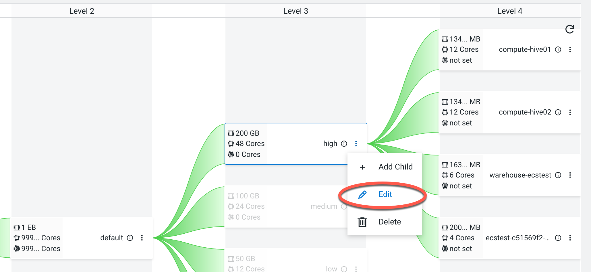

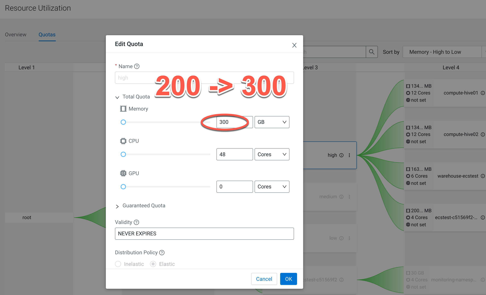

- It still failed even if you rebuild the virtual warehouse `hive02`. The error message is the same as before:"0/4 nodes are available: 4 Pod is not ready for scheduling.".

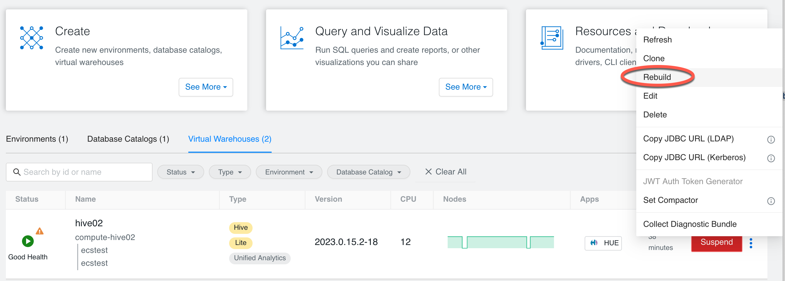

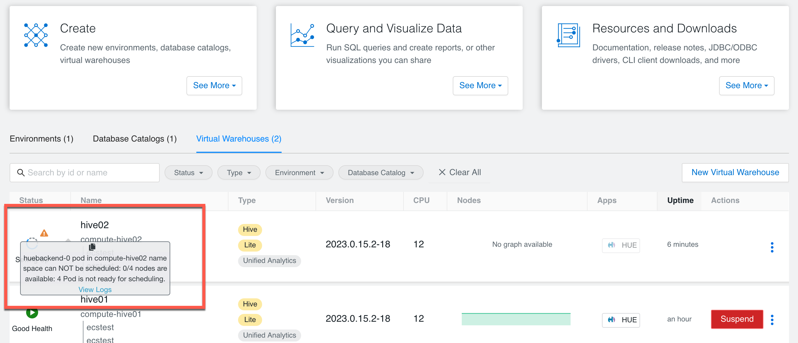

- However it works if you delete the hive virtual warehouse `hive02` and then create the impala virtual warehouse `impala01`.

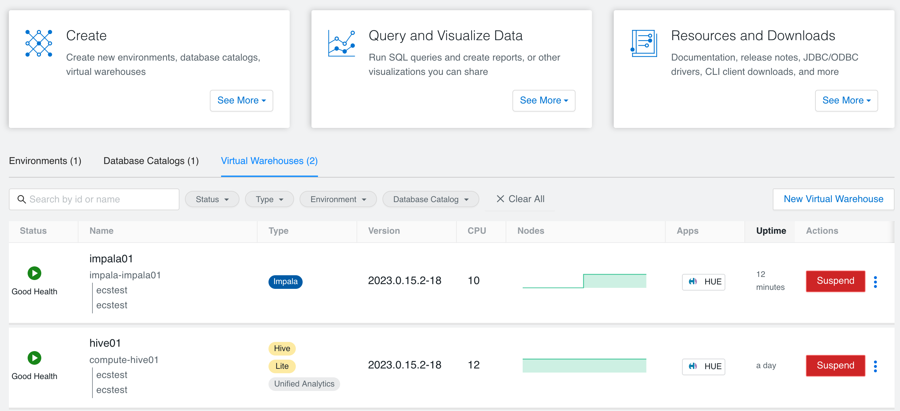

- We can compare these two queue definition from the database, and the difference is only in the memory quota: root.default.high.compute-hive02 is 128GB (134400000000), root.default.high.impala-impala01 is 121GB (126976000000). It is obvious that whether it is `compute-hive02` or `impala-impala01`, their total request resources don't exceed 300GB, which shows that quota is not the cause for the unsuccessful deployment of the virtual warehouse `hive02`.

```bash
 root.default.high.compute-hive02                   | {"owners":["crn:altus:iam:us-west-1:altus:user:__internal__actor__"],"admins":["crn:altus:iam:us-west-1:altus:user:__internal__actor__"],"quota":{"cpu":{"value":12000,"sufMultiplier":1000,"baseSuf":"m"},"memory":{"value":134400000000,"sufMultiplier":1000000,"sufName":"M","baseSuf":"B"}},"guaranteedResources":null,"policy":{"validity":"9999-12-31T23:59:59.999999999Z","allocation":{"queueing":true,"order":"FIFO","distribution":"ELASTIC"}},"scheduling":{"preemption":{"fence":false,"delay":0,"enabled":false},"priority":{"fence":false,"offset":0,"enabled":false}},"clusterId":"","namespaceName":"compute-hive02","tags":null,"labels":null,"annotations":{"yunikorn.apache.org/parentqueue":"root.cdp.default.high.compute-hive02"},"imagePullSecrets":null}
(12 rows)

 root.default.high.impala-impala01                  | {"owners":["crn:altus:iam:us-west-1:21ba2b50-e2d1-44de-844f-05e41082203c:user:5caa8635-4399-438a-acc2-19de8e0a267a"],"admins":["crn:altus:iam:us-west-1:21ba2b50-e2d1-44de-844f-05e41082203c:user:5caa8635-4399-438a-acc2-19de8e0a267a"],"quota":{"cpu":{"value":10000,"sufMultiplier":1000,"baseSuf":"m"},"memory":{"value":126976000000,"sufMultiplier":1000000,"sufName":"M","baseSuf":"B"}},"guaranteedResources":null,"policy":{"validity":"9999-12-31T23:59:59.999999999Z","allocation":{"queueing":true,"order":"FIFO","distribution":"ELASTIC"}},"scheduling":{"preemption":{"fence":false,"delay":0,"enabled":false},"priority":{"fence":false,"offset":0,"enabled":false}},"clusterId":"","namespaceName":"impala-impala01","tags":null,"labels":null,"annotations":{"yunikorn.apache.org/parentqueue":"root.cdp.default.high.impala-impala01"},"imagePullSecrets":null}
```


## 5. Why can't I create a new VW even if I have enough Quota?

- Let's do a port-forward to localhost to run the YuniKorn rest API.
    - Find YuniKorn scheduler pod
    ```bash
    $ kubectl get pods -n yunikorn
    NAME                                             READY   STATUS    RESTARTS   AGE
    yunikorn-admission-controller-6bc647d6c5-xnzr4   1/1     Running   0          5d4h
    yunikorn-scheduler-66c9984b6-smq42               2/2     Running   0          5d4h
    ```
    - Access the UI
    ```bash
    kubectl port-forward yunikorn-scheduler-66c9984b6-smq42 9889:9889 -n yunikorn
    ```
    - Run YuniKorn rest API
    ```bash
    curl http://localhost:9889/ws/v1/partition/default/nodes
    ```
    - You can get [node details](https://yunikorn.apache.org/docs/1.0.0/api/scheduler/#nodes) include host and rack name, capacity, resources, utilization, and allocations.

- Let's check the available resource after creating the virtual warehouse `hive01`.

```bash
$ curl http://localhost:9889/ws/v1/partition/default/nodes| jq 'sort_by(.nodeID)'| jq '.[] | .nodeID,.available'

"feng-ws2.sme-feng.athens.cloudera.com"
{
  "ephemeral-storage": 101994496125,
  "hugepages-2Mi": 0,
  "memory": 77040513024,
  "pods": 476,
  "vcore": 12565
}
"feng-ws3.sme-feng.athens.cloudera.com"
{
  "ephemeral-storage": 101994496125,
  "hugepages-2Mi": 0,
  "memory": 34702320640,
  "pods": 483,
  "vcore": 7940
}
"feng-ws4.sme-feng.athens.cloudera.com"
{
  "ephemeral-storage": 101994496125,
  "hugepages-2Mi": 0,
  "memory": 73637948928,
  "pods": 462,
  "vcore": 11919
}
"feng-ws5.sme-feng.athens.cloudera.com"
{
  "ephemeral-storage": 101994496125,
  "hugepages-2Mi": 0,
  "memory": 28456036352,
  "pods": 471,
  "vcore": 10688
}
```

- Let's check the resource allocations of pods in namespace "compute-hive01".

```bash
$ curl http://localhost:9889/ws/v1/partition/default/nodes| jq '.[] | .allocations[] | select(.allocationTags."kubernetes.io/meta/namespace"=="compute-hive01") | .allocationTags."kubernetes.io/meta/podName",.resource,.nodeId'

"huefrontend-58967b5747-9rsnq"
{
  "memory": 536870912,
  "pods": 1,
  "vcore": 100
}
"feng-ws2.sme-feng.athens.cloudera.com"
"huebackend-0"
{
  "memory": 8192000000,
  "pods": 1,
  "vcore": 500
}
"feng-ws2.sme-feng.athens.cloudera.com"
"query-coordinator-0-0"
{
  "memory": 4096000000,
  "pods": 1,
  "vcore": 1000
}
"feng-ws2.sme-feng.athens.cloudera.com"
"query-coordinator-0-1"
{
  "memory": 4096000000,
  "pods": 1,
  "vcore": 1000
}
"feng-ws2.sme-feng.athens.cloudera.com"
"query-executor-0-1"
{
  "memory": 49152000000,
  "pods": 1,
  "vcore": 4000
}
"feng-ws3.sme-feng.athens.cloudera.com"
"query-executor-0-0"
{
  "memory": 49152000000,
  "pods": 1,
  "vcore": 4000
}
"feng-ws5.sme-feng.athens.cloudera.com"
```

- We only see 6 pods because the other 3 pods have the property `yunikorn.apache.org/ignore-application` to be set `true`. This means that they are using the default k8s default scheduler instead of yunikorn scheduler.

```bash
$ kubectl describe pod hiveserver2-0 -n compute-hive01| grep 'ignore-application'
              yunikorn.apache.org/ignore-application: true

$ kubectl describe pod standalone-compute-operator-0 -n compute-hive01| grep 'ignore-application'
              yunikorn.apache.org/ignore-application: true

$ kubectl describe pod usage-monitor-56fcf7f946-564sw -n compute-hive01| grep 'ignore-application'
              yunikorn.apache.org/ignore-application: true
```

- Let's check the available resource after creating the virtual warehouse `hive02`.

```bash
$ curl http://localhost:9889/ws/v1/partition/default/nodes| jq 'sort_by(.nodeID)'| jq '.[] | .nodeID,.available'

"feng-ws2.sme-feng.athens.cloudera.com"
{
  "ephemeral-storage": 101994496125,
  "hugepages-2Mi": 0,
  "memory": 77040513024,
  "pods": 476,
  "vcore": 12565
}
"feng-ws3.sme-feng.athens.cloudera.com"
{
  "ephemeral-storage": 101994496125,
  "hugepages-2Mi": 0,
  "memory": 34702320640,
  "pods": 483,
  "vcore": 7940
}
"feng-ws4.sme-feng.athens.cloudera.com"
{
  "ephemeral-storage": 101994496125,
  "hugepages-2Mi": 0,
  "memory": 56910016000,
  "pods": 459,
  "vcore": 10719
}
"feng-ws5.sme-feng.athens.cloudera.com"
{
  "ephemeral-storage": 101994496125,
  "hugepages-2Mi": 0,
  "memory": 28456036352,
  "pods": 471,
  "vcore": 10688
}
```

- As you can see from the yunikorn scheduler log, 3 pods will be deployed in advance and placed on node `feng-ws4.sme-feng.athens.cloudera.com`.
    - These 3 pods used default k8s default scheduler.
    - The pod `hiveserver2-0` consumed 16384000000 memory.
    - The pod `standalone-compute-operator-0` consumed 209715200 memory.
    - The pod `usage-monitor-56fcf7f946-564sw` consumed 134217728 memory.
    - The available resource of node`feng-ws4.sme-feng.athens.cloudera.com`= 73637948928 - 16384000000 - 209715200 - 134217728 = 56910016000.

- There is no change in the resources of the other 3 nodes (feng-ws2, feng-ws3, feng-ws5). The remaining 6 pods will be allocated to these three nodes.
    - The available memory of feng-ws2 is `77040513024`, which met the memory request of query-executor(49152000000).
    - The available memory of feng-ws3 is `34702320640`, which is below the memory request of query-executor(49152000000).
    - The available memory of feng-ws5 is `28456036352`, which is below the memory request of query-executor(49152000000).
    - The current available resources cannot place 2 query-executor pods: `query-executor-0-0` and `query-executor-0-1`.

- This resulted in the remaining 6 pods being unable to allocate resources with errors: "0/4 nodes are available: 4 Pod is not ready for scheduling, ... , series.count: Invalid value: "": should be at least 2' (will not retry!)".

```bash
E1114 06:56:06.193682  ...  Action:"Scheduling", Reason:"FailedScheduling", Regarding:v1.ObjectReference{Kind:"Pod", Namespace:"compute-hive02", Name:"huefrontend-fcdfc76bb-smv49", UID:"633037ae-f1ee-4e00-912a-a558fa7b58f0", APIVersion:"v1", ResourceVersion:"2938471", FieldPath:""}, Related:(*v1.ObjectReference)(nil), Note:"0/4 nodes are available: 4 Pod is not ready for scheduling.", Type:"Warning", DeprecatedSource:v1.EventSource{Component:"", Host:""}, DeprecatedFirstTimestamp:time.Date(1, time.January, 1, 0, 0, 0, 0, time.UTC), DeprecatedLastTimestamp:time.Date(1, time.January, 1, 0, 0, 0, 0, time.UTC), DeprecatedCount:0}': 'Event "huefrontend-fcdfc76bb-smv49.17976af02504d026" is invalid: series.count: Invalid value: "": should be at least 2' (will not retry!)

E1114 06:56:06.193681  ...  Action:"Scheduling", Reason:"FailedScheduling", Regarding:v1.ObjectReference{Kind:"Pod", Namespace:"compute-hive02", Name:"huebackend-0", UID:"0befb088-36aa-456c-9979-267ea14ce644", APIVersion:"v1", ResourceVersion:"2938478", FieldPath:""}, Related:(*v1.ObjectReference)(nil), Note:"0/4 nodes are available: 4 Pod is not ready for scheduling.", Type:"Warning", DeprecatedSource:v1.EventSource{Component:"", Host:""}, DeprecatedFirstTimestamp:time.Date(1, time.January, 1, 0, 0, 0, 0, time.UTC), DeprecatedLastTimestamp:time.Date(1, time.January, 1, 0, 0, 0, 0, time.UTC), DeprecatedCount:0}': 'Event "huebackend-0.17976af0250bbd2f" is invalid: series.count: Invalid value: "": should be at least 2' (will not retry!)

E1114 06:57:28.299965  ...  Action:"Scheduling", Reason:"FailedScheduling", Regarding:v1.ObjectReference{Kind:"Pod", Namespace:"compute-hive02", Name:"query-coordinator-0-0", UID:"80b80f85-841f-43c2-9722-b57fa424e88f", APIVersion:"v1", ResourceVersion:"2938563", FieldPath:""}, Related:(*v1.ObjectReference)(nil), Note:"0/4 nodes are available: 4 Pod is not ready for scheduling.", Type:"Warning", DeprecatedSource:v1.EventSource{Component:"", Host:""}, DeprecatedFirstTimestamp:time.Date(1, time.January, 1, 0, 0, 0, 0, time.UTC), DeprecatedLastTimestamp:time.Date(1, time.January, 1, 0, 0, 0, 0, time.UTC), DeprecatedCount:0}': 'Event "query-coordinator-0-0.17976af0e30ef315" is invalid: series.count: Invalid value: "": should be at least 2' (will not retry!)

E1114 06:58:28.294739  ...  Action:"Scheduling", Reason:"FailedScheduling", Regarding:v1.ObjectReference{Kind:"Pod", Namespace:"compute-hive02", Name:"query-executor-0-1", UID:"8a7a5f15-bc79-4ab0-9924-53c1218c5768", APIVersion:"v1", ResourceVersion:"2938575", FieldPath:""}, Related:(*v1.ObjectReference)(nil), Note:"0/4 nodes are available: 4 Pod is not ready for scheduling.", Type:"Warning", DeprecatedSource:v1.EventSource{Component:"", Host:""}, DeprecatedFirstTimestamp:time.Date(1, time.January, 1, 0, 0, 0, 0, time.UTC), DeprecatedLastTimestamp:time.Date(1, time.January, 1, 0, 0, 0, 0, time.UTC), DeprecatedCount:0}': 'Event "query-executor-0-1.17976b03c4f0ed2e" is invalid: series.count: Invalid value: "": should be at least 2' (will not retry!)

E1114 06:58:28.294701  ...  Action:"Scheduling", Reason:"FailedScheduling", Regarding:v1.ObjectReference{Kind:"Pod", Namespace:"compute-hive02", Name:"query-coordinator-0-1", UID:"22a4bd72-ecb6-489f-85e7-91fab70eeebf", APIVersion:"v1", ResourceVersion:"2938573", FieldPath:""}, Related:(*v1.ObjectReference)(nil), Note:"0/4 nodes are available: 4 Pod is not ready for scheduling.", Type:"Warning", DeprecatedSource:v1.EventSource{Component:"", Host:""}, DeprecatedFirstTimestamp:time.Date(1, time.January, 1, 0, 0, 0, 0, time.UTC), DeprecatedLastTimestamp:time.Date(1, time.January, 1, 0, 0, 0, 0, time.UTC), DeprecatedCount:0}': 'Event "query-coordinator-0-1.17976b03c4eaa2ed" is invalid: series.count: Invalid value: "": should be at least 2' (will not retry!)

E1114 06:58:28.294863  ...  Action:"Scheduling", Reason:"FailedScheduling", Regarding:v1.ObjectReference{Kind:"Pod", Namespace:"compute-hive02", Name:"query-executor-0-0", UID:"a1d4cac9-ab5b-4259-9269-cb6e5e6e4d15", APIVersion:"v1", ResourceVersion:"2938565", FieldPath:""}, Related:(*v1.ObjectReference)(nil), Note:"0/4 nodes are available: 4 Pod is not ready for scheduling.", Type:"Warning", DeprecatedSource:v1.EventSource{Component:"", Host:""}, DeprecatedFirstTimestamp:time.Date(1, time.January, 1, 0, 0, 0, 0, time.UTC), DeprecatedLastTimestamp:time.Date(1, time.January, 1, 0, 0, 0, 0, time.UTC), DeprecatedCount:0}': 'Event "query-executor-0-0.17976b03c4e5d114" is invalid: series.count: Invalid value: "": should be at least 2' (will not retry!)
```

- Let's delete the virtual warehouse `hive02`. check the available resource again. You can see the available resources revert to the earlier state.

```bash
$ curl http://localhost:9889/ws/v1/partition/default/nodes| jq 'sort_by(.nodeID)'| jq '.[] | .nodeID,.available'

"feng-ws2.sme-feng.athens.cloudera.com"
{
  "ephemeral-storage": 101994496125,
  "hugepages-2Mi": 0,
  "memory": 77040513024,
  "pods": 476,
  "vcore": 12565
}
"feng-ws3.sme-feng.athens.cloudera.com"
{
  "ephemeral-storage": 101994496125,
  "hugepages-2Mi": 0,
  "memory": 34702320640,
  "pods": 483,
  "vcore": 7940
}
"feng-ws4.sme-feng.athens.cloudera.com"
{
  "ephemeral-storage": 101994496125,
  "hugepages-2Mi": 0,
  "memory": 73637948928,
  "pods": 462,
  "vcore": 11919
}
"feng-ws5.sme-feng.athens.cloudera.com"
{
  "ephemeral-storage": 101994496125,
  "hugepages-2Mi": 0,
  "memory": 28456036352,
  "pods": 471,
  "vcore": 10688
}
```

- Let's create the impala virtual warehouse `impala01`. check the available resource again after it's successfully built.

```bash
$ curl http://localhost:9889/ws/v1/partition/default/nodes| jq 'sort_by(.nodeID)'| jq '.[] | .nodeID,.available'

"feng-ws2.sme-feng.athens.cloudera.com"
{
  "ephemeral-storage": 101994496125,
  "hugepages-2Mi": 0,
  "memory": 52531621888,
  "pods": 476,
  "vcore": 9615
}
"feng-ws3.sme-feng.athens.cloudera.com"
{
  "ephemeral-storage": 101994496125,
  "hugepages-2Mi": 0,
  "memory": 10159875072,
  "pods": 483,
  "vcore": 7540
}
"feng-ws4.sme-feng.athens.cloudera.com"
{
  "ephemeral-storage": 101994496125,
  "hugepages-2Mi": 0,
  "memory": 22144642560,
  "pods": 456,
  "vcore": 7169
}
"feng-ws5.sme-feng.athens.cloudera.com"
{
  "ephemeral-storage": 101994496125,
  "hugepages-2Mi": 0,
  "memory": 3913590784,
  "pods": 471,
  "vcore": 10288
}
```


- We found all pods in namespace "impala-impala01" use the default k8s scheduler.

```bash
$ for pod in $(kubectl get pod -n impala-impala01 --output=jsonpath={.items..metadata.name}); do echo $pod && kubectl describe pod $pod -n impala-impala01|grep yunikorn.apache.org; done
catalogd-0
              yunikorn.apache.org/ignore-application: true
catalogd-1
              yunikorn.apache.org/ignore-application: true
coordinator-0
              yunikorn.apache.org/ignore-application: true
coordinator-1
              yunikorn.apache.org/ignore-application: true
hue-huedb-create-job-xq6mz
              yunikorn.apache.org/ignore-application: true
huebackend-0
              yunikorn.apache.org/ignore-application: true
huefrontend-7d46c4465-8gtrx
              yunikorn.apache.org/ignore-application: true
impala-autoscaler-5655fb65c-tc6qz
              yunikorn.apache.org/ignore-application: true
impala-executor-000-0
              yunikorn.apache.org/ignore-application: true
impala-executor-000-1
              yunikorn.apache.org/ignore-application: true
statestored-f96f8bc6-85hx4
              yunikorn.apache.org/ignore-application: true
```