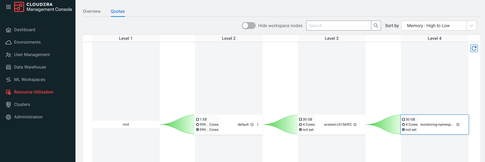
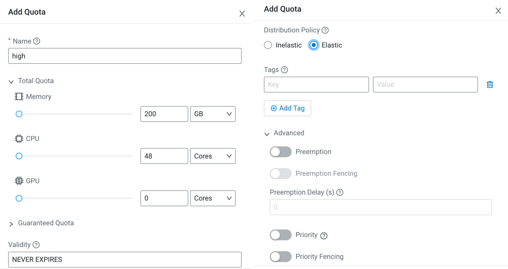

# CDW Quota Management
{: .no_toc }

- TOC
{:toc}

---

## 1. Introduction to the test environment

|CDP Runtime version |CDP PvC Base 7.1.7 SP2|
|CM version |Cloudera Manager 7.11.3.2|
|ECS version |CDP PvC DataServices 1.5.2|
|OS version |Centos 7.9|
|K8S version |RKE 1.25.14|
|Whether to enable Kerberos |Yes|
|Whether to enable TLS |Yes|
|Auto-TLS |Yes|
|Kerberos |FreeIPA|
|LDAP |FreeIPA|
|DB Configuration |Embedded|
|Vault |Embedded|
|Docker registry |Embedded|
|Install Method |Internet|

## 2. Basic Concept

- By enabling quota management in Cloudera Data Warehouse (CDW) on Private Cloud, you can assign quota-managed resource pools for environments, Data Catalogs, Virtual Warehouses, and Data Visualization instances.

## 3. Know more about resource pools 

- Navigate to Cloduera Management Console > Resource Utilization > Quotas, you can see four-level resource pools: root ->  root.default -> root.default.ecstest-c51569f2 -> root.default.ecstest-c51569f2.monitoring-namespace.



- You can query the backend database for more details.

```bash
kubectl exec -it cdp-embedded-db-0 -n cdp -- bash
psql -P pager=off -d db-resourcepoolmanager

db-resourcepoolmanager=# select path,metadata from pools order by created_at;
```

- There are five built-in pools post DS environment initiation. 
    - Note: The top resource pool is root which have unrestricted access to all resources available within your cluster.
    - Note: quota_cpu=2000 means 2 CPU cores, quota_memory=1000000000 means 1GB.

|No.|PATH|quota_cpu|quota_memory|validity|distribution|order|queueing|clusterId|namespace|
|1|root|null|null|null|ELASTIC|FIFO|false|||
|2|root.default|1000000000000000000|1000000000000000000|-1|ELASTIC|UNSET|false|||
|3|root.default.observability|2000|1000000000|-1|ELASTIC|FIFO|false||observability|
|4|root.default.ecstest-c51569f2|4000|30000000000|-1|ELASTIC|FIFO|true|liftie-8wqkf202||
|5|root.default.ecstest-c51569f2.monitoring-namespace|4000|30000000000|-1|ELASTIC|FIFO|true|liftie-8wqkf202|ecstest-c51569f2-monitoring-platform|

- Add three new pools for CDW workloads. 
    - Note: please keep advanced properties no changed. 

|No.|PATH|quota_cpu|quota_memory|validity|distribution|order|queueing|clusterId|namespace|
|1|root.default.high||48|200GB|ELASTIC|FIFO|true|||
|2|root.default.medium||24|100GB|ELASTIC|FIFO|true|||
|3|root.default.low||12|50GB|ELASTIC|FIFO|true|||





## 4. Test quotas in CDW

- Log in to CDW as user `admin`. Go to Advanced Configuration and select the Enable quota management option. Click Update.
    - Note: You must enable this feature before activating an environment in CDW. You cannot enable this feature in existing environments; you will need to deactivate the environment in CDW, enable the quota management feature, and then reactivate the environment.


- Activate the environment and select the resource pool `root.default.high`.
    - Note: If you enable the quota management feature, you must select a resource pool while activating the environment.


- Turn back to the resource pool UI. the resource pool `root.default.high` has two new level 4 branches, namely `root.default.high.ecstest-c51569f2-log-router` and `root.default.high.warehouse-ecstest`.
    - `ecstest-c51569f2-log-router` and `warehouse-ecstest` are the new namespaces added by the activation environment step.
    - The pool `root.default.high.ecstest-c51569f2-log-router` consumed 4 cores, 2GB memory.
    - The pool `root.default.high.warehouse-ecstest`consumed 6 cores, 16GB memory.
    - Total cpu and memory consumption is below quota, so there are no warnings so far.


 
- Create new virtual warehouse `hive01`. The resource pool has only one option `root.default.high`, indicating that it is inherited from environment.


- Turn back to the resource pool UI. We can see the new resource pool `root.default.high.compute-hive01`.
    - `compute-hive01`is the namespace of hive virtual warehouse.
    - The pool `root.default.high.compute-hive01` consumed 12 cores, 128GB memory.
    - Total cpu and memory consumption is still below quota, so there are no warnings so far.


- Create another virtual warehouse `hive02`. It got stuck in the provisioning process with the warning message: `query-executor-0-0 pod in compute-hive02 namespace can NOT be scheduled: 0/4 nodes are available: 4 Pod is not ready for scheduling.  Error Code : undefined`.


- The pod logs showed the root cause `compute-hive02/query-executor-0-0 is queued and waiting for allocation`. Two VWs will consume 256GB of memory, which .


- Turn back to the resource pool UI. We can see the new resource pool `root.default.high.compute-hive02`.
    - `compute-hive02`is the namespace of hive virtual warehouse.
    - The pool `root.default.high.compute-hive02` consumed 12 cores, 128GB memory.
    - Total cpu and memory consumption exceeds the resource pool `root.default.high` quota limit.


## 4. Conclusion


