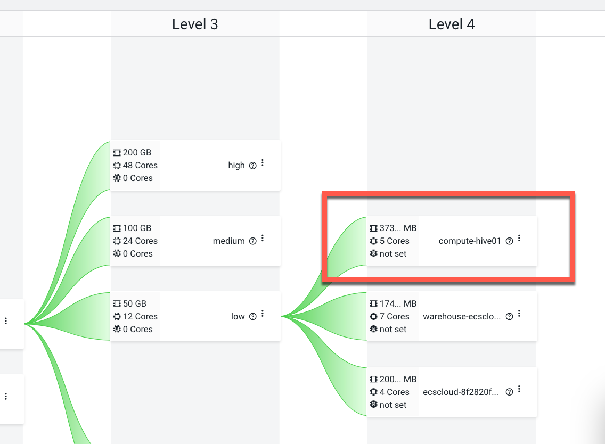

# CDW Quota Management Testing
{: .no_toc }

- TOC
{:toc}

---

## 1. Introduction to the test environment

|CDP Runtime version |CDP PvC Base 7.1.9|
|CM version |Cloudera Manager 7.11.3.9|
|ECS version |CDP PvC DataServices 1.5.4|
|OS version |Centos 8.4|
|K8S version |RKE 1.27.10|
|Whether to enable Kerberos |Yes|
|Whether to enable TLS |No|
|Auto-TLS |No|
|Kerberos |FreeIPA|
|LDAP |FreeIPA|
|DB Configuration |Embedded|
|Vault |Embedded|
|Docker registry |Embedded|
|Install Method |Internet|

## 2. Basic Concept

- By enabling quota management in Cloudera Data Warehouse (CDW) on Private Cloud, you can assign quota-managed resource pools for environments, Data Catalogs, Virtual Warehouses, and Data Visualization instances.

## 3. Add new pool for Data Services 

- RPM (Resouce Pool Manager) is tracking resources across K8s clusters through resource pool objects. Resouce pool objects allow for defining a hierarchical structure for purposes of ownership and quota management.

- Navigate to Cloudera Management Console > Resource Utilization > Quotas, and add three new pools for Data Services workloads. 
    - Note: please keep advanced properties no changed. 

|No.|PATH|quota_cores|quota_memory|validity|distribution|order|queueing|clusterId|namespace|
|1|root.default.high|48|200GB||ELASTIC|FIFO|true|||
|2|root.default.medium|24|100GB||ELASTIC|FIFO|true|||
|3|root.default.low|12|50GB||ELASTIC|FIFO|true|||


## 4. Create custom resource templates[Optional]

- A new menu option Resource Templates has been added to the left navigation pane on the CDW web interface. The default resource templates for Hive, Impala, Database Catalog, and Data Visualization pods is listed in [predefined resource templates](https://docs.cloudera.com/data-warehouse/1.5.4/administration/topics/dw-pvc-predefined-list-resource-templates.html).
- You can configure the customized allocation of Kubernetes resources to the pods for Hive, Data Visualization, and Database Catalog in addition to Impala.
- Due to limited experimental environment resources, a new `Limited Resources` template is added to reduce the request resource to 1/4 of the original values.


## 5. Enable quota management for CDW

- Log in to CDW as user `admin`. Go to Advanced Configuration and select the Enable quota management option. Click Update.
    - Note: Starting with CDP Private Cloud Data Services 1.5.4, you can enable or disable the quota management option at any time during the lifecycle of the CDW entities. 


- Activate the environment.


- Select the resource pool `root.default.low`.
    - Note: If you enable the quota management feature, you must select a resource pool while activating the environment.


- Turn back to the resource pool UI. the resource pool `root.default.low` has two new level 4 branches, namely `root.default.low.ecscloud-8f2820fc-log-router` and `root.default.low.warehouse-ecscloud`.


- `ecstest-c51569f2-log-router` and `warehouse-ecstest` are the new namespaces added by the activation environment step.
    - The pool `root.default.medium.ecscloud-8f2820fc-log-router` consumed 4 cores, 2GB memory.
    - The pool `root.default.medium.warehouse-ecscloud`consumed 7 cores, 18GB memory.

- From the Yunikorn UI, the resource pool `root.default.low` allocated 0 CPUs and 0 Memorys.


- All pods in `warehouse-ecscloud` use the default k8s scheduler. This causes Quota management to lose control of resources.
    - The default k8s scheduler take over when `yunikorn.apache.org/ignore-application` is `true`.
    
```bash
$ for pod in $(kubectl get pod -n warehouse-ecscloud --output=jsonpath={.items..metadata.name}); do echo $pod && kubectl describe pod $pod -n warehouse-ecscloud|grep yunikorn.apache.org; done
```


- Create new virtual warehouse `hive01`. The resource pool has only one option `root.default.low`, indicating that it is inherited from environment.


- Due to limited resources, hive VW also used the `Limited resource` template.
    - Note: Cloudera Data Warehouse (CDW) provides an option to enable active-passive configuration for HiveServer2 (HS2) pods in Private Cloud for Hive and Unified Analytics. By selecting this option (available from PvC 1.5.4), two HS2 pods run simultaneouslyone active and the other inactive. When one pod terminates, the inactive pod becomes active--most likey due to a node failure, providing High Availability (HA).


- Turn back to the resource pool UI. We can see the new resource pool `root.default.low.compute-hive01`.



- `compute-hive01`is the namespace of hive virtual warehouse.
    - The pool `root.default.high.compute-hive01` consumed 5 cores, 36GB memory.


- The total resources of the three child pools have exceeded the parent pool `root.default.low`.
    - The total number of CPU is 16 > 12
    - The total number of Memory is 56 > 50
    - However, the hive VW is created successfully.

- The root cause is that only 7 pods in hive virtual warehouse used yunikorn scheduler.
    - The default k8s scheduler take over when `yunikorn.apache.org/ignore-application` is `true`.

```bash
$ for pod in $(kubectl get pod -n compute-hive01 --output=jsonpath={.items..metadata.name}); do echo $pod && kubectl describe pod $pod -n compute-hive01|grep yunikorn.apache.org; done
```


- From the Yunikorn UI, the resource pool `root.default.low` allocated 4100m CPUs and 33.1 GB Memory to 7 pods. 
    - CPU: 4100m < 12K
    - Memory: 33.1 < 50
    - It is still within the limits of the resource pool.


- Create new virtual warehouse `impala01`. The resource pool has only one option `root.default.low`, indicating that it is inherited from environment.


- It failed with errors "creating namespace for Virtual Warehouse (cause: non-retriable error: failed to create the resource pool 'root.default.low.impala-impala01', because: 'Request type: 'CreateResourcePool', state: 'FAILED', last updated: '2024-06-05T17:17:42.257+08:00', finished: 'true', error: 'policy violation: child quota larger than parent quota'', request ID: 'rp-req-7ffcb8f1-4732-4239-8661-08e2ca344a05')  Error Code : 4000". This shows that CDW quota management take effect.


## 6. Conclusion

- Enabling quota management does not mean that all new pods of CDW will use the yunikorn scheduler, which brings confusion to resource control. Pods using the k8s scheduler will get unlimited resources.