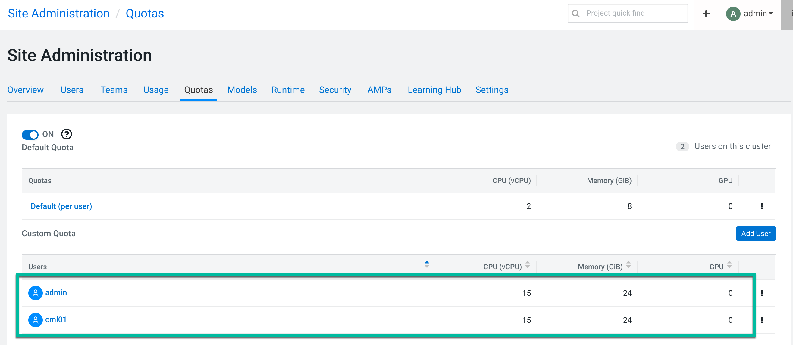
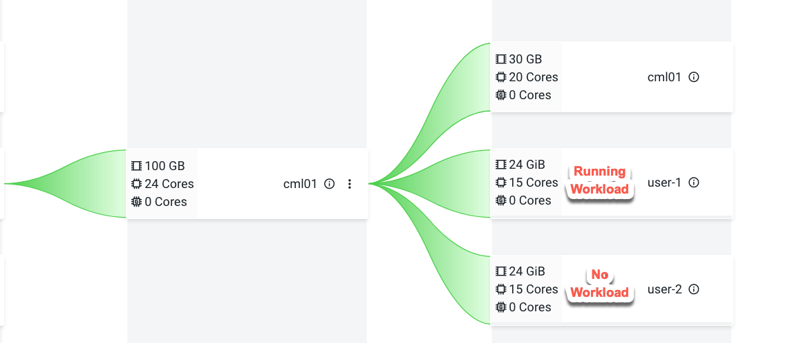
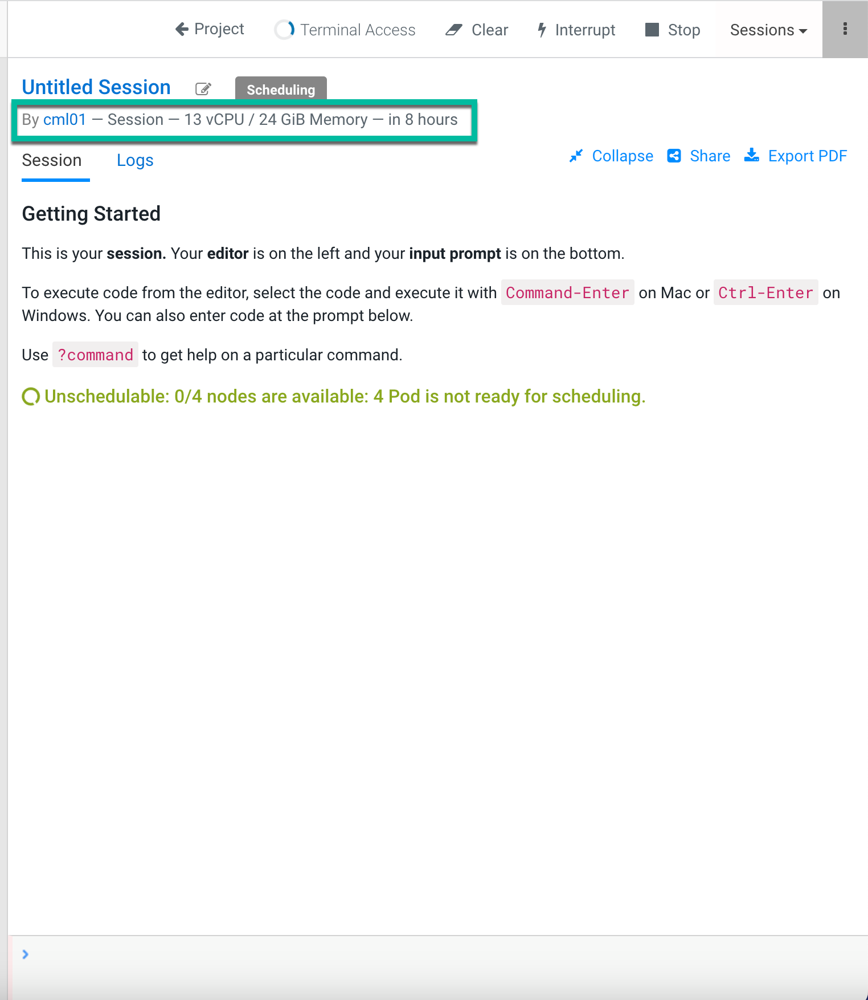
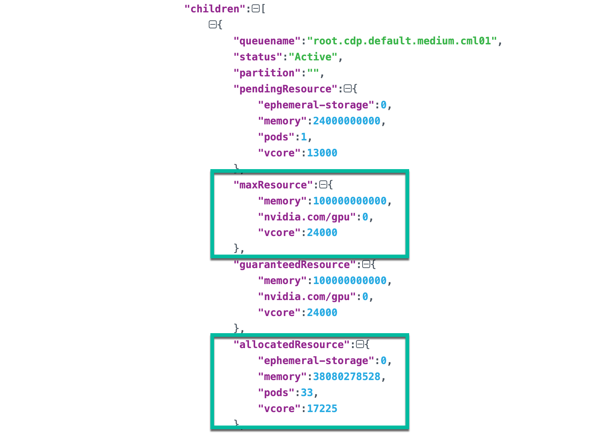

# CML Quota Management Testing
{: .no_toc }

- TOC
{:toc}

---

## 1. Introduction to the test environment

|CDP Runtime version |CDP PvC Base 7.1.7 SP2|
|CM version |Cloudera Manager 7.11.3.2|
|ECS version |CDP PvC DataServices 1.5.2|
|OS version |Centos 7.9|
|K8S version |RKE 1.25.14|
|Whether to enable Kerberos |Yes|
|Whether to enable TLS |Yes|
|Auto-TLS |Yes|
|Kerberos |FreeIPA|
|LDAP |FreeIPA|
|DB Configuration |Embedded|
|Vault |Embedded|
|Docker registry |Embedded|
|Install Method |Internet|

## 2. Basic Concept

- Quota management enables you to control how resources are allocated within your CML workspace.
    - `Pod Count Quota`: Each user can only run 50 Pods in parallel (sessions, jobs, Spark drivers+executors, etc). You can set the OVERRIDE_PODQUOTA environment variable in the project to override the default value.
    - `User Level Quota`: CML administrators can enable user level quota under Site Administration Page. By default, 8 GiB memory and 2 vCPU cores are configured for each user. The custom quota can override the default quota for the dedicated user.
    - `Workspace Level Quota` (Technical preview in 1.5.2): Resource Pools are organized in a hierarchical manner by defining nodes in the hierarchy with resource limits, which can then be subdivided as needed to allocate resources for a new namespace. CML has two types of namespace: Infra namespace and User namespace. 1 CML workspace has one infra namespace and many user namespaces. Use namespace is created dynamically when any workload is run (like session, job etc) based on infra namespace name with suffixes of `-user-<id>`. This means that each user has its own working namespace.

- All you should know about [Workspace level Quota](https://yunikorn.apache.org/docs/1.0.0/user_guide/resource_quota_management/#quota-configuration-and-rules):
    - Each namespace is assigned a resource pool with predefined quota.
    - The quota is hard limit for resource usage.
        - Each pool can never use more resources than the quota configured by itself.
        - The usage of all children combined can never exceed the quota configured on the parent.
    - However, from a configuration perspective this does not mean that the sum of the configured quotas for all children must be smaller than the parent quota.
        - There are two kind of distribute type (`inelastic` or `elastic`) which define the relationship between child quota and parent quota.
            - `inelastic`: sum of all child quotas must be smaller than the parent quota.
            - `elastic`: each child quota must be smaller than the parent quota.
        - The distribution type is defined in RPM (Resouce Pool Manager) but not in YuniKorn. YuniKorn always uses an `elastic` queue system. 

- All you should know about the new quota management in CML:
    - You must define tag `key: experience, value: cml` to help CML to identify the resource pool is configured for CML. Tags provide a way to add user-defined name/value pairs as metadata for the resource pools. 
    - The minimum requirement for a CML workspace is 38 GB of Memory and 22 CPU.
        - CML reserves 30 GB Memory and 20 CPU for the infra namespace.
        - CML reserves the user level quota for the user namespace. `Note: The user level quota is enabled automatically once the new quota management is enabled`. 
    - The new quota management cannot be enabled for an existing workspace. you will need to delete the existing workspace, enable the quota management feature, and then rebuild the workspace.

## 3. Know more about Resouce Pool Manager

- RPM (`Resouce Pool Manager`) is tracking resources across K8s clusters through resource pool objects. Resouce pool objects allow for defining a hierarchical structure for purposes of ownership and quota management.

- Navigate to Cloudera Management Console > Resource Utilization > Quotas, you can see four-level resource pools: root ->  root.default -> root.default.ecstest-c51569f2 -> root.default.ecstest-c51569f2.monitoring-namespace.


- You can query the backend database for more details.

```bash
kubectl exec -it cdp-embedded-db-0 -n cdp -- bash
psql -P pager=off -d db-resourcepoolmanager

db-resourcepoolmanager=# select path,metadata from pools order by created_at;
```

- There are five built-in pools post DS environment initiation. 
    - Note: The top resource pool is root which have unrestricted access to all resources available within your cluster.
    - Note: quota_cpu=2000 means 2 CPU cores, quota_memory=1000000000 means 1GB memory.

|No.|PATH|quota_cpu|quota_memory|validity|distribution|order|queueing|clusterId|namespace|
|1|root|null|null|null|ELASTIC|FIFO|false|||
|2|root.default|1000000000000000000|1000000000000000000|-1|ELASTIC|UNSET|false|||
|3|root.default.observability|2000|1000000000|-1|ELASTIC|FIFO|false||observability|
|4|root.default.ecstest-c51569f2|4000|30000000000|-1|ELASTIC|FIFO|true|liftie-8wqkf202||
|5|root.default.ecstest-c51569f2.monitoring-namespace|4000|30000000000|-1|ELASTIC|FIFO|true|liftie-8wqkf202|ecstest-c51569f2-monitoring-platform|

- Add three new pools for Data Service workloads. 
    - Note: please keep advanced properties no changed. 

|No.|PATH|quota_cores|quota_memory|validity|distribution|order|queueing|clusterId|namespace|
|1|root.default.high|48|200GB||ELASTIC|FIFO|true|||
|2|root.default.medium|24|100GB||ELASTIC|FIFO|true|||
|3|root.default.low|12|50GB||ELASTIC|FIFO|true|||


## 4. Enable quota management for CML

- Please add tag 'key: experience, value: cml' for pool `root.default.medium`. This is a mandatory requirement of CML.


- Please edit the CML control plane deployment `dp-mlx-control-plane-app` and set environment variable `ENABLE_UMBRA_INTEGRATION` to `true`.

```bash
$ kubectl describe deploy dp-mlx-control-plane-app -n cdp|grep ENABLE_UMBRA_INTEGRATION
      ENABLE_UMBRA_INTEGRATION:                            false
```


- Wait for the new pod to come up.


- Provisioning workspace is the same as it was before quota management. There are some extra configurations for configuring the quota for specified workspace. 


- Resource pool 'root.default' is optional but not available. When you select the valid resource pool `root.default.medium`, its default quota is 0. please  pull the slider to a reasonable value as needed.


- Turn back to the resource pool UI. the resource pool `root.default.medium` has two new pools after provisioning workspace `cml01`.


|No.|PATH|quota_cores|quota_memory|validity|distribution|order|queueing|preemption enabled|preemption fencing|priority enabled|priority fencing|tags|clusterId|namespace|
|1|root.default.medium.cml01|24|100GB|NEVER EXPIRES|ELASTIC|FIFO|true|true|true|true|true|createdby:cml|||
|2|root.default.medium.cml01.cml01|20|30GB|NEVER EXPIRES|ELASTIC|FIFO|true|false|false|false|false|createdby:cml|liftie-8wqkf202|cml01|

- Log in to CML as user `admin` and check the user quota under Site Administration Page. 
    - Note: It's enabled by default after you have enabled the workspace level quota management.
    - Note: Do not toggle off this default quota once you have enabled the quota management in cml.
    - Note: Do not edit the gpu resources on the user quota tab under site administration when the workspace is provisioned without any gpu resources gpu resources. We can edit the gpu resources if the workspace is provisioned with gpu resources.


- Let's define the custom user quota ( 15 cores and 24GB memory ) for user `admin` and `cml01`.



- Log in to CML as user `admin` and start a new session.


- Log in to CML as user `cml01` and start a new session.

- Turn back to the resource pool UI.
    - The new pool 'root.default.medium.cml01.user-1' and 'root.default.medium.cml01.user-2' are added automatically.
    - Note: Although the session container is using 2 cores and 4GB memory, we see that the quota of the user namespace is 15 cores and 24GB memory, indicating that it follows the user level quota specification.

|No.|PATH|quota_cores|quota_memory|validity|distribution|order|queueing|preemption enabled|preemption fencing|priority enabled|priority fencing|tags|clusterId|namespace|
|3|root.default.medium.cml01.user-1|15|24GB|NEVER EXPIRES|INELASTIC|FIFO|true|true|true|false|false|createdby:cml|liftie-8wqkf202|cml01-user-1|
|4|root.default.medium.cml01.user-2|15|24GB|NEVER EXPIRES|INELASTIC|FIFO|true|true|true|false|false|createdby:cml|liftie-8wqkf202|cml01-user-2|


## 5. Technical Preview in 1.5.2

- Workspace Level Quota Management is technical preview in 1.5.2 which's generally not ready for production deployment. You should explore this feature in a non production cluster.

- We found that all pods in the CML workspace used yunikorn scheduler, so release 1.5.2 is very close to GA.

```
$ for pod in $(kubectl get pod -n cml01 --output=jsonpath={.items..metadata.name}); do echo $pod && kubectl describe pod $pod -n cml01|grep yunikorn.apache.org; done
api-67849d85dd-bvbtx
                      yunikorn.apache.org/allow-preemption: false
                      yunikorn.apache.org/scheduled-at: 1700455984279153223
...

web-885854cb7-vptcw
                      yunikorn.apache.org/allow-preemption: false
                      yunikorn.apache.org/scheduled-at: 1700455985068707436
```

## 6. Know more about Yunikorn API

- Let's do a port-forward to localhost to run the YuniKorn rest API.
    - Find YuniKorn scheduler pod
    ```bash
    $ kubectl get pods -n yunikorn
    NAME                                             READY   STATUS    RESTARTS   AGE
    yunikorn-admission-controller-6bc647d6c5-xnzr4   1/1     Running   0          5d4h
    yunikorn-scheduler-66c9984b6-n9vpg               2/2     Running   0          5d4h
    ```
    - Access the UI
    ```bash
    kubectl port-forward yunikorn-scheduler-66c9984b6-n9vpg 9889:9889 -n yunikorn
    ```
    - Run a curl command following [YuniKorn rest API Documents](https://yunikorn.apache.org/docs/1.0.0/api/scheduler).

- You can retrieve the current scheduler configuration. Note: The queue names naming convention is different from RPM.

```bash
curl http://localhost:9889/ws/v1/config
```

- You can get general information about the clusters managed by the YuniKorn Scheduler.

```bash
curl http://localhost:9889/ws/v1/clusters
```

- You can display general information about the partition like name, state, capacity, used capacity, utilization, and node sorting policy.

```bash
curl http://localhost:9889/ws/v1/partitions
```

- You can fetch all Queues associated with given Partition and displays general information about the queues like name, status, capacities and properties. 

```bash
curl http://localhost:9889/ws/v1/partition/default/queues
```

- You can fetch all Nodes associated with given Partition and displays general information about the nodes managed by YuniKorn. Node details include host and rack name, capacity, resources, utilization, and allocations.

```bash
curl http://localhost:9889/ws/v1/partition/default/nodes
```

- You can fetch all Applications for the given Partition Queue combination and displays general information about the applications like used resources, queue name, submission time and allocations.

```bash
curl http://localhost:9889/ws/v1/partition/default/queue/root.cdp.default.medium.cml01.user-1.cml01-user-1/applications
```

## 7. Test cases for quota management

### 7.1 Single Child pool testing



- Log in to CML as user `admin` and start a new session using 14 cores and 24GB memory. Unfortunately it's stuck with warnings "Unschedulable: 0/4 nodes are available: 4 Pod is not ready for scheduling."


- The yunikorn scheduler logs shows there are no headroom for the queue path `root.cdp.default.medium.cml01.user-1.cml01-user-1`.

```bash
$ kubectl logs yunikorn-scheduler-66c9984b6-n9vpg -n yunikorn  -c yunikorn-scheduler-k8s --since 10m

2023-11-23T13:20:07.982Z	DEBUG	core.scheduler.ugm	ugm/manager.go:562	Calculated headroom for user	{"user": "nobody", "queue path": "root.cdp.default.medium.cml01.user-1.cml01-user-1", "user headroom": "nil resource"}
```

- User `admin` has the user quota: 15 cores and 24GB memory. It seems that the quota is enough, but the resources are insufficient.

- Let's check the available node resource.

```bash
$ curl http://localhost:9889/ws/v1/partition/default/nodes| jq 'sort_by(.nodeID)'| jq '.[] | .nodeID,.available'

"feng-ws2.sme-feng.athens.cloudera.com"
{
  "ephemeral-storage": 101994496125,
  "hugepages-2Mi": 0,
  "memory": 87799951360,
  "pods": 458,
  "vcore": 12765
}
"feng-ws3.sme-feng.athens.cloudera.com"
{
  "ephemeral-storage": 101994496125,
  "hugepages-2Mi": 0,
  "memory": 88371682304,
  "pods": 454,
  "vcore": 12240
}
"feng-ws4.sme-feng.athens.cloudera.com"
{
  "ephemeral-storage": 101994496125,
  "hugepages-2Mi": 0,
  "memory": 89487906304,
  "pods": 452,
  "vcore": 13594
}
"feng-ws5.sme-feng.athens.cloudera.com"
{
  "ephemeral-storage": 101994496125,
  "hugepages-2Mi": 0,
  "memory": 75607353344,
  "pods": 459,
  "vcore": 13288
}
```

- Each node has less than 14 available cores.

- Log in to CML as user `admin` and start a new session using 13 cores and 24GB memory. The session was spinned up successfully.


- Let's check the available resource again.

```bash
$ curl http://localhost:9889/ws/v1/partition/default/nodes| jq 'sort_by(.nodeID)'| jq '.[] | .nodeID,.available'

"feng-ws2.sme-feng.athens.cloudera.com"
{
  "ephemeral-storage": 101994496125,
  "hugepages-2Mi": 0,
  "memory": 87799951360,
  "pods": 458,
  "vcore": 12765
}
"feng-ws3.sme-feng.athens.cloudera.com"
{
  "ephemeral-storage": 101994496125,
  "hugepages-2Mi": 0,
  "memory": 88371682304,
  "pods": 454,
  "vcore": 12240
}
"feng-ws4.sme-feng.athens.cloudera.com"
{
  "ephemeral-storage": 101994496125,
  "hugepages-2Mi": 0,
  "memory": 65487906304,
  "pods": 451,
  "vcore": 594
}
"feng-ws5.sme-feng.athens.cloudera.com"
{
  "ephemeral-storage": 101994496125,
  "hugepages-2Mi": 0,
  "memory": 75607353344,
  "pods": 459,
  "vcore": 13288
}
```

- Note: The user admin's session was allocated to the node ("feng-ws5.sme-feng.athens.cloudera.com") with the most CPU resources.


### 7.2 Two Child pools testing


- Please keep the above session running. Currently, the maximum number of available cores on a single node has is `13` ("vcore": 13288).

- Log in to CML as user `cml01` and start a new session using 13 cores and 24GB memory. it's stuck with warnings "Unschedulable: 0/4 nodes are available: 4 Pod is not ready for scheduling."



- The yunikorn scheduler logs shows "Application yunikorn-cml01-user-2-autogen does not fit into root.cdp.default.medium.cml01.user-2.cml01-user-2 queue".

```bash
$ kubectl logs yunikorn-scheduler-66c9984b6-n9vpg -n yunikorn  -c yunikorn-scheduler-k8s --since 10m

2023-11-23T13:58:39.112Z	WARN	shim.context	cache/context.go:952	task event is not published because task is not found	{"appID": "ce093580-a7a6-495b-9adb-12b98215fda3", "taskID": "yunikorn-cml01-user-2-autogen", "event": "type:REQUEST objectID:\"ce093580-a7a6-495b-9adb-12b98215fda3\" message:\"Application yunikorn-cml01-user-2-autogen does not fit into root.cdp.default.medium.cml01.user-2.cml01-user-2 queue\" timestampNano:1700747917144450425 referenceID:\"yunikorn-cml01-user-2-autogen\" resource:{resources:{key:\"ephemeral-storage\" value:{}} resources:{key:\"memory\" value:{value:24000000000}} resources:{key:\"pods\" value:{value:1}} resources:{key:\"vcore\" value:{value:13000}}}"}

2023-11-23T13:58:39.270Z	DEBUG	core.scheduler.ugm	ugm/manager.go:562	Calculated headroom for user	{"user": "nobody", "queue path": "root.cdp.default.medium.cml01.user-2.cml01-user-2", "user headroom": "nil resource"}
```

- Let's check the `maxResource` and `allocatedResource` of the parent pool `root.cdp.default.medium.cml01`.

```bash
$ curl http://localhost:9889/ws/v1/partition/default/queues | jq .[] |grep -A24 '"queuename": "root.cdp.default.medium.cml01"'

                "queuename": "root.cdp.default.medium.cml01",
                "status": "Active",
                "partition": "",
                "pendingResource": {
                  "ephemeral-storage": 0,
                  "memory": 24000000000,
                  "pods": 1,
                  "vcore": 13000
                },
                "maxResource": {
                  "memory": 100000000000,
                  "nvidia.com/gpu": 0,
                  "vcore": 24000
                },
                "guaranteedResource": {
                  "memory": 100000000000,
                  "nvidia.com/gpu": 0,
                  "vcore": 24000
                },
                "allocatedResource": {
                  "ephemeral-storage": 0,
                  "memory": 38080278528,
                  "pods": 33,
                  "vcore": 17225
                },
```



- The usage of all children combined can never exceed the quota configured on the parent.
    - The parent's max Resource = `24000` cores
    - The parent's allocated Resource = `17225` cores
    - The parent's available Quota = 24000 - 17225 = `6775` cores

- Let's start a new session using 7 cores and 24GB memory. We see the same warnings "Unschedulable: 0/4 nodes are available: 4 Pod is not ready for scheduling."


- Let's stop it and start a new session using 6.5 cores and 24GB memory. It's successful because the resource request met the parent quota.


- Let's check the available resource again.

```bash
$  curl http://localhost:9889/ws/v1/partition/default/nodes| jq 'sort_by(.nodeID)'| jq '.[] | .nodeID,.available'

"feng-ws2.sme-feng.athens.cloudera.com"
{
  "ephemeral-storage": 101994496125,
  "hugepages-2Mi": 0,
  "memory": 63799951360,
  "pods": 457,
  "vcore": 6265
}
"feng-ws3.sme-feng.athens.cloudera.com"
{
  "ephemeral-storage": 101994496125,
  "hugepages-2Mi": 0,
  "memory": 88371682304,
  "pods": 454,
  "vcore": 12240
}
"feng-ws4.sme-feng.athens.cloudera.com"
{
  "ephemeral-storage": 101994496125,
  "hugepages-2Mi": 0,
  "memory": 65487906304,
  "pods": 451,
  "vcore": 594
}
"feng-ws5.sme-feng.athens.cloudera.com"
{
  "ephemeral-storage": 101994496125,
  "hugepages-2Mi": 0,
  "memory": 75607353344,
  "pods": 459,
  "vcore": 13288
}
```

- Note: The user cml01's session was allocated to the node ("feng-ws2.sme-feng.athens.cloudera.com") with the available CPU resources.


## 8. Conclusion

- Workspace Level Quota Management is Technical Preview in PvC 1.5.2.
- Pools are organized in a hierarchical manner by defining each CML namespace with quota as resource limits.
    - Each pool can never use more resources than the quota configured by itself.
    - The usage of all children combined can never exceed the quota configured on the parent.
- The available resource of ECS node is hard limit if resource requests don't go beyond any quotas.
