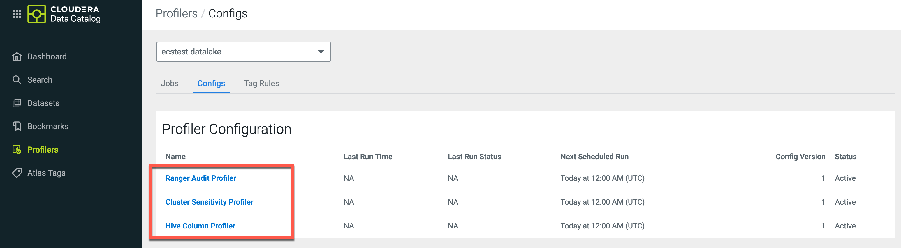

# Data catalog demo
{: .no_toc }

- TOC
{:toc}

---

## 1. Introduction to the test environment

|CDP Runtime version |CDP PvC Base 7.1.7 SP2|
|CM version |Cloudera Manager 7.11.3.2|
|ECS version |CDP PvC DataServices 1.5.2|
|OS version |Centos 7.9|
|K8S version |RKE 1.25.14|
|Whether to enable Kerberos |Yes|
|Whether to enable TLS |Yes|
|Auto-TLS |Yes|
|Kerberos |FreeIPA|
|LDAP |FreeIPA|
|DB Configuration |Embedded|
|Vault |Embedded|
|Docker registry |Embedded|
|Install Method |Internet|

## 2. Basic Concept

- Data Catalog is a service within Cloudera Data Platform that enables you to understand, manage, secure, and govern data assets across the enterprise.

## 3. Prerequisites

- Navigate to Cloudera Manager > Clusters > Atlas > Configuration, search `conf/atlas-application.properties_role_safety_valve` and enter the values for the Atlas service:

```bash
atlas.proxyuser.dpprofiler.hosts=*
atlas.proxyuser.dpprofiler.users=*
atlas.proxyuser.dpprofiler.groups=*
```


- Navigate to Cloudera Manager > Clusters > Ranger > Configuration, search `conf/ranger-admin-site.xml` and enter the values for the Atlas service:

```bash
Name: ranger.proxyuser.dpprofiler.hosts
Value: *

Name: ranger.proxyuser.dpprofiler.users
Value: *

Name: ranger.proxyuser.dpprofiler.groups
Value: *
```


- Restart the cluster according to the configuration update prompts on the CM UI.


- Go to Cloudera Management Console > User Management > Users and grant PowerUser role to user `admin`.


- Log in to Data Catalog service as user `admin` by clicking on the CDP homepage on your CDP console.


- Navigate to Cloudera Data Catalog > Search, You can see "Setup the Profiler for ecstest-datalake". Click Get Started.


- Click Setup Profiler.


- Navigate to Cloudera Data Catalog > Profilers > Configs, You can see that three built-in profilers: Cluster Sensitivity Profiler, Ranger Audit Profiler, Hive Column Profiler are enabled.



