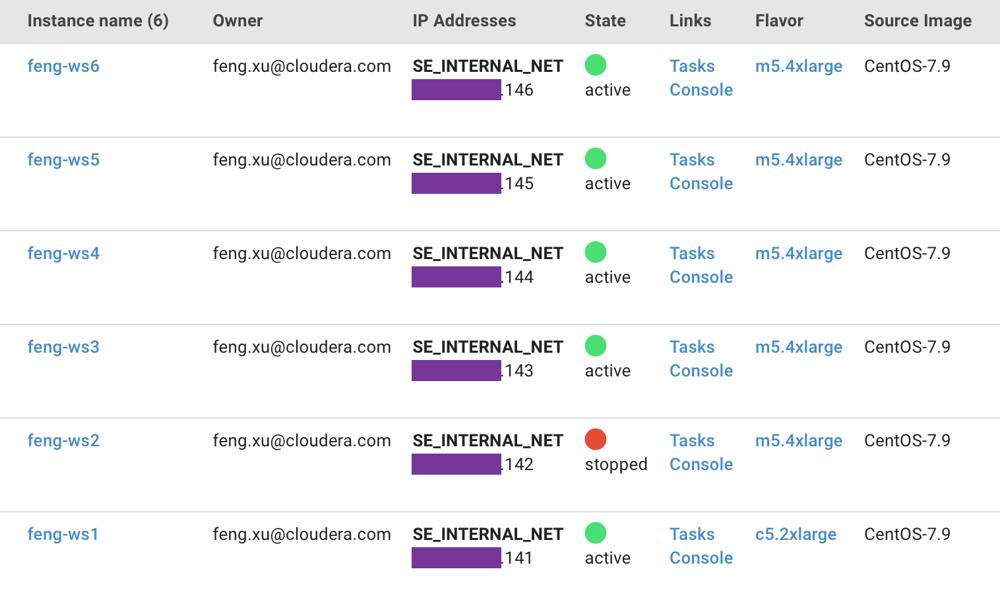
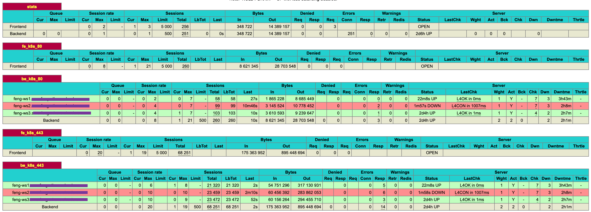

# ECS Server High Availability - Failure Domain Testing and Troubleshooting
{: .no_toc }

- TOC
{:toc}

---

## 1. Introduction to the test environment

|CDP Runtime version |CDP PvC Base 7.1.7 SP1|
|CM version |Cloudera Manager 7.8.1|
|ECS version |CDP PvC DataServices 1.4.1|
|OS version |Centos 7.9|
|K8S version |RKE 1.21|
|Whether to enable Kerberos |Yes|
|Whether to enable TLS |Yes|
|Auto-TLS |Yes|
|Kerberos |FreeIPA|
|LDAP |FreeIPA|
|DB Configuration |External Postgres 12|
|Vault |Embedded|
|Docker registry |Embedded|
|Install Method |Internet|

|IP addresss |hostname |description|
|192.168.8.141	|ds01.ecs.openstack.com |ECS master node 1|
|192.168.8.142	|ds02.ecs.openstack.com |ECS master node 2|
|192.168.8.143	|ds03.ecs.openstack.com |ECS master node 3|
|192.168.8.144	|ds04.ecs.openstack.com |ECS worker node 1|
|192.168.8.145	|ds05.ecs.openstack.com |ECS worker node 2|
|192.168.8.146	|ds06.ecs.openstack.com |ECS worker node 3|

- For ECS cluster install/config guide, see [Fresh install of ECS 1.3.4 HA Cluster](https://fxu1024.github.io/docs/ds/freshinstall/). 

## 2. Basic Concept

### 2.1 Pod Eviction on the NotReady Node

- kube-controller-manager checks the node status periodically. Whenever the node status is NotReady and the podEvictionTimeout time is exceeded, all pods on the node will be expelled to other nodes. The specific expulsion speed is also affected by expulsion speed parameters, cluster size, and so on. See [kubernetes pod evictions](https://www.containiq.com/post/kubernetes-pod-evictions).

### 2.2 Pod Deletion on the NotReady Node

- A Pod is not deleted automatically when a node is unreachable. The Pods running on an unreachable Node enter the 'Terminating' or 'Unknown' state after a timeout. Pods may also enter these states when the user attempts graceful deletion of a Pod on an unreachable Node. See [delete pods](https://kubernetes.io/docs/tasks/run-application/force-delete-stateful-set-pod/#delete-pods).

- The only ways in which a Pod in such a state can be removed from the apiserver are as follows:
    - The Node object is deleted (either by you, or by the Node Controller).
    - The kubelet on the unresponsive Node starts responding, kills the Pod and removes the entry from the apiserver.
    - Force deletion of the Pod by the user.

- The recommended best practice is to use the first or second approach. If a Node is confirmed to be dead (e.g. permanently disconnected from the network, powered down, etc), then delete the Node object. If the Node is suffering from a network partition, then try to resolve this or wait for it to resolve. When the partition heals, the kubelet will complete the deletion of the Pod and free up its name in the apiserver.

- Normally, the system completes the deletion once the Pod is no longer running on a Node, or the Node is deleted by an administrator. You may override this by force deleting the Pod.

### 2.3 Safely Drain a Node before you bring down the node

- You can use kubectl drain to safely evict all of your pods from a node before you perform maintenance on the node (e.g. kernel upgrade, hardware maintenance, etc.). Safe evictions allow the pod's containers to gracefully terminate and will respect the PodDisruptionBudgets you have specified. See [use kubectl drain to remove a node from service](https://kubernetes.io/docs/tasks/administer-cluster/safely-drain-node/#use-kubectl-drain-to-remove-a-node-from-service). 
- When kubectl drain returns successfully, that indicates that all of the pods (except the ones excluded as described in the previous paragraph) have been safely evicted (respecting the desired graceful termination period, and respecting the PodDisruptionBudget you have defined). It is then safe to bring down the node by powering down its physical machine or, if running on a cloud platform, deleting its virtual machine.

### 2.4 Cronjob pod-reaper introduced in PvC 1.4.1

- CronJob pod-reaper creates reaper job every 10 minutes. The reaper job will scan all namespaces and force delete pods that have been in the terminating state for more than 10 minutes.

## Case #1. ECS server suddenly goes down, verify whether CDW/CML cluster are not affected

- Check all ECS nodes

```bash
$ kubectl get node
NAME                                    STATUS   ROLES                       AGE    VERSION
feng-ws1.sme-feng.athens.cloudera.com   Ready    control-plane,etcd,master   2d4h   v1.21.14+rke2r1
feng-ws2.sme-feng.athens.cloudera.com   Ready    control-plane,etcd,master   2d4h   v1.21.14+rke2r1
feng-ws3.sme-feng.athens.cloudera.com   Ready    control-plane,etcd,master   2d4h   v1.21.14+rke2r1
feng-ws4.sme-feng.athens.cloudera.com   Ready    <none>                      2d4h   v1.21.14+rke2r1
feng-ws5.sme-feng.athens.cloudera.com   Ready    <none>                      2d4h   v1.21.14+rke2r1
feng-ws6.sme-feng.athens.cloudera.com   Ready    <none>                      2d4h   v1.21.14+rke2r1
```

- Check the state of ECS roles on CM UI


- Check all Kubernetes objects


- Check all pods running on feng-ws2

```bash
$ kubectl get pods -A -o wide --field-selector spec.nodeName=feng-ws2.sme-feng.athens.cloudera.com
NAMESPACE                            NAME                                                              READY   STATUS      RESTARTS   AGE     IP               NODE                                    NOMINATED NODE   READINESS GATES
cdp                                  cdp-release-alert-admin-service-68f5c6dd7c-glt9k                  2/2     Running     0          2d4h    10.42.1.17       feng-ws2.sme-feng.athens.cloudera.com   <none>           <none>
cdp                                  cdp-release-classic-clusters-7fdf69b6b-psmkj                      3/3     Running     0          2d4h    10.42.1.24       feng-ws2.sme-feng.athens.cloudera.com   <none>           <none>
cdp                                  cdp-release-cluster-access-manager-b58448f45-hqpnq                2/2     Running     0          2d4h    10.42.1.26       feng-ws2.sme-feng.athens.cloudera.com   <none>           <none>
cdp                                  cdp-release-dmx-559ccfb675-qjqb5                                  3/3     Running     0          2d4h    10.42.1.21       feng-ws2.sme-feng.athens.cloudera.com   <none>           <none>
cdp                                  cdp-release-logger-alert-receiver-7cc7647d57-r78s4                2/2     Running     0          2d4h    10.42.1.19       feng-ws2.sme-feng.athens.cloudera.com   <none>           <none>
cdp                                  cdp-release-metrics-server-exporter-cfff8b89f-tm7gs               2/2     Running     0          2d4h    10.42.1.18       feng-ws2.sme-feng.athens.cloudera.com   <none>           <none>
cdp                                  cdp-release-thunderhead-de-api-675b74d89c-hl4h7                   2/2     Running     0          2d4h    10.42.1.15       feng-ws2.sme-feng.athens.cloudera.com   <none>           <none>
cml01                                api-648d7bc885-xvv92                                              1/1     Running     1          105m    10.42.1.48       feng-ws2.sme-feng.athens.cloudera.com   <none>           <none>
cml01                                cron-86888f4849-gn2kw                                             2/2     Running     0          105m    10.42.1.44       feng-ws2.sme-feng.athens.cloudera.com   <none>           <none>
cml01                                ds-operator-5d79bf6756-k78kk                                      2/2     Running     0          105m    10.42.1.46       feng-ws2.sme-feng.athens.cloudera.com   <none>           <none>
cml01                                ds-reconciler-5bfb4bb4fc-qgbrz                                    2/2     Running     0          105m    10.42.1.45       feng-ws2.sme-feng.athens.cloudera.com   <none>           <none>
cml01                                livelog-0                                                         2/2     Running     0          104m    10.42.1.49       feng-ws2.sme-feng.athens.cloudera.com   <none>           <none>
cml01                                livelog-publisher-5wjw5                                           2/2     Running     2          2d2h    10.42.1.34       feng-ws2.sme-feng.athens.cloudera.com   <none>           <none>
cml01                                model-metrics-7654cf6945-7vsbm                                    1/1     Running     0          105m    10.42.1.47       feng-ws2.sme-feng.athens.cloudera.com   <none>           <none>
cml01                                model-proxy-dd4d49678-tqj4h                                       2/2     Running     0          105m    10.42.1.43       feng-ws2.sme-feng.athens.cloudera.com   <none>           <none>
cml01                                s2i-queue-0                                                       2/2     Running     0          2d2h    10.42.1.35       feng-ws2.sme-feng.athens.cloudera.com   <none>           <none>
compute-hive01                       hiveserver2-0                                                     1/1     Running     0          2m38s   10.42.1.53       feng-ws2.sme-feng.athens.cloudera.com   <none>           <none>
compute-hive01                       huebackend-0                                                      1/1     Running     0          2m38s   10.42.1.52       feng-ws2.sme-feng.athens.cloudera.com   <none>           <none>
compute-hive01                       huefrontend-5b67b68994-vqcp8                                      1/1     Running     0          2m38s   10.42.1.51       feng-ws2.sme-feng.athens.cloudera.com   <none>           <none>
compute-hive01                       standalone-compute-operator-0                                     1/1     Running     0          2m39s   10.42.1.50       feng-ws2.sme-feng.athens.cloudera.com   <none>           <none>
ecs-webhooks                         ecs-tolerations-webhook-7d9454f4f9-549qj                          1/1     Running     0          2d4h    10.42.1.3        feng-ws2.sme-feng.athens.cloudera.com   <none>           <none>
impala-impala01                      catalogd-0                                                        2/2     Running     1          30h     10.42.1.39       feng-ws2.sme-feng.athens.cloudera.com   <none>           <none>
impala-impala01                      huebackend-0                                                      2/2     Running     0          30h     10.42.1.37       feng-ws2.sme-feng.athens.cloudera.com   <none>           <none>
impala-impala01                      huefrontend-7788ff9f45-8kvhj                                      1/1     Running     0          30h     10.42.1.36       feng-ws2.sme-feng.athens.cloudera.com   <none>           <none>
impala-impala01                      impala-autoscaler-66cfbb7b7f-clsfg                                1/1     Running     0          30h     10.42.1.38       feng-ws2.sme-feng.athens.cloudera.com   <none>           <none>
impala-impala01                      statestored-8bcbc5657-mw7kg                                       1/1     Running     0          30h     10.42.1.41       feng-ws2.sme-feng.athens.cloudera.com   <none>           <none>
impala-impala01                      usage-monitor-645b96b78f-fvvvp                                    1/1     Running     0          30h     10.42.1.40       feng-ws2.sme-feng.athens.cloudera.com   <none>           <none>
infra-prometheus                     infra-prometheus-operator-1-1672115985-prometheus-node-exp49m48   1/1     Running     0          2d4h    10.113.207.142   feng-ws2.sme-feng.athens.cloudera.com   <none>           <none>
kube-system                          etcd-feng-ws2.sme-feng.athens.cloudera.com                        1/1     Running     0          2d4h    10.113.207.142   feng-ws2.sme-feng.athens.cloudera.com   <none>           <none>
kube-system                          helm-install-rke2-canal-xt5w6                                     0/1     Completed   0          2d4h    10.113.207.142   feng-ws2.sme-feng.athens.cloudera.com   <none>           <none>
kube-system                          kube-apiserver-feng-ws2.sme-feng.athens.cloudera.com              1/1     Running     0          2d4h    10.113.207.142   feng-ws2.sme-feng.athens.cloudera.com   <none>           <none>
kube-system                          kube-controller-manager-feng-ws2.sme-feng.athens.cloudera.com     1/1     Running     0          2d4h    10.113.207.142   feng-ws2.sme-feng.athens.cloudera.com   <none>           <none>
kube-system                          kube-proxy-feng-ws2.sme-feng.athens.cloudera.com                  1/1     Running     0          2d4h    10.113.207.142   feng-ws2.sme-feng.athens.cloudera.com   <none>           <none>
kube-system                          kube-scheduler-feng-ws2.sme-feng.athens.cloudera.com              1/1     Running     0          2d4h    10.113.207.142   feng-ws2.sme-feng.athens.cloudera.com   <none>           <none>
kube-system                          nvidia-device-plugin-daemonset-vfvm9                              1/1     Running     0          2d4h    10.42.1.14       feng-ws2.sme-feng.athens.cloudera.com   <none>           <none>
kube-system                          rke2-canal-jgslr                                                  2/2     Running     0          2d4h    10.113.207.142   feng-ws2.sme-feng.athens.cloudera.com   <none>           <none>
kube-system                          rke2-coredns-rke2-coredns-6775f768c8-82tkq                        1/1     Running     0          2d4h    10.42.1.2        feng-ws2.sme-feng.athens.cloudera.com   <none>           <none>
kube-system                          rke2-ingress-nginx-controller-84fb589c78-bgkp5                    1/1     Running     0          2d4h    10.42.1.13       feng-ws2.sme-feng.athens.cloudera.com   <none>           <none>
longhorn-system                      engine-image-ei-045573ad-thvcf                                    1/1     Running     0          2d4h    10.42.1.11       feng-ws2.sme-feng.athens.cloudera.com   <none>           <none>
longhorn-system                      helm-install-longhorn-z7hr8                                       0/1     Completed   0          2d4h    10.42.1.4        feng-ws2.sme-feng.athens.cloudera.com   <none>           <none>
longhorn-system                      instance-manager-e-b4025e6d                                       1/1     Running     0          2d4h    10.42.1.10       feng-ws2.sme-feng.athens.cloudera.com   <none>           <none>
longhorn-system                      instance-manager-r-dfa1437e                                       1/1     Running     0          2d4h    10.42.1.9        feng-ws2.sme-feng.athens.cloudera.com   <none>           <none>
longhorn-system                      longhorn-admission-webhook-584567fd57-sfmmg                       1/1     Running     0          2d4h    10.42.1.8        feng-ws2.sme-feng.athens.cloudera.com   <none>           <none>
longhorn-system                      longhorn-conversion-webhook-74bdb64887-mq45q                      1/1     Running     0          2d4h    10.42.1.5        feng-ws2.sme-feng.athens.cloudera.com   <none>           <none>
longhorn-system                      longhorn-csi-plugin-p24j8                                         2/2     Running     0          2d4h    10.42.1.12       feng-ws2.sme-feng.athens.cloudera.com   <none>           <none>
longhorn-system                      longhorn-manager-h2vb2                                            1/1     Running     0          2d4h    10.42.1.6        feng-ws2.sme-feng.athens.cloudera.com   <none>           <none>
longhorn-system                      longhorn-ui-6f94dfc58c-jw7r8                                      1/1     Running     0          2d4h    10.42.1.7        feng-ws2.sme-feng.athens.cloudera.com   <none>           <none>
warehouse-default-datalake-default   metastore-0                                                       1/1     Running     0          2d3h    10.42.1.27       feng-ws2.sme-feng.athens.cloudera.com   <none>           <none>
```

- Shutdown node feng-ws2



- Confirm that only feng-ws1 is NotReady

```bash
$ kubectl get node
NAME                                    STATUS     ROLES                       AGE    VERSION
feng-ws1.sme-feng.athens.cloudera.com   Ready      control-plane,etcd,master   2d4h   v1.21.14+rke2r1
feng-ws2.sme-feng.athens.cloudera.com   NotReady   control-plane,etcd,master   2d4h   v1.21.14+rke2r1
feng-ws3.sme-feng.athens.cloudera.com   Ready      control-plane,etcd,master   2d4h   v1.21.14+rke2r1
feng-ws4.sme-feng.athens.cloudera.com   Ready      <none>                      2d4h   v1.21.14+rke2r1
feng-ws5.sme-feng.athens.cloudera.com   Ready      <none>                      2d4h   v1.21.14+rke2r1
feng-ws6.sme-feng.athens.cloudera.com   Ready      <none>                      2d4h   v1.21.14+rke2r1
```

- As you can see from the HAProxy UI, all ports on feng-ws1 ( http port 80, https port 434) have become Down state 



    - ECS server (feng-ws2, feng-ws3) stderr.log indicated Stopped tunnel to 10.113.207.141.
    ```console
    time="2022-12-29T17:13:37+08:00" level=info msg="error in remotedialer server [400]: websocket: close 1006 (abnormal closure): unexpected EOF"
    time="2022-12-29T17:13:37+08:00" level=error msg="Remotedialer proxy error" error="websocket: close 1006 (abnormal closure): unexpected EOF"
    time="2022-12-29T17:13:42+08:00" level=info msg="Connecting to proxy" url="wss://10.113.207.142:9345/v1-rke2/connect"
    time="2022-12-29T17:13:53+08:00" level=info msg="Stopped tunnel to 10.113.207.142:9345"
    time="2022-12-29T17:14:47+08:00" level=error msg="Failed to connect to proxy" error="dial tcp 10.113.207.142:9345: connect: no route to host"
    time="2022-12-29T17:14:47+08:00" level=error msg="Remotedialer proxy error" error="dial tcp 10.113.207.142:9345: connect: no route to host"
    ```

    - ECS Agent (feng-ws4, feng-ws5, feng-ws6 ) stderr.log indicated Updating load balancer server addresses and Stopped tunnel to 10.113.207.141.
    ```console 
    time="2022-12-29T17:13:37+08:00" level=error msg="Remotedialer proxy error" error="websocket: close 1006 (abnormal closure): unexpected EOF"
    time="2022-12-29T17:13:42+08:00" level=info msg="Connecting to proxy" url="wss://10.113.207.142:9345/v1-rke2/connect"
    time="2022-12-29T17:14:08+08:00" level=error msg="Tunnel endpoint watch channel closed: {ERROR &Status{ListMeta:ListMeta{SelfLink:,ResourceVersion:,Continue:,RemainingItemCount:nil,},Status:Failure,Message:an error on the server (\"unable to decode an event from the watch stream: http2: client connection lost\") has prevented the request from succeeding,Reason:InternalError,Details:&StatusDetails{Name:,Group:,Kind:,Causes:[]StatusCause{StatusCause{Type:UnexpectedServerResponse,Message:unable to decode an event from the watch stream: http2: client connection lost,Field:,},StatusCause{Type:ClientWatchDecoding,Message:unable to decode an event from the watch stream: http2: client connection lost,Field:,},},RetryAfterSeconds:0,UID:,},Code:500,}}"
    time="2022-12-29T17:14:13+08:00" level=info msg="Updating load balancer rke2-api-server-agent-load-balancer server addresses -> [10.113.207.141:6443 10.113.207.143:6443 10.113.207.142:6443]"
    time="2022-12-29T17:14:13+08:00" level=info msg="Updating load balancer rke2-agent-load-balancer server addresses -> [10.113.207.141:9345 10.113.207.143:9345]"
    time="2022-12-29T17:14:13+08:00" level=info msg="Stopped tunnel to 10.113.207.142:9345"
    time="2022-12-29T17:14:45+08:00" level=error msg="Failed to connect to proxy" error="dial tcp 10.113.207.142:9345: connect: no route to host"
    time="2022-12-29T17:14:45+08:00" level=error msg="Remotedialer proxy error" error="dial tcp 10.113.207.142:9345: connect: no route to host"
    ```

- As you can see from the CM UI, ECS server health/Control Plane Health/Kubernetes Health/Longhorn Health start to alarm.


- You can also see many pod failures on the k8s web UI.


- Most of the pods from feng-ws1 are stuck in terminating state after 300 seconds.

```bash
$ kubectl get pods -A -o wide --field-selector spec.nodeName=feng-ws2.sme-feng.athens.cloudera.com
NAMESPACE                            NAME                                                              READY   STATUS        RESTARTS   AGE    IP               NODE                                    NOMINATED NODE   READINESS GATES
cdp                                  cdp-release-alert-admin-service-68f5c6dd7c-glt9k                  2/2     Terminating   0          2d4h   10.42.1.17       feng-ws2.sme-feng.athens.cloudera.com   <none>           <none>
cdp                                  cdp-release-classic-clusters-7fdf69b6b-psmkj                      3/3     Terminating   0          2d4h   10.42.1.24       feng-ws2.sme-feng.athens.cloudera.com   <none>           <none>
cdp                                  cdp-release-cluster-access-manager-b58448f45-hqpnq                2/2     Terminating   0          2d4h   10.42.1.26       feng-ws2.sme-feng.athens.cloudera.com   <none>           <none>
cdp                                  cdp-release-dmx-559ccfb675-qjqb5                                  3/3     Terminating   0          2d4h   10.42.1.21       feng-ws2.sme-feng.athens.cloudera.com   <none>           <none>
cdp                                  cdp-release-logger-alert-receiver-7cc7647d57-r78s4                2/2     Terminating   0          2d4h   10.42.1.19       feng-ws2.sme-feng.athens.cloudera.com   <none>           <none>
cdp                                  cdp-release-metrics-server-exporter-cfff8b89f-tm7gs               2/2     Terminating   0          2d4h   10.42.1.18       feng-ws2.sme-feng.athens.cloudera.com   <none>           <none>
cdp                                  cdp-release-thunderhead-de-api-675b74d89c-hl4h7                   2/2     Terminating   0          2d4h   10.42.1.15       feng-ws2.sme-feng.athens.cloudera.com   <none>           <none>
cml01                                api-648d7bc885-xvv92                                              1/1     Terminating   1          122m   10.42.1.48       feng-ws2.sme-feng.athens.cloudera.com   <none>           <none>
cml01                                cron-86888f4849-gn2kw                                             2/2     Terminating   0          122m   10.42.1.44       feng-ws2.sme-feng.athens.cloudera.com   <none>           <none>
cml01                                ds-operator-5d79bf6756-k78kk                                      2/2     Terminating   0          122m   10.42.1.46       feng-ws2.sme-feng.athens.cloudera.com   <none>           <none>
cml01                                ds-reconciler-5bfb4bb4fc-qgbrz                                    2/2     Terminating   0          122m   10.42.1.45       feng-ws2.sme-feng.athens.cloudera.com   <none>           <none>
cml01                                livelog-publisher-5wjw5                                           2/2     Running       2          2d3h   10.42.1.34       feng-ws2.sme-feng.athens.cloudera.com   <none>           <none>
cml01                                model-metrics-7654cf6945-7vsbm                                    1/1     Terminating   0          122m   10.42.1.47       feng-ws2.sme-feng.athens.cloudera.com   <none>           <none>
cml01                                model-proxy-dd4d49678-tqj4h                                       2/2     Terminating   0          122m   10.42.1.43       feng-ws2.sme-feng.athens.cloudera.com   <none>           <none>
compute-hive01                       hiveserver2-0                                                     1/1     Terminating   0          19m    10.42.1.53       feng-ws2.sme-feng.athens.cloudera.com   <none>           <none>
compute-hive01                       huebackend-0                                                      1/1     Terminating   0          19m    10.42.1.52       feng-ws2.sme-feng.athens.cloudera.com   <none>           <none>
compute-hive01                       huefrontend-5b67b68994-vqcp8                                      1/1     Terminating   0          19m    10.42.1.51       feng-ws2.sme-feng.athens.cloudera.com   <none>           <none>
compute-hive01                       standalone-compute-operator-0                                     1/1     Terminating   0          19m    10.42.1.50       feng-ws2.sme-feng.athens.cloudera.com   <none>           <none>
ecs-webhooks                         ecs-tolerations-webhook-7d9454f4f9-549qj                          1/1     Terminating   0          2d4h   10.42.1.3        feng-ws2.sme-feng.athens.cloudera.com   <none>           <none>
impala-impala01                      catalogd-0                                                        2/2     Terminating   1          30h    10.42.1.39       feng-ws2.sme-feng.athens.cloudera.com   <none>           <none>
impala-impala01                      huebackend-0                                                      2/2     Terminating   0          30h    10.42.1.37       feng-ws2.sme-feng.athens.cloudera.com   <none>           <none>
impala-impala01                      huefrontend-7788ff9f45-8kvhj                                      1/1     Terminating   0          30h    10.42.1.36       feng-ws2.sme-feng.athens.cloudera.com   <none>           <none>
impala-impala01                      impala-autoscaler-66cfbb7b7f-clsfg                                1/1     Terminating   0          30h    10.42.1.38       feng-ws2.sme-feng.athens.cloudera.com   <none>           <none>
impala-impala01                      statestored-8bcbc5657-mw7kg                                       1/1     Terminating   0          30h    10.42.1.41       feng-ws2.sme-feng.athens.cloudera.com   <none>           <none>
impala-impala01                      usage-monitor-645b96b78f-fvvvp                                    1/1     Terminating   0          30h    10.42.1.40       feng-ws2.sme-feng.athens.cloudera.com   <none>           <none>
infra-prometheus                     infra-prometheus-operator-1-1672115985-prometheus-node-exp49m48   1/1     Running       0          2d4h   10.113.207.142   feng-ws2.sme-feng.athens.cloudera.com   <none>           <none>
kube-system                          etcd-feng-ws2.sme-feng.athens.cloudera.com                        1/1     Running       0          2d4h   10.113.207.142   feng-ws2.sme-feng.athens.cloudera.com   <none>           <none>
kube-system                          kube-apiserver-feng-ws2.sme-feng.athens.cloudera.com              1/1     Running       0          2d4h   10.113.207.142   feng-ws2.sme-feng.athens.cloudera.com   <none>           <none>
kube-system                          kube-controller-manager-feng-ws2.sme-feng.athens.cloudera.com     1/1     Running       0          2d4h   10.113.207.142   feng-ws2.sme-feng.athens.cloudera.com   <none>           <none>
kube-system                          kube-proxy-feng-ws2.sme-feng.athens.cloudera.com                  1/1     Running       0          2d4h   10.113.207.142   feng-ws2.sme-feng.athens.cloudera.com   <none>           <none>
kube-system                          kube-scheduler-feng-ws2.sme-feng.athens.cloudera.com              1/1     Running       0          2d4h   10.113.207.142   feng-ws2.sme-feng.athens.cloudera.com   <none>           <none>
kube-system                          nvidia-device-plugin-daemonset-vfvm9                              1/1     Running       0          2d4h   10.42.1.14       feng-ws2.sme-feng.athens.cloudera.com   <none>           <none>
kube-system                          rke2-canal-jgslr                                                  2/2     Running       0          2d4h   10.113.207.142   feng-ws2.sme-feng.athens.cloudera.com   <none>           <none>
kube-system                          rke2-coredns-rke2-coredns-6775f768c8-82tkq                        1/1     Terminating   0          2d4h   10.42.1.2        feng-ws2.sme-feng.athens.cloudera.com   <none>           <none>
kube-system                          rke2-ingress-nginx-controller-84fb589c78-bgkp5                    1/1     Terminating   0          2d4h   10.42.1.13       feng-ws2.sme-feng.athens.cloudera.com   <none>           <none>
longhorn-system                      engine-image-ei-045573ad-thvcf                                    1/1     Running       0          2d4h   10.42.1.11       feng-ws2.sme-feng.athens.cloudera.com   <none>           <none>
longhorn-system                      instance-manager-e-b4025e6d                                       1/1     Terminating   0          2d4h   10.42.1.10       feng-ws2.sme-feng.athens.cloudera.com   <none>           <none>
longhorn-system                      instance-manager-r-dfa1437e                                       1/1     Terminating   0          2d4h   10.42.1.9        feng-ws2.sme-feng.athens.cloudera.com   <none>           <none>
longhorn-system                      longhorn-admission-webhook-584567fd57-sfmmg                       1/1     Terminating   0          2d4h   10.42.1.8        feng-ws2.sme-feng.athens.cloudera.com   <none>           <none>
longhorn-system                      longhorn-conversion-webhook-74bdb64887-mq45q                      1/1     Terminating   0          2d4h   10.42.1.5        feng-ws2.sme-feng.athens.cloudera.com   <none>           <none>
longhorn-system                      longhorn-csi-plugin-p24j8                                         2/2     Running       0          2d4h   10.42.1.12       feng-ws2.sme-feng.athens.cloudera.com   <none>           <none>
longhorn-system                      longhorn-manager-h2vb2                                            1/1     Running       0          2d4h   10.42.1.6        feng-ws2.sme-feng.athens.cloudera.com   <none>           <none>
longhorn-system                      longhorn-ui-6f94dfc58c-jw7r8                                      1/1     Terminating   0          2d4h   10.42.1.7        feng-ws2.sme-feng.athens.cloudera.com   <none>           <none>
warehouse-default-datalake-default   metastore-0                                                       1/1     Terminating   0          2d3h   10.42.1.27       feng-ws2.sme-feng.athens.cloudera.com   <none>           <none>
```

- CDW cluster is abnormal with warnings "Hive server service is not ready. Service endpoint may not be reachable!  Error Code : undefined".


- Job pod-reaper forced to delete pods in terminating state which are older than 10 minutes.

```bash
$ kubectl logs -n pod-reaper pod-reaper-27871780-tpwzm
Thu Dec 29 09:40:01 UTC 2022 Starting pod-reaper [Reap older than: 10 minute(s)][Namespace regex: *UNKNOWN*]
Thu Dec 29 09:40:01 UTC 2022 processing namespace cml01
Thu Dec 29 09:40:01 UTC 2022 processing namespace cdp
Thu Dec 29 09:40:01 UTC 2022 processing namespace cml01-user-1
Thu Dec 29 09:40:01 UTC 2022 processing namespace compute-hive01
Thu Dec 29 09:40:01 UTC 2022 processing namespace default
Thu Dec 29 09:40:01 UTC 2022 processing namespace impala-impala01
Thu Dec 29 09:40:01 UTC 2022 processing namespace default-ad522d9e-log-router
Thu Dec 29 09:40:01 UTC 2022 processing namespace default-ad522d9e-monitoring-platform
Thu Dec 29 09:40:01 UTC 2022 processing namespace ecs-webhooks
Thu Dec 29 09:40:01 UTC 2022 processing namespace infra-prometheus
Thu Dec 29 09:40:02 UTC 2022 Force delete pod ecs-tolerations-webhook-7d9454f4f9-549qj in namespace ecs-webhooks with deletion timestamp: 2022-12-29T09:20:25Z
warning: Immediate deletion does not wait for confirmation that the running resource has been terminated. The resource may continue to run on the cluster indefinitely.
Thu Dec 29 09:40:02 UTC 2022 Force delete pod hiveserver2-0 in namespace compute-hive01 with deletion timestamp: 2022-12-29T09:20:25Z
pod "ecs-tolerations-webhook-7d9454f4f9-549qj" force deleted
Thu Dec 29 09:40:02 UTC 2022 Force delete pod catalogd-0 in namespace impala-impala01 with deletion timestamp: 2022-12-29T09:20:25Z
Thu Dec 29 09:40:02 UTC 2022 Successfully force deleted pod ecs-tolerations-webhook-7d9454f4f9-549qj in namespace ecs-webhooks
warning: Immediate deletion does not wait for confirmation that the running resource has been terminated. The resource may continue to run on the cluster indefinitely.
pod "hiveserver2-0" force deleted
warning: Immediate deletion does not wait for confirmation that the running resource has been terminated. The resource may continue to run on the cluster indefinitely.
Thu Dec 29 09:40:02 UTC 2022 Successfully force deleted pod hiveserver2-0 in namespace compute-hive01
Thu Dec 29 09:40:02 UTC 2022 Force delete pod huebackend-0 in namespace compute-hive01 with deletion timestamp: 2022-12-29T09:20:25Z
pod "catalogd-0" force deleted
Thu Dec 29 09:40:02 UTC 2022 Successfully force deleted pod catalogd-0 in namespace impala-impala01
Thu Dec 29 09:40:02 UTC 2022 Force delete pod api-648d7bc885-xvv92 in namespace cml01 with deletion timestamp: 2022-12-29T09:20:25Z
Thu Dec 29 09:40:02 UTC 2022 Force delete pod huebackend-0 in namespace impala-impala01 with deletion timestamp: 2022-12-29T09:20:25Z
warning: Immediate deletion does not wait for confirmation that the running resource has been terminated. The resource may continue to run on the cluster indefinitely.
Thu Dec 29 09:40:02 UTC 2022 Force delete pod cdp-release-alert-admin-service-68f5c6dd7c-glt9k in namespace cdp with deletion timestamp: 2022-12-29T09:20:25Z
warning: Immediate deletion does not wait for confirmation that the running resource has been terminated. The resource may continue to run on the cluster indefinitely.
warning: Immediate deletion does not wait for confirmation that the running resource has been terminated. The resource may continue to run on the cluster indefinitely.
pod "huebackend-0" force deleted
Thu Dec 29 09:40:02 UTC 2022 Successfully force deleted pod huebackend-0 in namespace compute-hive01
......
```

- The remaining 13 pods are basically daemonset type. Pod rke2-ingress-nginx-controller is an exception.

```bash
$ kubectl get pods -A -o wide --field-selector spec.nodeName=feng-ws2.sme-feng.athens.cloudera.com
NAMESPACE          NAME                                                              READY   STATUS    RESTARTS   AGE    IP               NODE                                    NOMINATED NODE   READINESS GATES
cml01              livelog-publisher-5wjw5                                           2/2     Running   2          2d3h   10.42.1.34       feng-ws2.sme-feng.athens.cloudera.com   <none>           <none>
infra-prometheus   infra-prometheus-operator-1-1672115985-prometheus-node-exp49m48   1/1     Running   0          2d5h   10.113.207.142   feng-ws2.sme-feng.athens.cloudera.com   <none>           <none>
kube-system        etcd-feng-ws2.sme-feng.athens.cloudera.com                        1/1     Running   0          2d5h   10.113.207.142   feng-ws2.sme-feng.athens.cloudera.com   <none>           <none>
kube-system        kube-apiserver-feng-ws2.sme-feng.athens.cloudera.com              1/1     Running   0          2d5h   10.113.207.142   feng-ws2.sme-feng.athens.cloudera.com   <none>           <none>
kube-system        kube-controller-manager-feng-ws2.sme-feng.athens.cloudera.com     1/1     Running   0          2d5h   10.113.207.142   feng-ws2.sme-feng.athens.cloudera.com   <none>           <none>
kube-system        kube-proxy-feng-ws2.sme-feng.athens.cloudera.com                  1/1     Running   0          2d5h   10.113.207.142   feng-ws2.sme-feng.athens.cloudera.com   <none>           <none>
kube-system        kube-scheduler-feng-ws2.sme-feng.athens.cloudera.com              1/1     Running   0          2d5h   10.113.207.142   feng-ws2.sme-feng.athens.cloudera.com   <none>           <none>
kube-system        nvidia-device-plugin-daemonset-vfvm9                              1/1     Running   0          2d5h   10.42.1.14       feng-ws2.sme-feng.athens.cloudera.com   <none>           <none>
kube-system        rke2-canal-jgslr                                                  2/2     Running   0          2d5h   10.113.207.142   feng-ws2.sme-feng.athens.cloudera.com   <none>           <none>
kube-system        rke2-ingress-nginx-controller-84fb589c78-lqxrh                    0/1     Pending   0          24m    <none>           feng-ws2.sme-feng.athens.cloudera.com   <none>           <none>
longhorn-system    engine-image-ei-045573ad-thvcf                                    1/1     Running   0          2d5h   10.42.1.11       feng-ws2.sme-feng.athens.cloudera.com   <none>           <none>
longhorn-system    longhorn-csi-plugin-p24j8                                         2/2     Running   0          2d5h   10.42.1.12       feng-ws2.sme-feng.athens.cloudera.com   <none>           <none>
longhorn-system    longhorn-manager-h2vb2                                            1/1     Running   0          2d5h   10.42.1.6        feng-ws2.sme-feng.athens.cloudera.com   <none>           <none>
```

- Only 13 pods are in failed state on Kubernetes Web UI and they are all daemonset type.


- Confirm that CP/CDW/CML works well


