# Installing ECS 1.3.4 HA cluster
{: .no_toc }

- TOC
{:toc}

---

## 1. Introduction to the test environment

|CDP Runtime version |CDP PvC Base 7.1.7|
|CM version |Cloudera Manager 7.5.5|
|ECS version |CDP PvC DataServices 1.3.4|
|OS version |Centos 7.9|
|K8S version |RKE 1.21|
|Whether to enable Kerberos |Yes|
|Whether to enable TLS |Yes|
|Auto-TLS |No, using manual TLS|
|Kerberos |AD|
|LDAP |AD|
|DB Configuration |External Postgres 12|
|Vault |Embedded|
|Docker registry |Embedded|
|Install Method |Internet|

|IP addresss |hostname |description|
|192.168.8.140	|ds00.ecs.openstack.com |CDP Base cluster, only a single node|
|192.168.8.141	|ds01.ecs.openstack.com |ECS master node 1|
|192.168.8.142	|ds02.ecs.openstack.com |ECS master node 2|
|192.168.8.143	|ds03.ecs.openstack.com |ECS master node 3|
|192.168.8.144	|ds04.ecs.openstack.com |ECS worker node 1|
|192.168.8.145	|ds05.ecs.openstack.com |ECS worker node 2|
|192.168.8.146	|ds06.ecs.openstack.com |ECS worker node 3|

## 2. Install CDP Private Cloud Base Cluster

- Base Cluster is deployed by [Cloudera-Deploy playbook](https://github.com/cloudera-labs/cloudera-deploy.git)

- 6 ECS hosts are available, added to Cloudera Manager but not yet bound to any cluster. In this case `ds0[1-6].ecs.openstack.com`

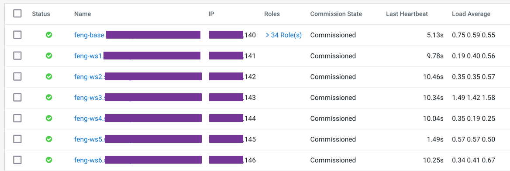

## 3. Add DNS records

|hostname|subdomain|Expected roles|DNS ForwardZone|Reverse Zone PTR|
|Wildcard (hostname = *)|apps.ecs-lb.`subdomain`|The string `apps` is required, `ecs-lb` is up to user|Virtual app domain wildcard , `A Record` wildcard (hostsname = *) , Resolves to fixed IP of ha_proxy|N|
|`apps alias`|apps.ecs-lb.`subdomain`|Virtual app domain Alias|CNAME Alias points to `A Record` of ha_proxy. Alternatively can be an `A Record` with IP of ha_proxy|N/A|
|ha_proxy|`subdomain`|HA Load balancer|Depends on vendor/software||
|ecs-master1|`subdomain`|ECS Server 1 & Docker server|`A Record` resolves to IP of ecs-master1|Y|
|ecs-master2|`subdomain`|ECS Server 2 & Docker server|`A Record` resolves to IP of ecs-master2|Y|
|ecs-master3|`subdomain`|ECS Server 3 & Docker server|`A Record` resolves to IP of ecs-master3|Y|
|ecs-agentN|`subdomain`|ECS Agent N & Docker server N|`A Record` resolves to IP of ecs-agentN|Y|

- ecs-lb.ecs.openstack.com is the name of this new subdomain. Full name should not exceed 29 chars.

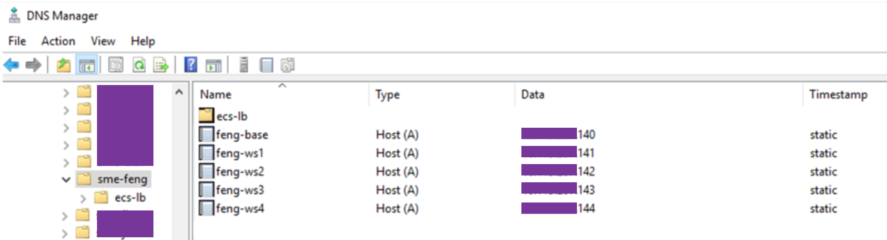

- Create a nested subdomain named apps in esc-lb domain.

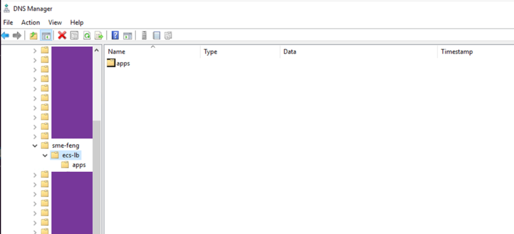

- Define a wildcard `A Record` pointing to the HAProxy host ip address inside `apps` subdomain.
    - Any dns lookups for both apps.ecs-lb.ecs.openstack.com and *.apps.ecs-lb.ecs.openstack.com will resolve to the IP address of HAProxy host.


**_NOTE:_** Properties of the host `A Record` inside apps subdomain, note host = asterisk char (*) and that PTR is NOT checked as we dont want to create a reverse lookup for this a-record.

- Run nslookup to check DNS records.

```bash 
hosts="*.apps.ecs-lb.ecs.openstack.com
ds00.ecs.openstack.com
ds01.ecs.openstack.com
ds02.ecs.openstack.com
ds03.ecs.openstack.com
ds04.ecs.openstack.com
ds05.ecs.openstack.com
ds06.ecs.openstack.com
192.168.8.140
192.168.8.141
192.168.8.142
192.168.8.143
192.168.8.144
192.168.8.145
192.168.8.146"

for target in $hosts; do
    nslookup $target
done
```

## 4. Install HAProxy

- ssh to the HAProxy host and install/config haproxy.

    - Example uses a single instance of HAProxy, configured with round robin balancing and tcp mode (allows for non-terminating https).

```bash 
yum install haproxy -y

cat > /etc/haproxy/haproxy.cfg  << EOF
global
    log         127.0.0.1 local2
    chroot      /var/lib/haproxy
    pidfile     /var/run/haproxy.pid
    user        haproxy
    group       haproxy
    daemon

defaults
    mode                    tcp
    log                     global
    option                  tcplog
    option                  dontlognull
    option                  redispatch
    retries                 3
    maxconn                 5000
    timeout connect         5s
    timeout client          50s
    timeout server          50s

listen stats
    bind *:8081
    mode http
    stats enable
    stats refresh 30s
    stats uri /stats
    monitor-uri /healthz

frontend fe_k8s_80
    bind *:80
    default_backend be_k8s_80

backend be_k8s_80
    balance roundrobin
    mode tcp
    server ds01.ecs.openstack.com 192.168.8.141:80 check
    server ds02.ecs.openstack.com 192.168.8.142:80 check
    server ds03.ecs.openstack.com 192.168.8.143:80 check

frontend fe_k8s_443
    bind *:443
    default_backend be_k8s_443

backend be_k8s_443
    balance roundrobin
    mode tcp
    server ds01.ecs.openstack.com 192.168.8.141:443 check
    server ds02.ecs.openstack.com 192.168.8.142:443 check
    server ds03.ecs.openstack.com 192.168.8.143:443 check

EOF

systemctl enable haproxy
systemctl restart haproxy
systemctl status haproxy
```

- You can view [HAproxy UI](http://192.168.8.147:8081/stats) now.


## 5. Create external databases for ECS Cluster

```bash
sudo -u postgres psql << EOF
CREATE ROLE pvc LOGIN PASSWORD 'changeme';
ALTER USER pvc CREATEDB;
DROP DATABASE IF EXISTS "db-env";
DROP DATABASE IF EXISTS "db-mlx";
DROP DATABASE IF EXISTS "db-dwx";
DROP DATABASE IF EXISTS "db-liftie";
DROP DATABASE IF EXISTS "db-ums";
DROP DATABASE IF EXISTS "db-dex";
DROP DATABASE IF EXISTS "db-resourcepoolmanager";
DROP DATABASE IF EXISTS "db-clusteraccessmanager";
DROP DATABASE IF EXISTS "db-alerts";
DROP DATABASE IF EXISTS "cm-registration";
DROP DATABASE IF EXISTS "cluster-proxy";
DROP DATABASE IF EXISTS "db-das";
DROP DATABASE IF EXISTS "db-hue";
CREATE DATABASE "db-env" OWNER pvc  ENCODING 'UTF8';
CREATE DATABASE "db-mlx" OWNER pvc  ENCODING 'UTF8';
CREATE DATABASE "db-dwx" OWNER pvc  ENCODING 'UTF8';
CREATE DATABASE "db-liftie" OWNER pvc  ENCODING 'UTF8';
CREATE DATABASE "db-ums" OWNER pvc  ENCODING 'UTF8';
CREATE DATABASE "db-dex" OWNER pvc  ENCODING 'UTF8';
CREATE DATABASE "db-resourcepoolmanager" OWNER pvc  ENCODING 'UTF8';
CREATE DATABASE "db-clusteraccessmanager" OWNER pvc  ENCODING 'UTF8';
CREATE DATABASE "db-alerts" OWNER pvc  ENCODING 'UTF8';
CREATE DATABASE "cm-registration" OWNER pvc  ENCODING 'UTF8';
CREATE DATABASE "cluster-proxy" OWNER pvc  ENCODING 'UTF8';
CREATE DATABASE "db-das" OWNER pvc  ENCODING 'UTF8';
CREATE DATABASE "db-hue" OWNER pvc  ENCODING 'UTF8';
EOF
```

## 6. Install ECS HA cluster

- In Cloudera Manager, on the top right corner, click Add > Add Cluster. In the Select Cluster Type page, select the cluster type as Private Cloud Containerized Cluster and click Continue.


- On the Getting Started page of the installation wizard, select Internet Install Method. To use a custom repository link provided to you by Cloudera, click Custom Repository. Click Continue.

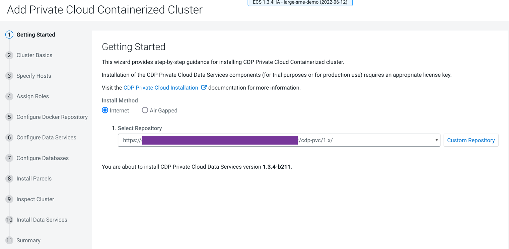

- In the Cluster Basics page, type a name for the Private Cloud cluster that you want to create in the Cluster Name field. From the Base Cluster drop-down list, select the cluster that has the storage and SDX services that you want this new Private Cloud Data Services instance to connect with. Click Continue.


- In the Specify Hosts page, provide a list of available hosts or you can add new hosts. You can provide the Fully Qualified Domain Name (FQDN) in the following patterns:
You can specify multiple addresses and address ranges by separating them by commas, semicolons, tabs, or blank spaces, or by placing them on separate lines. Use this technique to make more specific searches instead of searching overly wide ranges.

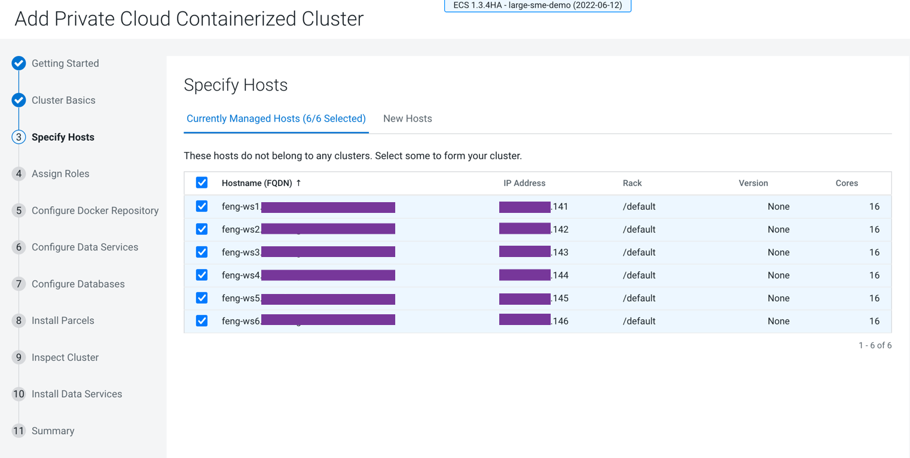

- In the Assign Roles page, you can customize the roles assignment for your new Private Cloud Containerized cluster.
- 6 docker servers - example `ds0[1-6].ecs.openstack.com`

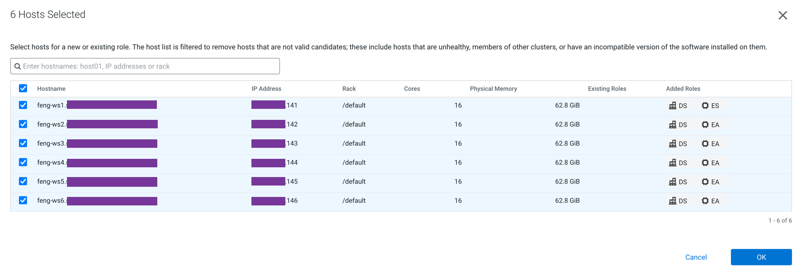

- 3 ECS server - example `ds0[1-3].ecs.openstack.com`

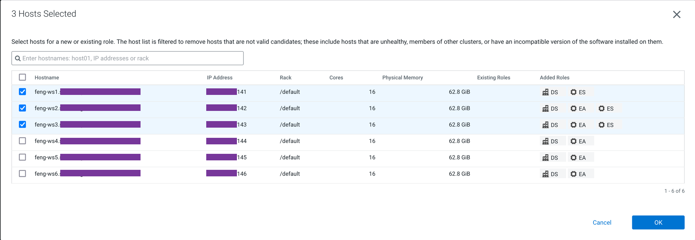

- 3 ECS agents - example `ds0[4-6].ecs.openstack.com`

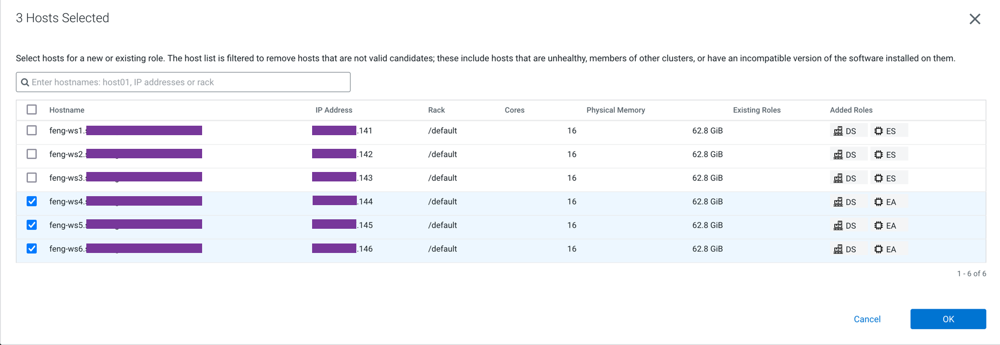

- Click Continue.

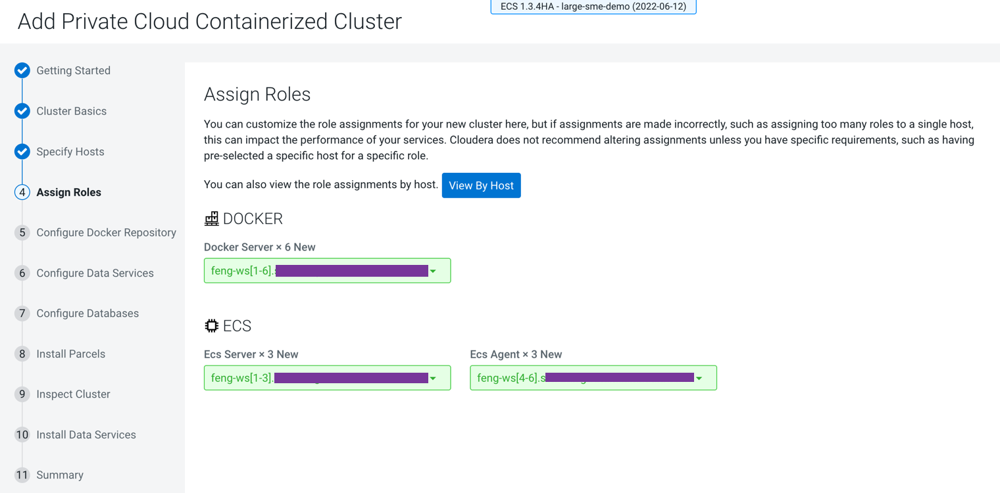

- In the Configure Docker Repository page, you must select one of the Docker repository options. Use an embedded Docker Repository - Copies all images (Internet or AirGapped) to the embedded registry. If you select Use an embedded Docker Repository option, then you can download and deploy the Data Services that you need for your cluster.
    - By selecting Default, all the data services will be downloaded and deployed.
    - By selecting Select the optional images:
        - If you switch off the Machine Learning toggle key, then the Machine Learning runtimes will not be installed.
        - If you switch on the Machine Learning toggle key, then the Machine Learning runtimes will be installed.
    - Click Continue.


- In the Configure Data Services page, set the following parameters, appropriate for your env:
```
Example:
Docker directory: /docker
Data Storage Directory: /mnt2/ecs/longhorn-storage
Local Path Storage Directory: /mnt/ecs/local-storage
Application Domain: ecs-lb.ecs.openstack.com
```
**_NOTE:_** Application Domain maps to the  pre-defined wildcard DNS record which allows the resolution of `*.apps.ecs-lb.ecs.openstack.com` to the IP address of the HAProxy host. MUST be done before you proceed. You can verify from command line using nslookup or dig

- Click Continue.

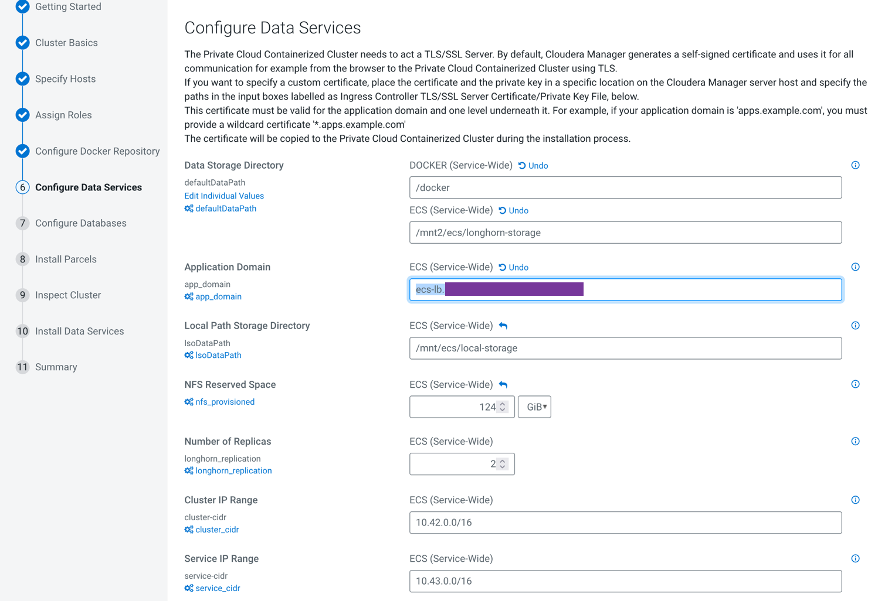

- In the Configure Databases page, follow the instructions in the wizard to use your external existing databases with CDP Private Cloud.
Click Continue.

**_NOTE:_** Ensure that you have selected the Use TLS for Connections Between the Control Plane and the Database option if you have plans to use Cloudera Data Warehouse (CDW). Enabling the Private Cloud Base Cluster PostgreSQL database to use an SSL connection to encrypt client-server communication is a requirement for CDW in CDP Private Cloud.

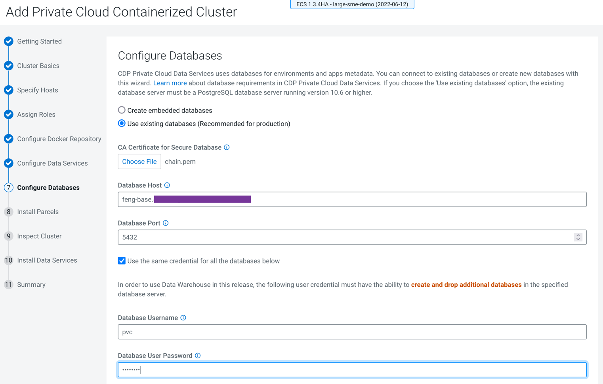


- In the Install Parcels page, the selected parcels are downloaded and installed on the host cluster. Click Continue.


- In the Inspect Cluster page, you can inspect your network performance and hosts. If the inspect tool displays any issues, you can fix those issues and run the inspect tool again. Click Continue.


- In the Install Data Services page, you will see the installation process.


- After the installation is complete, you will see the Summary image. You can Launch CDP Private Cloud.


- After the installation is complete, you can access your Private Cloud Data Services instance from Cloudera Manager > click Open Private Cloud Data Services.


- Confirm that all backends of HAProxy are now status UP, it may take several minutes.

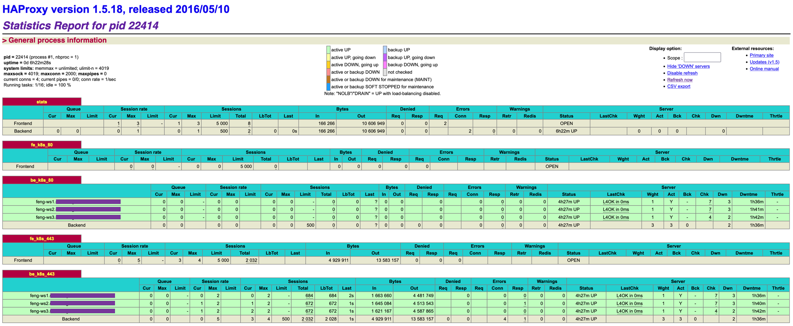

- Confirm that all pods are green in the ECS WebUI >> (All Namespaces) >> Workloads.


## 7. Setup kubectl for command line

- Open SSH terminal for ECS server node and modify `.bash_profile`.
```bash
sudo chmod 644 /etc/rancher/rke2/rke2.yaml
echo "export PATH=/var/lib/rancher/rke2/bin:$PATH
export KUBECONFIG=/etc/rancher/rke2/rke2.yaml" >> ~/.bash_profile
source ~/.bash_profile
```

- Create gen_ext_kubeconfig.sh and generates a kubeconfig file for ECS worker node.
```bash
cat <<EOF > ~/gen_ext_kubeconfig.sh
#!/bin/bash
# usage: gen_ext_kubeconfig.sh
# generates an external_kubeconfig file under current user's home directory. This kubeconfig can be used externally to access the RKE cluster.
sudo sed -e 's/certificate-authority-data/#&/' -e "s/server: .*/server: https:\/\/`hostname`:6443/" -e '/server/a \ \ \ \ insecure-skip-tls-verify: true' /etc/rancher/rke2/rke2.yaml > ~/external_kubeconfig
EOF
chmod 755 ~/gen_ext_kubeconfig.sh
sh ~/gen_ext_kubeconfig.sh
```
- Copy file `external_kubeconfig` to each ECS worker node.

- Open SSH terminal for ECS worker node and modify `.bash_profile`.
```bash
sudo chmod 644 /home/centos/external_kubeconfig
echo "export PATH=/var/lib/rancher/rke2/bin:$PATH
export KUBECONFIG=/home/centos/external_kubeconfig" >> ~/.bash_profile
source ~/.bash_profile
```
- You can run kubectl commands now
```bash
kubectl get node
kubectl get ns
kubectl get pod -n cdp
```

