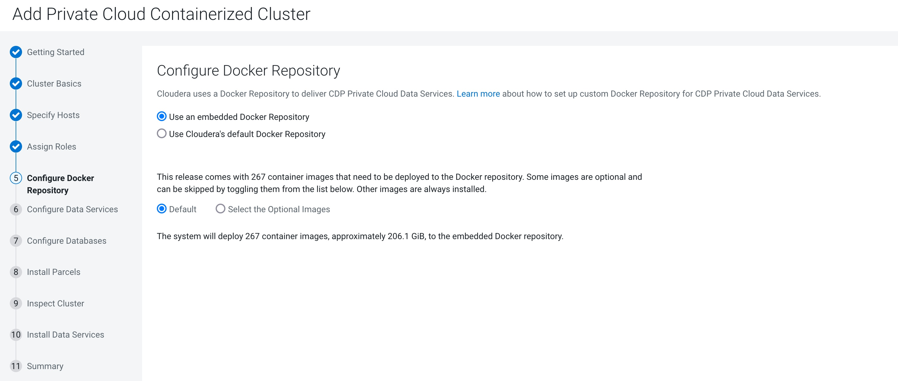

# Installing ECS 1.4.0 cluster after migrating postgreSQL to oracle
{: .no_toc }

- TOC
{:toc}

---

## 1. Introduction to the test environment

|CDP Runtime version |CDP PvC Base 7.1.7 SP1|
|CM version |Cloudera Manager 7.6.5|
|ECS version |CDP PvC DataServices 1.4.0|
|OS version |Centos 7.9|
|K8S version |RKE 1.21|
|Whether to enable Kerberos |Yes|
|Whether to enable TLS |Yes|
|Auto-TLS |Yes|
|Kerberos |FreeIPA|
|LDAP |FreeIPA|
|DB Configuration |PostgreSQL 10.21 -> Oracle 19.3|
|Vault |Embedded|
|Docker registry |Embedded|
|Install Method |Internet|

|IP addresss |hostname |description|
|192.168.6.201  |cb01.ecs.ycloud.com |CDP Base master node 1 , PostgreSQL server|
|192.168.6.202  |cb02.ecs.ycloud.com |CDP Base worker node 1|
|192.168.6.203  |cb03.ecs.ycloud.com |CDP Base worker node 2|
|192.168.6.204  |cb04.ecs.ycloud.com |CDP Base worker node 3|
|192.168.6.205  |orcl.ecs.ycloud.com |Oracle Server         |
|192.168.8.141	|ds01.ecs.openstack.com |ECS master node 1|
|192.168.8.142	|ds02.ecs.openstack.com |ECS worker node 1|
|192.168.8.143	|ds03.ecs.openstack.com |ECS worker node 2|
|192.168.8.144	|ds04.ecs.openstack.com |ECS worker node 3|

## 2. Install CDP Private Cloud Base Cluster

- Base Cluster is deployed by [cldr-playbook](https://github.com/frischHWC/cldr-playbook)

- 4 CDP Base hosts are available which are based on PostgreSQL and FreeIPA.

- 4 ECS hosts are available, added to Cloudera Manager but not yet bound to any cluster. In this case `ds[01-04].ecs.openstack.com`


## 3. Add DNS records

- Add DNS as a service to IPA server

```bash
ipa-dns-install -p password --ip-address=192.168.6.201 --no-forwarders --allow-zone-overlap
systemctl status named-pkcs11
```
- Design DNS Zones on [FreeIPA UI](https://cb01.ecs.ycloud.com/ipa/ui/)

|No.|Zone Name             |Zone Type                  |Record Name          
|1|ecs.ycloud.com.         |subdomain1                 |cb[01-04], orcl |
|2|ecs.openstack.com.      |subdomain2                 |ds[01-04]       |
|3|apps.ecs-lb.ecs.openstack.com. |subdomain3          |*
|4|6.168.192.in-addr.arpa.        |Reverse zone for subdomain1 (192.168.6.0/24)|201-205   |
|5|8.168.192.in-addr.arpa.        |Reverse zone for subdomain2 (192.168.8.0/24)|141-144   |

- Add DNS records on [FreeIPA UI](https://cb01.ecs.ycloud.com/ipa/ui/)

|hostname|subdomain|Expected roles|DNS ForwardZone|Reverse Zone PTR|
|Wildcard (hostname = *)|subdomain3|The string `apps` is required, `ecs-lb` is up to user|Virtual app domain wildcard , `A Record` wildcard (hostsname = *) , Resolves to fixed IP of ECS master node 1|N|
|ECS master node 1|subdomain2|ECS Server 1 & Docker server 1|`A Record` resolves to IP of ECS master node 1|Y|
|ECS worker node 1|subdomain2|ECS Agent 1 & Docker server 2 |`A Record` resolves to IP of ECS worker node 1|Y|
|ECS worker node 2|subdomain2|ECS Agent 2 & Docker server 3 |`A Record` resolves to IP of ECS worker node 2|Y|
|ECS worker node 3|subdomain2|ECS Agent 3 & Docker server 4 |`A Record` resolves to IP of ECS worker node 3|Y|
|CDP Base master node 1|subdomain1|CDP master roles |`A Record` resolves to IP of CDP Base master node 1|Y|
|CDP Base worker node 1|subdomain1|CDP worker roles |`A Record` resolves to IP of CDP Base worker node 1|Y|
|CDP Base worker node 2|subdomain1|CDP worker roles |`A Record` resolves to IP of CDP Base worker node 2|Y|
|CDP Base worker node 3|subdomain1|CDP worker roles |`A Record` resolves to IP of CDP Base worker node 3|Y|
|Oracle Server         |subdomain1|Oracle Server    |`A Record` resolves to IP of Oracle Server         |Y|


## 4. Install and configure Oracle Server

- Download the Oracle Database 19c (19.3) for Linux x86-64 from [Oracle Technology Network](https://www.oracle.com/database/technologies/oracle-database-software-downloads.html).

- Oracle Server is deployed by [Install Oracle 19c database software in silent mode](http://www.br8dba.com/install-oracle-19c-database-software-in-silent-mode/)

- You must enable SSL for the Oracle database before setting up the CDP Private Cloud Data Services. Enabling SSL establishes a secure channel between the client (CDP-side) and the server (Oracle database server).

- TCPS for Hue connection to Oracle DB backend is not supported now. Cloudera recommend setting up 2 different protocols (TCP and TCPS) at the same time. The TCPS protocol uses port `1251`, which is hardcoded by HMS in CDW. TCP with port `2048` is used by other services except HMS.

- Oracle has two ways to connect to the database from the connect descriptor. You can use the SID (it is obsoleted since 8i) or you can use the service name. A good practice is to use service name instead of SID in the connect descriptor. We can add a parameter `USE_SID_AS_SERVICE_LISTENER = on` to the listener so that the listener will use the SID in the connection as Service name and establish a connection to the database. The default value for this parameter is off and it has to be explicitly set to on to use this functionality.
    - With SID: `db_host=host:port:SID` eg: db_host=localhost:1521:ORCL
    - With ServiceName: `db_host=host:port/ServiceName` eg: db_host=llocalhost:1521/ORCL


### 4.1 Change the Default Value for the Maximum Processes Initialization Parameter
   
- To change the value for the maximum processes, issue the following statements. Depending on your database options, the value specified for processes should be set to a minimum value greater than or equal to 250.

```bash     
su - oracle

lsnrctl stop
ps -ef|grep $ORACLE_SID|grep -v ora_ | grep LOCAL=NO |awk '{print $2}'| xargs kill
sqlplus / as sysdba
SQL> show parameter processes;
SQL> select count(*) from v$process;
SQL> select value from v$parameter where name = 'processes';
SQL> select count(*) from v$session;
SQL> select value from v$parameter where name = 'sessions';
SQL> alter system set processes=1000 scope=spfile;
SQL> alter system set sessions=1500 scope=spfile;
SQL> shutdown immediate
SQL> exit

lsnrctl start
sqlplus / as sysdba
SQL> startup
SQL> exit
```

### 4.2 Configure Oracle database to use SSL for Data Warehouse

- Open SSH terminal for Oracle server and switch to user `oracle`. use an Oracle Wallet to securely store and retrieve credentials such as certificates, certificate requests, and private keys.

```bash
su - oracle

orapki wallet create -wallet $ORACLE_HOME/data/wallet -auto_login -pwd password

orapki wallet add -wallet $ORACLE_HOME/data/wallet -dn "CN=$(hostname -f)" -keysize 4096 -self_signed -validity 365

orapki wallet display -wallet $ORACLE_HOME/data/wallet -pwd password

orapki wallet export -wallet $ORACLE_HOME/data/wallet -dn "CN=$(hostname -f)" -pwd password -cert /home/oracle/oracle_server.pem
```

- Update the Server sqlnet.ora

```bash
echo "
NAMES.DIRECTORY_PATH= (TNSNAMES, EZCONNECT)

WALLET_LOCATION =
  (SOURCE =
    (METHOD = FILE)
    (METHOD_DATA =
      (DIRECTORY = $ORACLE_HOME/data/wallet)
    )
  )

SQLNET.AUTHENTICATION_SERVICES = (TCPS,NTS,BEQ)
SSL_CLIENT_AUTHENTICATION = FALSE
SSL_CIPHER_SUITES = (SSL_RSA_WITH_AES_256_CBC_SHA, SSL_RSA_WITH_3DES_EDE_CBC_SHA)
"> $ORACLE_HOME/network/admin/sqlnet.ora
```

- Update the Server listener.ora

```bash
export ORACLE_SERVER=192.168.6.205
echo "
USE_SID_AS_SERVICE_LISTENER_CDP=on
SSL_CLIENT_AUTHENTICATION = FALSE

WALLET_LOCATION =
  (SOURCE =
    (METHOD = FILE)
    (METHOD_DATA =
      (DIRECTORY = $ORACLE_HOME/data/wallet)
    )
  )

LISTENER =
  (DESCRIPTION_LIST =
    (DESCRIPTION =
      (ADDRESS = (PROTOCOL = TCP)(HOST = $ORACLE_SERVER)(PORT = 2484))
      (ADDRESS = (PROTOCOL = IPC)(KEY = EXTPROC1521))
      (ADDRESS = (PROTOCOL = TCPS)(HOST = $ORACLE_SERVER)(PORT = 1521))
    )
  )

SID_LIST_LISTENER=
  (SID_LIST =
    (SID_DESC =
      (GLOBAL_DBNAME = orcl)
      (ORACLE_HOME = $ORACLE_HOME)
      (SID_NAME = orcl)
    )
  )
ADR_BASE_LISTENER = $ORACLE_HOME
" > $ORACLE_HOME/network/admin/listener.ora
```

- Restart the listener by running the following commands

```bash
lsnrctl stop
lsnrctl start
```

- Copy `oracle_server.pem` and wallet files to CM server.

```bash
scp /home/oracle/oracle_server.pem oracle@cb01.ecs.ycloud.com:/home/oracle/
scp $ORACLE_HOME/data/wallet/*.* oracle@cb01.ecs.ycloud.com:/usr/share/oracle/instantclient/wallet
```

### 4.3 Create external databases for CDP Base Cluster

```bash
sqlplus / as sysdba
SQL> 

drop user scm cascade;
drop tablespace scm including contents and datafiles;
CREATE TABLESPACE scm datafile 'scm.dat' size 200M autoextend on maxsize 10G;
create user scm identified by admin default tablespace scm;
grant CREATE SESSION to scm;
grant CREATE TABLE to scm;
grant CREATE SEQUENCE to scm;
grant EXECUTE on sys.dbms_lob to scm;
alter user scm quota UNLIMITED on scm;

drop user rman cascade;
drop tablespace rman including contents and datafiles;
CREATE TABLESPACE rman datafile 'rman.dat' size 200M autoextend on maxsize 10G;
create user rman identified by admin default tablespace rman;
grant CREATE SESSION to rman;
grant CREATE TABLE to rman;
grant CREATE SEQUENCE to rman;
grant EXECUTE on sys.dbms_lob to rman;
alter user rman quota UNLIMITED on rman;

drop user hive cascade;
drop tablespace metastore including contents and datafiles;
CREATE TABLESPACE metastore datafile 'metastore.dat' size 200M autoextend on maxsize 10G;
create user hive identified by admin default tablespace metastore;
grant CREATE SESSION to hive;
grant CREATE TABLE to hive;
grant CREATE SEQUENCE to hive;
grant EXECUTE on sys.dbms_lob to hive;
alter user hive quota UNLIMITED on metastore;

drop user hue cascade;
drop tablespace hue including contents and datafiles;
CREATE TABLESPACE hue datafile 'hue.dat' size 200M autoextend on maxsize 10G;
create user hue identified by admin default tablespace hue;
GRANT SELECT_CATALOG_ROLE TO hue;
GRANT CONNECT, RESOURCE TO hue;
GRANT CREATE SESSION,CREATE PROCEDURE,CREATE TABLE,CREATE VIEW,CREATE SEQUENCE,CREATE PUBLIC SYNONYM,CREATE TRIGGER,UNLIMITED TABLESPACE TO hue;
alter user hue quota UNLIMITED on hue;

drop user rangeradmin cascade;
drop tablespace ranger including contents and datafiles;
CREATE TABLESPACE ranger datafile 'ranger.dat' size 200M autoextend on maxsize 10G;
create user rangeradmin identified by admin default tablespace ranger;
GRANT SELECT_CATALOG_ROLE TO rangeradmin;
GRANT CONNECT, RESOURCE TO rangeradmin;
GRANT CREATE SESSION,CREATE PROCEDURE,CREATE TABLE,CREATE VIEW,CREATE SEQUENCE,CREATE PUBLIC SYNONYM,CREATE TRIGGER,UNLIMITED TABLESPACE TO rangeradmin;
alter user rangeradmin quota UNLIMITED on ranger;
```


## 5. Install and configure Oracle Client

- Download the Oracle Instant Client Version 19.16 for Linux x86-64 (64-bit) from [Oracle Technology Network](https://www.oracle.com/database/technologies/instant-client/linux-x86-64-downloads.html).
    - instantclient-basiclite-linux.x64-19.16.0.0.0dbru.zip 37MB
    - instantclient-sqlplus-linux.x64-19.16.0.0.0dbru.zip 1MB

- Open SSH terminal for CM server and distribute oracle client files.

```bash
groupadd oinstall
useradd -g oinstall -p password -d /home/oracle -s /bin/bash oracle

su - oracle
mkdir -pm 755 /usr/share/oracle/instantclient/lib
unzip instantclient-basiclite-linux.x64-19.16.0.0.0dbru.zip -d /usr/share/oracle/instantclient/
unzip instantclient-sqlplus-linux.x64-19.16.0.0.0dbru.zip -d /usr/share/oracle/instantclient/

# Move lib files from instantclient_<ver> to /usr/share/oracle/instantclient/lib/
mv /usr/share/oracle/instantclient/`ls -l /usr/share/oracle/instantclient/ | grep instantclient_ | awk '{print $9}'`/lib* /usr/share/oracle/instantclient/lib/

# Move rest of the files to /usr/share/oracle/instantclient/
mv /usr/share/oracle/instantclient/`ls -l /usr/share/oracle/instantclient/ | grep instantclient_ | awk '{print $9}'`/* /usr/share/oracle/instantclient/

echo "export ORACLE_HOME=/usr/share/oracle/instantclient
export LD_LIBRARY_PATH=$LD_LIBRARY_PATH:$ORACLE_HOME:$ORACLE_HOME/lib:/usr/lib64
export PATH=$PATH:$ORACLE_HOME/bin
export ORACLE_SID=orcl" >> ~/.bash_profile
source ~/.bash_profile
```

- Update the Client sqlnet.ora and tnsnames.ora

```bash
su - oracle

echo "
WALLET_LOCATION =
  (SOURCE =
    (METHOD = FILE)
    (METHOD_DATA =
      (DIRECTORY = $ORACLE_HOME/wallet)
    )
  )

SQLNET.AUTHENTICATION_SERVICES = (TCPS,NTS)
SSL_CLIENT_AUTHENTICATION = FALSE
SSL_CIPHER_SUITES = (SSL_RSA_WITH_AES_256_CBC_SHA, SSL_RSA_WITH_3DES_EDE_CBC_SHA)
"> $ORACLE_HOME/network/admin/sqlnet.ora

export ORACLE_SERVER=192.168.6.205
echo "
orcl_ssl=
     (DESCRIPTION=
        (ADDRESS=
            (PROTOCOL=TCPS)
            (HOST=$ORACLE_SERVER)
            (PORT=1521)
        )
        (CONNECT_DATA=
            (SERVER=DEDICATED)
            (SERVICE_NAME=orcl)
        )
      )
orcl=
     (DESCRIPTION=
        (ADDRESS=
            (PROTOCOL=TCP)
            (HOST=$ORACLE_SERVER)
            (PORT=2484)
        )
        (CONNECT_DATA=
            (SERVER=DEDICATED)
            (SERVICE_NAME=orcl)
        )
      )
" > $ORACLE_HOME/network/admin/tnsnames.ora
```

- Verify connectivity to oracle database

```bash
sqlplus scm/admin@orcl
SQL> select 1 from dual;
SQL> exit
```

- Import the certificate from the Oracle wallet into trustore file on the Hive metestore instances. 

```bash
pass=`curl -k --insecure -u admin:admin -X GET https://cb01.ecs.ycloud.com:7183/api/v49/certs/truststorePassword`
keytool -list -alias oracle -keystore /var/lib/cloudera-scm-agent/agent-cert/cm-auto-global_truststore.jks -storepass $pass
keytool -delete -alias oracle -keystore /var/lib/cloudera-scm-agent/agent-cert/cm-auto-global_truststore.jks -storepass $pass
keytool -import -v -trustcacerts -alias oracle -file /home/oracle/oracle_server.pem -keystore /var/lib/cloudera-scm-agent/agent-cert/cm-auto-global_truststore.jks -storepass $pass
keytool -list -rfc -keystore /var/lib/cloudera-scm-agent/agent-cert/cm-auto-global_truststore.jks -storepass $pass
```

- repeat the above steps for the following hosts:
    - Hive Metastore instances
    - Hue server instances
    - Ranger admin instances
    - Reports manager instance


## 6. Uninstall the old ECS cluster

- Before performing the uninstallation, ensure that you know the current ecs directory configuration:


```bash
Docker directory: /docker
Data Storage Directory: /mnt2/ecs/longhorn-storage
Local Path Storage Directory: /mnt/ecs/local-storage
```

- Assumes that RK2 and Docker registry are running and not already shut down. The first step is to remove Docker registry

```bash
export nodes="192.168.8.141
192.168.8.142
192.168.8.143
192.168.8.144"

for target in $nodes; do
    echo $target "==========>"
    echo "Stop Embedded Registry and remove";
    ssh -o StrictHostKeyChecking=no -i ~/.ssh/id_rsa centos@$target "
sudo /opt/cloudera/parcels/ECS/docker/docker container stop registry
sudo /opt/cloudera/parcels/ECS/docker/docker container rm -v registry
sudo /opt/cloudera/parcels/ECS/docker/docker image rm registry:2
"
    echo "DONE Remove embedded registry";
done
```

- Stop the ECS cluster in Cloudera Manager  

```bash
export user=admin;
export password=admin;
export host=cb01.ecs.ycloud.com;
export ecs_cluster=ECS2;

curl -k -u $user:$password -X POST https://$host:7183/api/v45/clusters/${ecs_cluster}/commands/stop
```

- Uninstall RKE2

```bash
for target in $nodes; do
    echo $target "==========>"
    echo "Shutdown and Uninstall rke2";
    ssh -o StrictHostKeyChecking=no -i ~/.ssh/id_rsa centos@$target "
sudo /opt/cloudera/parcels/ECS/bin/rke2-killall.sh
sudo /opt/cloudera/parcels/ECS/bin/rke2-uninstall.sh
sudo systemctl stop iscsid
sudo yum -y erase iscsi-initiator-utils
"
    echo "DONE Uninstall rke2";   
done
```


- Clean up the remaining directories

    - If you used the default configuration, issue the following statements:

    ```bash
    export docker_dir=/docker
    export pv_dir=/mnt2/ecs
    export local_dir=/mnt/ecs
    
    for target in $nodes; do
        echo $target "==========>"
        echo "Clean up lib/logs/umount/config directory";
        ssh -o StrictHostKeyChecking=no -i ~/.ssh/id_rsa centos@$target "
    sudo mount| awk '/on \/var\/lib\/(kubelet|k3s)/{print \$3}' | xargs -r sudo umount
    sudo rm -rf /var/lib/longhorn /var/lib/calico /var/lib/docker /var/lib/docker_server /var/log/pods /var/log/containers
    sudo rm -rf /run/containerd /run/docker /run/longhorn-iscsi.lock /etc/docker /etc/iscsi /opt/containerd /opt/cni
    sudo rm -rf ${docker_dir} ${pv_dir} ${local_dir}
    "
        echo "DONE Clean up directory";   
    done
    ```

    - If you had linked `/run/k3s`,`/var/lib/rancher` and `/var/lib/kubelet` to large volume disk `/mnt`, issue the following statements:


    ```bash
    export docker_dir=/docker
    export pv_dir=/mnt2/ecs
    export local_dir=/mnt/ecs
    
    for target in $nodes; do
        echo $target "==========>"
        echo "Clean up lib/logs/umount/config directory";
        ssh -o StrictHostKeyChecking=no -i ~/.ssh/id_rsa centos@$target "
    sudo mount| awk '/on \/mnt\/(kubelet|k3s)/{print \$3}' | xargs -r sudo umount
    sudo rm -rf /var/lib/longhorn /var/lib/calico /var/lib/docker /var/lib/docker_server /var/log/pods /var/log/containers
    sudo rm -rf /run/containerd /run/docker /run/longhorn-iscsi.lock /etc/docker /etc/iscsi /opt/containerd /opt/cni
    sudo rm -rf ${docker_dir} ${pv_dir} ${local_dir}
    sudo rm -rf /run/k3s /var/lib/rancher /var/lib/kubelet /mnt/k3s /mnt/rancher /mnt/kubelet
    sudo mkdir /mnt/k3s /mnt/rancher /mnt/kubelet
    sudo ln -s /mnt/k3s /run/k3s
    sudo ln -s /mnt/rancher /var/lib/rancher
    sudo ln -s /mnt/kubelet /var/lib/kubelet
    "
        echo "DONE Clean up directory";   
    done
    ```

- Delete ECS cluster in Cloudera Manager

```bash
curl -k -u $user:$password -X DELETE https://$host:7183/api/v45/clusters/${ecs_cluster}
```

- Cleanup iptables

```bash
for target in $nodes; do
    echo $target "==========>"
    echo "iptables updating ...";
    ssh -o StrictHostKeyChecking=no -i ~/.ssh/id_rsa centos@$target "
sudo iptables -P INPUT ACCEPT
sudo iptables -P FORWARD ACCEPT
sudo iptables -P OUTPUT ACCEPT
sudo iptables -t nat -F
sudo iptables -t mangle -F
sudo iptables -F
sudo iptables -X
"
    echo "DONE iptables update";   
done
```

## 7. Migrate CM from External PostgreSQL Database Server to Oracle Database Server

- By default, Cloudera Manager API redacts sensitive information when exporting configuration information. You must [disable redaction](https://docs.cloudera.com/cdp-private-cloud-base/7.1.7/configuring-clusters/topics/cm-api-disable-redaction.html)
 at first.

```bash 
grep -A1 CMF_JAVA_OPTS /etc/default/cloudera-scm-server

echo "export CMF_JAVA_OPTS=\"-Dcom.cloudera.api.redaction=false \${CMF_JAVA_OPTS}\"" >> /etc/default/cloudera-scm-server

systemctl restart cloudera-scm-server

curl -k -u admin:admin -X GET https://cb01.ecs.ycloud.com:7183/api/version

curl -k -u admin:admin "https://cb01.ecs.ycloud.com:7183/api/v49/cm/deployment" > cm-deployment.json

grep -A1 KDC_ADMIN cm-deployment.json
```

- Preserve Cloudera Manager's GUID by running the following command to create a /etc/cloudera-scm-server/uuid file. On a host that has an agent, run:

```bash
sudo -u postgres psql -qtAX scm -c "select GUID from CM_VERSION" > /etc/cloudera-scm-server/uuid
```

- Stop the ECS cluster.

- Stop the CDP Base cluster.

- Stop the Cloudera Management Services.

- Stop the Cloudera Manager Server:

```bash
systemctl stop cloudera-scm-server
systemctl status cloudera-scm-server | grep Active
```

- Stop all Cloudera Manager agents and supervisors

```bash
nodes="cb01.ecs.ycloud.com
cb02.ecs.ycloud.com
cb03.ecs.ycloud.com
cb04.ecs.ycloud.com"

for target in $nodes; do
    echo $target "==========>"
    ssh -o StrictHostKeyChecking=no $target "
sudo systemctl stop cloudera-scm-supervisord
sudo systemctl stop cloudera-scm-agent
"
done
```

- Confirm that the agent and supervisor process are stopped

```bash
ps -ef | grep -i cmf-agent
ps -ef | grep -i supervisor
```

- The process directory (/var/run/cloudera-scm-agent/process/) must be cleaned out for all of the hosts that have agents running on them.

```bash
for target in $nodes; do
    echo $target "==========>"
    ssh -o StrictHostKeyChecking=no $target "
sudo mv /var/run/cloudera-scm-agent /var/run/cloudera-scm-agent-BU
"
done
```

- Run scm_prepare_database.sh to reconfigure the Cloudera Manager database.

```bash
/opt/cloudera/cm/schema/scm_prepare_database.sh oracle -h 192.168.6.205:2484 -uadmin -padmin --scm-host cb01.ecs.ycloud.com orcl scm password

[                          main] DbCommandExecutor              INFO  Successfully connected to database.
All done, your SCM database is configured correctly!

# -h Oracle server host with port
# -u Cloudera Manager administrator User
# -p Cloudera Manager administrator User's password
# --scm-host Cloudera Manager server host
# orcl -- oracle service name
# scm -- oracle user for cloudera manager
# password - oracle user's password for cloudera manager
```

- Verify configuration in db.properties

```bash
cat /etc/cloudera-scm-server/db.properties

com.cloudera.cmf.db.type=oracle
com.cloudera.cmf.db.host=192.168.6.205:2484
com.cloudera.cmf.db.name=orcl
com.cloudera.cmf.db.user=scm
com.cloudera.cmf.db.setupType=EXTERNAL
com.cloudera.cmf.db.password=password
```

- Start the Cloudera Manager server:

```bash
systemctl start cloudera-scm-server
tail -f /var/log/cloudera-scm-server/cloudera-scm-server.log
netstat -lnpt | grep 7180
```
Note: At this time, only port 7180 is open.

- Upload a valid Cloudera Manager license.

```bash
curl -k -u admin:admin -X GET http://cb01.ecs.ycloud.com:7180/api/version
curl -k -u admin:admin -X POST -H 'Content-Type:multipart/form-data' -F license=@/root/license.txt  "http://cb01.ecs.ycloud.com:7180/api/v49/cm/license"
```

- Restore the Cloudera Manager configuration:

```bash
curl -k -u admin:admin -H "Content-Type: application/json" --upload-file /root/cm-deployment.json "http://cb01.ecs.ycloud.com:7180/api/v49/cm/deployment?deleteCurrentDeployment=true"

systemctl restart cloudera-scm-server
netstat -lnpt | grep 7183
```
Note: port 7183 is open now.

- Start all Cloudera Manager agents

```bash
for target in $nodes; do
    echo $target "==========>"
    ssh -o StrictHostKeyChecking=no $target "
sudo systemctl restart cloudera-scm-agent
"
done
```

- Start Cloudera Management Service > Host Monitor and Services Monitor. Verify that all the services in the Cloudera Management Service started and are Healthy.

Note: Don't start reports manager at this time.


## 8. Migrate other databases from External PostgreSQL Database Server to Oracle Database Server

### 8.1 migrate hive metastore 

- ESF Database Migration Toolkit is a powerful and high performance toolkit that can migrate data from PostgreSQL to Oracle. Please follow the [migrating steps](https://www.dbsofts.com/articles/postgresql_to_oracle/) for hive metastore.

- Go to Clusters > Hive service > Configuration > SCOPE Hive(Service-Wide) & Database and verify the current setting:

```bash
Hive Database Type: PostgreSQL
Hive Database Hostname: cb01.ecs.ycloud.com
Hive Database Port: 5432
Hive Database Username: metastore
Hive Database Password: changeme
Hive Database Name: hive
```

- Update all the above settings: 

```bash
Hive Database Type: Oracle
Hive Database Hostname: orcl.ecs.ycloud.com
Hive Database Port: 1521
Hive Database Username: hive
Hive Database Password: admin
Hive Database Name: orcl
```
Note: Hive Database Name: orcl will be overrided by safety valve `javax.jdo.option.ConnectionURL`.

- Go to Clusters > Hive service > Configuration > Filter by SCOPE HIVE(Service-Wide) & CATEGORY Database, verify the current setting:

```bash
Name: javax.jdo.option.ConnectionURL
Value: jdbc:oracle:thin:@tcps://192.168.6.205:1521/orcl?javax.net.ssl.trustStore=/var/lib/cloudera-scm-agent/agent-cert/cm-auto-global_truststore.jks&javax.net.ssl.trustStorePassword=M2Wu9PAu6cCeMMiCCK6cyhooNuZCQbYhbtfacbp0k5c&oracle.net.ssl_server_dn_match=false
```

- Restart the Hive service.


### 8.2 migrate reports manager

- ESF Database Migration Toolkit is a powerful and high performance toolkit that can migrate data from PostgreSQL to Oracle. Please follow the [migrating steps](https://www.dbsofts.com/articles/postgresql_to_oracle/) for reports manager.

- Go to Cloudera Management Service > Configuration > Filter by SCOPE Reports Manager & CATEGORY Database, verify the current setting:

```bash
Rman Database Type: PostgreSQL
Rman Database Hostname: cb01.ecs.ycloud.com:5432
Rman Database Username: rman
Rman Database Password: changeme
Rman Database Name: rman
```

- Update all the above settings: 

```bash
Rman Database Type: Oracle
Rman Database Hostname: orcl.ecs.ycloud.com:2484
Rman Database Username: rman
Rman Database Password: admin
Rman Database Name: orcl
```
- Restart the Reports Manager.

### 8.3 migrate ranger admin

- ESF Database Migration Toolkit is a powerful and high performance toolkit that can migrate data from PostgreSQL to Oracle. Please follow the [migrating steps](https://www.dbsofts.com/articles/postgresql_to_oracle/) for ranger admin.

- Go to Clusters > Ranger service > Configuration > Filter by SCOPE Ranger(Service-Wide) & CATEGORY Database, verify the current setting:

```bash
Ranger Database Type: PostgreSQL
Ranger Database Hostname: cb01.ecs.ycloud.com
Ranger Database Port: 5432
Ranger Database Username: ranger
Ranger Database Password: changeme
Ranger Database Name: rangeradmin
```

- Update all the above settings: 

```bash
Ranger Database Type: Oracle
Ranger Database Hostname: orcl.ecs.ycloud.com [empty is ok]
Ranger Database Port: 2484
Ranger Database Username: rangeradmin
Ranger Database Password: admin
Ranger Database Name: orcl [empty is ok]
```
Note: Ranger Database Name: orcl will be overrided by safety valve `ranger.jpa.jdbc.url`.

- Go to Clusters > Ranger service > Configuration > Ranger Admin Advanced Configuration Snippet (Safety Valve) for conf/ranger-admin-site.xml, add the following:

```bash
Name: ranger.jpa.jdbc.url  
Vaule: jdbc:oracle:thin:@//orcl.ecs.ycloud.com:2484/orcl
```

- Restart the Ranger service.


### 8.4 migrate hue server

- Hue has the function of migration natively. Please see [official doc](https://docs.cloudera.com/documentation/enterprise/6/6.3/topics/hue_dbs_oracle_pcl.html#concept_qq3_yjc_4z).

- Stop Hue Service. In Cloudera Manager, navigate to Cluster > Hue. Select Actions > Stop.

- Go to Clusters > Hue service > Configuration > Filter by SCOPE Hue(Service-Wide) & CATEGORY Database, verify the current setting:

```bash
Hue Database Type: PostgreSQL
Hue Database Hostname: cb01.ecs.ycloud.com
Hue Database Port: 5432
Hue Database Username: hue
Hue Database Password: changeme
Hue Database Name: hue
```

- Dump Postgres Database. Select Actions > Dump Database. Click Dump Database. The file is written to /tmp/hue_database_dump.json on the host of the Hue server.

- Log on to the host of the Hue server in a command-line terminal. Edit /tmp/hue_database_dump.json by removing the first three rows to make sure it's a compliant json format.

- Update database properties: 

```bash
Hue Database Type: Oracle
Hue Database Hostname: orcl.ecs.ycloud.com
Hue Database Port: 2484
Hue Database Username: hue
Hue Database Password: admin
Hue Database Name: orcl.ecs.ycloud.com:2484/orcl
```

- Synchronize New Database. Select Actions > Synchronize Database, Click Synchronize Database.

- Load Data from Old Database. Select Actions > Load Database, Click Load Database.

- Go to Clusters > Hue service > Configuration > Hue Service Advanced Configuration Snippet (Safety Valve) for hue_safety_valve.ini, add the following:

```bash
[desktop]
[[database]]
port=0
```

- Restart the Hue service.


## 9. Install a new ECS cluster

Note: ECS 1.4.0 does not support external oracle database and you have to use embedded database.

- In Cloudera Manager, on the top right corner, click Add > Add Cluster. In the Select Cluster Type page, select the cluster type as Private Cloud Containerized Cluster and click Continue.


- On the Getting Started page of the installation wizard, select Internet Install Method. To use a custom repository link provided to you by Cloudera, click Custom Repository. Click Continue.


- In the Cluster Basics page, type a name for the Private Cloud cluster that you want to create in the Cluster Name field. From the Base Cluster drop-down list, select the cluster that has the storage and SDX services that you want this new Private Cloud Data Services instance to connect with. Click Continue.


- In the Specify Hosts page, provide a list of available hosts or you can add new hosts. You can provide the Fully Qualified Domain Name (FQDN) in the following patterns:
You can specify multiple addresses and address ranges by separating them by commas, semicolons, tabs, or blank spaces, or by placing them on separate lines. Use this technique to make more specific searches instead of searching overly wide ranges.


- In the Assign Roles page, you can customize the roles assignment for your new Private Cloud Containerized cluster.
- 1 docker servers - example `ds04.ecs.openstack.com`


- 1 ECS server - example `ds01.ecs.openstack.com`


- 3 ECS agents - example `ds0[2-4].ecs.openstack.com`


- Click Continue.


- In the Configure Docker Repository page, you must select one of the Docker repository options. Use an embedded Docker Repository - Copies all images (Internet or AirGapped) to the embedded registry. If you select Use an embedded Docker Repository option, then you can download and deploy the Data Services that you need for your cluster.
    - By selecting Default, all the data services will be downloaded and deployed.
    - By selecting Select the optional images:
        - If you switch off the Machine Learning toggle key, then the Machine Learning runtimes will not be installed.
        - If you switch on the Machine Learning toggle key, then the Machine Learning runtimes will be installed.
    - Click Continue.



- In the Configure Data Services page, set the following parameters, appropriate for your env:
```
Example:
Docker directory: /mnt/docker
Data Storage Directory: /mnt2/ecs/longhorn-storage
Local Path Storage Directory: /mnt/ecs/local-storage
Application Domain: ecs-lb.ecs.openstack.com
```
**_NOTE:_** Application Domain maps to the  pre-defined wildcard DNS record which allows the resolution of `*.apps.ecs-lb.ecs.openstack.com` to the IP address of the HAProxy host. MUST be done before you proceed. You can verify from command line using nslookup or dig

- Click Continue.


- In the Configure Databases page, follow the instructions in the wizard to choose create embedded databases.
Click Continue.


- In the Install Parcels page, the selected parcels are downloaded and installed on the host cluster. Click Continue.


- In the Inspect Cluster page, you can inspect your network performance and hosts. If the inspect tool displays any issues, you can fix those issues and run the inspect tool again. Click Continue.


- In the Install Data Services page, you will see the installation process.


- After the installation is complete, you will see the Summary image. You can Launch CDP Private Cloud.


- Confirm that all pods are green in the ECS >> Web UI >> ECS WebUI >> (All Namespaces) >> Workloads.


- After the installation is complete, you can access your Private Cloud Data Services instance from Cloudera Manager > click Open Private Cloud Data Services.


