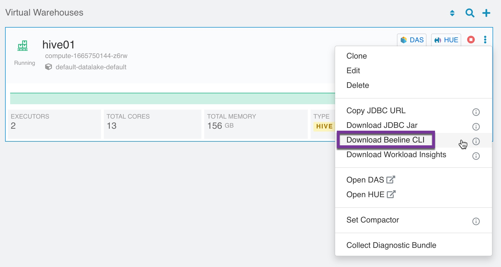
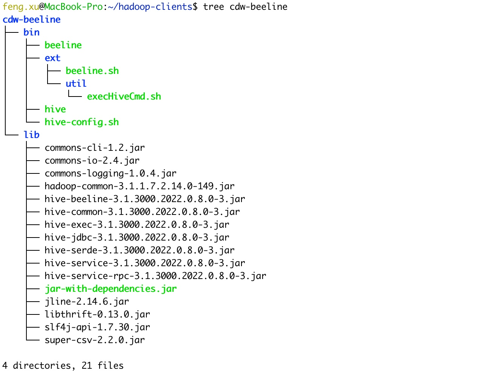
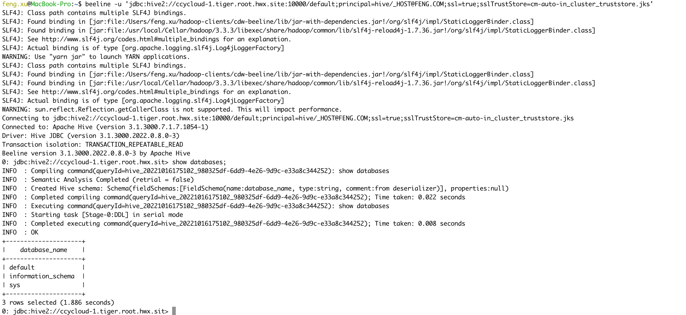
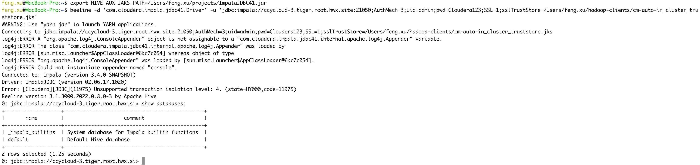
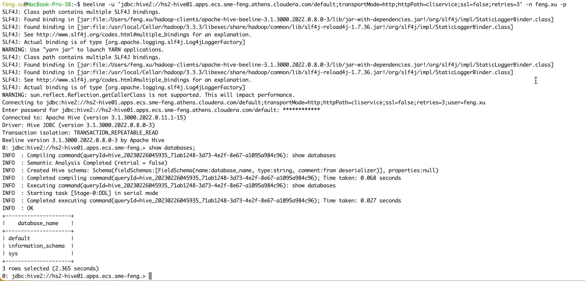
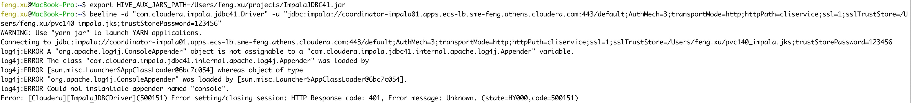
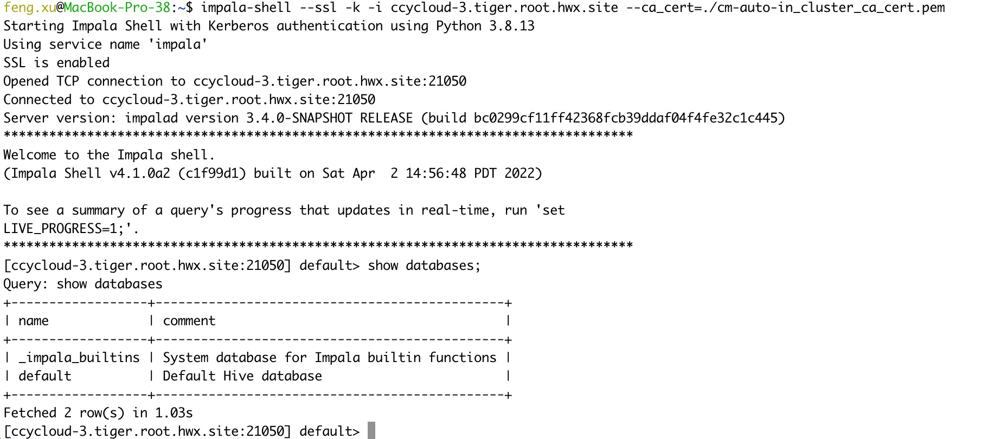
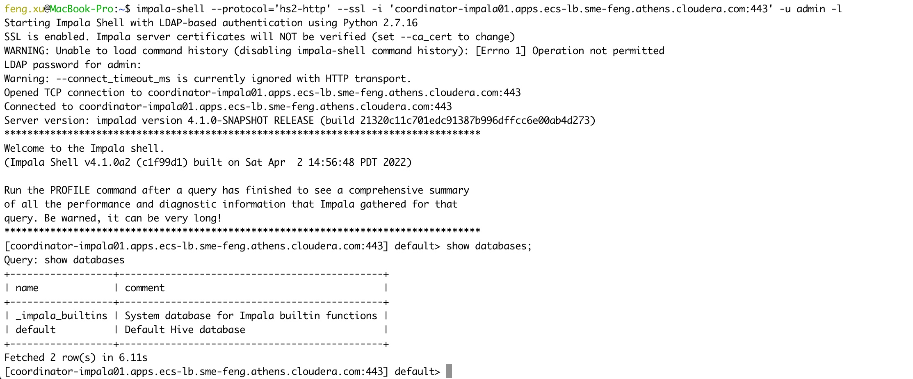
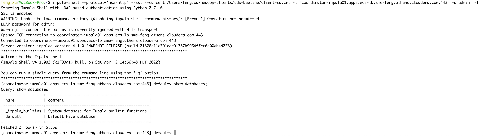

# Setting up Hadoop Client on MacOS
{: .no_toc }

- TOC
{:toc}

---

This topic would allow you to connect to hive using beeline, connect to impala using impala-shell from your MAC computer.

## 1. Standalone Beeline

- In order to connect to Hive VW via beeline shell, the first step is to download Beeline CLI software. Click on the 3 dots beside the HUE button, and click on the ["Download Beeline CLI"](https://cdw-ui.s3.amazonaws.com/hive3/beeline-standalone/apache-hive-beeline-3.1.3000.tar.gz).



- Extract the tar.gz file, and you will see two folders, bin & lib
```bash
mkdir -p ~/hadoop-clients
tar xvzf apache-hive-beeline-3.1.3000.tar.gz -C ~/hadoop-clients
cd ~/hadoop-clients
mv apache-hive-beeline-3.1.3000.2022.0.8.0-3 cdw-beeline
```


- Beeline requires Java to be available, so install JDK as well.
```console
$ java -version
java version "1.8.0_341"
Java(TM) SE Runtime Environment (build 1.8.0_341-b10)
Java HotSpot(TM) 64-Bit Server VM (build 25.341-b10, mixed mode)
```

- Beelne requires config files from CDP Base cluster(/etc/hive/conf.cloudera.hive_on_tez)
```bash
# gen tarball on CDP Base node
tar cvf hiveconf.tar /etc/hive/conf.cloudera.hive_on_tez
```

```bash
# extrace tarball on MAC laptop
tar xvf hiveconf.tar -C ~/hadoop-clients/cdw-beeline
```

- Modify `.bash_profile`
```bash
echo "export PATH=/Users/feng.xu/hadoop-clients/cdw-beeline/bin:$PATH
export HADOOP_CONF_DIR=/Users/feng.xu/hadoop-clients/cdw-beeline/etc/hive/conf.cloudera.hive_on_tez
export JAVA_HOME=/Library/Internet\ Plug-Ins/JavaAppletPlugin.plugin/Contents/Home" >> ~/.bash_profile
source ~/.bash_profile
```

- Connect to Hive in CDP Base cluster using Kerberos authentication.

```bash
beeline -u 'jdbc:hive2://ccycloud-1.tiger.root.hwx.site:10000/default;principal=hive/_HOST@FENG.COM;ssl=true;sslTrustStore=cm-auto-in_cluster_truststore.jks'
```
NOTE: Please copy certificate from /var/lib/cloudera-scm-agent/agent-cert/cm-auto-in_cluster_ca_cert.jks on CDP cluster.



- Connect to Impala in CDP Base cluster using LDAP authentication.

```bash
export HIVE_AUX_JARS_PATH=/Users/feng.xu/projects/ImpalaJDBC41.jar
beeline -d 'com.cloudera.impala.jdbc41.Driver' -u 'jdbc:impala://ccycloud-3.tiger.root.hwx.site:21050;AuthMech=3;uid=admin;pwd=xxx;SSL=1;sslTrustStore=/Users/feng.xu/hadoop-clients/cm-auto-in_cluster_truststore.jks'
```



- Connect to Hive VW in PvC CDW using LDAP authentication.

```bash
beeline -u 'jdbc:hive2://hs2-hive01.apps.ecs-lb.sme-feng.athens.cloudera.com/default;transportMode=http;httpPath=cliservice;ssl=false;retries=3' -n admin -p
```



- Connect to Impala VW in PvC CDW using LDAP authentication.

```bash
export host=coordinator-impala01.apps.ecs-lb.sme-feng.athens.cloudera.com
export file=pvc140_impala
rm -f $file.jks $file.pem
openssl s_client -showcerts -connect $host:443 -servername $host </dev/null 2>/dev/null|openssl x509 -outform PEM > $file.pem
keytool -import -alias $host -file $file.pem -keystore $file.jks
export HIVE_AUX_JARS_PATH=/Users/feng.xu/projects/ImpalaJDBC41.jar
beeline -d "com.cloudera.impala.jdbc41.Driver" -u "jdbc:impala://coordinator-impala01.apps.ecs-lb.sme-feng.athens.cloudera.com:443/default;AuthMech=3;transportMode=http;httpPath=cliservice;ssl=1;sslTrustStore=/Users/feng.xu/pvc140_impala.jks;trustStorePassword=123456"
```



It returned error messages "Error setting/closing session: HTTP Response code: 401". This shows that beeline does not support direct access to impala VW.


## 2. Standalone Impala-shell

- Impala shell can be invoked on a remote client machine by installing the impala-shell package. It is a python package that can be installed using pip.

```console
$ python --version
Python 2.7.16

$ sudo easy_install pip
Password:
Searching for pip
Best match: pip 20.2.4
Adding pip 20.2.4 to easy-install.pth file
Installing pip script to /usr/local/bin
Installing pip3.8 script to /usr/local/bin
Installing pip3 script to /usr/local/bin

Using /Library/Python/2.7/site-packages
Processing dependencies for pip
Finished processing dependencies for pip

$ pip --version
pip 20.2.4 from /Library/Python/2.7/site-packages/pip (python 2.7)

$ sudo pip install impala-shell==4.1.0a2
DEPRECATION: Python 2.7 reached the end of its life on January 1st, 2020. Please upgrade your Python as Python 2.7 is no longer maintained. pip 21.0 will drop support for Python 2.7 in January 2021. More details about Python 2 support in pip can be found at https://pip.pypa.io/en/latest/development/release-process/#python-2-support pip 21.0 will remove support for this functionality.
WARNING: The directory '/Users/feng.xu/Library/Caches/pip' or its parent directory is not owned or is not writable by the current user. The cache has been disabled. Check the permissions and owner of that directory. If executing pip with sudo, you may want sudo's -H flag.
Collecting impala-shell==4.1.0a2
  Downloading impala_shell-4.1.0a2.tar.gz (484 kB)
     || 484 kB 332 kB/s
Requirement already satisfied: bitarray==2.3.0 in /Library/Python/2.7/site-packages (from impala-shell==4.1.0a2) (2.3.0)
Requirement already satisfied: configparser==4.0.2 in /Library/Python/2.7/site-packages (from impala-shell==4.1.0a2) (4.0.2)
Requirement already satisfied: prettytable==0.7.2 in /Library/Python/2.7/site-packages (from impala-shell==4.1.0a2) (0.7.2)
Requirement already satisfied: sasl==0.2.1 in /Library/Python/2.7/site-packages (from impala-shell==4.1.0a2) (0.2.1)
Requirement already satisfied: setuptools>=36.8.0 in /System/Library/Frameworks/Python.framework/Versions/2.7/Extras/lib/python (from impala-shell==4.1.0a2) (41.0.1)
Requirement already satisfied: six==1.14.0 in ./Library/Python/2.7/lib/python/site-packages (from impala-shell==4.1.0a2) (1.14.0)
Requirement already satisfied: sqlparse==0.3.1 in /Library/Python/2.7/site-packages (from impala-shell==4.1.0a2) (0.3.1)
Requirement already satisfied: thrift==0.11.0 in /Library/Python/2.7/site-packages (from impala-shell==4.1.0a2) (0.11.0)
Requirement already satisfied: thrift_sasl==0.4.3 in /Library/Python/2.7/site-packages (from impala-shell==4.1.0a2) (0.4.3)
Requirement already satisfied: pure-sasl>=0.6.2 in /Library/Python/2.7/site-packages (from thrift_sasl==0.4.3->impala-shell==4.1.0a2) (0.6.2)
Building wheels for collected packages: impala-shell
  Building wheel for impala-shell (setup.py) ... done
  Created wheel for impala-shell: filename=impala_shell-4.1.0a2-py2-none-any.whl size=569227 sha256=bef61f089f2a75f2de109cdf5f16abb32193f6caa254764294ccbfe54b4a6c1c
  Stored in directory: /private/tmp/pip-ephem-wheel-cache-wUUJgI/wheels/8a/1d/4f/666a32afae31ab6439f4a1f2ca8c9132cb96a08530356e3491
Successfully built impala-shell
Installing collected packages: impala-shell
Successfully installed impala-shell-4.1.0a2
```

- The following are the artifacts added by impala-shell installation.
```console
    /Library/Python/2.7/site-packages/impala_shell-4.1.0a2.dist-info/*
    /Library/Python/2.7/site-packages/impala_shell/*
    /usr/local/bin/impala-shell
```

- Connect to Impala in CDP Base cluster using kerberos authentication.

```bash
impala-shell --ssl -k -i ccycloud-3.tiger.root.hwx.site --ca_cert=/Users/feng.xu/hadoop-clients/cm-auto-in_cluster_ca_cert.pem
```

NOTE: Please copy certificate from /var/lib/cloudera-scm-agent/agent-cert/cm-auto-in_cluster_ca_cert.pem on CDP cluster.



- Connect to Impala VW in PvC CDW using LDAP authentication.

```bash
impala-shell --protocol='hs2-http' --ssl -i 'coordinator-impala01.apps.ecs-lb.sme-feng.athens.cloudera.com:443' -u admin -l
```



```bash
impala-shell --protocol='hs2-http' --ssl --ca_cert /Users/feng.xu/hadoop-clients/cdw-beeline/client-ca.crt -i "coordinator-impala01.apps.ecs-lb.sme-feng.athens.cloudera.com:443" -u admin  -l
```



NOTE: Please copy certificate from /var/lib/rancher/rke2/server/tls/client-ca.crt on ECS cluster.

