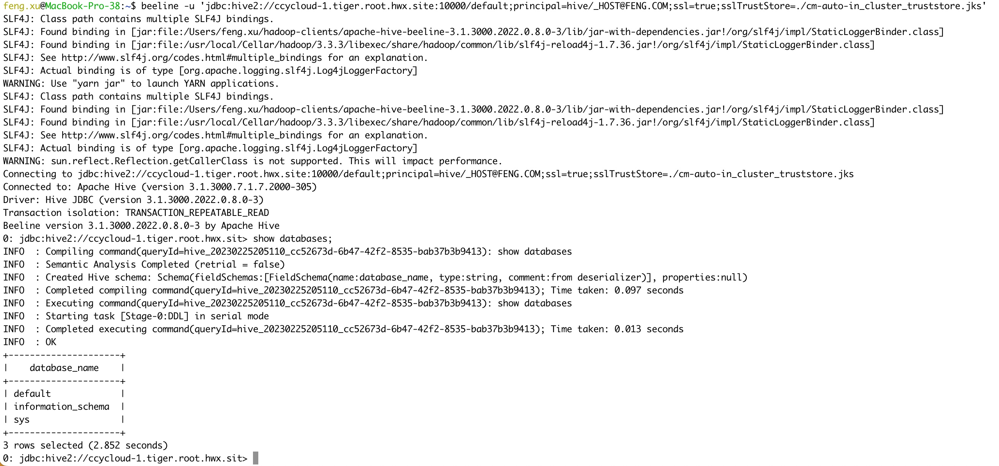
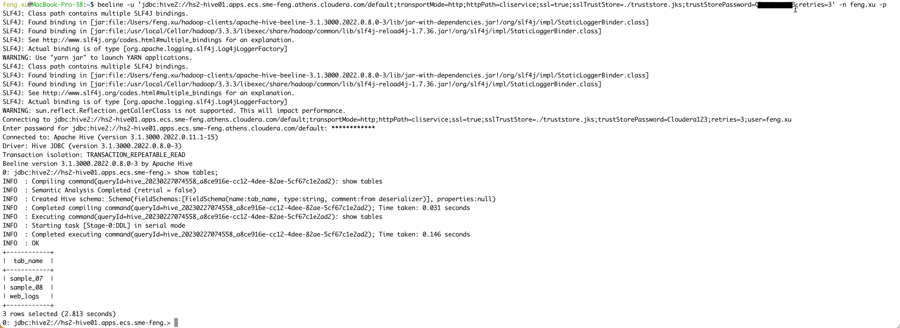
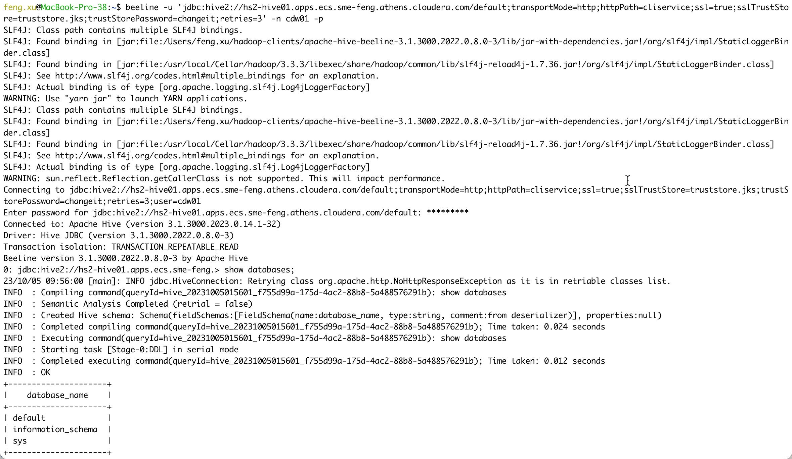
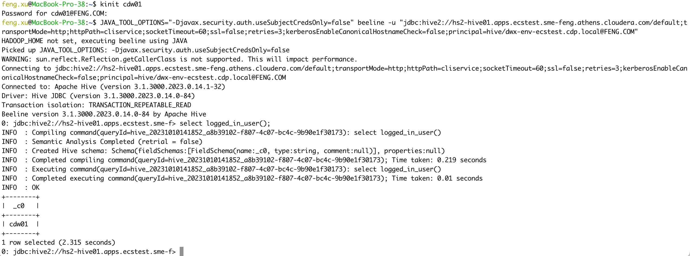
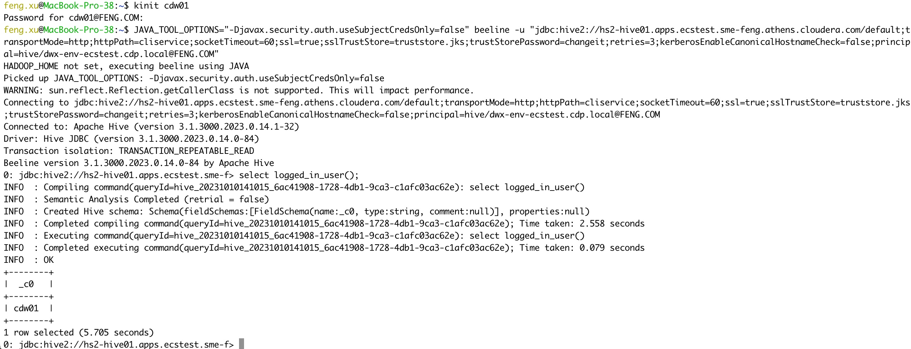
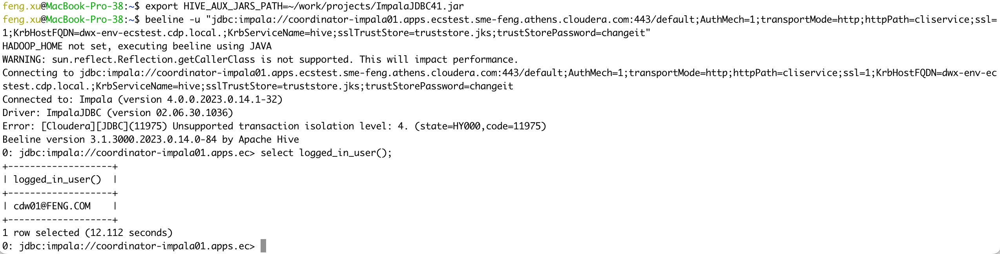
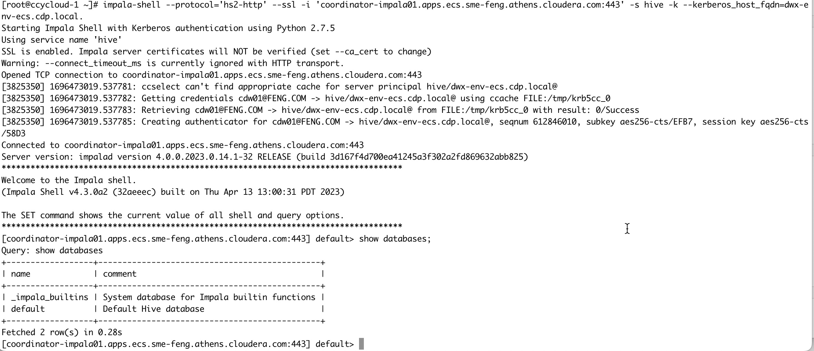

# Setting up Hadoop Client on MacOS
{: .no_toc }

- TOC
{:toc}

---

This topic would allow you to connect to hive using beeline, connect to impala using impala-shell on MacOS.

|MAC OS|13.1 (22C65)|
|Processor|Intel Core i7|
|Java|11.0.18|
|Python|3.8.12|
|Hadoop|3.1.1|
|Beeline|3.1.3000|
|Impala-shell|4.3.0a2|
|Data Service|1.5.1|


## 1. Install OpenJDK 11

```bash
brew install openjdk@11
```

## 2. Install Python 3.8.12

```bash
pyenv install --list
rm -rf $(pyenv root)
brew uninstall pyenv
brew install pyenv
pyenv install 3.8.12
pyenv global 3.8.12
pyenv version
```

## 3. Install Beeline 3.1.3

- Note: To use Kerberos auth in PvC DS you must use the latest beeline CLI(3.1.3000.2023.0.14.0-84) downloaded from the PVC DS DW UI.

- In order to connect to Hive VW via beeline shell, the first step is to download Beeline CLI software. "Guides and More" is on the Cloudera Data Warehouse Overview. Navigate to "Guides and More" and click on the "see more" button, you can see ["Downloads - Beeline CLI"](https://cdw-ui.s3.amazonaws.com/hive3/beeline-standalone/apache-hive-beeline-3.1.3000.tar.gz).


- Extract the tar.gz file, and you will see two folders, bin & lib
```bash
mkdir -p $HOME/hadoop-clients
tar xvzf apache-hive-beeline-3.1.3000.tar.gz -C $HOME/hadoop-clients
cd $HOME/hadoop-clients
ln -s apache-hive-beeline-3.1.3000.2023.0.14.0-84 beeline
```


## 4. Install Impala-shell 4.2

- Impala shell can be invoked on a remote client machine by installing the impala-shell package. It is a python package that can be installed using pip.
    - Note: Kerberos authentication requires impala-shell version 4.2.0 or later (https://pypi.org/project/impala-shell/4.2.0/). 

```console
$ python -V
Python 3.8.13

$ pip --version
pip 22.0.4 from /Users/feng.xu/.pyenv/versions/3.8.13/lib/python3.8/site-packages/pip (python 3.8)

$ sudo pip install impala-shell==4.2.0

```bash
Collecting impala-shell==4.2.0
  Downloading impala_shell-4.2.0.tar.gz (464 kB)
      464.1/464.1 KB 465.4 kB/s eta 0:00:00
  Preparing metadata (setup.py) ... done
Collecting bitarray==2.3.0
  Downloading bitarray-2.3.0.tar.gz (87 kB)
      87.1/87.1 KB 2.1 MB/s eta 0:00:00
  Preparing metadata (setup.py) ... done
Collecting configparser==4.0.2
  Downloading configparser-4.0.2-py2.py3-none-any.whl (22 kB)
Collecting kerberos==1.3.1
  Downloading kerberos-1.3.1-cp38-cp38-macosx_10_15_x86_64.whl (33 kB)
Collecting prettytable==0.7.2
  Downloading prettytable-0.7.2.zip (28 kB)
  Preparing metadata (setup.py) ... done
Collecting sasl==0.3.1
  Downloading sasl-0.3.1.tar.gz (44 kB)
      44.7/44.7 KB 96.5 MB/s eta 0:00:00
  Preparing metadata (setup.py) ... done
Requirement already satisfied: setuptools>=36.8.0 in ./.pyenv/versions/3.8.13/lib/python3.8/site-packages (from impala-shell==4.2.0) (56.0.0)
Collecting six==1.14.0
  Downloading six-1.14.0-py2.py3-none-any.whl (10 kB)
Collecting sqlparse==0.3.1
  Downloading sqlparse-0.3.1-py2.py3-none-any.whl (40 kB)
      40.8/40.8 KB 17.3 MB/s eta 0:00:00
Collecting thrift==0.14.2
  Downloading thrift-0.14.2.tar.gz (59 kB)
      59.4/59.4 KB 17.2 MB/s eta 0:00:00
  Preparing metadata (setup.py) ... done
Collecting thrift_sasl==0.4.3
  Downloading thrift_sasl-0.4.3-py2.py3-none-any.whl (8.3 kB)
Collecting pure-sasl>=0.6.2
  Downloading pure-sasl-0.6.2.tar.gz (11 kB)
  Preparing metadata (setup.py) ... done
Using legacy 'setup.py install' for impala-shell, since package 'wheel' is not installed.
Using legacy 'setup.py install' for bitarray, since package 'wheel' is not installed.
Using legacy 'setup.py install' for prettytable, since package 'wheel' is not installed.
Using legacy 'setup.py install' for sasl, since package 'wheel' is not installed.
Using legacy 'setup.py install' for thrift, since package 'wheel' is not installed.
Using legacy 'setup.py install' for pure-sasl, since package 'wheel' is not installed.
Installing collected packages: pure-sasl, prettytable, kerberos, bitarray, sqlparse, six, configparser, thrift, sasl, thrift_sasl, impala-shell
  Running setup.py install for pure-sasl ... done
  Running setup.py install for prettytable ... done
  Running setup.py install for bitarray ... done
  Running setup.py install for thrift ... done
  Running setup.py install for sasl ... done
  Running setup.py install for impala-shell ... done
Successfully installed bitarray-2.3.0 configparser-4.0.2 impala-shell-4.2.0 kerberos-1.3.1 prettytable-0.7.2 pure-sasl-0.6.2 sasl-0.3.1 six-1.14.0 sqlparse-0.3.1 thrift-0.14.2 thrift_sasl-0.4.3
```

- The following are the artifacts added by impala-shell installation.
```console
    $HOME/.pyenv/versions/3.8.13/bin/impala-shell
    $HOME/.pyenv/versions/3.8.13/lib/python3.8/site-packages/impala_shell-4.2.0-py3.8.egg-info
    $HOME/.pyenv/versions/3.8.13/lib/python3.8/site-packages/impala_shell/*
```


## 5. Download config files from CDP Base cluster

- Please download config files from CDP Base cluster(/etc/hive/conf.cloudera.hive_on_tez, /etc/spark3/conf.cloudera.spark3_on_yarn)

```bash
# gen tarball on CDP Base node
cd /etc/hive
tar cvf ~/hiveconf.tar conf.cloudera.hive_on_tez

cd /etc/spark3/
tar cvf ~/spark3conf.tar conf.cloudera.spark3_on_yarn
```

```bash
# extrace tarball on MAC laptop
tar xvf hiveconf.tar -C $HOME/hadoop-clients
tar xvf spark3conf.tar -C $HOME/hadoop-clients
```

## 6. Update bash_profile

- Modify `$HOME/.bash_profile`

```bash

vi $HOME/.bash_profile
export GREP_OPTIONS='--color=auto'
export TERM="xterm-color"
PS1='\[\e[0;33m\]\u\[\e[0m\]@\[\e[0;32m\]\h\[\e[0m\]:\[\e[0;34m\]\w\[\e[0m\]\$ '
export JAVA_HOME=/usr/local/Cellar/openjdk@11/11.0.18/libexec/openjdk.jdk/Contents/Home/
export SPARK_HOME=$HOME/hadoop-clients/spark
export BEELINE_HOME=$HOME/hadoop-clients/beeline
export PYENV_ROOT="$HOME/.pyenv"
export HADOOP_CONF_DIR=$HOME/hadoop-clients/conf.cloudera.hive_on_tez
export PATH=$PATH:$BEELINE_HOME/bin:$SPARK_HOME/sbin:$SPARK_HOME/bin:$PYENV_ROOT/bin
if command -v pyenv 1>/dev/null 2>&1; then
  eval "$(pyenv init -)"
fi

source $HOME/.bash_profile
```

## 7. Update /etc/hosts,/etc/krb5.conf and core-site.xml

- Please add the remote hiveserver2 hosts into /etc/hosts.
    - ccycloud-1.tiger.root.hwx.site has the realm `FENG.COM`.
    - feng-base.sme-feng.athens.cloudera.com has the realm `ATHENS.CLOUDERA.COM`.

```bash
sudo vi /etc/hosts

172.27.xx.xx ccycloud-1.tiger.root.hwx.site
10.113.xx.xx feng-base.sme-feng.athens.cloudera.com
```

- Please add all realms into /etc/krb5.conf. In the realms section we have to properly define both the ATHENS.CLOUDERA.COM and FENG.COM realms.

```bash
sudo vi /etc/krb5.conf

[realms]
ATHENS.CLOUDERA.COM = {
  kdc = goes-svc-win01.athens.cloudera.com
  admin_server = goes-svc-win01.athens.cloudera.com
}

FENG.COM = {
  kdc = ccycloud-1.tiger.root.hwx.site:88
  admin_server = ccycloud-1.tiger.root.hwx.site:749
}

[domain_realm]
.sme-feng.athens.cloudera.com = ATHENS.CLOUDERA.COM
sme-feng.athens.cloudera.com = ATHENS.CLOUDERA.COM
.tiger.root.hwx.site = FENG.COM
tiger.root.hwx.site = FENG.COM
```

- Please add the mapping rules into the `hadoop.security.auth_to_local` property of $HADOOP_CONF_DIR/core-site.xml.

```bash
vi $HADOOP_CONF_DIR/core-site.xml

  <property>
    <name>hadoop.security.auth_to_local</name>
    <value>RULE:[2:$1@$0](rangeradmin@ATHENS.CLOUDERA.COM)s/(.*)@ATHENS.CLOUDERA.COM/ranger/
......
RULE:[1:$1@$0](.*@\QATHENS.CLOUDERA.COM\E$)s/@\QATHENS.CLOUDERA.COM\E$//
RULE:[2:$1@$0](.*@\QATHENS.CLOUDERA.COM\E$)s/@\QATHENS.CLOUDERA.COM\E$//
RULE:[1:$1@$0](.*@\QFENG.COM\E$)s/@\QFENG.COM\E$//
RULE:[2:$1@$0](.*@\QFENG.COM\E$)s/@\QFENG.COM\E$//
DEFAULT</value>
```

- You can test mapping rules for a long principal name by running:

```bash
$ hadoop org.apache.hadoop.security.HadoopKerberosName admin@FENG.COM
Name: admin@FENG.COM to admin

$ hadoop org.apache.hadoop.security.HadoopKerberosName feng.xu@ATHENS.CLOUDERA.COM
Name: feng.xu@ATHENS.CLOUDERA.COM to feng.xu
```

## 8. Validate Beeline

- Beeline requires Java to be available, so install JDK as well.

```console
$ java -version
openjdk version "11.0.18" 2023-01-17
OpenJDK Runtime Environment Homebrew (build 11.0.18+0)
OpenJDK 64-Bit Server VM Homebrew (build 11.0.18+0, mixed mode)
```

- Download the trustore (.JKS) File from the CDP Base cluster. This file corresponds to `sslTrustStore` in the beeline command for connecting to Hive/impala in CDP Base cluster.
    - For Auto-TLS enabled cluster, the location of trustore file is `/var/lib/cloudera-scm-agent/agent-cert/cm-auto-in_cluster_truststore.jks`.
    - For Manual TLS setup, the location of trustore file is `/opt/cloudera/security/pki/truststore.jks`.


- Connect to Hive in CDP Base cluster A [realm=ATHENS.CLOUDERA.COM] using Kerberos authentication.

```bash
kinit feng.xu@ATHENS.CLOUDERA.COM
beeline -u 'jdbc:hive2://feng-base.sme-feng.athens.cloudera.com:10000/default;principal=hive/_HOST@ATHENS.CLOUDERA.COM;ssl=true;sslTrustStore=./truststore.jks'
```


- Connect to Hive in CDP Base cluster B [realm=FENG.COM] using Kerberos authentication.

```bash
kinit admin@FENG.COM
beeline -u 'jdbc:hive2://ccycloud-1.tiger.root.hwx.site:10000/default;principal=hive/_HOST@FENG.COM;ssl=true;sslTrustStore=./cm-auto-in_cluster_truststore.jks'
```




- Connect to Hive VW in PvC CDW using LDAP authentication without CA.

```bash
beeline -u 'jdbc:hive2://hs2-hive01.apps.ecs.sme-feng.athens.cloudera.com/default;transportMode=http;httpPath=cliservice;ssl=false;retries=3' -n feng.xu -p
```


- Connect to Hive VW in PvC CDW using LDAP authentication with CA from Manual TLS setup.
    - Please use the same trustore (.jks) file as connecting to hive in the Base cluster.
    - Please retrieve truststorePassword via CM API. It corresponds to `trustStorePassword` in the beeline command. e.g. `curl -k --insecure -u admin:password -X GET https://ccycloud-1.tiger.root.hwx.site:7183/api/v42/certs/truststorePassword`

```bash
beeline -u 'jdbc:hive2://hs2-hive01.apps.ecs-lb.sme-feng.athens.cloudera.com/default;transportMode=http;httpPath=cliservice;ssl=true;sslTrustStore=./truststore.jks;trustStorePassword=xxxx;retries=3' -n feng.xu -p
```



- Connect to Hive VW in PvC CDW using LDAP authentication with CA from Auto TLS setup.
    - Please retrieve truststore.jks by a kubectl call: `kubectl get configmap -n cdp vault-jks -o jsonpath="{.binaryData['truststore\.jks']}"| base64 --decode > truststore.jks`. The default password is `changeit`.
    
```bash
kubectl get configmap -n cdp vault-jks -o jsonpath="{.binaryData['truststore\.jks']}"| base64 --decode > truststore.jks
beeline -u 'jdbc:hive2://hs2-hive01.apps.ecs.sme-feng.athens.cloudera.com/default;transportMode=http;httpPath=cliservice;ssl=true;sslTrustStore=./truststore.jks;trustStorePassword=changeit;retries=3' -n cdw01 -p
```




- Connect to Hive VW in PvC CDW using Kerberos authentication without CA.
	- You must use the latest beeline CLI(3.1.3000.2023.0.14.0-84) downloaded from the PVC DS DW UI. Otherwise the connection will fail with errors "HTTP Response code: 404 (state=08S01,code=0)".
    - You must add the kerberosEnableCanonicalHostnameCheck=false option in the jdbc url. The kerberosEnableCanonicalHostnameCheck option disables the reverse dns check implemented in the jdbc driver. There is no need for this in PVC Base, because the reverse dns records must be correct there for the cluster nodes (otherwise Kerberos does not work between cluster services). So this is a DS specific functionality and it was not backported from the upstream hive code to the PVC Base jdbc drivers, which is why Kerberos auth does not work with the drivers installed on Base nodes towards PVC DS Virtual Warehouses.
    - You must set JAVA_TOOL_OPTIONS=-Djavax.security.auth.useSubjectCredsOnly=false prop in the java env (this allows jvm to use kerberos tickets from the system ticket cache).

```bash
kinit cdw01
JAVA_TOOL_OPTIONS="-Djavax.security.auth.useSubjectCredsOnly=false" beeline -u "jdbc:hive2://hs2-hive01.apps.ecstest.sme-feng.athens.cloudera.com/default;transportMode=http;httpPath=cliservice;socketTimeout=60;ssl=false;retries=3;kerberosEnableCanonicalHostnameCheck=false;principal=hive/dwx-env-ecstest.cdp.local@FENG.COM"
```



- Connect to Hive VW in PvC CDW using Kerberos authentication with CA from Auto TLS setup.
   - You must use the latest beeline CLI(3.1.3000.2023.0.14.0-84) downloaded from the PVC DS DW UI. Otherwise the connection will fail with errors "HTTP Response code: 404 (state=08S01,code=0)".
   - You must add the kerberosEnableCanonicalHostnameCheck=false option in the jdbc url. The kerberosEnableCanonicalHostnameCheck option disables the reverse dns check implemented in the jdbc driver. There is no need for this in PVC Base, because the reverse dns records must be correct there for the cluster nodes (otherwise Kerberos does not work between cluster services). So this is a DS specific functionality and it was not backported from the upstream hive code to the PVC Base jdbc drivers, which is why Kerberos auth does not work with the drivers installed on Base nodes towards PVC DS Virtual Warehouses.
    - You must set JAVA_TOOL_OPTIONS=-Djavax.security.auth.useSubjectCredsOnly=false prop in the java env (this allows jvm to use kerberos tickets from the system ticket cache).
    - Please retrieve truststore.jks by a kubectl call: `kubectl get configmap -n cdp vault-jks -o jsonpath="{.binaryData['truststore\.jks']}"| base64 --decode > truststore.jks`. The default password is `changeit`.

```bash
kubectl get configmap -n cdp vault-jks -o jsonpath="{.binaryData['truststore\.jks']}"| base64 --decode > truststore.jks
kinit cdw01
JAVA_TOOL_OPTIONS="-Djavax.security.auth.useSubjectCredsOnly=false" beeline -u "jdbc:hive2://hs2-hive01.apps.ecstest.sme-feng.athens.cloudera.com/default;transportMode=http;httpPath=cliservice;socketTimeout=60;ssl=true;sslTrustStore=truststore.jks;trustStorePassword=changeit;retries=3;kerberosEnableCanonicalHostnameCheck=false;principal=hive/dwx-env-ecstest.cdp.local@FENG.COM"
```



- Connect to Impala in CDP Base cluster B [realm=FENG.COM] using Kerberos authentication.

```bash
kinit admin@FENG.COM
export HIVE_AUX_JARS_PATH=/$HOME/work/projects/ImpalaJDBC41.jar
beeline -d 'com.cloudera.impala.jdbc41.Driver' -u 'jdbc:impala://ccycloud-3.tiger.root.hwx.site:21050;AuthMech=1;KrbHostFQDN=ccycloud-3.tiger.root.hwx.site;KrbServiceName=impala;SSL=1;sslTrustStore=./cm-auto-in_cluster_truststore.jks'
```


- Connect to Impala VW in PvC CDW using LDAP authentication with CA from Manual TLS setup.
    - Note: It returned error messages "Error setting/closing session: HTTP Response code: 401". This shows that beeline does not support direct access to impala VW. Please use impala-shell instead of beelne.
    
```bash
export HIVE_AUX_JARS_PATH=$HOME/work/projects/ImpalaJDBC41.jar
beeline -d "com.cloudera.impala.jdbc41.Driver" -u "jdbc:impala://coordinator-impala01.apps.ecs.sme-feng.athens.cloudera.com:443/default;AuthMech=3;transportMode=http;httpPath=cliservice;ssl=1;sslTrustStore=./truststore.jks;"
```


- Connect to Impala VW in PvC CDW using Kerberos authentication with CA from Auto TLS setup.
    - Please retrieve truststore.jks by a kubectl call: `kubectl get configmap -n cdp vault-jks -o jsonpath="{.binaryData['truststore\.jks']}"| base64 --decode > truststore.jks`. The default password is `changeit`.

```bash
kubectl get configmap -n cdp vault-jks -o jsonpath="{.binaryData['truststore\.jks']}"| base64 --decode > truststore.jks
kinit cdw01
export HIVE_AUX_JARS_PATH=~/work/projects/ImpalaJDBC41.jar
beeline -u "jdbc:impala://coordinator-impala01.apps.ecstest.sme-feng.athens.cloudera.com:443/default;AuthMech=1;transportMode=http;httpPath=cliservice;ssl=1;KrbHostFQDN=dwx-env-ecstest.cdp.local.;KrbServiceName=hive;sslTrustStore=truststore.jks;trustStorePassword=changeit"
```




## 9. Validate impala-shell 

- Download the trustore (.pem) File from the CDP Base cluster. This file corresponds to `--ca_cert` in the impala-shell command.
    - For Auto-TLS enabled cluster, the location of trustore file is `/var/lib/cloudera-scm-agent/agent-cert/cm-auto-in_cluster_ca_cert.pem`.
    - For Manual TLS setup, the location of trustore file is `/opt/cloudera/security/pki/chain.pem`.

- Connect to Impala in CDP Base cluster using kerberos authentication. This is Auto-TLS enabled cluster.

```bash
kinit admin@FENG.COM
impala-shell --ssl -k -i ccycloud-3.tiger.root.hwx.site --ca_cert=./cm-auto-in_cluster_ca_cert.pem
```


- Connect to Impala VW in PvC CDW using LDAP authentication without CA.

```bash
impala-shell --protocol='hs2-http' --ssl -i 'coordinator-impala01.apps.ecs.sme-feng.athens.cloudera.com:443' -u feng.xu -l
```


- Connect to Impala VW in PvC CDW using LDAP authentication with CA from Manual TLS setup. 
    - Please use the same trustore (.pem) file as connecting to Impala in the Base cluster.


```bash
impala-shell --protocol='hs2-http' --ssl --ca_cert ./chain.pem -i 'coordinator-impala01.apps.ecs.sme-feng.athens.cloudera.com:443' -u feng.xu  -l
```


- Connect to Impala VW in PvC CDW using LDAP authentication with CA from Auto TLS setup. 
    - Please retrieve vault.ca by a kubectl call: `kubectl get secret -n vault-system vault-server-tls -o jsonpath="{.data['vault\.ca']}"| base64 --decode > vault.ca`

```bash
kubectl get secret -n vault-system vault-server-tls -o jsonpath="{.data['vault\.ca']}"| base64 --decode > vault.ca   
impala-shell --protocol='hs2-http' --ssl --ca_cert ./vault.ca -i 'coordinator-impala01.apps.ecs.sme-feng.athens.cloudera.com:443' -u cdw01  -l
```


- Connect to Impala VW in PvC CDW using Kerberos authentication with CA from Auto TLS setup. 
    - Please upgrade impala-shell to 4.2.0 or later
    - You can enable kerberos debug logging for impala-shell

```bash
export HADOOP_OPTS="-Dsun.security.krb5.debug=true"
export KRB5_TRACE=/dev/stdout
export HADOOP_ROOT_LOGGER=TRACE,console

kinit cdw01
impala-shell --protocol='hs2-http' --ssl -i 'coordinator-impala01.apps.ecs.sme-feng.athens.cloudera.com:443' -s hive -k --kerberos_host_fqdn=dwx-env-ecs.cdp.local.
```

