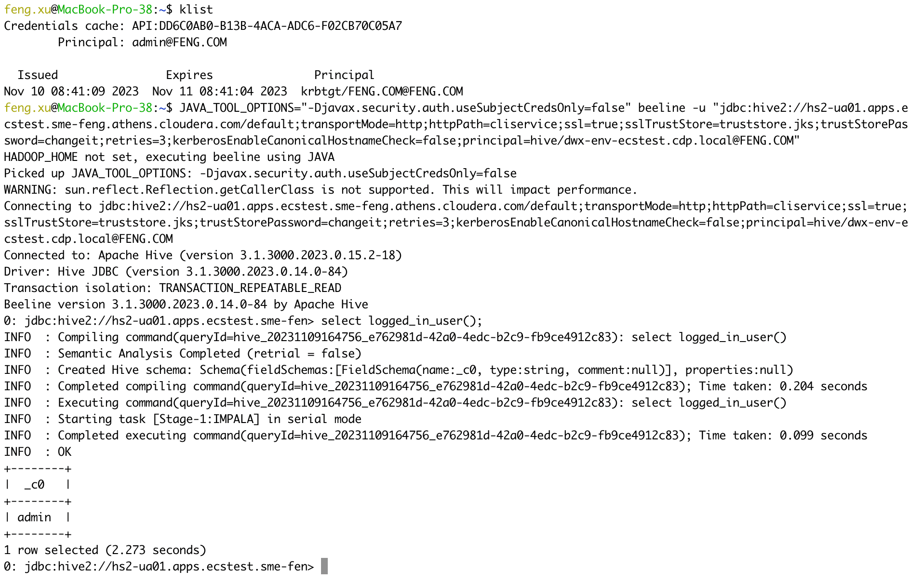
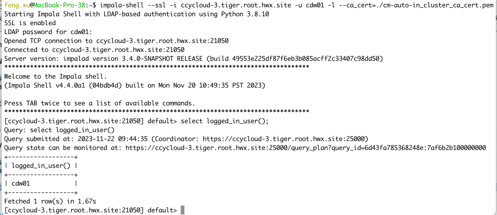
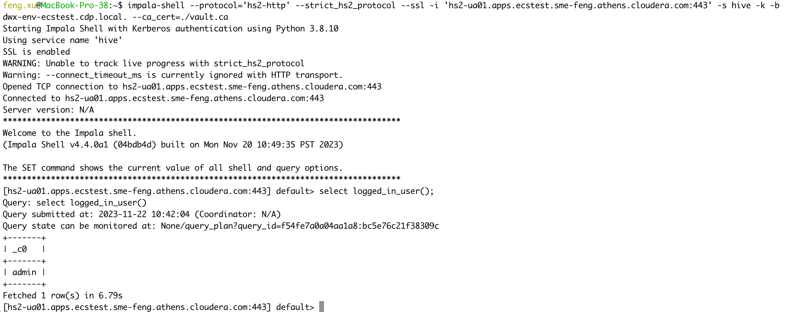
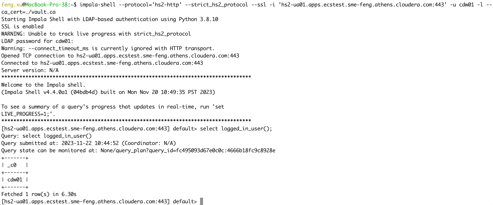

# Hadoop Clients Setup on MacOSX
{: .no_toc }

- TOC
{:toc}

---

## 1. Introduction to the test environment

|MAC OS version |13.1 (22C65)|
|Processor Type |Intel Core i7|
|Java version |11.0.18|
|Python version |2.7.18rc1 & 3.8.10|
|Beeline version |3.1.3000|
|Impala-shell version |4.3.0a4|
|CDP Runtime version |CDP PvC Base 7.1.7 SP2|
|CM version |Cloudera Manager 7.11.3.2|
|ECS version |CDP PvC DataServices 1.5.2|

## 2. Basic Concept

- In a secured CDP environment there are different alternatives available for clients to authenticate with the cluster. In this article we will look into the different authentication mechanisms and their configuration details:
    - Kerberos authentication
        - Kerberos is by far the most common option we see being used in the field to secure CDP clusters. It enables users to use their corporate identities, stored in services like Active Directory and RedHat IPA/FreeIPA, which simplifies identity management. A kerberized CDP cluster also makes it easier to integrate with other services in the Hadoop ecosystem, which also use Kerberos for strong authentication. Kerberos uses shared key cryptography through a ticket-based authentication system, whereby tickets are issued, encrypted, and decrypted by a key distribution center (KDC).
    - LDAP authentication
        - LDAP authentication can also be used for authentication with the CDP cluster, instead of Kerberos. This eliminates some of the complexity related to Kerberos, like requiring  Kerberos libraries to be installed for the client and issues when Load Balancers are used. When LDAP is used for authentication, differently from the Kerberos protocol, the beeline/impala-shell client needs to send the username and password over the network. Password files are often used to avoid password leaks.

- Hive and Impala virtual warehouses support Kerberos authentication from PvC 1.5.0 (Jan 2023), unfortunately there are many limitations on beeline version, impala version, python version and command attributes.
    - You must use the beeline CLI(`3.1.3000.2023.0.14.0-84` or later) downloaded from the PVC DS DW UI. Otherwise the connection will fail with errors "HTTP Response code: 404 (state=08S01,code=0)". The downloaded Beeline itself already contains the open source Hive JDBC driver. The open source Hive JDBC driver uses Java Authentication and Authorization Service (JAAS) standard, which requires either a config file OR the use of a JVM property (`-Djavax.security.auth.useSubjectCredsOnly=false`) to enable the use of the Kerberos ticket cache.
    - You must add the `kerberosEnableCanonicalHostnameCheck=false` option in the hive jdbc url. The `kerberosEnableCanonicalHostnameCheck` option disables the reverse dns check implemented in the jdbc driver. There is no need for this in PVC Base, because the reverse dns records must be correct there for the cluster nodes (otherwise Kerberos does not work between cluster services). So this is a DS specific functionality and it was not backported from the upstream hive code to the PVC Base jdbc drivers, which is why Kerberos auth does not work with the drivers installed on Base nodes towards PVC DS Virtual Warehouses.
    - You must use impala-shell(`4.2.0` or later) on python 2.7 to access Impala virtual warehouse when using Kerberos authentication. I verified that this limitation still exists in PvC 1.5.2, impala-shell client has compatibility issues in a python 3.x environment for Kerberos principal. However, LDAP authentication does not have any compatibility issues.
    - Long story short: please do `NOT` use the built-in beeline or impala-shell client in PvC Base Cluster to access hive/impala virtual warehouses with Kerberos authentication.


## 3. Hadoop Clients Setup on MacOSX

### 3.1. Install OpenJDK 11

```bash
brew install openjdk@11
```

```console
$ java -version
openjdk version "11.0.18" 2023-01-17
OpenJDK Runtime Environment Homebrew (build 11.0.18+0)
OpenJDK 64-Bit Server VM Homebrew (build 11.0.18+0, mixed mode)
```

### 3.2. Install Python 2.7.18 & 3.8.10

- Python 2.7.18 is the last release of Python 2. To install python 2.7.18 on MacOS, please download the installer from [python official download site](https://www.python.org/downloads/release/python-2718rc1/).
    - Note: The command `brew install python@2` doesn't work because macOS remove the support of python 2.

- You can install [Python 3.8.10](https://www.python.org/downloads/release/python-3810/) by the same way.

### 3.3 Install Beeline 3.1.3

- Note: To use Kerberos auth in PvC DS you must use the latest beeline CLI(3.1.3000.2023.0.14.0-84) downloaded from the PVC DS DW UI.

- In order to connect to Hive VW via beeline shell, the first step is to download Beeline CLI software. "Guides and More" is on the Cloudera Data Warehouse Overview. Navigate to "Guides and More" and click on the "see more" button, you can see ["Downloads - Beeline CLI"](https://cdw-ui.s3.amazonaws.com/hive3/beeline-standalone/apache-hive-beeline-3.1.3000.tar.gz).


- Extract the tar.gz file, and you will see two folders, bin & lib
```bash
mkdir -p $HOME/hadoop-clients
tar xvzf apache-hive-beeline-3.1.3000.tar.gz -C $HOME/hadoop-clients
cd $HOME/hadoop-clients
ln -s apache-hive-beeline-3.1.3000.2023.0.14.0-84 beeline
```


### 3.4. Install Impala-shell 4.3.0a4

- Impala shell can be invoked on a remote client machine by installing the impala-shell package. It is a python package that can be installed using pip.
    - Note: Kerberos authentication requires impala-shell version 4.2.0 or later (https://pypi.org/project/impala-shell/4.3.0a4/). 

```console
$ which python
/usr/local/bin/python

$ ls -l /usr/local/bin/python
lrwxr-xr-x  1 root  wheel  68 Nov  8 20:38 /usr/local/bin/python -> ../../../Library/Frameworks/Python.framework/Versions/2.7/bin/python

$ python -V
Python 2.7.18rc1

$ pip -V
pip 19.2.3 from /Library/Frameworks/Python.framework/Versions/2.7/lib/python2.7/site-packages/pip (python 2.7)

$ pip install impala-shell==4.3.0a4
DEPRECATION: Python 2.7 will reach the end of its life on January 1st, 2020. Please upgrade your Python as Python 2.7 won't be maintained after that date. A future version of pip will drop support for Python 2.7. More details about Python 2 support in pip, can be found at https://pip.pypa.io/en/latest/development/release-process/#python-2-support
Collecting impala-shell==4.3.0a4
  Using cached https://files.pythonhosted.org/packages/c6/db/5346489ed196dd5ce3ac9b885a4d6c16417f1d03ca7168aeb6f7c85af7d5/impala_shell-4.3.0a4.tar.gz
Collecting bitarray==2.3.0 (from impala-shell==4.3.0a4)
  Using cached https://files.pythonhosted.org/packages/92/43/4ddd1efaf5ed7913847624248f7888a55dbacab8daf07787aebf9e9a51f7/bitarray-2.3.0.tar.gz
Collecting configparser==4.0.2 (from impala-shell==4.3.0a4)
  Using cached https://files.pythonhosted.org/packages/7a/2a/95ed0501cf5d8709490b1d3a3f9b5cf340da6c433f896bbe9ce08dbe6785/configparser-4.0.2-py2.py3-none-any.whl
Collecting kerberos==1.3.1 (from impala-shell==4.3.0a4)
  Using cached https://files.pythonhosted.org/packages/39/cd/f98699a6e806b9d974ea1d3376b91f09edcb90415adbf31e3b56ee99ba64/kerberos-1.3.1.tar.gz
Collecting prettytable==0.7.2 (from impala-shell==4.3.0a4)
  Using cached https://files.pythonhosted.org/packages/ef/30/4b0746848746ed5941f052479e7c23d2b56d174b82f4fd34a25e389831f5/prettytable-0.7.2.tar.bz2
Collecting sasl==0.3.1 (from impala-shell==4.3.0a4)
  Using cached https://files.pythonhosted.org/packages/df/ae/d8dda9ef1636f548935c271910d3b35afbf1782df582fda88a13ea48de53/sasl-0.3.1.tar.gz
Requirement already satisfied: setuptools>=36.8.0 in /Library/Frameworks/Python.framework/Versions/2.7/lib/python2.7/site-packages (from impala-shell==4.3.0a4) (41.2.0)
Collecting six==1.14.0 (from impala-shell==4.3.0a4)
  Using cached https://files.pythonhosted.org/packages/65/eb/1f97cb97bfc2390a276969c6fae16075da282f5058082d4cb10c6c5c1dba/six-1.14.0-py2.py3-none-any.whl
Collecting sqlparse==0.3.1 (from impala-shell==4.3.0a4)
  Using cached https://files.pythonhosted.org/packages/85/ee/6e821932f413a5c4b76be9c5936e313e4fc626b33f16e027866e1d60f588/sqlparse-0.3.1-py2.py3-none-any.whl
Collecting thrift==0.16.0 (from impala-shell==4.3.0a4)
  Using cached https://files.pythonhosted.org/packages/e4/23/dd951c9883cb49a73b750bdfe91e39d78e8a3f1f7175608634f381a197d5/thrift-0.16.0.tar.gz
Collecting thrift_sasl==0.4.3 (from impala-shell==4.3.0a4)
  Using cached https://files.pythonhosted.org/packages/c3/9e/636c24ce1c0d46ce3020c5836c5a375d8e862fa81a240e0e352cc991dcf8/thrift_sasl-0.4.3-py2.py3-none-any.whl
Collecting pure-sasl>=0.6.2 (from thrift_sasl==0.4.3->impala-shell==4.3.0a4)
  Using cached https://files.pythonhosted.org/packages/37/b2/ef1124540ee2c0b417be8d0f74667957e6aa084a3f26621aa67e2e77f3fb/pure_sasl-0.6.2-py2-none-any.whl
Installing collected packages: bitarray, configparser, kerberos, prettytable, six, sasl, sqlparse, thrift, pure-sasl, thrift-sasl, impala-shell
  Running setup.py install for bitarray ... done
  Running setup.py install for kerberos ... done
  Running setup.py install for prettytable ... done
  Running setup.py install for sasl ... done
  WARNING: The script sqlformat is installed in '/Library/Frameworks/Python.framework/Versions/2.7/bin' which is not on PATH.
  Consider adding this directory to PATH or, if you prefer to suppress this warning, use --no-warn-script-location.
  Running setup.py install for thrift ... done
  Running setup.py install for impala-shell ... done
Successfully installed bitarray-2.3.0 configparser-4.0.2 impala-shell-4.3.0a4 kerberos-1.3.1 prettytable-0.7.2 pure-sasl-0.6.2 sasl-0.3.1 six-1.14.0 sqlparse-0.3.1 thrift-0.16.0 thrift-sasl-0.4.3
WARNING: You are using pip version 19.2.3, however version 20.3.4 is available.
You should consider upgrading via the 'pip install --upgrade pip' command.
```

- Please ensure that impala-shell runs on python 2.7 environment by default.
```console
rm -f /usr/local/bin/impala-shell
ln -s /Library/Frameworks/Python.framework/Versions/2.7/bin/impala-shell /usr/local/bin/impala-shell
```


### 3.5. Download config files from CDP Base cluster

- Please download config files from CDP Base cluster(/etc/hive/conf.cloudera.hive_on_tez, /etc/spark3/conf.cloudera.spark3_on_yarn)

```bash
# gen tarball on CDP Base node
cd /etc/hive
tar cvf ~/hiveconf.tar conf.cloudera.hive_on_tez

cd /etc/spark3/
tar cvf ~/spark3conf.tar conf.cloudera.spark3_on_yarn
```

```bash
# extrace tarball on MAC laptop
tar xvf hiveconf.tar -C $HOME/hadoop-clients
tar xvf spark3conf.tar -C $HOME/hadoop-clients
```

### 3.6. Update bash_profile

- Modify `$HOME/.bash_profile`

```bash
vi $HOME/.bash_profile
export GREP_OPTIONS='--color=auto'
export TERM="xterm-color"
PS1='\[\e[0;33m\]\u\[\e[0m\]@\[\e[0;32m\]\h\[\e[0m\]:\[\e[0;34m\]\w\[\e[0m\]\$ '
export JAVA_HOME=/usr/local/Cellar/openjdk@11/11.0.18/libexec/openjdk.jdk/Contents/Home/
export SPARK_HOME=$HOME/hadoop-clients/spark
export BEELINE_HOME=$HOME/hadoop-clients/beeline
export HIVE_CONF_DIR=$HOME/hadoop-clients/conf.cloudera.hive_on_tez
PATH=$PATH:$BEELINE_HOME/bin:$SPARK_HOME/sbin:$SPARK_HOME/bin
export PATH="/Library/Frameworks/Python.framework/Versions/2.7/bin:/Library/Frameworks/Python.framework/Versions/3.8/bin:${PATH}"

source $HOME/.bash_profile
```

### 3.7. Update /etc/hosts,/etc/krb5.conf and core-site.xml

- Please add the remote hiveserver2 hosts into /etc/hosts.
    - ccycloud-1.tiger.root.hwx.site has the realm `FENG.COM`.
    - feng-base.sme-feng.athens.cloudera.com has the realm `ATHENS.CLOUDERA.COM`.

```bash
sudo vi /etc/hosts

172.27.xx.xx ccycloud-1.tiger.root.hwx.site
10.113.xx.xx feng-base.sme-feng.athens.cloudera.com
```

- Please add all realms into /etc/krb5.conf. In the realms section we have to properly define both the ATHENS.CLOUDERA.COM and FENG.COM realms.

```bash
sudo vi /etc/krb5.conf

[libdefaults]
  default_realm = FENG.COM
  dns_lookup_realm = false
  rdns = false
  dns_canonicalize_hostname = false
  dns_lookup_kdc = true
  ticket_lifetime = 24h
  renew_lifetime = 7d
  renewable = true
  forwardable = true
  udp_preference_limit = 0

[realms]
ATHENS.CLOUDERA.COM = {
  kdc = goes-svc-win01.athens.cloudera.com
  admin_server = goes-svc-win01.athens.cloudera.com
}

FENG.COM = {
  kdc = ccycloud-1.tiger.root.hwx.site:88
  admin_server = ccycloud-1.tiger.root.hwx.site:749
}

[domain_realm]
.sme-feng.athens.cloudera.com = ATHENS.CLOUDERA.COM
sme-feng.athens.cloudera.com = ATHENS.CLOUDERA.COM
.tiger.root.hwx.site = FENG.COM
tiger.root.hwx.site = FENG.COM
```

- Please add the mapping rules into the `hadoop.security.auth_to_local` property of $HIVE_CONF_DIR/core-site.xml.

```bash
vi $HIVE_CONF_DIR/core-site.xml

  <property>
    <name>hadoop.security.auth_to_local</name>
    <value>RULE:[2:$1@$0](rangeradmin@ATHENS.CLOUDERA.COM)s/(.*)@ATHENS.CLOUDERA.COM/ranger/
......
RULE:[1:$1@$0](.*@\QATHENS.CLOUDERA.COM\E$)s/@\QATHENS.CLOUDERA.COM\E$//
RULE:[2:$1@$0](.*@\QATHENS.CLOUDERA.COM\E$)s/@\QATHENS.CLOUDERA.COM\E$//
RULE:[1:$1@$0](.*@\QFENG.COM\E$)s/@\QFENG.COM\E$//
RULE:[2:$1@$0](.*@\QFENG.COM\E$)s/@\QFENG.COM\E$//
DEFAULT</value>
```

- You can test mapping rules for a long principal name by running:

```bash
$ hadoop org.apache.hadoop.security.HadoopKerberosName admin@FENG.COM
Name: admin@FENG.COM to admin

$ hadoop org.apache.hadoop.security.HadoopKerberosName feng.xu@ATHENS.CLOUDERA.COM
Name: feng.xu@ATHENS.CLOUDERA.COM to feng.xu
```


## 4. Validate Beeline

|Test Cases |Connect To | Authentication Type | Status |
|Case 01 |Hive on Tez(Base Cluster) |Kerberos |Successful |
|Case 02 |Hive on Tez(Base Cluster) |LDAP |Successful |
|Case 03 |Hive LLAP(CDW) |Kerberos |Successful |
|Case 04 |Hive LLAP(CDW) |LDAP     |Successful |
|Case 05 |Impala(Base Cluster) |Kerberos |Successful |
|Case 06 |Impala(Base Cluster) |LDAP |Successful |
|Case 07 |Impala(CDW) |Kerberos |Successful |
|Case 08 |Impala(CDW) |LDAP |Successful |
|Case 09 |Unified Analytics(CDW) |Kerberos |Successful |
|Case 10 |Unified Analytics(CDW) |LDAP |Successful |

- Please use the beeline CLI(3.1.3000.2023.0.14.0-84 or later) downloaded from the PVC DS DW UI.

- How to get the JDBC URL?
    -  Go to Hive Virtual Warehouse > more (...) and click `Copy JDBC URL(LDAP)` or `Copy JDBC URL(Kerberos)`.
    -  Hive LLAP(CDW)
    
    -  Impala(CDW)
    
    -  Unified Analytics(CDW)
    

- How to get `sslTrustStore` and `trustStorePassword` for the JDBC URL?
    - For Auto-TLS enabled Base cluster, please download `sslTrustStore` from the location `/var/lib/cloudera-scm-agent/agent-cert/cm-auto-in_cluster_truststore.jks`. You can retrieve `trustStorePassword` via CM API. e.g. `curl -k --insecure -u admin:password -X GET https://ccycloud-1.tiger.root.hwx.site:7183/api/v42/certs/truststorePassword`
    - For Hive/Impala Virtual Warehouse, please retrieve `sslTrustStore` by a kubectl call: `kubectl get configmap -n cdp vault-jks -o jsonpath="{.binaryData['truststore\.jks']}"| base64 --decode > truststore.jks`. The default `trustStorePassword` is `changeit`.


### 4.1 Case 01 - Hive on Tez(Base Cluster) + Kerberos auth

- Connect to Hive in CDP Base cluster[realm=FENG.COM] using Kerberos authentication.
    - Note: You must set `JAVA_TOOL_OPTIONS=-Djavax.security.auth.useSubjectCredsOnly=false` property in the java env which allows jvm to use kerberos tickets from the system ticket cache.

```bash
kinit admin@FENG.COM

JAVA_TOOL_OPTIONS="-Djavax.security.auth.useSubjectCredsOnly=false" beeline -u 'jdbc:hive2://ccycloud-1.tiger.root.hwx.site:10000/default;principal=hive/_HOST@FENG.COM;ssl=true;sslTrustStore=./cm-auto-in_cluster_truststore.jks'

select logged_in_user();
```


### 4.2 Case 02 - Hive on Tez(Base Cluster) + LDAP auth

- Connect to Hive in CDP Base cluster[realm=FENG.COM] using LDAP authentication.

```bash
beeline -u 'jdbc:hive2://ccycloud-1.tiger.root.hwx.site:10000/default;ssl=true;sslTrustStore=./cm-auto-in_cluster_truststore.jks' -n cdw01 -p

select logged_in_user();
```


### 4.3 Case 03 - Hive LLAP(CDW) + Kerberos auth

- Connect to Hive VW in PvC CDW using Kerberos authentication.

- 1) ssl=false

```bash
kinit admin

JAVA_TOOL_OPTIONS="-Djavax.security.auth.useSubjectCredsOnly=false" beeline -u "jdbc:hive2://hs2-hive01.apps.ecstest.sme-feng.athens.cloudera.com/default;transportMode=http;httpPath=cliservice;socketTimeout=60;ssl=false;retries=3;kerberosEnableCanonicalHostnameCheck=false;principal=hive/dwx-env-ecstest.cdp.local@FENG.COM"

select logged_in_user();
```


- 2) ssl=true

```bash
kubectl get configmap -n cdp vault-jks -o jsonpath="{.binaryData['truststore\.jks']}"| base64 --decode > truststore.jks

kinit admin

JAVA_TOOL_OPTIONS="-Djavax.security.auth.useSubjectCredsOnly=false" beeline -u "jdbc:hive2://hs2-hive01.apps.ecstest.sme-feng.athens.cloudera.com/default;transportMode=http;httpPath=cliservice;socketTimeout=60;ssl=true;sslTrustStore=truststore.jks;trustStorePassword=changeit;retries=3;kerberosEnableCanonicalHostnameCheck=false;principal=hive/dwx-env-ecstest.cdp.local@FENG.COM"

select logged_in_user();
```


### 4.4 Case 04 - Hive LLAP(CDW) + LDAP auth

- Connect to Hive VW in PvC CDW using LDAP authentication.

- 1) ssl=false

```bash
beeline -u 'jdbc:hive2://hs2-hive01.apps.ecstest.sme-feng.athens.cloudera.com/default;transportMode=http;httpPath=cliservice;ssl=false;retries=3' -n cdw01 -p

select logged_in_user();
```


- 2) ssl=true

```bash
kubectl get configmap -n cdp vault-jks -o jsonpath="{.binaryData['truststore\.jks']}"| base64 --decode > truststore.jks

beeline -u 'jdbc:hive2://hs2-hive01.apps.ecstest.sme-feng.athens.cloudera.com/default;transportMode=http;httpPath=cliservice;ssl=true;sslTrustStore=./truststore.jks;trustStorePassword=changeit;retries=3' -n cdw01 -p

select logged_in_user();
```


### 4.5 Case 05 - Impala(Base Cluster) + Kerberos auth

- Connect to Impala in CDP Base cluster B [realm=FENG.COM] using Kerberos authentication.

```bash
kinit admin@FENG.COM

export HIVE_AUX_JARS_PATH=$HOME/work/projects/ImpalaJDBC41.jar

beeline -d 'com.cloudera.impala.jdbc41.Driver' -u 'jdbc:impala://ccycloud-3.tiger.root.hwx.site:21050;AuthMech=1;KrbHostFQDN=ccycloud-3.tiger.root.hwx.site;KrbServiceName=impala;SSL=1;sslTrustStore=./cm-auto-in_cluster_truststore.jks'

select logged_in_user();
```


### 4.6 Case 06 - Impala(Base Cluster) + LDAP auth

- Connect to Impala in CDP Base cluster B [realm=FENG.COM] using LDAP authentication.

```bash
export HIVE_AUX_JARS_PATH=$HOME/work/projects/ImpalaJDBC41.jar

beeline -d 'com.cloudera.impala.jdbc41.Driver' -u 'jdbc:impala://ccycloud-3.tiger.root.hwx.site:21050;AuthMech=3;SSL=1;sslTrustStore=./cm-auto-in_cluster_truststore.jks' -n cdw01 -p

select logged_in_user();
```


### 4.7 Case 07 - Impala(CDW) + Kerberos auth

- Connect to Impala VW in PvC CDW using Kerberos authentication.

```bash
kubectl get configmap -n cdp vault-jks -o jsonpath="{.binaryData['truststore\.jks']}"| base64 --decode > truststore.jks

kinit admin

export HIVE_AUX_JARS_PATH=~/work/projects/ImpalaJDBC41.jar

beeline -u "jdbc:impala://coordinator-impala01.apps.ecstest.sme-feng.athens.cloudera.com:443/default;AuthMech=1;transportMode=http;httpPath=cliservice;ssl=1;KrbHostFQDN=dwx-env-ecstest.cdp.local.;KrbServiceName=hive;sslTrustStore=truststore.jks;trustStorePassword=changeit"

select logged_in_user();
```


### 4.8 Case 08 - Impala(CDW) + LDAP auth

- Connect to Impala VW in PvC CDW using LDAP authentication.

```bash
kubectl get configmap -n cdp vault-jks -o jsonpath="{.binaryData['truststore\.jks']}"| base64 --decode > truststore.jks

export HIVE_AUX_JARS_PATH=~/work/projects/ImpalaJDBC41.jar

beeline -u "jdbc:impala://coordinator-impala01.apps.ecstest.sme-feng.athens.cloudera.com:443/default;AuthMech=3;transportMode=http;httpPath=cliservice;ssl=1;sslTrustStore=truststore.jks;trustStorePassword=changeit" -n cdw01 -p

select logged_in_user();
```


### 4.9 Case 09 - Unified Analytics(CDW) + Kerberos auth

- Connect to Unified Analytics VW in PvC CDW using Kerberos authentication.

- 1) ssl=false

```bash
kinit admin

JAVA_TOOL_OPTIONS="-Djavax.security.auth.useSubjectCredsOnly=false" beeline -u "jdbc:hive2://hs2-ua01.apps.ecstest.sme-feng.athens.cloudera.com/default;transportMode=http;httpPath=cliservice;ssl=false;retries=3;kerberosEnableCanonicalHostnameCheck=false;principal=hive/dwx-env-ecstest.cdp.local@FENG.COM"

select logged_in_user();
```


- 2) ssl=true

```bash
kubectl get configmap -n cdp vault-jks -o jsonpath="{.binaryData['truststore\.jks']}"| base64 --decode > truststore.jks

kinit admin

JAVA_TOOL_OPTIONS="-Djavax.security.auth.useSubjectCredsOnly=false" beeline -u "jdbc:hive2://hs2-ua01.apps.ecstest.sme-feng.athens.cloudera.com/default;transportMode=http;httpPath=cliservice;ssl=true;sslTrustStore=truststore.jks;trustStorePassword=changeit;retries=3;kerberosEnableCanonicalHostnameCheck=false;principal=hive/dwx-env-ecstest.cdp.local@FENG.COM"

select logged_in_user();
```



### 4.10 Case 10 - Unified Analytics(CDW) + LDAP auth

- Connect to Unified Analytics VW in PvC CDW using LDAP authentication.

- 1) ssl=false

```bash
beeline -u 'jdbc:hive2://hs2-ua01.apps.ecstest.sme-feng.athens.cloudera.com/default;transportMode=http;httpPath=cliservice;ssl=false;retries=3' -n cdw01 -p

select logged_in_user();
```


- 2) ssl=true

```bash
kubectl get configmap -n cdp vault-jks -o jsonpath="{.binaryData['truststore\.jks']}"| base64 --decode > truststore.jks

beeline -u 'jdbc:hive2://hs2-ua01.apps.ecstest.sme-feng.athens.cloudera.com/default;transportMode=http;httpPath=cliservice;ssl=true;sslTrustStore=truststore.jks;trustStorePassword=changeit;retries=3' -n cdw01 -p

select logged_in_user();
```


## 5. Validate impala-shell

|Test Cases |Connect To | Authentication Type | Status |
|Case 11 |Impala(Base Cluster) |Kerberos |Successful |
|Case 12 |Impala(Base Cluster) |LDAP |Successful |
|Case 13 |Impala(CDW) |Kerberos |Successful |
|Case 14 |Impala(CDW) |LDAP |Successful |
|Case 15 |Unified Analytics(CDW) |Kerberos |Successful |
|Case 16 |Unified Analytics(CDW) |LDAP |Successful |


- Please use impala-shell on python 2.7 to access Impala virtual warehouse when using Kerberos authentication. 

- Please upgrade impala-shell to 4.2.0 or later.

- You can enable kerberos debug logging for impala-shell.

```bash
export HADOOP_OPTS="-Dsun.security.krb5.debug=true"
export KRB5_TRACE=/dev/stdout
export HADOOP_ROOT_LOGGER=TRACE,console
```

- How to get the Impala shell command?
    -  Go to Impala Virtual Warehouse > more (...) and click `Copy Impala shell command`.

- How to get `ca_cert` for the JDBC URL?
    - For Auto-TLS enabled Base cluster, please download `ca_cert` from the location `/var/lib/cloudera-scm-agent/agent-cert/cm-auto-in_cluster_ca_cert.pem`.
    - For Impala Virtual Warehouse, please retrieve `ca_cert` by a kubectl call: `kubectl get secret -n vault-system vault-server-tls -o jsonpath="{.data['vault\.ca']}"| base64 --decode > vault.ca`.

### 5.1 Case 11 - Impala(Base Cluster) + Kerberos auth

- Connect to Impala in CDP Base cluster using kerberos authentication.

- 1) NOT Verify Impala server certificates

```bash
kinit admin@FENG.COM

impala-shell --ssl -k -i ccycloud-3.tiger.root.hwx.site

select logged_in_user();
```


- 2) Verify Impala server certificates

```bash
kinit admin@FENG.COM

impala-shell --ssl -k -i ccycloud-3.tiger.root.hwx.site --ca_cert=./cm-auto-in_cluster_ca_cert.pem

select logged_in_user();
```


### 5.2 Case 12 - Impala(Base Cluster) + LDAPLDAP auth

- Connect to Impala in CDP Base cluster using LDAP authentication.

- 1) NOT Verify Impala server certificates

```bash
impala-shell --ssl -i ccycloud-3.tiger.root.hwx.site -u cdw01 -l

select logged_in_user();
```


- 2) Verify Impala server certificates

```bash
impala-shell --ssl -i ccycloud-3.tiger.root.hwx.site -u cdw01 -l --ca_cert=./cm-auto-in_cluster_ca_cert.pem

select logged_in_user();
```




### 5.3 Case 13 - Impala(CDW) + Kerberos auth

- Connect to Impala VW in PvC CDW using Kerberos authentication.

- 1) NOT Verify Impala server certificates

```bash
kinit admin

impala-shell --protocol='hs2-http' --ssl -i 'coordinator-impala01.apps.ecstest.sme-feng.athens.cloudera.com:443' -s hive -k -b dwx-env-ecstest.cdp.local.

select logged_in_user();
```


- 2) Verify Impala server certificates
    
```bash
kubectl get secret -n vault-system vault-server-tls -o jsonpath="{.data['vault\.ca']}"| base64 --decode > vault.ca

kinit admin

impala-shell --protocol='hs2-http' --ssl -i 'coordinator-impala01.apps.ecstest.sme-feng.athens.cloudera.com:443' -s hive -k -b dwx-env-ecstest.cdp.local. --ca_cert=./vault.ca

select logged_in_user();
```


### 5.4 Case 14 - Impala(CDW) + LDAP auth

- Connect to Impala VW in PvC CDW using LDAP authentication.

- 1) NOT Verify Impala server certificates

```bash
impala-shell --protocol='hs2-http' --ssl -i 'coordinator-impala01.apps.ecstest.sme-feng.athens.cloudera.com:443' -u cdw01 -l

select logged_in_user();
```


- 2) Verify Impala server certificates
    
```bash
kubectl get secret -n vault-system vault-server-tls -o jsonpath="{.data['vault\.ca']}"| base64 --decode > vault.ca

impala-shell --protocol='hs2-http' --ssl -i 'coordinator-impala01.apps.ecstest.sme-feng.athens.cloudera.com:443' -u cdw01 -l --ca_cert=./vault.ca

select logged_in_user();
```


### 5.5 Case 15 - Unified Analytics(CDW) + Kerberos auth

- Connect to Unified Analytics VW in PvC CDW using Kerberos authentication.

- 1) NOT Verify UA server certificates

```bash
kinit admin

impala-shell --protocol='hs2-http' --strict_hs2_protocol --ssl -i 'hs2-ua01.apps.ecstest.sme-feng.athens.cloudera.com:443' -s hive -k -b dwx-env-ecstest.cdp.local.

select logged_in_user();
```


- 2) Verify UA server certificates
    
```bash
kubectl get secret -n vault-system vault-server-tls -o jsonpath="{.data['vault\.ca']}"| base64 --decode > vault.ca

kinit admin

impala-shell --protocol='hs2-http' --strict_hs2_protocol --ssl -i 'hs2-ua01.apps.ecstest.sme-feng.athens.cloudera.com:443' -s hive -k -b dwx-env-ecstest.cdp.local. --ca_cert=./vault.ca

select logged_in_user();
```




### 5.6 Case 16 - Unified Analytics(CDW) + LDAP auth

- Connect to Unified Analytics VW in PvC CDW using LDAP authentication.

- 1) NOT Verify UA server certificates

```bash
impala-shell --protocol='hs2-http' --strict_hs2_protocol --ssl -i 'hs2-ua01.apps.ecstest.sme-feng.athens.cloudera.com:443' -u cdw01 -l

select logged_in_user();
```


- 2) Verify UA server certificates
    
```bash
kubectl get secret -n vault-system vault-server-tls -o jsonpath="{.data['vault\.ca']}"| base64 --decode > vault.ca

impala-shell --protocol='hs2-http' --strict_hs2_protocol --ssl -i 'hs2-ua01.apps.ecstest.sme-feng.athens.cloudera.com:443' -u cdw01 -l --ca_cert=./vault.ca

select logged_in_user();
```



