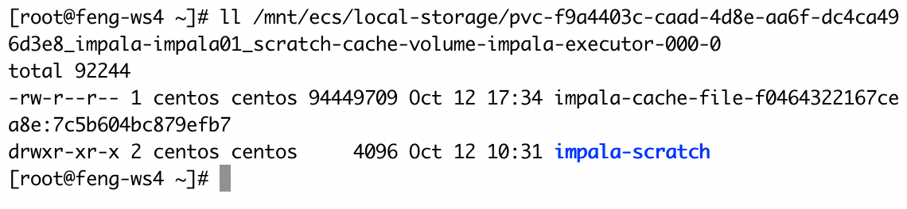
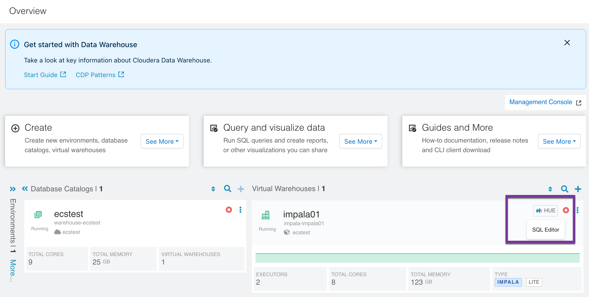
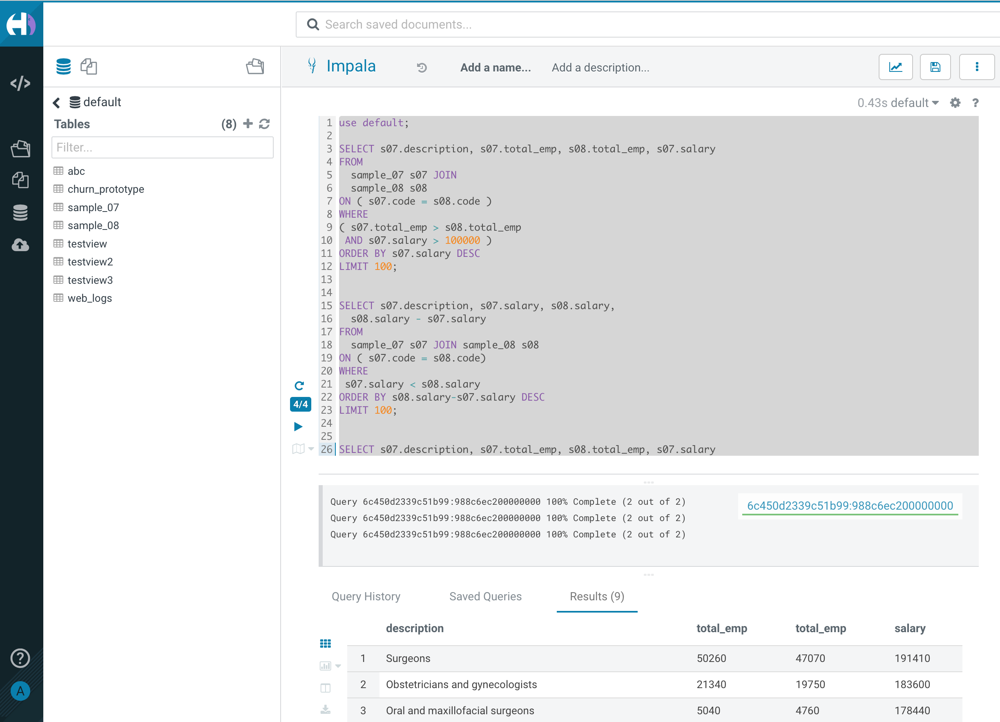
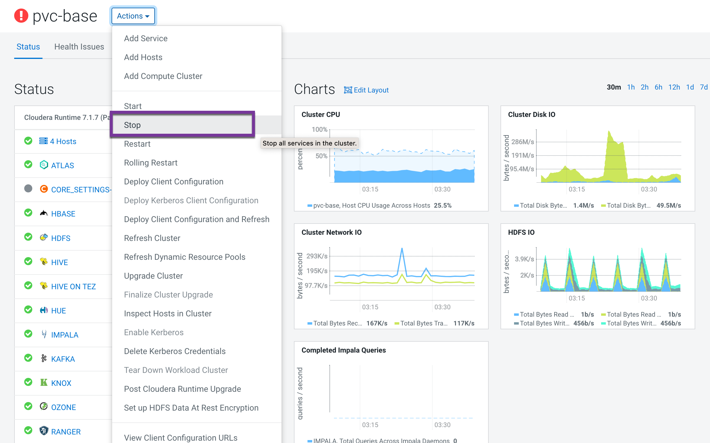
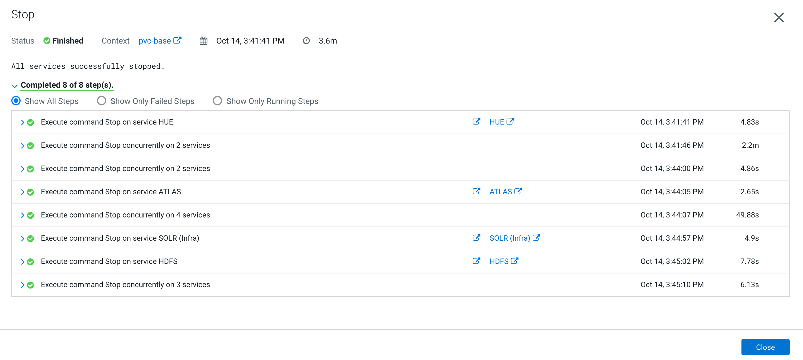
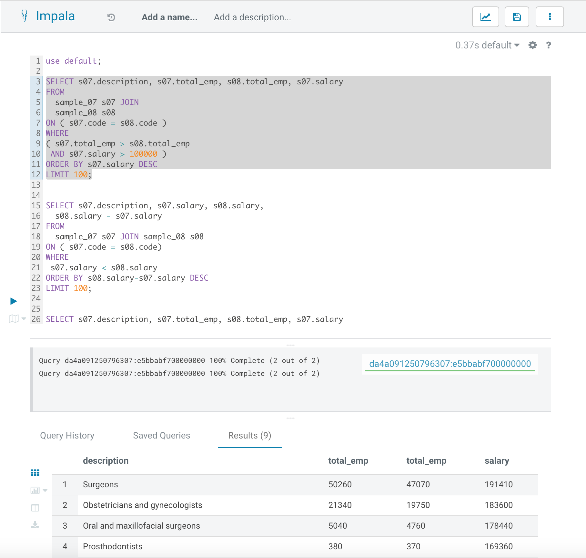
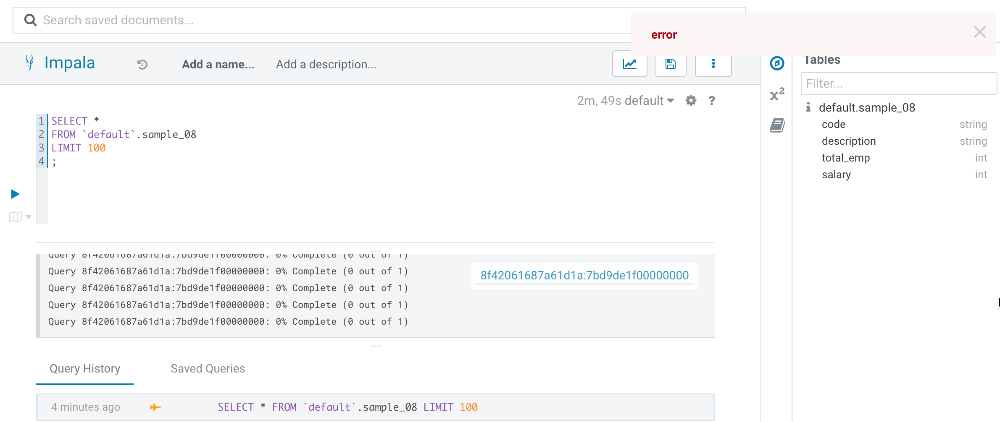
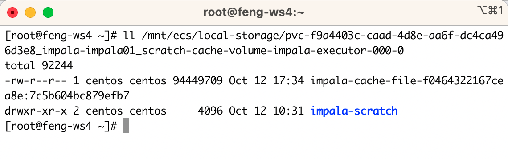

# ECS Server HA Failure Domain Testing
{: .no_toc }

- TOC
{:toc}

---

## 1. Introduction to the test environment

|CDP Runtime version |CDP PvC Base 7.1.7 SP2|
|CM version |Cloudera Manager 7.10.1|
|ECS version |CDP PvC DataServices 1.5.1|
|OS version |Centos 7.9|
|K8S version |RKE 1.24|
|Whether to enable Kerberos |Yes|
|Whether to enable TLS |Yes|
|Auto-TLS |Yes|
|Kerberos |FreeIPA|
|LDAP |FreeIPA|
|DB Configuration |External Postgres 12|
|Vault |Embedded|
|Docker registry |Embedded|
|Install Method |Internet|

## 2. Basic Concept

- When Impala compute nodes and its storage are not co-located, the network bandwidth requirement goes up as the network traffic includes the data fetch as well as the shuffling exchange traffic of intermediate results. To mitigate the pressure on the network, you can enable the compute nodes to cache the working set read from remote filesystems, such as, remote HDFS data node, S3, ABFS, ADLS.

- To enable remote data cache, set the --data_cache Impala Daemon start-up flag as below: `--data_cache=dir1,dir2,dir3,...:quota`
    - The flag is set to a list of directories, separated by ,, followed by a :, and a capacity quota per directory.
    - Cached data is stored in the specified directories. The specified directories must exist in the local filesystem of each Impala Daemon, or Impala will fail to start.
    - The cache can consume up to the quota bytes for each of the directories specified.

- You configure a cache eviction policy using the --data_cache_eviction_policy Impala Daemon start-up flag: `--data_cache_eviction_policy=policy`.
    - In Impala 3.4 and higher, you can configure one of the following cache eviction policies for the data cache:
        - LRU (Least Recently Used -- the default)
        - LIRS (Inter-referenece Recency Set)
    - Please see details about [Data Cache for Remote Reads](https://impala.apache.org/docs/build/html/topics/impala_data_cache.html).

## 3. List Data cache files

- Get all start-up flagfile in CDW impala.
    - The target configmap is `impala-executor-000-flagfile`.

```bash
$ kubectl get configmap -n impala-impala01|grep flagfile
impala-autoscaler-flagfile                    1      47h
impala-catalog-flagfile                       3      47h
impala-coordinator-flagfile                   5      47h
impala-executor-000-flagfile                  3      47h
impala-statestore-flagfile                    2      47h
```

- Get data cache settings in Impala Daemon start-up flag.
    - The target data cache directory is `/opt/impala/cache` and it's quota is 48GB.
    - The cache eviction policy is `LRU`.

```bash
$ kubectl describe configmap impala-executor-000-flagfile -n impala-impala01 |grep data_cache
--data_cache=/opt/impala/cache:48GB
--data_cache_eviction_policy=LRU
```

- Get data cache volume name in impala executor definition.
    - The target volume is `scratch-cache-volume`.

```bash
$ kubectl describe pod impala-executor-000-0 -n impala-impala01|grep /opt/impala/cache
      /opt/impala/cache from scratch-cache-volume (rw)
```

- Get pvc name in impala executor definition.
    - The target pvc is `scratch-cache-volume-impala-executor-000-0`.

```bash
$ kubectl describe pod impala-executor-000-0 -n impala-impala01|grep -A3 scratch-cache-volume:
  scratch-cache-volume:
    Type:       PersistentVolumeClaim (a reference to a PersistentVolumeClaim in the same namespace)
    ClaimName:  scratch-cache-volume-impala-executor-000-0
    ReadOnly:   false
```

- Get the target pv name which is `pvc-f9a4403c-caad-4d8e-aa6f-dc4ca496d3e8`.

```bash
$ kubectl get pv|grep scratch-cache-volume-impala-executor-000-0
pvc-f9a4403c-caad-4d8e-aa6f-dc4ca496d3e8   94Gi       RWO            Delete           Bound    impala-impala01/scratch-cache-volume-impala-executor-000-0                                                              local-path              47h
```

- Get the host and the local storage path.
    - The target host is `feng-ws4.sme-feng.athens.cloudera.com`
    - The target path is `/mnt/ecs/local-storage/pvc-f9a4403c-caad-4d8e-aa6f-dc4ca496d3e8_impala-impala01_scratch-cache-volume-impala-executor-000-0`.

```bash
$ kubectl describe pv pvc-f9a4403c-caad-4d8e-aa6f-dc4ca496d3e8

Capacity:          94Gi
Node Affinity:
  Required Terms:
    Term 0:        kubernetes.io/hostname in [feng-ws4.sme-feng.athens.cloudera.com]
Message:
Source:
    Type:          HostPath (bare host directory volume)
    Path:          /mnt/ecs/local-storage/pvc-f9a4403c-caad-4d8e-aa6f-dc4ca496d3e8_impala-impala01_scratch-cache-volume-impala-executor-000-0
    HostPathType:  DirectoryOrCreate
Events:            <none>
```

- Open SSH terminal for the host `feng-ws4.sme-feng.athens.cloudera.com` and list the cache files.
    - data_cache: to cache the working set read from remote HDFS data node
    - srcatch_dirs: to store intermediate files

```bash
[root@feng-ws4 ~]# ll /mnt/ecs/local-storage/pvc-f9a4403c-caad-4d8e-aa6f-dc4ca496d3e8_impala-impala01_scratch-cache-volume-impala-executor-000-0
total 92244
-rw-r--r-- 1 centos centos 94449709 Oct 12 17:34 impala-cache-file-f0464322167cea8e:7c5b604bc879efb7
drwxr-xr-x 2 centos centos     4096 Oct 12 10:31 impala-scratch
```




## 4. Run Demo Queries

- On the Overview page under Virtual Warehouses, click the options menu in the upper right corner of an Impala Virtual Warehouse tile, and select `Open Hue`.



- Submit Impala queries as followings with Hue.

```bash
use default;

SELECT s07.description, s07.total_emp, s08.total_emp, s07.salary
FROM
  sample_07 s07 JOIN 
  sample_08 s08
ON ( s07.code = s08.code )
WHERE
( s07.total_emp > s08.total_emp
 AND s07.salary > 100000 )
ORDER BY s07.salary DESC
LIMIT 100;


SELECT s07.description, s07.salary, s08.salary,
  s08.salary - s07.salary
FROM
  sample_07 s07 JOIN sample_08 s08
ON ( s07.code = s08.code)
WHERE
 s07.salary < s08.salary
ORDER BY s08.salary-s07.salary DESC
LIMIT 100;


SELECT s07.description, s07.total_emp, s08.total_emp, s07.salary
FROM
  sample_07 s07 JOIN 
  sample_08 s08
ON ( s07.code = s08.code )
WHERE
( s07.total_emp > s08.total_emp
 AND s07.salary > 100000 )
ORDER BY s07.salary DESC
LIMIT 100;
```



- Stop CDP Base Cluster.





- The previous query will run normally.



- New query gets stuck, even if the query is very simple



- Let's check the local path again, nothing has changed.



## 5. Conclusion

- Impala Data Cache saves the data files from the remote storage layer in local storage on the node on which the impala daemon is running. Subsequent queries that require the same data or a subset thereof will not require IO from the remote storage layer to access the data. 
- The default evict policy is LRU (Least Recently Used), if no new query writes any more result sets into the data cache(such as the scenario when base cluster is down), the data cache will never exceed the max capacity, so the current data cache exists permanently.
