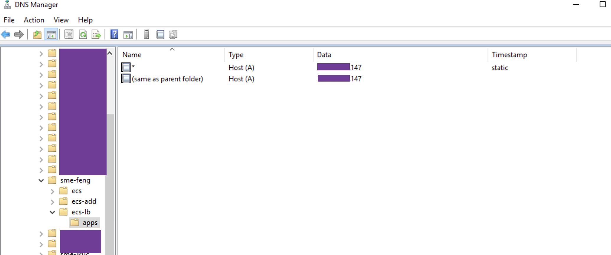

# DS Issues
{: .no_toc }

- TOC
{:toc}

---

## 0. issue template

--- 
PROBLEM: 
{: .label .label-yellow } 

- 

```console
```

--- 
ENVIRONMENT: 
{: .label .label-yellow }

- 

--- 
CAUSE: 
{: .label .label-red }

- 

---  
RESOLUTION: 
{: .label .label-green } 
   
```bash
```


## 1. rendered manifests contain a resource that already exists

--- 
PROBLEM: 
{: .label .label-yellow } 

- failed to activate CDE service

```console
2021-09-07T01:40:29.556957Z:LogDebug:Error fetching chart info for dex-base, invalid chart, will retry
Sep 7, 2021, 9:40:30 AM:LogError:dex-base, version 1.10.0 installation failed, dex-base installation failed, rendered manifests contain a resource that already exists. Unable to continue with install: existing resource conflict: namespace: , name: pvccde-dex-base-dex-base-configs-manager, existing_kind: rbac.authorization.k8s.io/v1, Kind=ClusterRole, new_kind: rbac.authorization.k8s.io/v1, Kind=ClusterRole
```
--- 
CAUSE: 
{: .label .label-red }

- Deleting from the CDE UI does not delete records in the backend database. 

---  
RESOLUTION: 
{: .label .label-green } 
   
```bash
kubectl exec -it cdp-embedded-db-0 -n cp -- bash
psql -P pager=off -d db-dex

delete from instance where clusterid = 'cluster-spzq7cvg';

delete from cluster where id = 'cluster-spzq7cvg';
```

## 2. Name or service not known

--- 
PROBLEM: 
{: .label .label-yellow } 

- Get errors when installing Control Plane :
Process install-cp (id=1546338729) on host ip-10-113-204-13.se.fuse.cloudera.com (id=1546338574) exited with 1 and expected 0

```console
+ ./install-cdp.sh -n cp
+ popd
+ pushd logs
+ python /opt/cloudera/cm-agent/service/ecs/get_creds.py https://console-cp.apps.ecs-ycloud.ecs.openstack.com
Traceback (most recent call last):
  File "/opt/cloudera/cm-agent/service/ecs/get_creds.py", line 64, in <module>
    result = generate_initial_access_and_private_keys(sys.argv[1])
  File "/opt/cloudera/cm-agent/service/ecs/get_creds.py", line 15, in generate_initial_access_and_private_keys
    local_account_id = get_cdp_account_id(management_console_url)
  File "/opt/cloudera/cm-agent/service/ecs/get_creds.py", line 49, in get_cdp_account_id
    initial_auth_response = requests.get(api_path, verify=False)
  File "/usr/lib/python2.7/site-packages/requests/api.py", line 68, in get
    return request('get', url, **kwargs)
  File "/usr/lib/python2.7/site-packages/requests/api.py", line 50, in request
    response = session.request(method=method, url=url, **kwargs)
  File "/usr/lib/python2.7/site-packages/requests/sessions.py", line 486, in request
    resp = self.send(prep, **send_kwargs)
  File "/usr/lib/python2.7/site-packages/requests/sessions.py", line 598, in send
    r = adapter.send(request, **kwargs)
  File "/usr/lib/python2.7/site-packages/requests/adapters.py", line 415, in send
    raise ConnectionError(err, request=request)
requests.exceptions.ConnectionError: ('Connection aborted.', gaierror(-2, 'Name or service not known'))
```
--- 
CAUSE: 
{: .label .label-red }

- need to define wildcard DNS entry `*.apps.ecs-ycloud.ecs.openstack.com`. The app domain describes a dns subdomain set up for ecs/ocp, within that dns subdomain we expect to have an A-Record with wildcard resolving to IP address of the ECS Server (or to the VIP of a Loadbalancer, when using ECSMaster HA).

- apps is hardcoded and cannot be changed

- An A-record for apps.ecs-ycloud.ecs.openstack.com is not necessary.

---  
RESOLUTION: 
{: .label .label-green } 

The sample example for AD using DNS Manager:



The sample example for FreeIPA using DNS Zones:


The sample example for dnsmasq using `address`:

```bash
echo "strict-order
user=root
listen-address=172.27.27.9
address=/apps.ecs-ycloud.ecs.openstack.com/192.168.8.144
addn-hosts=/etc/dnsmasq.hosts
resolv-file=/etc/resolv.dnsmasq.conf
conf-dir=/etc/dnsmasq.d" > /etc/dnsmasq.conf

systemctl restart dnsmasq
```


## 3. Non supported character set (add orai18n.jar in your classpath): ZHS16GBK

--- 
PROBLEM: 
{: .label .label-yellow } 

- Get errors from cloudera-scm-service.log

```console
2022-08-01 20:03:28,371 ERROR main:com.cloudera.server.cmf.bootstrap.EntityManagerFactoryBean: Unable to access schema version in database.
javax.persistence.PersistenceException: org.hibernate.exception.GenericJDBCException: could not execute query

Caused by: org.hibernate.exception.GenericJDBCException: could not execute query

Caused by: java.sql.SQLException: Non supported character set (add orai18n.jar in your classpath): ZHS16GBK
```

- Get errors from hadoop-cmf-hive-HIVEMETASTORE-<HOSTNAME>.log

```console
[pool-6-thread-67]: Internal error processing lock
org.apache.hadoop.hive.metastore.api.MetaException: Unable to update transaction database java.sql.SQLException: Non supported character set (add orai18n.jar in your classpath): ZHS16GBK
```

- Get errors from container metastore in pod metastore-0

```console
level="ERROR" thread="pool-12-thread-71"] MetaException(message:Unable to update transaction database java.sql.SQLException: Non supported character set (add orai18n.jar in your classpath): ZHS16GBK\r	at oracle.sql.CharacterSetUnknown.failCharsetUnknown(CharacterSetFactoryThin.java:233)
```

--- 
ENVIRONMENT: 
{: .label .label-yellow }

- ECS - All Versions 
- Oracle DB backend

--- 
CAUSE: 
{: .label .label-red }

- Ensure that ojdbc8.jar and orai18n.jar are present in the Hive CLASSPATH, for using Oracle as backend DB.
    - ojdbc8.jar is JDBC driver used by Spark or Hadoop tasks to connect to the database.
    - orai18n.jar offers Oracle Globalization Support.

---  
RESOLUTION: 
{: .label .label-green } 

- For Cloudera Manager Server:

```bash
systemctl stop cloudera-scm-server

vi /etc/default/cloudera-scm-server

- export CMF_JDBC_DRIVER_JAR="/usr/share/java/mysql-connector-java.jar:/usr/share/java/oracle-connector-java.jar:/usr/share/java/postgresql-connector-java.jar"  
+ export CMF_JDBC_DRIVER_JAR="/usr/share/java/mysql-connector-java.jar:/usr/share/java/oracle-connector-java.jar:/usr/share/java/postgresql-connector-java.jar:/usr/share/oracle/instantclient/orai18n.jar"  

systemctl start cloudera-scm-server
```

- For Hive metastore in CDP Base, Hive CLASSPATH is /opt/cloudera/parcels/CDH/lib/hive/lib:

```bash
cp /usr/share/oracle/instantclient/orai18n.jar /opt/cloudera/parcels/CDH/lib/hive/lib
```
and then restart HMS. 

- For Hive metastore in CDW Private Cloud, turn to /aux-jars for additional Hive CLASSPATH:

```bash
kubectl scale -n warehouse-1659681455-fh9p sts metastore --replicas=0
kubectl -n warehouse-1659681455-fh9p edit sts metastore

          command:
            - sh
            - '-c'
            - wget http://cb04.ecs.ycloud.com/oracle/orai18n.jar -O /aux-jars/orai18n.jar;/aux-jars-localizer.sh

kubectl scale -n warehouse-1659681455-fh9p sts metastore --replicas=2
```
This a tricky way to upload orai18n.jar into /aux-jars in container metastore by wget commandline.

## 4. ORA-02289: sequence does not exist

--- 
PROBLEM: 
{: .label .label-yellow } 

- Get errors from /var/log/cloudera-scm-headlamp/mgmt-cmf-mgmt-REPORTSMANAGER-cb01.ecs.ycloud.com.log.out

```console
Encountered exception
javax.persistence.PersistenceException: org.hibernate.exception.SQLGrammarException: could not extract ResultSet
	at org.hibernate.internal.ExceptionConverterImpl.convert(ExceptionConverterImpl.java:154)
	at org.hibernate.internal.ExceptionConverterImpl.convert(ExceptionConverterImpl.java:181)
	at org.hibernate.internal.ExceptionConverterImpl.convert(ExceptionConverterImpl.java:188)
	at org.hibernate.internal.SessionImpl.firePersist(SessionImpl.java:726)
	at org.hibernate.internal.SessionImpl.persist(SessionImpl.java:706)
	at com.cloudera.headlamp.BeancounterDiskUsagePersistenceThread.persistUserGroupSummaries(BeancounterDiskUsagePersistenceThread.java:170)
	at com.cloudera.headlamp.BeancounterDiskUsagePersistenceThread.work(BeancounterDiskUsagePersistenceThread.java:89)
	at com.cloudera.headlamp.BeancounterDiskUsagePersistenceThread.run(BeancounterDiskUsagePersistenceThread.java:51)
Caused by: org.hibernate.exception.SQLGrammarException: could not extract ResultSet
Caused by: Error : 2289, Position : 7, Sql = select RMAN_USERGROUPHISTORY_SEQ.nextval from dual, OriginalSql = select RMAN_USERGROUPHISTORY_SEQ.nextval from dual, Error Msg = ORA-02289: sequence does not exist

	at oracle.jdbc.driver.T4CTTIoer11.processError(T4CTTIoer11.java:513)
	... 28 more
```

--- 
ENVIRONMENT: 
{: .label .label-yellow }

- ECS - All Versions 
- Oracle DB backend

--- 
CAUSE: 
{: .label .label-red }

- There was no changes regarding the sequence creation of this database for a long time. It's possible that there will be other corrupted part of the database.

---  
RESOLUTION: 
{: .label .label-green } 

- To recreate the missing sequence in that way:
    - select max(id) from RMAN.RMAN_USERGROUPHISTORY;
    - CREATE SEQUENCE rman.RMAN_USERGROUPHISTORY_SEQ start with <something bigger than the max(id)>; 
   
```console
SQL> select max(id) from RMAN.RMAN_USERGROUPHISTORY;

   MAX(ID)
----------
      4947

SQL> CREATE SEQUENCE RMAN.RMAN_USERGROUPHISTORY_SEQ start with 5000;

Sequence created.
```


## 5. ORA-12514, TNS:listener does not currently know of service requested in connect descriptor

--- 
PROBLEM: 
{: .label .label-yellow } 

- Get errors from /var/log/cloudera-scm-headlamp/mgmt-cmf-mgmt-REPORTSMANAGER-cb01.ecs.ycloud.com.log.out

```console
com.mchange.v2.resourcepool.BasicResourcePool$ScatteredAcquireTask@5f9136b0 -- Acquisition Attempt Failed!!! Clearing pending acquires. While trying to acquire a needed new resource, we failed to succeed more than the maximum number of allowed acquisition attempts (5). Last acquisition attempt exception: 
java.sql.SQLRecoverableException: Listener refused the connection with the following error:
ORA-12514, TNS:listener does not currently know of service requested in connect descriptor
```

--- 
ENVIRONMENT: 
{: .label .label-yellow }

- ECS - All Versions 
- Oracle DB backend

--- 
CAUSE: 
{: .label .label-red }

- Wrong config: Rman Database Name = rman
- Rman Database Name is SID/Service Name instead of username in Oracle.

---  
RESOLUTION: 
{: .label .label-green } 
   
```bash
Rman Database Type: Oracle
Rman Database Hostname: orcl.ecs.ycloud.com:2484
Rman Database Username: rman
Rman Database Password: admin
Rman Database Name: orcl
```


## 6. ORA-12505, TNS:listener does not currently know of SID given in connect descriptor

--- 
PROBLEM: 
{: .label .label-yellow } 

- Get errors from /var/log/ranger/admin/ranger-admin-cb01.ecs.ycloud.com-ranger.log

```console
com.mchange.v2.resourcepool.BasicResourcePool$ScatteredAcquireTask@3f11c924 -- Acquisition Attempt Failed!!! Clearing pending acquires. While trying to acquire a needed new resource, we failed to succeed more than the maximum number of allowed acquisition attempts (30). Last acquisition attempt exception: 
java.sql.SQLException: Listener refused the connection with the following error:
ORA-12505, TNS:listener does not currently know of SID given in connect descriptor


com.mchange.v2.resourcepool.BasicResourcePool$ScatteredAcquireTask@5fc2f435 -- Acquisition Attempt Failed!!! Clearing pending acquires. While trying to acquire a needed new resource, we failed to succeed more than the maximum number of allowed acquisition attempts (30). Last acquisition attempt exception: 
java.sql.SQLRecoverableException: IO Error: Invalid number format for port number
```

--- 
ENVIRONMENT: 
{: .label .label-yellow }

- ECS - All Versions
- Oracle DB backend

--- 
CAUSE: 
{: .label .label-red }

- Ranger service assumes non-HA ORCL RDBMS configuration thus the service deployment fails even if the required DB objects have been created correctly. The non-HA ORCL the DB connectivity string must use the ORCL SID like: `host:port:SID`

---  
RESOLUTION: 
{: .label .label-green }

Ranger Database Type: Oracle
Ranger Database Hostname: orcl.ecs.ycloud.com [empty is ok]
Ranger Database Port: 2484
Ranger Database Username: rangeradmin
Ranger Database Password: admin
Ranger Database Name: orcl [empty is ok]

Note: Ranger Database Name: orcl will be overrided by safety valve `ranger.jpa.jdbc.url`. 

- Go to Clusters > Ranger service > Configuration > Ranger Admin Advanced Configuration Snippet (Safety Valve) for conf/ranger-admin-site.xml, add the following:

```bash
Name: ranger.jpa.jdbc.url  
Vaule: jdbc:oracle:thin:@//orcl.ecs.ycloud.com:2484/orcl
```

## 7. org.postgresql.util.PSQLException : The server does not support SSL

--- 
PROBLEM: 
{: .label .label-yellow } 

- Logs from metastore in metastore-0

```console
<11>1 2022-05-22T12:36:03.474Z metastore-0.metastore-service.warehouse-1658493217-m55v.svc.cluster.local metastore 66 3fa07df4-db20-4dce-badc-37ac8caaec4b [mdc@18060 class="schematool.MetastoreSchemaTool" level="ERROR" thread="main"] Underlying cause: org.postgresql.util.PSQLException : The server does not support SSL.
Underlying cause: org.postgresql.util.PSQLException : The server does not support SSL.
<11>1 2022-05-22T12:36:03.475Z metastore-0.metastore-service.warehouse-1658493217-m55v.svc.cluster.local metastore 66 3fa07df4-db20-4dce-badc-37ac8caaec4b [mdc@18060 class="schematool.MetastoreSchemaTool" level="ERROR" thread="main"] SQL Error code: 0
SQL Error code: 0
```

--- 
ENVIRONMENT: 
{: .label .label-yellow }

- ECS - All Versions
- Postgresql backend

--- 
CAUSE: 
{: .label .label-red }

- The PostgreSQL database instance must be configured to accept inbound TLS requests to the HiveMetastore database.

---  
RESOLUTION: 
{: .label .label-green } 
   
```bash
export pass=`cat /var/lib/cloudera-scm-agent/agent-cert/cm-auto-host_key.pw`
openssl rsa -in /var/lib/cloudera-scm-agent/agent-cert/cm-auto-host_key.pem -out /var/lib/cloudera-scm-agent/agent-cert/cm-auto-host_key_nopass.pem -passin pass:$pass

openssl rsa -noout -modulus -in /var/lib/cloudera-scm-agent/agent-cert/cm-auto-host_key.pem -passin pass:$pass | openssl md5
openssl rsa -noout -modulus -in /var/lib/cloudera-scm-agent/agent-cert/cm-auto-host_key_nopass.pem | openssl md5

setfacl -m g:postgres:r /var/lib/cloudera-scm-agent/agent-cert/cm-auto-global_cacerts.pem
setfacl -m g:postgres:r /var/lib/cloudera-scm-agent/agent-cert/cm-auto-host_key_nopass.pem
setfacl -m g:postgres:r /var/lib/cloudera-scm-agent/agent-cert/cm-auto-host_cert_chain.pem
chown root:cloudera-scm /var/lib/cloudera-scm-agent/agent-cert/cm-auto-host_key_nopass.pem
chmod 640 /var/lib/cloudera-scm-agent/agent-cert/cm-auto-host_key_nopass.pem

systemctl stop postgresql-10.service
echo "ssl = on
ssl_cert_file = '/var/lib/cloudera-scm-agent/agent-cert/cm-auto-host_cert_chain.pem'
ssl_key_file = '/var/lib/cloudera-scm-agent/agent-cert/cm-auto-host_key_nopass.pem'
ssl_ca_file = '/var/lib/cloudera-scm-agent/agent-cert/cm-auto-global_cacerts.pem'"  >> /var/lib/pgsql/10/data/postgresql.conf
systemctl restart postgresql-10.service
systemctl status postgresql-10.service
```

## 8. failure to login: for principal: from keytab /mnt/config/current/hive

--- 
PROBLEM: 
{: .label .label-yellow } 

- Logs from das-event-processor in das-event-processor-0

```console
12:28:02.739 [main] INFO com.hortonworks.hivestudio.common.AppAuthentication - Trying to login as user: , using keytab: /mnt/config/current/hive
org.apache.hadoop.security.KerberosAuthException: failure to login: for principal: from keytab /mnt/config/current/hive javax.security.auth.login.LoginException: java.lang.IllegalArgumentException: Empty nameString not allowed
```

--- 
ENVIRONMENT: 
{: .label .label-yellow }

- ECS - All Versions
- FreeIPA

--- 
CAUSE: 
{: .label .label-red }

- https://jira.cloudera.com/browse/OPSAPS-58019

---  
RESOLUTION: 
{: .label .label-green } 
   
- Comment out the "include" and "includedir" lines in /etc/krb5.conf on the Cloudera Manager host. If configuration in those files/directories are needed, add them directly to /etc/krb5.conf.

## 9. ipa: ERROR: invalid 'hostname': invalid domain-name: not fully qualified

--- 
PROBLEM: 
{: .label .label-yellow } 

- Failed to activate CDW DBCatalog:

Logs from sdx-init-container in das-event-processor-0

```console
{"timestamp":"2022-07-22 11:20:28.827 +0000","level":"WARN","thread":"Thread-8","logger":"c.cloudera.cdp.config.ConfigTemplate","message":"[2022-07-22 11:20:28.827 +0000] WARN [Thread-8] - c.cloudera.cdp.config.ConfigTemplate: Error populating data with template, skipping file ..2022_07_22_10_57_01.167605807/hive.krb5template for templating due to {}. com.cloudera.cdp.CdpServiceException: com.cloudera.cdp.CdpServiceException: 500: UNKNOWN: An internal error has occurred. Retry your request, but if the problem persists, contact us with details by posting a message on the Cloudera Community forums. f66a1195-73db-40f9-9906-6934d2f694a5\n\tat 
```

- Failed to generate Missing Credentials

```console
/opt/cloudera/cm/bin/gen_credentials_ipa.sh failed with exit code 1 and output of <<
+ CMF_REALM=FENG.COM
+ export PATH=/usr/local/sbin:/usr/local/bin:/usr/sbin:/usr/bin:/usr/kerberos/bin:/usr/kerberos/sbin:/usr/lib/mit/sbin:/usr/sbin:/usr/lib/mit/bin:/usr/bin
+ PATH=/usr/local/sbin:/usr/local/bin:/usr/sbin:/usr/bin:/usr/kerberos/bin:/usr/kerberos/sbin:/usr/lib/mit/sbin:/usr/sbin:/usr/lib/mit/bin:/usr/bin
+ kinit -k -t /var/run/cloudera-scm-server/cmf3292675141173607844.keytab cmadmin-81e436bf@FENG.COM
+ KEYTAB_OUT=/var/run/cloudera-scm-server/cmf14835657237609603154.keytab
+ PRINCIPAL=hive/dwx-env-hgzrsx@FENG.COM
+ MAX_RENEW_LIFE=432000
+ '[' -z /etc/krb5.conf ']'
+ echo 'Using custom config path '\''/etc/krb5.conf'\'', contents below:'
+ cat /etc/krb5.conf
+ PRINC=hive
++ echo hive/dwx-env-hgzrsx@FENG.COM
++ cut -d / -f 2
++ cut -d @ -f 1
+ HOST=dwx-env-hgzrsx
+ set +e
+ ipa host-show dwx-env-hgzrsx
ipa: ERROR: dwx-env-hgzrsx: host not found
+ ERR=2
+ set -e
+ [[ 2 -eq 0 ]]
+ echo 'Adding new host: dwx-env-hgzrsx'
+ ipa host-add dwx-env-hgzrsx --force --no-reverse
ipa: ERROR: invalid 'hostname': invalid domain-name: not fully qualified
```

--- 
ENVIRONMENT: 
{: .label .label-yellow }

- ECS - All Versions
- FreeIPA

--- 
CAUSE: 
{: .label .label-red }

There is a bug in gen_credentials_ipa.sh.

---  
RESOLUTION: 
{: .label .label-green } 

- Modify the /opt/cloudera/cm/bin/gen_credentials_ipa.sh, so we forced the script to add the domain name to the host.

```bash
  echo "Adding new host: $HOST"
  ipa host-add $HOST --force --no-reverse
  
  =>
  
  echo "Adding new host: $HOST"
  if [[ $HOST =~ \. ]]; then
    ipa host-add $HOST  --force --no-reverse
  else
    ipa host-add $HOST.ecs.openstack.com  --force --no-reverse
  fi
```

## 10. User is not authorized

--- 
PROBLEM: 
{: .label .label-yellow } 

- Unable to open impala hue UI

```console
Bad status for request TOpenSessionReq(client_protocol=10, username='hive', password=None, configuration={'impala.doas.user': 'etl_user', 'idle_session_timeout': '900'}): TOpenSessionResp(status=TStatus(statusCode=3, infoMessages=None, sqlState='HY000', errorCode=None, errorMessage='User is not authorized.'), serverProtocolVersion=5, sessionHandle=TSessionHandle(sessionId=THandleIdentifier(guid=b't\
```

--- 
ENVIRONMENT: 
{: .label .label-yellow }

- ECS - All Versions
- FreeIPA

--- 
CAUSE: 
{: .label .label-red }

- member={0} represents member=sAMAccountName, for example: member=feng.xu.
While member={1} represents member=dn, for example: member=cn=feng.xu,cn=users,cn=accounts,dc=feng,dc=com

---  
RESOLUTION: 
{: .label .label-green } 
   
```bash
(&(member={0})(objectClass=posixGroup))

=>

(&(member={1})(objectClass=posixGroup))
```

## 11. Unable to see other user queries in DAS

--- 
PROBLEM: 
{: .label .label-yellow } 

- You can only view the hive queries submitted by yourself in DAS Queries window.

--- 
ENVIRONMENT: 
{: .label .label-yellow }

- ECS - All Versions

--- 
CAUSE: 
{: .label .label-red }

- Users should be specified as adminUsers.

---  
RESOLUTION: 
{: .label .label-green } 
   
- Step 1 : CDW &gt; Virtual Warehouse and click on the Edit (pencil) icon.
- Step 2 : Configurations &gt; Choose das-webapp-json in the selection box.
- Step 3 : Update adminUsers to the users you want to view queries and change "adminUsers":"&lt;user1&gt;,&lt;user2&gt;", "ldapGroupFilter":"" &gt; Apply &gt; Save
- Step 4 : Once the pod became running state, please log into your Virtual Warehouse DAS instance and now you should be able to see the query history of all users.


## 12. 0/2 nodes are available: 2 Insufficient cpu, 2 Insufficient memory

--- 
PROBLEM: 
{: .label .label-yellow } 

- All attempts to create Impala VW fails with Insufficient cpu/ memory error:

```console
kubectl describe pod impala-executor-000-1 -n impala-1635670911-8mdk

Events:
  Type     Reason            Age   From      Message
  ----     ------            ----  ----      -------
  Warning  FailedScheduling  82s   yunikorn  0/2 nodes are available: 1 Insufficient cpu, 2 Insufficient memory.
  Warning  FailedScheduling  82s   yunikorn  0/2 nodes are available: 1 Insufficient cpu, 2 Insufficient memory.
  Warning  FailedScheduling  75s   yunikorn  0/2 nodes are available: 2 Insufficient cpu, 2 Insufficient memory.
```

--- 
ENVIRONMENT: 
{: .label .label-yellow }

- ECS - All Versions

--- 
CAUSE: 
{: .label .label-red }

- Insufficient hardware resources

---  
RESOLUTION: 
{: .label .label-green } 

- Remove the resources section from the statefulsets.
   
```bash
1.Install yq first

wget https://github.com/mikefarah/yq/releases/download/v4.13.5/yq_linux_386.tar.gz
tar xzf yq_linux_386.tar.gz
mv yq_linux_386 /usr/bin/yq


2.Remove hive source limit:

ns=`kubectl get ns|awk '/^compute/{print$1}'|awk 'END{print}'`

kubectl get sts -l 'app in (hiveserver2, das-webapp, huebackend, standalone-compute-operator)' -n $ns -o yaml \
    | yq e .items[].spec.replicas=0 - \
    | kubectl apply --overwrite=true --grace-period=0 --force -f -
    
kubectl get sts -l 'app in (hiveserver2, das-webapp, huebackend, standalone-compute-operator)' -n $ns -o yaml \
    | yq e .items[].spec.replicas=1 - \
    | yq e 'del(.items[].spec.template.spec.containers[].resources)' - \
    | kubectl apply --overwrite=true --grace-period=0 --force -f -

kubectl get sts -l 'app in (query-coordinator, query-executor-0)' -n $ns -o yaml \
    | yq e .items[].spec.replicas=0 - \
    | kubectl apply --overwrite=true --grace-period=0 --force -f -

kubectl get sts -l 'app in (query-coordinator, query-executor-0)' -n $ns -o yaml \
    | yq e .items[].spec.replicas=2 - \
    | yq e 'del(.items[].spec.template.spec.containers[].resources)' - \
    | kubectl apply --overwrite=true --grace-period=0 --force -f -

kubectl get pod -n $ns

3.remove impala source limit:

ns=`kubectl get ns|awk '/^impala/{print$1}'|awk 'END{print}'`

kubectl get deploy -l 'app in (catalogd,huefrontend,impala-autoscaler,statestored,usage-monitor)' -n $ns -o yaml \
    | yq e .items[].spec.replicas=0 -\
    | kubectl apply --overwrite=true --grace-period=0 --force -f -

kubectl get deploy -l 'app in (catalogd,huefrontend,impala-autoscaler,statestored,usage-monitor)' -n $ns -o yaml \
    | yq e .items[].spec.replicas=1 - \
    | yq e 'del(.items[].spec.template.spec.containers[].resources)' - \
    | kubectl apply --overwrite=true --grace-period=0 --force -f -

kubectl get sts -l 'app in (huebackend,impala-executor,coordinator)' -n $ns -o yaml \
    | yq e .items[].spec.replicas=0 -\
    | kubectl apply --overwrite=true --grace-period=0 --force -f -

kubectl get sts -l 'app in (huebackend)' -n $ns -o yaml \
    | yq e .items[].spec.replicas=1 - \
    | yq e 'del(.items[].spec.template.spec.containers[].resources)' - \
    | kubectl apply --overwrite=true --grace-period=0 --force -f -

kubectl get sts -l 'app in (impala-executor,coordinator)' -n $ns -o yaml \
    | yq e .items[].spec.replicas=2 - \
    | yq e 'del(.items[].spec.template.spec.containers[].resources)' - \
    | kubectl apply --overwrite=true --grace-period=0 --force -f -

kubectl get pod -n $ns
```

## 13. Unable to connect to ums host context deadline exceeded

--- 
PROBLEM: 
{: .label .label-yellow } 

- Pod dp-mlx-control-plane-app is always in CrashLoopBackoff state in middle of "install control plane" stage.

```console
# kubectl logs dp-mlx-control-plane-app-d86cdc76b-8ppjp -n cdp -c cdp-release-mlx-control-plane-app

panic: Unable to connect to ums host cdp-release-thunderhead-usermanagement-private.cdp.svc.cluster.local:80: context deadline exceeded

goroutine 1 [running]:
github.infra.cloudera.com/Sense/mlx-crud-app/service/pkg/utils.CreateGRPCClientOrPanic(0xc000052239, 0x47, 0x6fc23ac00, 0xc0007809c0)
	/go/src/github.infra.cloudera.com/Sense/mlx-crud-app/service/pkg/utils/utils.go:490 +0x259
github.infra.cloudera.com/Sense/mlx-crud-app/service/pkg/ums.init.0()
	/go/src/github.infra.cloudera.com/Sense/mlx-crud-app/service/pkg/ums/ums.go:45 +0x57
```

--- 
ENVIRONMENT: 
{: .label .label-yellow }

- ECS - All Versions

--- 
CAUSE: 
{: .label .label-red }

- iptable rules leftover from a previous install are interfering with networking.

---  
RESOLUTION: 
{: .label .label-green } 

- Delete the network policies on the CDP namespace.
   
```bash
kubectl delete networkpolicy cdp-release-allow-same-namespace -n cdp
kubectl delete networkpolicy cdp-release-deny-all -n cdp
```

## 14. 1 node(s) had volume node affinity conflict

--- 
PROBLEM: 
{: .label .label-yellow } 

- When Node feng-ws1 crashed, pod impala-executor-000-1 freezed in pending state and reported an error: 0/6 nodes are available: 1 Insufficient cpu, 1 node(s) had taint {node.kubernetes.io/unreachable: }, that the pod didn't tolerate, 1 node(s) had volume node affinity conflict, 4 Insufficient memory.

--- 
ENVIRONMENT: 
{: .label .label-yellow }

- ECS - All Versions

--- 
CAUSE: 
{: .label .label-red }

- If you're using local volumes, and the node crashes, your pod cannot be rescheduled to a different node. It is scheduled to the same node by default. That is the caveat of using local storage, your Pod becomes bound forever to one specific node. Please refer to
https://github.com/kubernetes/kubernetes/issues/61620.

---  
RESOLUTION: 
{: .label .label-green } 

- Both pvc and pod should be deleted for rescheduling if you use local volume.

```bash
# kubectl delete pvc scratch-cache-volume-impala-executor-000-1 -n impala-1639918159-d2ld
persistentvolumeclaim "scratch-cache-volume-impala-executor-000-1" deleted

# kubectl delete pod impala-executor-000-1 -n impala-1639918159-d2ld
pod "impala-executor-000-1" deleted
```

## 15. Unable to update transactional statistics org.postgresql.util.PSQLException: ERROR: column "UPDATED_COUNT" does not exist

--- 
PROBLEM: 
{: .label .label-yellow } 

- All the hive insert queries are throwing the below warnings:

```console
0: jdbc:hive2://hs2-hive01.apps.ecs-lb.sme-fe> insert into cdp_test1 values(2,'cloudera');

INFO  : [Warning] could not update stats.Failed with exception MetaException(message:Unable to update transactional statistics org.postgresql.util.PSQLException: ERROR: column "UPDATED_COUNT" does not exist
```

--- 
ENVIRONMENT: 
{: .label .label-yellow }

- ECS - 1.4.0

--- 
CAUSE: 
{: .label .label-red }

- The table definition of "MV_TABLES_USED" is incomplete, 3 columns are missing.

```console
metastore=# \d "MV_TABLES_USED";
                   Table "public.MV_TABLES_USED"
         Column          |  Type  | Collation | Nullable | Default
-------------------------+--------+-----------+----------+---------
 MV_CREATION_METADATA_ID | bigint |           | not null |
 TBL_ID                  | bigint |           | not null |
Foreign-key constraints:
    "MV_TABLES_USED_FK1" FOREIGN KEY ("MV_CREATION_METADATA_ID") REFERENCES "MV_CREATION_METADATA"("MV_CREATION_METADATA_ID") DEFERRABLE
    "MV_TABLES_USED_FK2" FOREIGN KEY ("TBL_ID") REFERENCES "TBLS"("TBL_ID") DEFERRABLE
```

---  
RESOLUTION: 
{: .label .label-green }

- Add column "INSERTED_COUNT", "UPDATED_COUNT", "DELETED_COUNT" for table "MV_TABLES_USED".
   
```bash
# sudo -u postgres psql

postgres=# \c metastore
metastore=# ALTER TABLE "MV_TABLES_USED" ADD "INSERTED_COUNT" bigint NOT NULL DEFAULT 0;
ALTER TABLE
metastore=# ALTER TABLE "MV_TABLES_USED" ADD "UPDATED_COUNT" bigint NOT NULL DEFAULT 0;
ALTER TABLE
metastore=# ALTER TABLE "MV_TABLES_USED" ADD "DELETED_COUNT" bigint NOT NULL DEFAULT 0;
ALTER TABLE
```
