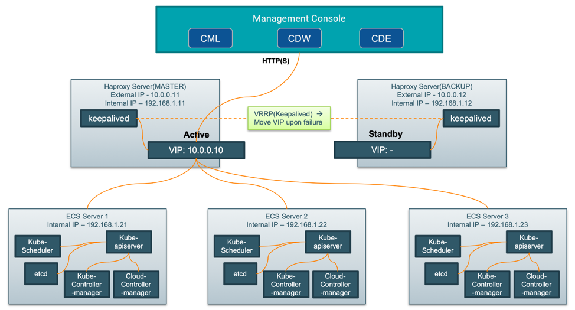

# Set Up Highly Available HAProxy Servers for ECS Cluster
{: .no_toc }

- TOC
{:toc}

---

## 1. Introduction

- The keepalived daemon can be used to monitor services or systems and to automatically failover to a standby if a failure occurs. VRRP (Virtual Router Redundancy Protocol) is a protocol for automatically assigning IP addresses to hosts.
- In this guide, we will demonstrate how to use keepalived to set up high availability for your load balancers. We will configure a floating IP address that can be moved between two capable load balancers. If the primary load balancer goes down, the floating IP will be moved to the second load balancer automatically, allowing Data Service to resume.

## 2. Prerequisites



- The above figure shows two HAProxy servers, which are connected to an externally facing network (10.0.0/24) as 10.0.0.11 and 10.0.0.12 and to an internal network (192.168.1/24) as 192.168.1.11 and 192.168.1.12. One HAProxy server (10.0.0.11) is configured as a Keepalived master server with the virtual IP address 10.0.0.10 and the other (10.0.0.12) is configured as a Keepalived backup server. Three ECS servers, ecssvr1 (192.168.1.21) ecssvr2 (192.168.1.22)  and ecssvr3 (192.168.1.23), are accessible on the internal network. The IP address 10.0.0.10 is in the private address range 10.0.0/24, which cannot be routed on the Internet.

- In order to complete this guide, you will need to build two HAProxy servers and reserve a VIP (Virtual IP Address). On each of HAProxy servers, you will need a non-root user configured with sudo access. 


## 3. Configure a Virtual IP Address

- For most cloud platforms, security modules like port security and security group will require that packets sent/received from a VM port must have the fixed IP/MAC address of this VM port. This rule prevents arp spoofing, but also causes the VIP to be unable to contact other VMs.

- For example, on the Openstack platform, an allowed address pair is needed when you identify a specific MAC address, IP address, or both to allow network traffic to pass through a port regardless of the subnet. When you define allowed address pairs, you are able to use protocols like VRRP (Virtual Router Redundancy Protocol) that float an IP address between two VM instances to enable fast data plane failover. See [Creating Multi-Master BareMetal Cluster on Platform9 Managed OpenStack VMs](https://platform9.com/kb/kubernetes/creating-multi-master-baremetal-cluster-on-platform9-managed-op).

- Please contact your system administrator for assistance in configuring VIP.


## 4. Install and Configure HAProxy

- Next, we will set up the HAProxy load balancers. These will each sit in front of ECS server and split requests between the three ECS servers. These load balancers are completely redundant. Only one will receive traffic at any given time.

### 4.1 Install HAProxy

- The first step we need to take on our load balancers will be to install the haproxy package. 

```bash
sudo yum install -y haproxy
sudo systemctl enable haproxy
```

### 4.2 Configure HAProxy

- The first item we need to modify when dealing with HAProxy is the /etc/haproxy/haproxy.cfg file. 

```bash
cat > /etc/haproxy/haproxy.cfg  << EOF
global
    log         127.0.0.1 local2
    chroot      /var/lib/haproxy
    pidfile     /var/run/haproxy.pid
    user        haproxy
    group       haproxy
    daemon

defaults
    mode                    tcp
    log                     global
    option                  tcplog
    option                  dontlognull
    option                  redispatch
    retries                 3
    maxconn                 5000
    timeout connect         5s
    timeout client          50s
    timeout server          50s

listen stats
    bind *:8081
    mode http
    stats enable
    stats refresh 30s
    stats uri /stats
    monitor-uri /healthz

frontend fe_k8s_80
    bind *:80
    default_backend be_k8s_80

backend be_k8s_80
    balance roundrobin
    mode tcp
    server feng-ws1.sme-feng.athens.cloudera.com 192.168.1.21:80 check
    server feng-ws2.sme-feng.athens.cloudera.com 192.168.1.22:80 check
    server feng-ws3.sme-feng.athens.cloudera.com 192.168.1.23:80 check

frontend fe_k8s_443
    bind *:443
    default_backend be_k8s_443

backend be_k8s_443
    balance roundrobin
    mode tcp
    server feng-ws1.sme-feng.athens.cloudera.com 192.168.1.21:443 check
    server feng-ws2.sme-feng.athens.cloudera.com 192.168.1.22:443 check
    server feng-ws3.sme-feng.athens.cloudera.com 192.168.1.23:443 check
EOF
```

- When you are finished making the above changes, save and close the file. 
    - Note: This file is exactly the same on both the primary haproxy server and the secondary haproxy server.

- Check that the configuration changes we made represent valid HAProxy syntax by typing:

```bash
sudo haproxy -f /etc/haproxy/haproxy.cfg -c
```

- If no errors were reported, restart your service on the two haproxy servers by typing:

```bash
sudo systemctl enable haproxy
sudo systemctl restart haproxy
```

## 5. Install and Configure Keepalived

### 5.1 Install Keepalived

- Our infrastructure is not highly available yet because we have no way of redirecting traffic if our active load balancer experiences problems. In order to rectify this, we will install the keepalived daemon on our load balancer servers. This is the component that will provide failover capabilities if our active load balancer becomes unavailable.

- Install the daemon by typing:

```bash
sudo yum install -y keepalived
sudo systemctl enable keepalived
```

- The daemon should be installed on both of the load balancer systems.

### 5.2 Create the Virtual IP Transition Scripts

- Next, we need to create a transition script that we can use to reassign the virtual IP address to the other HAProxy server whenever the local haproxy daemon abnormally interrupts.

```bash
sudo cat > /etc/keepalived/check_haproxy.sh   << EOF
#!/bin/bash
HAPROXY_STATUS=\$(ps ax | grep -w [h]aproxy)

if [ "\${HAPROXY_STATUS}" == "" ]; then
      echo "HAProxy is not running"
      killall keepalived
else
      echo "HAProxy is running"
fi
EOF

sudo chmod +x /etc/keepalived/check_haproxy.sh
```

### 5.3 Configure Keepalived for the Primary Load Balancer

- Next, on the load balancer server that you wish to use as your primary server, create the main keepalived configuration file. The daemon looks for a file called keepalived.conf inside of the /etc/keepalived directory.

```bash
sudo cat > /etc/keepalived/keepalived.conf   << EOF
! Configuration File for keepalived
global_defs {
  script_user root
  enable_script_security
}
vrrp_script check_haproxy {
  script "/etc/keepalived/check_haproxy.sh"
  interval 2
}
vrrp_instance VI_1 {
  state BACKUP
  interface eth0
  virtual_router_id 51
  priority 100
  advert_int 1
  nopreempt
  authentication {
    auth_type PASS
    auth_pass 1111
  }
  virtual_ipaddress {
    10.0.0.10
  }
  track_script {
    check_haproxy
  }
}
EOF
```

- Note: Both state of load balancers are set to BACKUP, **NOT** a MASTER + a BACKUP. In this case, the state of the two load balancers are equal, and unnecessary switching can be avoided.

### 5.4 Configure Keepalived for the Secondary Load Balancer

- Next, we will create the companion script on our secondary load balancer. Create a file as /etc/keepalived/keepalived.conf on your secondary server:

```bash
sudo cat > /etc/keepalived/keepalived.conf   << EOF
! Configuration File for keepalived
global_defs {
  script_user root
  enable_script_security
}
vrrp_script check_haproxy {
  script "/etc/keepalived/check_haproxy.sh"
  interval 2
}
vrrp_instance VI_1 {
  state BACKUP
  interface eth0
  virtual_router_id 51
  priority 90
  advert_int 1
  nopreempt
  authentication {
    auth_type PASS
    auth_pass 1111
  }
  virtual_ipaddress {
    10.0.0.10
  }
  track_script {
    check_haproxy
  }
}
EOF
```

- Inside, this script will be largely equivalent to the primary servers script. The items that we need to change are:
    - priority: This should be set to a lower value than the primary server. We will use the value 90 in this guide.


## 6. Start Up the Keepalived Service and Test Failover

### 6.1 VIP was assigned to the Primary Load Balancer 

- The keepalived daemon and all of its companion scripts should now be completely configured. We can start the service on both of our load balancers by typing:

```bash
sudo systemctl start keepalived
```

- Each daemon will monitor the local HAProxy process, and will listen to signals from the remote keepalived process.

- Your primary load balancer, which should have VIP assigned to it currently, will direct requests to each of ECS servers in turn. 

```console
[centos@haproxy1 ~]$ sudo systemctl status haproxy
 haproxy.service - HAProxy Load Balancer
   Loaded: loaded (/usr/lib/systemd/system/haproxy.service; enabled; vendor preset: disabled)
   Active: active (running) since Thu 2022-01-13 08:35:07 UTC; 2min 36s ago

[centos@haproxy1 ~]$ sudo systemctl status keepalived
 keepalived.service - LVS and VRRP High Availability Monitor
   Loaded: loaded (/usr/lib/systemd/system/keepalived.service; enabled; vendor preset: disabled)
   Active: active (running) since Thu 2022-01-13 08:35:07 UTC; 2min 41s ago

[centos@haproxy1 ~]$ ip a
2: eth0: <BROADCAST,MULTICAST,UP,LOWER_UP> mtu 1500 qdisc pfifo_fast state UP group default qlen 1000
    link/ether fa:16:3e:91:13:76 brd ff:ff:ff:ff:ff:ff
    inet 10.0.0.11/22 brd 10.0.0.255 scope global dynamic eth0
       valid_lft 68159sec preferred_lft 68159sec
    inet 10.0.0.10/32 scope global eth0
       valid_lft forever preferred_lft forever

[centos@haproxy2 ~]$ sudo systemctl status haproxy
 haproxy.service - HAProxy Load Balancer
   Loaded: loaded (/usr/lib/systemd/system/haproxy.service; enabled; vendor preset: disabled)
   Active: active (running) since Thu 2022-01-13 08:51:31 UTC; 22s ago

[centos@haproxy2 ~]$ sudo systemctl status keepalived
 keepalived.service - LVS and VRRP High Availability Monitor
   Loaded: loaded (/usr/lib/systemd/system/keepalived.service; enabled; vendor preset: disabled)
   Active: active (running) since Thu 2022-01-13 08:51:32 UTC; 22s ago

[centos@haproxy2 ~]$ ip a
2: eth0: <BROADCAST,MULTICAST,UP,LOWER_UP> mtu 1500 qdisc pfifo_fast state UP group default qlen 1000
    link/ether fa:16:3e:77:e9:c5 brd ff:ff:ff:ff:ff:ff
    inet 10.0.0.12/22 brd 10.0.0.255 scope global dynamic eth0
       valid_lft 69492sec preferred_lft 69492sec

[centos@haproxy2 ~]$ ping 10.0.0.10
PING 10.0.0.10 (10.0.0.10) 56(84) bytes of data.
64 bytes from 10.0.0.10: icmp_seq=1 ttl=64 time=1.25 ms
64 bytes from 10.0.0.10: icmp_seq=2 ttl=64 time=0.389 ms
64 bytes from 10.0.0.10: icmp_seq=3 ttl=64 time=0.330 ms
64 bytes from 10.0.0.10: icmp_seq=4 ttl=64 time=0.327 ms
64 bytes from 10.0.0.10: icmp_seq=5 ttl=64 time=0.327 ms
^C
--- 10.0.0.10 ping statistics ---
5 packets transmitted, 5 received, 0% packet loss, time 4001ms
rtt min/avg/max/mdev = 0.327/0.525/1.253/0.364 ms
```

### 6.2 VIP was took over by the Secondary Load Balancer 

- We can test failover in a simple way by simply turning off HAProxy on our primary load balancer:
sudo systemctl stop haproxy

- Both HAProxy and Keepalived service went down on the primary load balancer, so this indicated that our secondary load balancer has taken over. Using keepalived, the secondary server was able to determine that a service interruption had occurred. It then transitioned to the active state and claimed the virtual IP.

```console
[centos@haproxy1 ~]$ sudo systemctl status haproxy
 haproxy.service - HAProxy Load Balancer
   Loaded: loaded (/usr/lib/systemd/system/haproxy.service; enabled; vendor preset: disabled)
   Active: inactive (dead) since Thu 2022-01-13 08:55:53 UTC; 12s ago

[centos@haproxy1 ~]$ sudo systemctl status keepalived
 keepalived.service - LVS and VRRP High Availability Monitor
   Loaded: loaded (/usr/lib/systemd/system/keepalived.service; enabled; vendor preset: disabled)
   Active: inactive (dead) since Thu 2022-01-13 08:55:54 UTC; 13s ago

[centos@haproxy1 ~]$ ip a
2: eth0: <BROADCAST,MULTICAST,UP,LOWER_UP> mtu 1500 qdisc pfifo_fast state UP group default qlen 1000
    link/ether fa:16:3e:91:13:76 brd ff:ff:ff:ff:ff:ff
    inet 10.0.0.11/22 brd 10.0.0.255 scope global dynamic eth0
       valid_lft 67826sec preferred_lft 67826sec

[centos@haproxy1 ~]$ ping 10.0.0.10
PING 10.0.0.10 (10.0.0.10) 56(84) bytes of data.
64 bytes from 10.0.0.10: icmp_seq=1 ttl=64 time=0.366 ms
64 bytes from 10.0.0.10: icmp_seq=2 ttl=64 time=0.422 ms
64 bytes from 10.0.0.10: icmp_seq=3 ttl=64 time=0.449 ms
64 bytes from 10.0.0.10: icmp_seq=4 ttl=64 time=0.411 ms
64 bytes from 10.0.0.10: icmp_seq=5 ttl=64 time=0.365 ms
^C
--- 10.0.0.10 ping statistics ---
5 packets transmitted, 5 received, 0% packet loss, time 4000ms
rtt min/avg/max/mdev = 0.365/0.402/0.449/0.039 ms

[centos@haproxy2 ~]$ ping 10.0.0.10
PING 10.0.0.10 (10.0.0.10) 56(84) bytes of data.
64 bytes from 10.0.0.10: icmp_seq=1 ttl=64 time=1.25 ms
64 bytes from 10.0.0.10: icmp_seq=2 ttl=64 time=0.389 ms
64 bytes from 10.0.0.10: icmp_seq=3 ttl=64 time=0.330 ms
64 bytes from 10.0.0.10: icmp_seq=4 ttl=64 time=0.327 ms
64 bytes from 10.0.0.10: icmp_seq=5 ttl=64 time=0.327 ms
^C
--- 10.0.0.10 ping statistics ---
5 packets transmitted, 5 received, 0% packet loss, time 4001ms
rtt min/avg/max/mdev = 0.327/0.525/1.253/0.364 ms

[centos@haproxy2 ~]$ sudo systemctl status haproxy
 haproxy.service - HAProxy Load Balancer
   Loaded: loaded (/usr/lib/systemd/system/haproxy.service; enabled; vendor preset: disabled)
   Active: active (running) since Thu 2022-01-13 08:51:31 UTC; 6min ago

[centos@haproxy2 ~]$ sudo systemctl status keepalived
 keepalived.service - LVS and VRRP High Availability Monitor
   Loaded: loaded (/usr/lib/systemd/system/keepalived.service; enabled; vendor preset: disabled)
   Active: active (running) since Thu 2022-01-13 08:51:32 UTC; 6min ago

[centos@haproxy2 ~]$ ip a
2: eth0: <BROADCAST,MULTICAST,UP,LOWER_UP> mtu 1500 qdisc pfifo_fast state UP group default qlen 1000
    link/ether fa:16:3e:77:e9:c5 brd ff:ff:ff:ff:ff:ff
    inet 10.0.0.12/22 brd 10.0.0.255 scope global dynamic eth0
       valid_lft 69131sec preferred_lft 69131sec
    inet 10.0.0.10/32 scope global eth0
       valid_lft forever preferred_lft forever
```

### 6.3 VIP was regained by the Primary Load Balancer 

- We can start HAProxy and Keepalived on the primary load balancer again:

```bash
sudo systemctl start haproxy
sudo systemctl start keepalived
```

- At this time the secondary haproxy still holds the VIP.  This is because the state of the two load balancers are equal.

```console
[centos@haproxy1 ~]$ ip a
2: eth0: <BROADCAST,MULTICAST,UP,LOWER_UP> mtu 1500 qdisc pfifo_fast state UP group default qlen 1000
    link/ether fa:16:3e:91:13:76 brd ff:ff:ff:ff:ff:ff
    inet 10.0.0.11/22 brd 10.0.0.255 scope global dynamic eth0
       valid_lft 67591sec preferred_lft 67591sec

[centos@haproxy2 ~]$ ip a
2: eth0: <BROADCAST,MULTICAST,UP,LOWER_UP> mtu 1500 qdisc pfifo_fast state UP group default qlen 1000
    link/ether fa:16:3e:77:e9:c5 brd ff:ff:ff:ff:ff:ff
    inet 10.0.0.12/22 brd 10.0.0.255 scope global dynamic eth0
       valid_lft 69131sec preferred_lft 69131sec
    inet 10.0.0.10/32 scope global eth0
       valid_lft forever preferred_lft forever
```

- We can now stop HAProxy on the secondary load balancer:

```bash
sudo systemctl stop haproxy
```

- The primary load balancer will regain control of the virtual IP address immediately, and this will be rather transparent to the user.

```console
[centos@haproxy1 ~]$ sudo systemctl status haproxy
 haproxy.service - HAProxy Load Balancer
   Loaded: loaded (/usr/lib/systemd/system/haproxy.service; enabled; vendor preset: disabled)
   Active: active (running) since Thu 2022-01-13 09:00:02 UTC; 3min 30s ago

[centos@haproxy1 ~]$ sudo systemctl status keepalived
 keepalived.service - LVS and VRRP High Availability Monitor
   Loaded: loaded (/usr/lib/systemd/system/keepalived.service; enabled; vendor preset: disabled)
   Active: active (running) since Thu 2022-01-13 09:00:02 UTC; 3min 32s ago

[centos@haproxy1 ~]$ ip a
2: eth0: <BROADCAST,MULTICAST,UP,LOWER_UP> mtu 1500 qdisc pfifo_fast state UP group default qlen 1000
    link/ether fa:16:3e:91:13:76 brd ff:ff:ff:ff:ff:ff
    inet 10.0.0.11/22 brd 10.0.0.255 scope global dynamic eth0
       valid_lft 67380sec preferred_lft 67380sec
    inet 10.0.0.10/32 scope global eth0
       valid_lft forever preferred_lft forever

[centos@haproxy2 ~]$ sudo systemctl status haproxy
 haproxy.service - HAProxy Load Balancer
   Loaded: loaded (/usr/lib/systemd/system/haproxy.service; enabled; vendor preset: disabled)
   Active: inactive (dead) since Thu 2022-01-13 09:03:03 UTC; 1min 32s ago

[centos@haproxy2 ~]$ sudo systemctl status keepalived
 keepalived.service - LVS and VRRP High Availability Monitor
   Loaded: loaded (/usr/lib/systemd/system/keepalived.service; enabled; vendor preset: disabled)
   Active: inactive (dead) since Thu 2022-01-13 09:03:06 UTC; 1min 30s ago

[centos@haproxy2 ~]$ ip a
2: eth0: <BROADCAST,MULTICAST,UP,LOWER_UP> mtu 1500 qdisc pfifo_fast state UP group default qlen 1000
    link/ether fa:16:3e:77:e9:c5 brd ff:ff:ff:ff:ff:ff
    inet 10.0.0.12/22 brd 10.0.0.255 scope global dynamic eth0
       valid_lft 69492sec preferred_lft 69492sec

[centos@haproxy2 ~]$ ping 10.0.0.10
PING 10.0.0.10 (10.0.0.10) 56(84) bytes of data.
64 bytes from 10.0.0.10: icmp_seq=1 ttl=64 time=0.440 ms
64 bytes from 10.0.0.10: icmp_seq=2 ttl=64 time=0.291 ms
64 bytes from 10.0.0.10: icmp_seq=3 ttl=64 time=0.396 ms
64 bytes from 10.0.0.10: icmp_seq=4 ttl=64 time=0.417 ms
64 bytes from 10.0.0.10: icmp_seq=5 ttl=64 time=0.360 ms
^C
--- 10.0.0.10 ping statistics ---
5 packets transmitted, 5 received, 0% packet loss, time 4000ms
rtt min/avg/max/mdev = 0.291/0.380/0.440/0.057 ms
```

## 7. Conclusion

- In this guide, we walked through the complete process of setting up a highly available, load balanced infrastructure. This configuration works well because the active HAProxy server can distribute the load to the pool of ECS servers on the backend. 
- The virtual IP and keepalived configuration eliminates the single point of failure at the load balancing layer, allowing your service to continue functioning even when the primary load balancer completely fails. This configuration is fairly flexible and can be adapted to your own application environment by setting up your preferred web stack behind the HAProxy servers.
