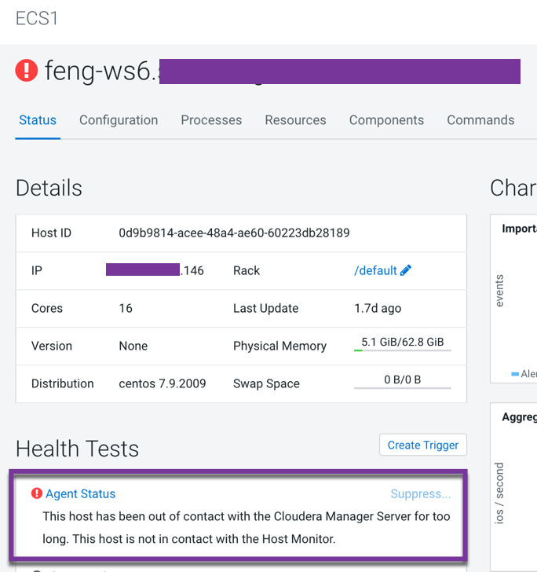
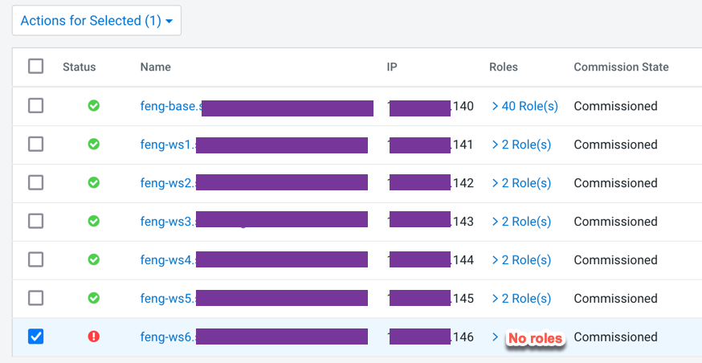
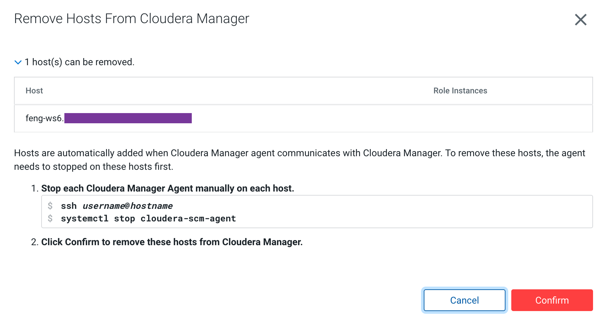

# Remove failed worker node from the existing ECS cluster
{: .no_toc }

- TOC
{:toc}

---

## 1. Introduction to the test environment

|CDP Runtime version |CDP PvC Base 7.1.7|
|CM version |Cloudera Manager 7.5.5|
|ECS version |CDP PvC DataServices 1.3.4|
|OS version |Centos 7.9|
|K8S version |RKE 1.21|
|Whether to enable Kerberos |Yes|
|Whether to enable TLS |Yes|
|Auto-TLS |No, using manual TLS|
|Kerberos |AD|
|LDAP |AD|
|DB Configuration |External Postgres 12|
|Vault |Embedded|
|Docker registry |Embedded|
|Install Method |Internet|

|IP addresss |hostname |description|
|192.168.8.140	|ds00.ecs.openstack.com |CDP Base cluster, only a single node|
|192.168.8.141	|ds01.ecs.openstack.com |ECS master node 1|
|192.168.8.142	|ds02.ecs.openstack.com |ECS master node 2|
|192.168.8.143	|ds03.ecs.openstack.com |ECS master node 3|
|192.168.8.144	|ds04.ecs.openstack.com |ECS worker node 1|
|192.168.8.145	|ds05.ecs.openstack.com |ECS worker node 2|
|192.168.8.146	|ds06.ecs.openstack.com |ECS worker node 3|

## 2. Check if node ds06.ecs.openstack.com is going down

- Error 1: Failed to receive heartbeat from agent ds06



- Error 2: Node ds06 is not ready
```bash
# kubectl get node
NAME                                    STATUS     ROLES                       AGE   VERSION
ds01.ecs.openstack.com   Ready      control-plane,etcd,master   22d   v1.21.8+rke2r2
ds02.ecs.openstack.com   Ready      control-plane,etcd,master   22d   v1.21.8+rke2r2
ds03.ecs.openstack.com   Ready      control-plane,etcd,master   22d   v1.21.8+rke2r2
ds04.ecs.openstack.com   Ready      <none>                      22d   v1.21.8+rke2r2
ds05.ecs.openstack.com   Ready      <none>                      22d   v1.21.8+rke2r2
ds06.ecs.openstack.com   NotReady   <none>                      22d   v1.21.8+rke2r2
```
- Error 3: Most of pods on Node ds06  are keeping in terminating state
```bash
# kubectl get pods -A -o wide --field-selector spec.nodeName=ds06.ecs.openstack.com
NAMESPACE                              NAME                                                              READY   STATUS        RESTARTS   AGE    IP               NODE                                    NOMINATED NODE   READINESS GATES
default-cbdec3c5-monitoring-platform   monitoring-prometheus-kube-state-metrics-6ffcdcb5b4-ljgfq         2/2     Terminating   0          2d1h   10.42.4.27       ds06.ecs.openstack.com   <none>           <none>
infra-prometheus                       infra-prometheus-operator-1-1652500324-prometheus-node-expgjddh   1/1     Running       0          22d    192.168.8.146   ds06.ecs.openstack.com   <none>           <none>
kube-system                            kube-proxy-ds06.ecs.openstack.com                  1/1     Running       0          2d6h   192.168.8.146   ds06.ecs.openstack.com   <none>           <none>
kube-system                            nvidia-device-plugin-daemonset-wnq8p                              1/1     Running       0          22d    10.42.4.5        ds06.ecs.openstack.com   <none>           <none>
kube-system                            rke2-canal-b8n4k                                                  2/2     Running       0          22d    192.168.8.146   ds06.ecs.openstack.com   <none>           <none>
longhorn-system                        engine-image-ei-d4c780c6-zwmbm                                    1/1     Running       0          22d    10.42.4.4        ds06.ecs.openstack.com   <none>           <none>
longhorn-system                        instance-manager-e-da42b727                                       1/1     Terminating   0          2d2h   10.42.4.15       ds06.ecs.openstack.com   <none>           <none>
longhorn-system                        instance-manager-r-c7bd215e                                       1/1     Terminating   0          2d2h   10.42.4.16       ds06.ecs.openstack.com   <none>           <none>
longhorn-system                        longhorn-csi-plugin-28rv2                                         2/2     Running       0          22d    10.42.4.3        ds06.ecs.openstack.com   <none>           <none>
longhorn-system                        longhorn-manager-zh9f9                                            1/1     Running       0          22d    10.42.4.6        ds06.ecs.openstack.com   <none>           <none>
shared-services                        log-router-979c8                                                  2/2     Running       0          10d    10.42.4.2        ds06.ecs.openstack.com   <none>           <none>
```

## 3. Remove node from Kubernetes Cluster

- Delete node using kubectl commands
```bash
# kubectl delete node ds06.ecs.openstack.com
node "ds06.ecs.openstack.com" deleted
```
- Check the status of available nodes and now we don't see ds06 again
```bash
# kubectl get node
NAME                                    STATUS   ROLES                       AGE   VERSION
ds01.ecs.openstack.com   Ready    control-plane,etcd,master   22d   v1.21.8+rke2r2
ds02.ecs.openstack.com   Ready    control-plane,etcd,master   22d   v1.21.8+rke2r2
ds03.ecs.openstack.com   Ready    control-plane,etcd,master   22d   v1.21.8+rke2r2
ds04.ecs.openstack.com   Ready    <none>                      22d   v1.21.8+rke2r2
ds05.ecs.openstack.com   Ready    <none>                      22d   v1.21.8+rke2r2
```
- Pods in terminating state can be removed from the apiserver after the failed Node is manually deleted.


## 4. Remove node From ECS Cluster

- In the Cloudera Manager Admin Console, go to Hosts > All Hosts. Select the hosts to delete.


- Select Actions for Selected > Remove From Cluster. The Remove Hosts From Cluster dialog box displays.


- Leave the selections to decommission roles and skip removing the Cloudera Management Service roles. Click Confirm to proceed with removing the selected hosts.


## 5. Remove node From Cloudera Manager

- In the Cloudera Manager Admin Console, go to Hosts > All Hosts. Select the hosts to delete.



- Select Actions for Selected > Remove from Cloudera Manager.


- Click Confirm to remove the failed host from Cloudera Manager.




## 6. Destroy node ds06

- If you want to replace this failed node with a new one, you need to destroy node ds06, then see the steps in the [docs](https://fxu1024.github.io/docs/ds/addworknode/).

