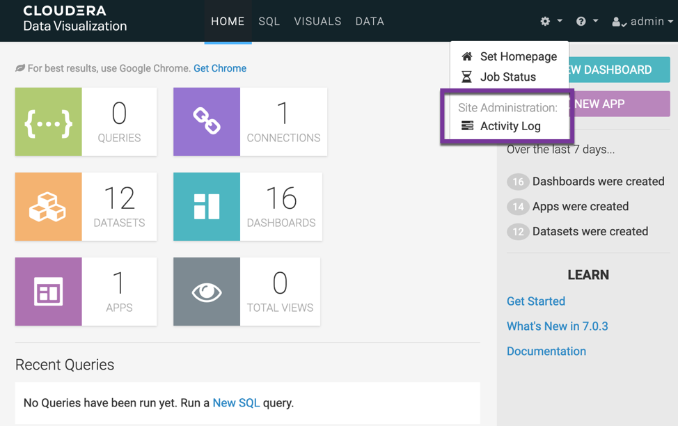

# SSO permission for Cloudera Viz in CDW+CML
{: .no_toc }

- TOC
{:toc}

---

- SSO will be enabled for Cloudera Viz after being launched as an application within CML or an instance within CDW. SSO users will have various types of roles:

|Role Type|Role Name|Description|
|Environment role|MLUser/MLAdmin/DWUser/DWAdmin|Provide permissions to perform tasks on a specific resource, such as a CDW virtual warehouse/CML workspace|
|CML workspace role|Owner/Contributor/Operator/Viewer|Restrict Access to CML Project/Session/Job|
|Viz role|System Admin/Database Admin/Analyst/Visual Consumer|Restrict Access to Viz connection/dataset/dashboard|

- Note: There are no CDW-related roles, however Viz in CDW is actually restricted by built-in groups as following:

|Group Type|Description|
|user groups|The Non-Administrator user group specified when deploying CDV instance|
|admin groups|The Administrator user group specified when deploying CDV instance|

- This topic will show you how to effectively combine these roles and user groups.

## 1. Introduction to the test environment

|CDP Runtime version |CDP PvC Base 7.1.7 SP2|
|CM version |Cloudera Manager 7.9.5|
|ECS version |CDP PvC DataServices 1.5.0|
|OS version |Centos 7.9|
|K8S version |RKE 1.21|
|Whether to enable Kerberos |Yes|
|Whether to enable TLS |Yes|
|Auto-TLS |Yes|
|Kerberos |FreeIPA|
|LDAP |FreeIPA|
|DB Configuration |PostgreSQL 10.21|
|Vault |Embedded|
|Docker registry |Embedded|
|Install Method |Internet|

## 2. Preparation for test environment

- Let's add three LDAP user groups, i.e. `cdwusers`,`cmlusers`,`cdeusers`, each group contains 2 users. Please select the `Sync Groups on Login` option from Management Console > Administration > Authentication, so that the associated LDAP groups can be imported when you log in to CDV. 

- For example: group `cdwusers` contains two users `cdw01` and `cdw02`.

- Assign the Environment role `DWUser` + `MLUser` to all three groups.

## 3. Viz in CDW test

- The cdv application is created by the user `admin`, with the group setting `user groups` =  `cmlusers`, and `admin groups` = `cdwusers`.
 

- Log in as `admin`, even if `admin` is the project owner, you still cannot log in to CDV UI because `admin` neither belongs to `user groups` nor `admin groups`.

- Log in as `cdw01`, you can see the site administrator menu since `cdw01` belongs to `admin groups`.

- Log in as `cml01`, you cannot see the site administrator menu since `cml01` belongs to `user groups`.

- Log in as `cde01`. you cannot log in to the CDV UI since `cde01` does not belong to either `user groups` or `admin groups`. user `cde01` and `admin` have the same behavior.

- Log in again as `cdw01`, and view user and user group permissions.
    - It shows that `cdw01` is Viz Administrator, and cml01 is Viz Normal user. 

- The Normal user `cml01` is automatically assigned to the group `viz_guest_group` which has the role `Database admin`. This can be confirmed from the figure below.

 
- Manually assign the role `system admin` to `cde01` and `cml01`:

- Log in as `cde01`, you still can't access CDV UI:

- Log in as `cml01`, you can see the site administrator menu although `cml01` is a Viz Normal user.

## 4. Viz in CML test

- The cdv application is created by the user `admin`.

- Since the CDV application belongs to the project `test01`, it can only be accessed by the project owner `admin`. The other users(`cdw01`,`cml01`,`cde01`) must be added as project collaborators.

- Log in as `admin` and it is only a Viz Normal user. 

- `cdw01`/`cml01`/`cde01` are also the Viz Normal users and cannot see the Site Administration menu.

- Log in as the built-in administration user `vizapps_admin`(password=vizapps_admin) and view all user and user group permissions.

- Every users are automatically assigned to the group `viz_guest_group`, which has the role `Database admin`. This can be confirmed from the following figure.

- Manually assign the role `system admin` to the group `viz_guest_group`:

- User `Admin` can see the Site Adminsitration menu now.

- Other users(such as cde01) become Viz administrator as well.

## 5. Conclusion

- CDV is not a standalone application/instance and it is currently parasitic on CDW/CML, so the logged-in user is also an SSO user of CDW or CML.

- For Viz in CDW:
    - SSO users must have permission to access CDW resources, i.e. they need to be assigned the role `DWUser`/`DWAdmin`.
    - SSO users are filtered by `user groups` and `admin groups` in the definition of CDV instance. 
        - If the SSO user belongs to `admin groups`, it will automatically become a Viz administrator.
        - If the SSO user belongs to `user groups`, it is automatically assigned to the group `viz_guest_group` which has role `Database Admin`. You can grant them other Viz permissions through Viz Administrator.
        - The SSO Users outside these groups cannot access the Viz application, and Viz permissions are invalid for them.

- For Viz in CML:
    - SSO users must have permission to access CML resources, i.e. they need to be assigned the role `MLUser`/`MLAdmin`.
    - If the SSO user is not the project owner, it must be the project collaborator to have access to the Viz application.
    - The SSO users are automatically assigned to the group `viz_guest_group` which has role `Database Admin`. You can grant them other Viz permissions through Viz Administrator.
