# Trino in Data Service 1.5.5 SP1
{: .no_toc }

- TOC
{:toc}

---

## 1. Introduction to the test environment

|CDP Runtime version |CDP PvC Base 7.1.9 SP1 - cdh7.1.9.p1064|
|CM version |Cloudera Manager 7.13.1.501|
|ECS version |CDP PvC DataServices 1.5.5 SP1|
|Trino version |0.451.1|
|Java version |17.0.17|
|Python version |3.8.8|
|MAC OS version |15.7.2 Sequoia|
|Processor Type |Apple M3 Pro|


## 2. Basic Concept

- Cloudera Data Services On Premises 1.5.5 SP1 introducd support for creating and managing Trino Virtual Warehouses. This enables you to leverage Trino's powerful distributed SQL query engine to efficiently query large datasets across heterogeneous data sources.
- Trino is in Technical Preview and is not ready for production deployments. Cloudera recommends trying this feature in test or development environments and encourages you to provide feedback on your experiences.


## 3. Creating Trino Virtual Warehouse

- Before you begin:
    - Activate your environment for use in CDW
    - Configure LDAP authentication for CDW
    - Grant the DWAdmin role to the user or group that needs to create a Virtual Warehouse

- From the Cloudera Data Warehouse Overview page, click the Virtual Warehouses tab and click New Virtual Warehouse.

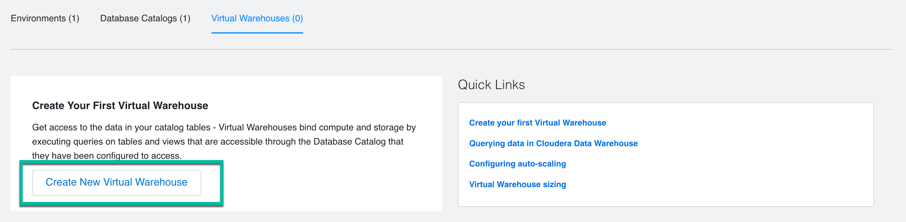

- Create the new Trino Virtual Warehouse:
    - Select the Trino type of Virtual Warehouse.
    - Select the Environment and Database Catalog for this Virtual Warehouse.
    - Select the Resource Pool that allows resources to be allocated for the Virtual Warehouse.
    - Select the Size of your Trino Virtual Warehouse.
    - Uncheck the "Enable Auto Suspend" checkbox so that VW can provide permanent access.
    - Select a Kubernetes Resource Template for the Virtual Warehouse.
    - Click Create Virtual Warehouse.

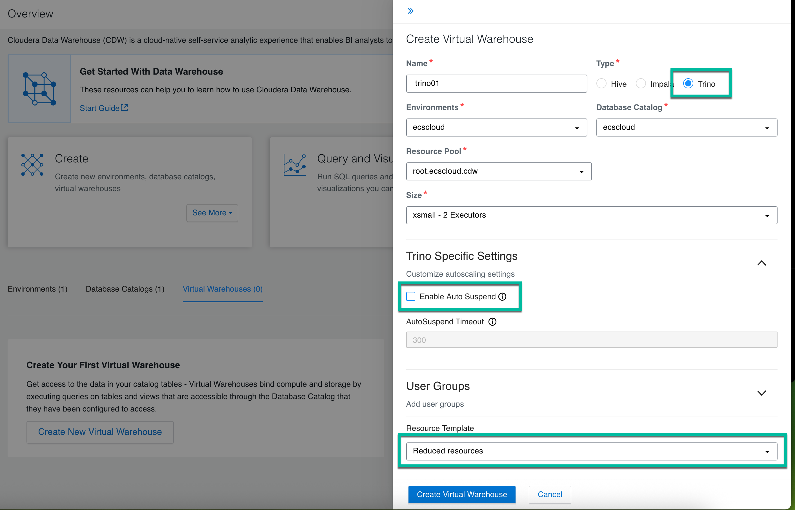

- You can start running workloads in the new Trino Virtual Warehouse.

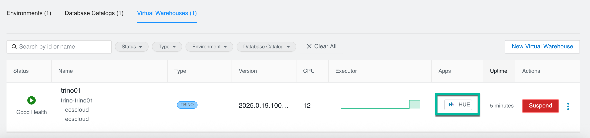


## 4. Querying data via Trino Virtual Warehouse

### 4.1. Adding user admin to the relevant Ranger service policies

- In Cloudera Manager, click Clusters > Ranger > Ranger Admin Web UI, enter your username and password, and then click Sign In.
- From the Service Manager page, click the `cm_trino` service.
- In the TRINO Policies page of the `cm_trino` service, click edit against the following policies and include the logged-in user or resource owner in the Allow Conditions:
    - all – trinouser
    - all – catalog, schema, table, column
- Click Save to apply the changes.

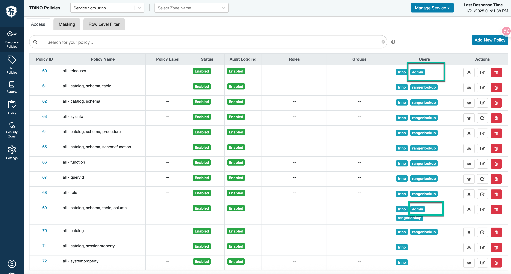

### 4.2. Submitting queries with Hue

- You can write and edit queries for Trino Virtual Warehouses in the Cloudera Data Warehouse service by using Hue.
    - Click a database to view the tables it contains.
    - Type a query in the editor panel and click   to run the query.
    - The built-in catalog includes: system, tpcds, tpch, iceberg, hive.

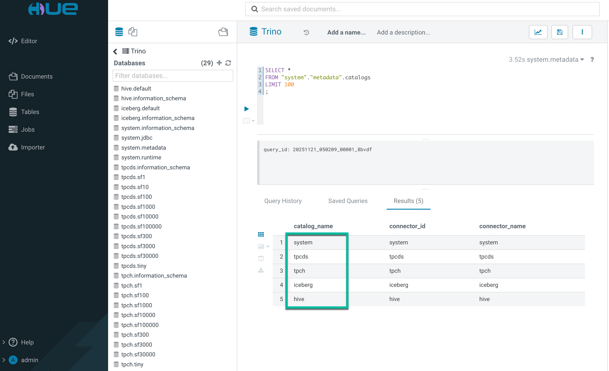


### 4.3. Submitting queries with Trino CLI

- Log in to the Cloudera web interface and navigate to the Cloudera Data Warehouse service. In the Overview page of the Cloudera Data Warehouse, click See More in the Resources and Downloads tile. Select Trino CLI and click to download the trino-cli-executable.jar file.

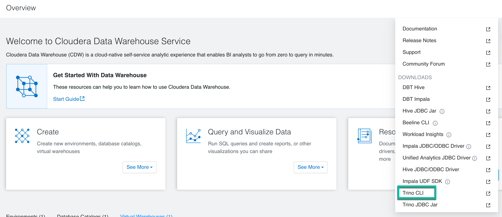

- In the Data Warehouse service Overview page, for the Virtual Warehouse you want to connect to the client, click and select `Copy Trino URL` and `Download Kubenetes cluster certificate`.

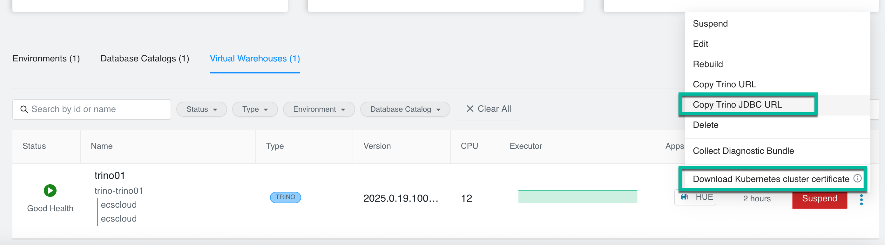

    - Trino URL: https://trino01.apps.ecscloud.iopscloud.cloudera.com:443
    - Kubenetes cluster certificate: truststore.jks

- 
```console
chmod +x trino-cli-executable.jar
mv trino-cli-executable.jar trino
./trino https://trino01.apps.ecscloud.iopscloud.cloudera.com:443 --truststore-path=./truststore.jks --truststore-password=changeit --user admin --password --catalog hive
```

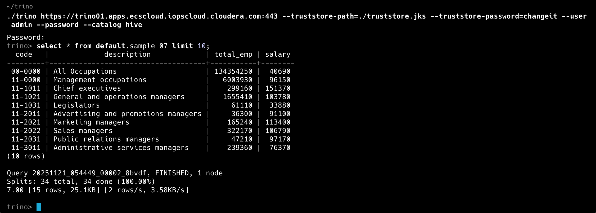


### 4.4. Submitting queries with cloudbeaver

- Build and deploy cloudbeaver

```console
docker pull dbeaver/cloudbeaver

docker run -d \
  --name cloudbeaver \
  -p 8978:8978 \
  dbeaver/cloudbeaver

docker cp truststore.jks cloudbeaver:/opt/cloudbeaver/conf/
```

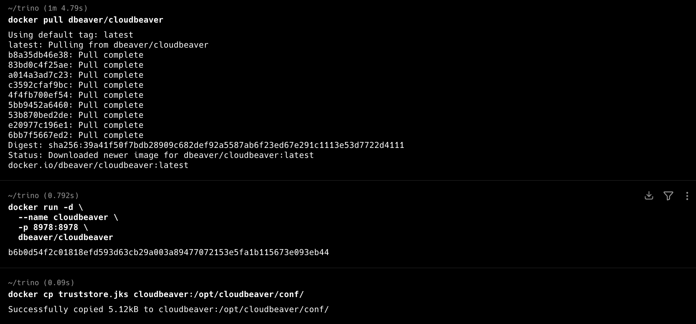

- Navigate to `http://localhost:8978`. Click `New Connection` and Select `Trino`.

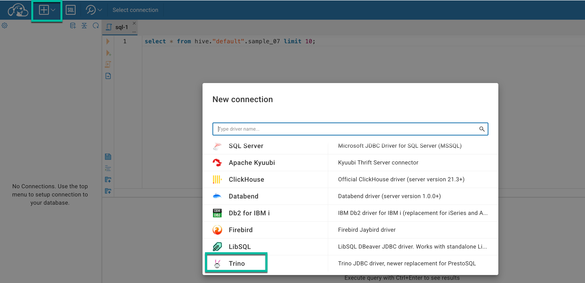

- In the `MAIN` window, select URL and enter the JDBC URL.

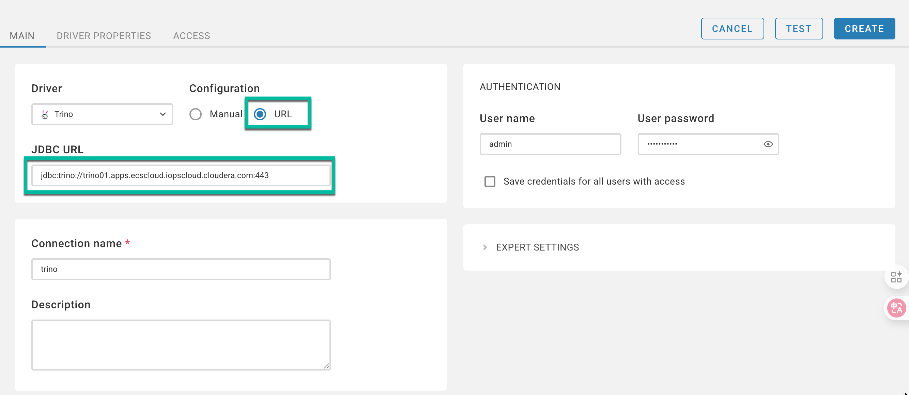

- In the `DRIVER PROPERTIES` window, add the following property:

```console
SSL=true
SSLTrustStorePath=/opt/cloudbeaver/conf/truststore.jks
SSLTrustStorePassword=changeit
SSLVerification=CA
```

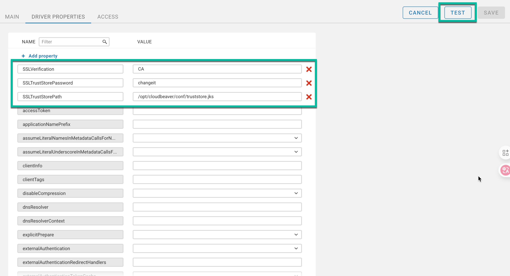

- Click `TEST` button and Connection is established.

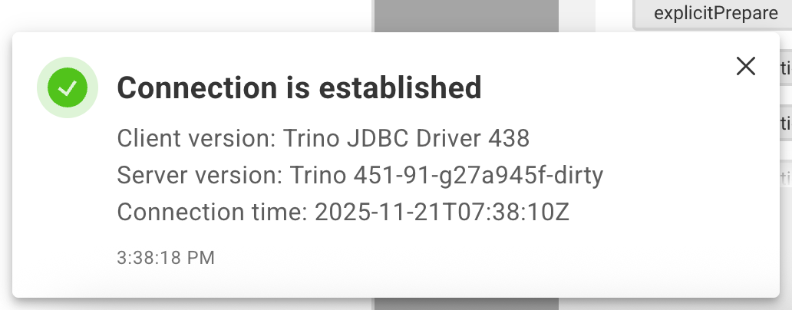

- Open the SQL Editor and execute SQL.

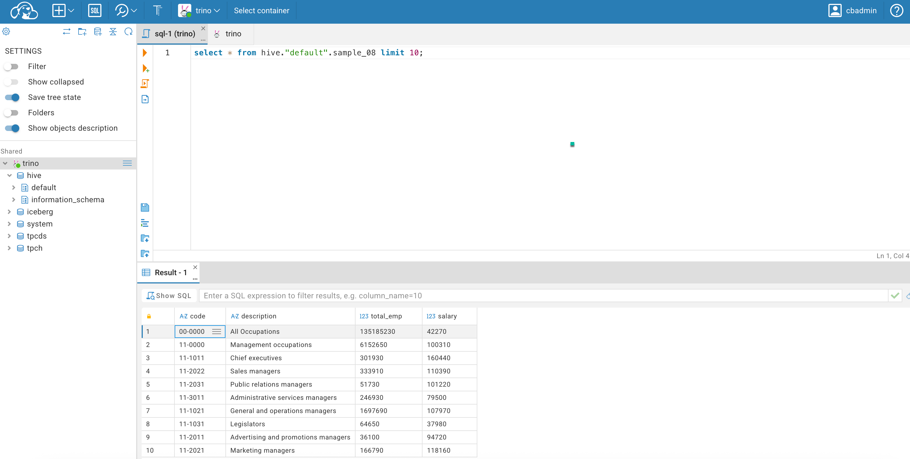


## 5. Configuring Federation Connectors

- You can use Cloudera Data Warehouse to configure a connector for a data source, enabling a Trino Virtual Warehouse to access the data source. Cloudera enables you to configure connectors for the following data sources:
    - PostgreSQL
    - MySQL
    - Snowflake
    - AWSRedshift
    - Hive
    - Iceberg
    - Oracle
    - MariaDB

- You must register a secret for your Environment:
    - From the Overview page, click the Environments tab and identify the Environment against which you want to register the secret, and then click > Edit. 
    - In the Environment details page, click the SECRETS tab.
    - Click Create Secret and enter the following information in the Create Secret modal:
        - Enter a name for the secret.
        - Enter a value for the secret.
    - Click Create and then click Apply Changes. The registered secret is listed in the Secrets page and can be used while creating a connector.

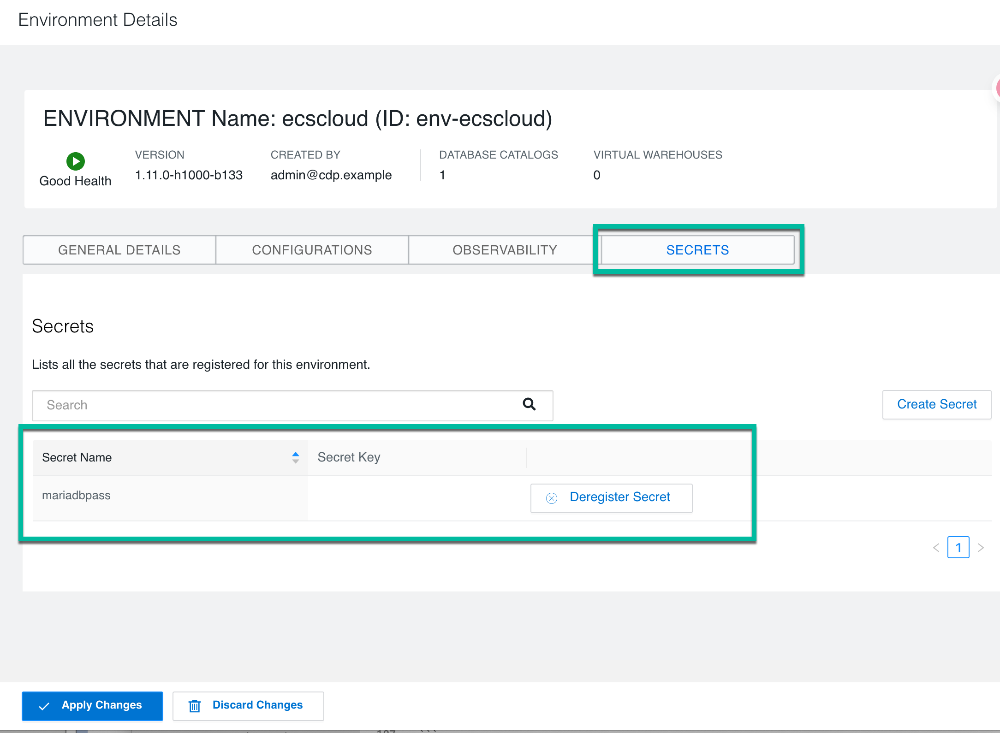

- Log in to the Cloudera Data Warehouse service and click Federation Connectors. The Federation Connectors page is displayed that lists all the currently configured connectors. Click `New Connector` to create a new data source.

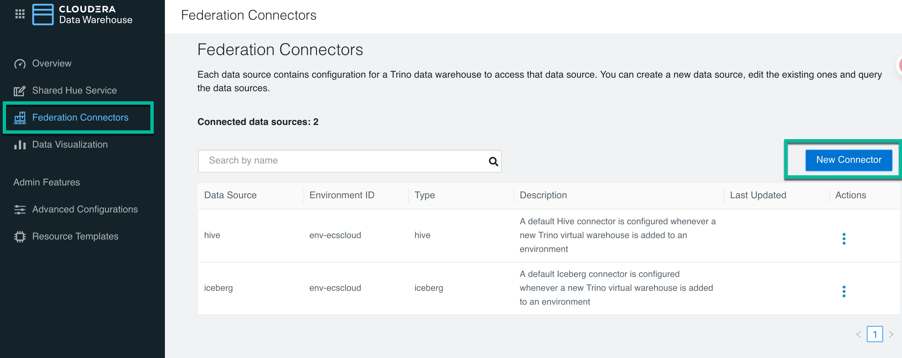

- In the Data Source Type page, select `MariaDB` and then click Next.

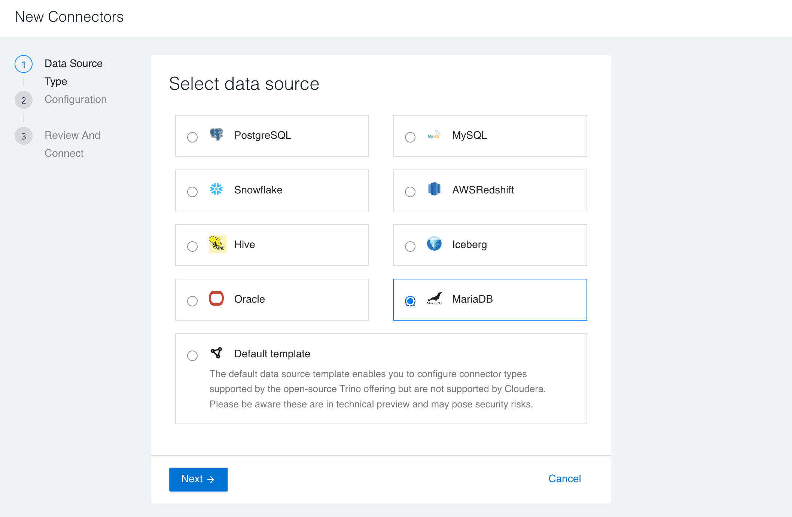

- In the Configuration Details page, enter the following information:
    - Provide a name and description for the connector.
    - Select the appropriate environment.
    - Enter the appropriate URL to connect to the required data source.
    - Enter the connection user name and select a registered secret.
    - Click Test Connection to verify if the configurations are correct to establish a successful connection to the data source.

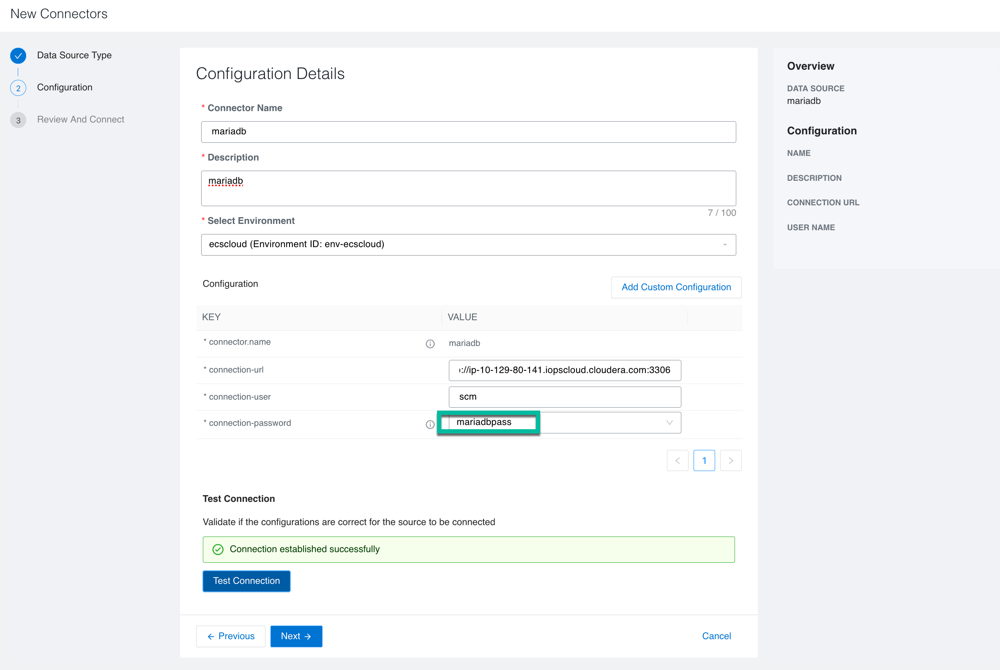

- The connector is created successfully and is listed in the Federation Connectors page.

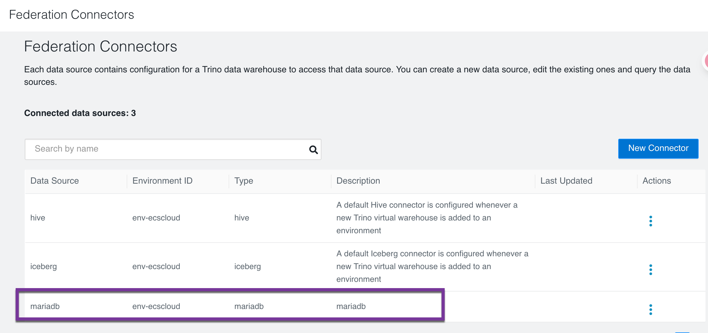

- Associating connectors to a Virtual Warehouse:
    - Log in to the Cloudera Data Warehouse service. From the Overview page, click the Virtual Warehouses tab and click > Edit against the required Trino Virtual Warehouse.
    - In the Virtual Warehouse details page, click the Federation Connectors tab.
    - Select the connector `mariadb` that is not associated with the Virtual Warehouse.
    - Click Apply Changes.

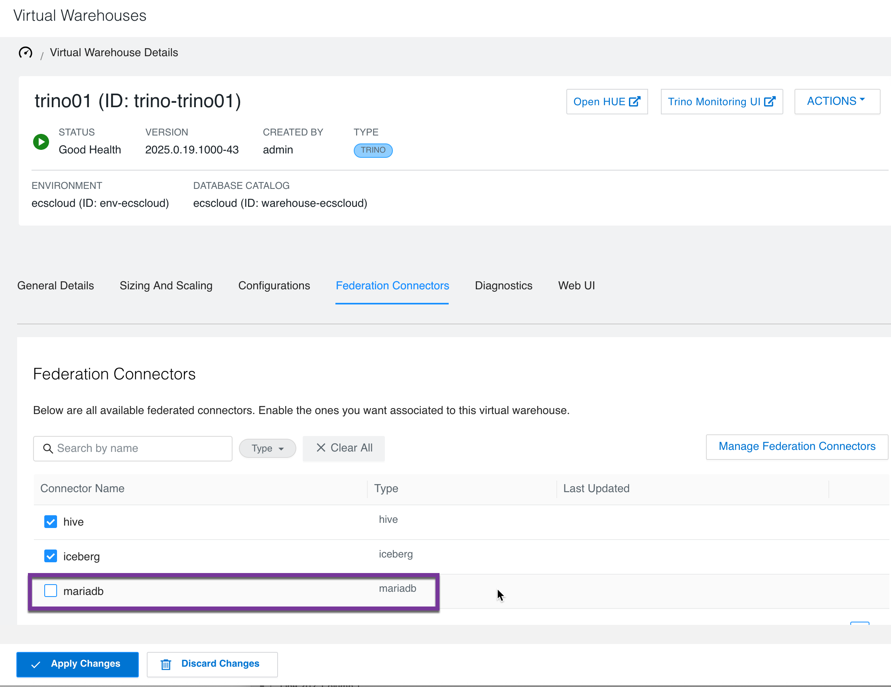

- The connector is associated with the Virtual Warehouse and you can now query data from the respective data source.

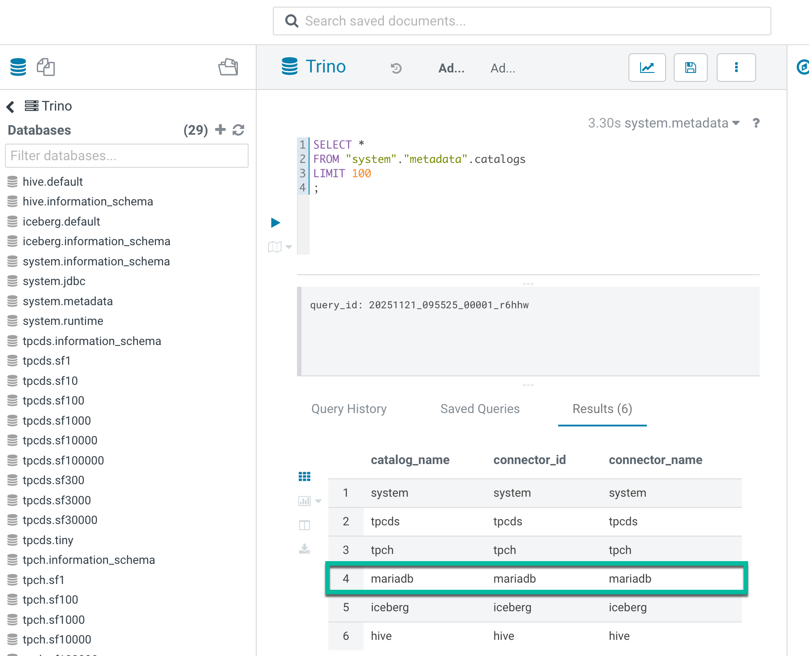

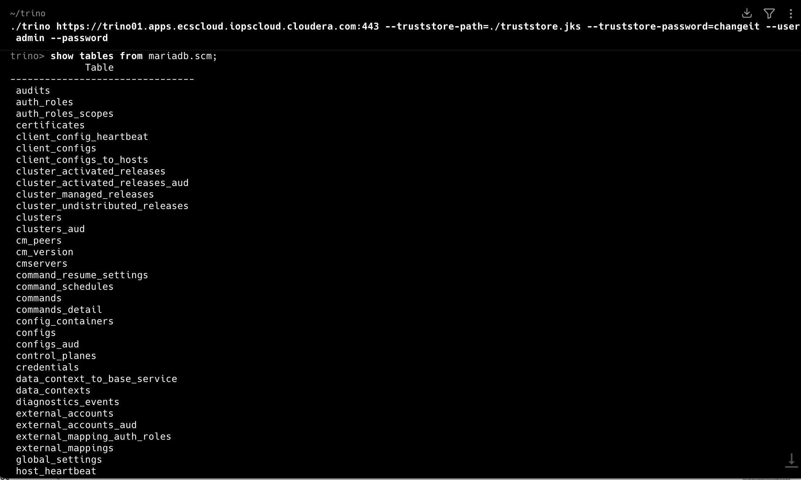


## 6. Query Monitoring

- Trino Coordinator Web UI (https://trino01.apps.ecscloud.iopscloud.cloudera.com:443/ui/) provides a lightweight, real-time interface that helps administrators and developers monitor and manage the state of a Trino cluster.
    - Monitor Running and Completed Queries
        - Displays all active, queued, and finished queries.
        - Shows query details such as SQL text, execution stages, tasks, memory usage, and performance metrics.
        - Helps identify slow or blocked queries.
    - Track Cluster and Node Status
        - Shows all worker nodes and their states (active, offline, shutting down).
        - Displays resource utilization for each node: CPU, memory, and running tasks.
        - Helps diagnose node failures or performance bottlenecks.
    - Monitor Resource Utilization
        - Provides an overview of cluster-wide memory usage (user memory, system memory, total memory).
        - Shows spill usage and other execution-related metrics.

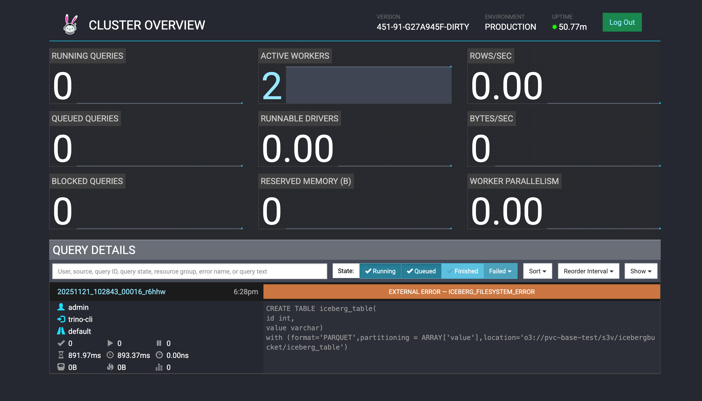
