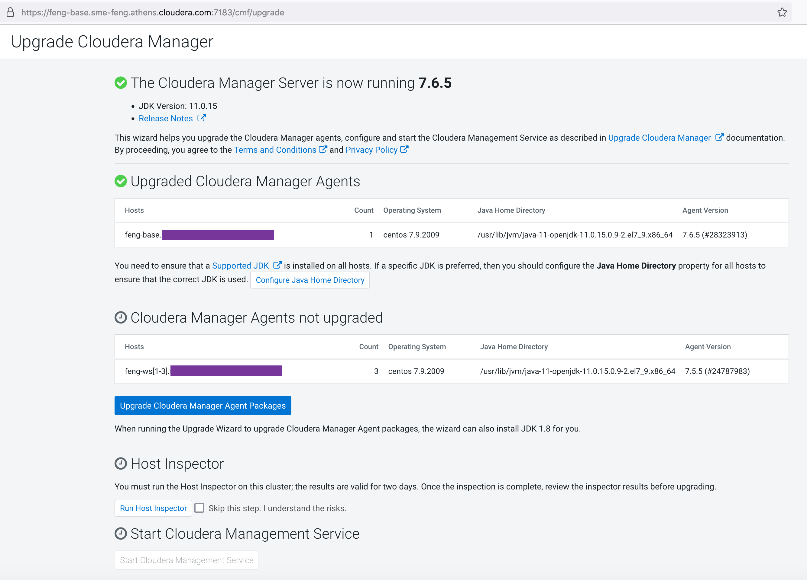
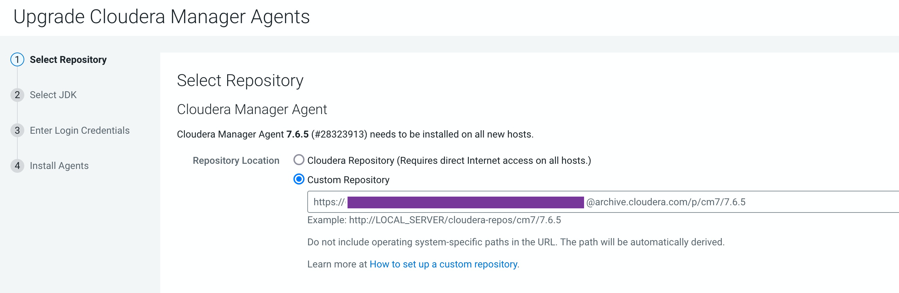
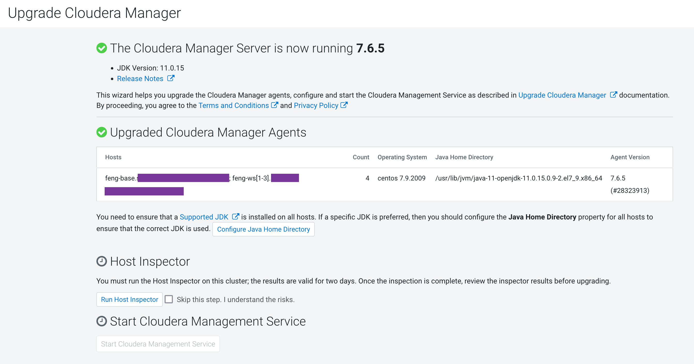
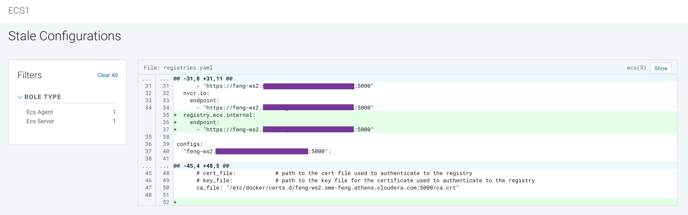
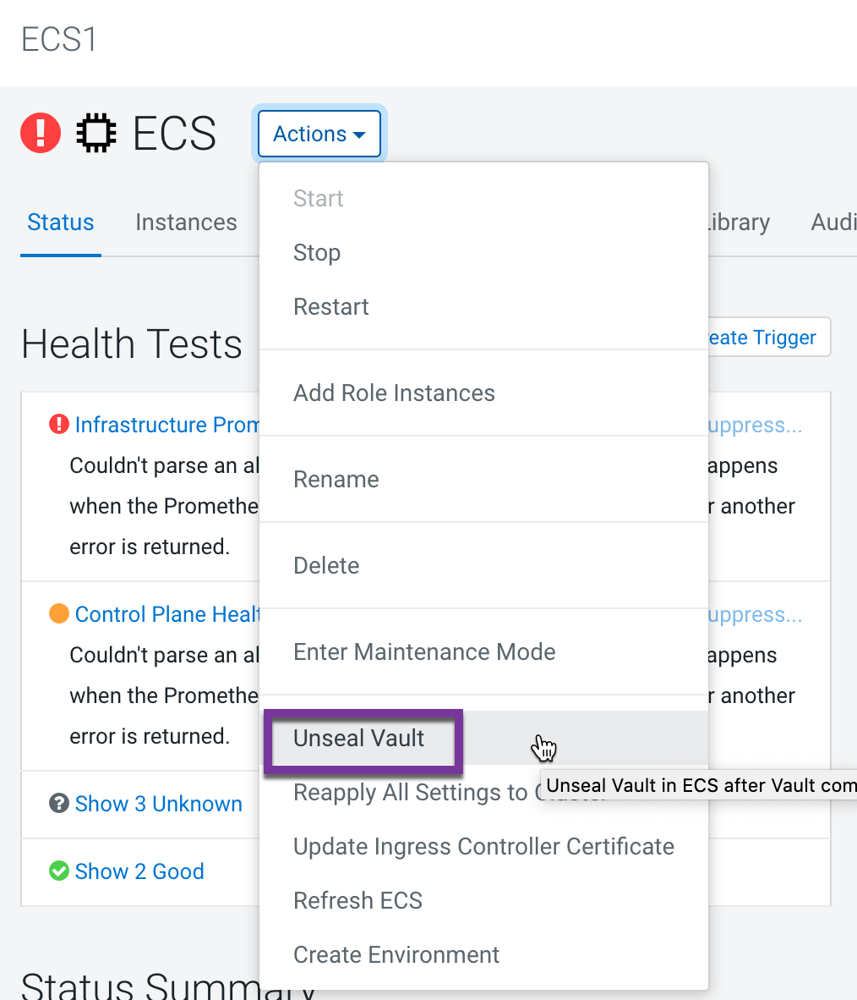
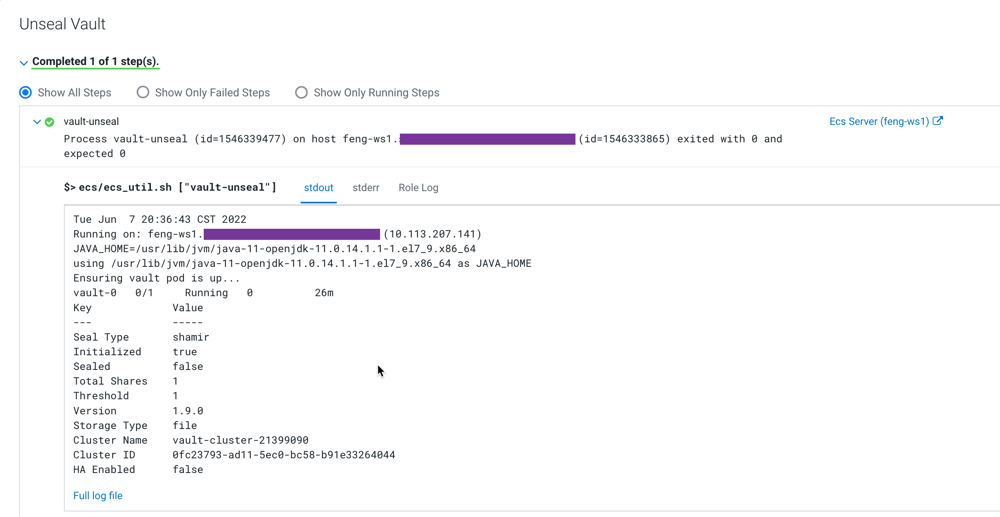
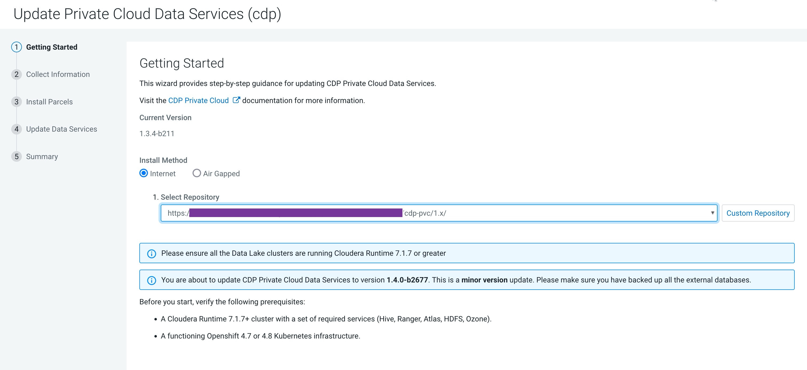
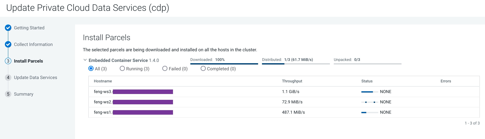

# Upgrade from ECS 1.3.4 to 1.4.0
{: .no_toc }

- TOC
{:toc}

---

## 1. Introduction to the test environment

|CDP Runtime version |CDP PvC Base 7.1.7 -> 7.1.7 SP1|
|CM version |Cloudera Manager 7.5.5 -> 7.6.5|
|ECS version |CDP PvC DataServices 1.3.4 -> 1.4.0|
|OS version |Centos 7.9|
|K8S version |RKE 1.21|
|Whether to enable Kerberos |Yes|
|Whether to enable TLS |Yes|
|Auto-TLS |No, using manual TLS|
|Kerberos |AD|
|LDAP |AD|
|DB Configuration |External Postgres 12|
|Vault |Embedded|
|Docker registry |Embedded|
|Install Method |Internet|

|IP addresss |hostname |description|
|192.168.8.140	|ds00.ecs.openstack.com |CDP Base cluster, only a single node|
|192.168.8.141	|ds01.ecs.openstack.com |ECS master node 1|
|192.168.8.142	|ds02.ecs.openstack.com |ECS worker node 1|
|192.168.8.143	|ds03.ecs.openstack.com |ECS worker node 2|

## 2. Upgrade from Cloudera Manager 7.5.5 to 7.6.5

### 2.1 Back Up Cloudera Manager

- Log in to the Cloudera Manager Server host and collect database information.
```bash
# cat /etc/cloudera-scm-server/db.properties
```

```console
com.cloudera.cmf.db.type=postgresql
com.cloudera.cmf.db.host=ds00.ecs.openstack.com:5432
com.cloudera.cmf.db.name=scm
com.cloudera.cmf.db.user=scm
com.cloudera.cmf.db.setupType=EXTERNAL
com.cloudera.cmf.db.password=xxx
```

- Create a top level backup directory.
```bash
export CM_BACKUP_DIR="`date +%F`-CM765"
echo $CM_BACKUP_DIR
mkdir -p $CM_BACKUP_DIR
```

- Stop the Cloudera Management Service.
   - Log in to the Cloudera Manager Admin Console.
   - Select Clusters > Cloudera Management Service.
   - Select Actions > Stop.

- Stop the Cloudera Manager Server and Agent.
```bash
systemctl stop cloudera-scm-server
systemctl stop cloudera-scm-agent
```

- Back Up CM Agent/Repository/Cloudera Management Service/PG database/CM Server.

```bash
export DB_HOST=ds00.ecs.openstack.com
tar -zcPf ${CM_BACKUP_DIR}/cloudera-scm-agent.tar --exclude=*.sock /etc/cloudera-scm-agent /etc/default/cloudera-scm-agent /var/run/cloudera-scm-agent /var/lib/cloudera-scm-agent
```

```bash
tar -zcPf ${CM_BACKUP_DIR}/repository.tar /etc/yum.repos.d
```

```bash
cp -rp /var/lib/cloudera-service-monitor /var/lib/cloudera-service-monitor-${CM_BACKUP_DIR}
cp -rp /var/lib/cloudera-host-monitor /var/lib/cloudera-host-monitor-${CM_BACKUP_DIR}
cp -rp /var/lib/cloudera-scm-eventserver /var/lib/cloudera-scm-eventserver-${CM_BACKUP_DIR}
```

```bash
pg_dump -h ${DB_HOST} -U scm -W -p 5432 scm > $HOME/scm-backup-${CM_BACKUP_DIR}
pg_dump -h ${DB_HOST} -U rman -W -p 5432 rman > $HOME/rman-backup-${CM_BACKUP_DIR}
```

```bash
tar -zcPf ${CM_BACKUP_DIR}/cloudera-scm-server.tar /etc/cloudera-scm-server /etc/default/cloudera-scm-server
tar -zcPf ${CM_BACKUP_DIR}/cloudera-scm-server.tar /etc/cloudera-scm-server /etc/default/cloudera-scm-server
```

### 2.2 Upgrade Cloudera Manager Server

- Create a file named /etc/yum.repos.d/cloudera-manager.repo with the following content:
```bash
echo "[cloudera-manager]
baseurl = https://archive.cloudera.com/p/cm7/7.6.5/redhat7/yum
enabled = 1
gpgcheck = 1
gpgkey = https://archive.cloudera.com/p/cm7/7.6.5/redhat7/yum/RPM-GPG-KEY-cloudera
name = Cloudera Manager
password = xxx
username = xxx" > /etc/yum.repos.d/cloudera-manager.repo
```

- Stop the Cloudera Management Service.
   - Log in to the Cloudera Manager Admin Console.
   - Select Clusters > Cloudera Management Service.
   - Select Actions > Stop.

- Stop Cloudera Manager Server & Cloudera Manager Agent.
```bash
systemctl stop cloudera-scm-server
systemctl stop cloudera-scm-agent
```

- Upgrade the packages.
```bash
yum clean all
yum upgrade cloudera-manager-server cloudera-manager-daemons cloudera-manager-agent
```

- Verify the packages.
```bash
# rpm -qa 'cloudera-manager-*'
```

```console
cloudera-manager-server-7.6.5-28323913.el7.x86_64
cloudera-manager-daemons-7.6.5-28323913.el7.x86_64
cloudera-manager-agent-7.6.5-28323913.el7.x86_64
```

- Start the Cloudera Manager Agent.
```bash
systemctl start cloudera-scm-agent
systemctl status cloudera-scm-agent
```

- Start the Cloudera Manager Server.
```bash
systemctl start cloudera-scm-server
systemctl status cloudera-scm-server
```

### 2.3 Upgrade Cloudera Manager Agent

- Use a Web browser to open the Cloudera Manager Admin Console using the following URL: `https://ds00.ecs.openstack.com:7183/cmf/upgrade`. The Upgrade Cloudera Manager screen displays:



- Click Upgrade Cloudera Manager Agent packages. The Upgrade Cloudera Manager Agent Packages page displays the Select Repository step.

- Select the Custom Repository and enter the Custom Repository URL. Click Continue.



- Select JDK screen displays the available options for the JDK used in the cluster. Choose `Manually Manage JDK` and Click Continue.


- Specify the credentials and initiate Agent installation. Click Continue.


- When the installations are complete, click Finish. The Upgrade Cloudera Manager page displays the status of the upgrade. If you see a message listing Cloudera Manager Agents not upgraded, wait a few minutes for the agents to heartbeat and the click the Refresh button.



- After the Agents are all upgraded, Click Run Host Inspector to run the host inspector. Inspect the output and correct any warnings. If problems occur, you can make changes and then rerun the inspector.


- When you are satisfied with the inspection results, click Start the Cloudera Management Service. Confirm that you want to start the Cloudera Management Service by clicking Continue. You will see a message indicating that the Cloudera Management Service has started.


- The CM upgrade is now complete.

- The ECS services prompts you to restart the stale service. Please follow the restart steps when the cluster is idle,




- Unseal the Vault. Go to the ECS service and click Actions > Unseal.






## 3. Upgrade from CDP Base 7.1.7 to 7.1.7 SP1

### 3.1 fsck & hbck

- fsck report

```bash
# kinit -kt /var/run/cloudera-scm-agent/process/`ls -l /var/run/cloudera-scm-agent/process/ | grep -i NAMENODE |awk '{print $9}' | sort -n | tail -n 1`/hdfs.keytab hdfs/`hostname -f`@ECS.OPENSTACK.COM && klist

# hdfs fsck / -includeSnapshots
Status: HEALTHY
 Number of data-nodes:	1
 Number of racks:		1
 Total dirs:			18338
 Total symlinks:		0

Replicated Blocks:
 Total size:	1831815819 B (Total open files size: 4773 B)
 Total files:	6890 (Files currently being written: 9)
 Total blocks (validated):	6874 (avg. block size 266484 B) (Total open file blocks (not validated): 7)
 Minimally replicated blocks:	6874 (100.0 %)
 Over-replicated blocks:	0 (0.0 %)
 Under-replicated blocks:	0 (0.0 %)
 Mis-replicated blocks:		0 (0.0 %)
 Default replication factor:	1
 Average block replication:	1.0
 Missing blocks:		0
 Corrupt blocks:		0
 Missing replicas:		0 (0.0 %)
 Blocks queued for replication:	0

Erasure Coded Block Groups:
 Total size:	0 B
 Total files:	0
 Total block groups (validated):	0
 Minimally erasure-coded block groups:	0
 Over-erasure-coded block groups:	0
 Under-erasure-coded block groups:	0
 Unsatisfactory placement block groups:	0
 Average block group size:	0.0
 Missing block groups:		0
 Corrupt block groups:		0
 Missing internal blocks:	0
 Blocks queued for replication:	0
FSCK ended at Fri Jun 24 14:44:40 UTC 2022 in 1813 milliseconds


The filesystem under path '/' is HEALTHY
```

- hbck report

```bash
# kinit -kt /var/run/cloudera-scm-agent/process/$(ls -t1 /var/run/cloudera-scm-agent/process/ | grep -e "hbase-MASTER\$" | head -1)/hbase.keytab hbase/`hostname -f`@ECS.OPENSTACK.COM && klist

# hbase hbck

Summary:
Table hbase:meta is okay.
    Number of regions: 1
    Deployed on:  ds00.ecs.openstack.com,16020,1655012678326
Table hbase:acl is okay.
    Number of regions: 1
    Deployed on:  ds00.ecs.openstack.com,16020,1655012678326
Table ATLAS_ENTITY_AUDIT_EVENTS is okay.
    Number of regions: 1
    Deployed on:  ds00.ecs.openstack.com,16020,1655012678326
Table hbase:namespace is okay.
    Number of regions: 1
    Deployed on:  ds00.ecs.openstack.com,16020,1655012678326
Table atlas_janus is okay.
    Number of regions: 1
    Deployed on:  ds00.ecs.openstack.com,16020,1655012678326
0 inconsistencies detected.
Status: OK
```

### 3.2 Back Up CDP Base Cluster

- Back up PG databases: Hive, Ranger, Hue, Oozie.
```bash
export CDH_BACKUP_DIR="`date +%F`-CM765"
export DB_HOST=ds00.ecs.openstack.com
pg_dump -h ${DB_HOST} -U hue -W -p 5432 hue > $HOME/hue-backup-${CDH_BACKUP_DIR}
pg_dump -h ${DB_HOST} -U oozie -W -p 5432 oozie > $HOME/oozie-backup-${CDH_BACKUP_DIR}
pg_dump -h ${DB_HOST} -U ranger -W -p 5432 ranger > $HOME/ranger-backup-${CDH_BACKUP_DIR}
pg_dump -h ${DB_HOST} -U hive -W -p 5432 metastore > $HOME/hive-backup-${CDH_BACKUP_DIR}
```

- Back Up ZooKeeper.
    - On all ZooKeeper hosts, back up the ZooKeeper data directory specified with the dataDir property in the ZooKeeper configuration. The default location is /var/lib/zookeeper.
```bash
export CDH_BACKUP_DIR="`date +%F`-CM765"
cp -rp /var/lib/zookeeper/ /var/lib/zookeeper-backup-$CDH_BACKUP_DIR
```

- Back up Jornalnode.
   - If high availability is enabled for HDFS, run the following command on all hosts running the JournalNode role:
```bash
export CDH_BACKUP_DIR="`date +%F`-CM765"
cp -rp /dfs/jn /dfs/jn-backup-$CDH_BACKUP_DIR
```

- Back up Namenode.
   - On all NameNode hosts, back up the NameNode runtime directory   
```bash
export CDH_BACKUP_DIR="`date +%F`-CM765"
cp -rp /dfs/nn /dfs/nn-backup-$CDH_BACKUP_DIR
mkdir -p /etc/hadoop/conf.rollback.namenode
cp -rp /var/run/cloudera-scm-agent/process/$(ls -t1 /var/run/cloudera-scm-agent/process/ | grep -e "-NAMENODE\$" | head -1)/* /etc/hadoop/conf.rollback.namenode/
rm -rf /etc/hadoop/conf.rollback.namenode/log4j.properties
cp -rp /etc/hadoop/conf.cloudera.hdfs/log4j.properties /etc/hadoop/conf.rollback.namenode/
```

- Back up Datanodes.
   - Run the following commands on all DataNodes: 
```bash
mkdir -p /etc/hadoop/conf.rollback.datanode/
cp -rp /var/run/cloudera-scm-agent/process/$(ls -t1 /var/run/cloudera-scm-agent/process/ | grep -e "-DATANODE\$" | head -1)/* /etc/hadoop/conf.rollback.datanode/
rm -rf /etc/hadoop/conf.rollback.datanode/log4j.properties
cp -rp /etc/hadoop/conf.cloudera.hdfs/log4j.properties /etc/hadoop/conf.rollback.datanode/
```

- Back up Solr.
   1. Stop Solr
   2. Solr > Actions > Backup Solr Configuration Meta-data for Upgrade

- Back up Hue.
```bash
export CDH_BACKUP_DIR="`date +%F`-CM765"
mkdir -p /opt/cloudera/parcels_backup/
cp -rp /opt/cloudera/parcels/CDH/lib/hue/app.reg /opt/cloudera/parcels_backup/app.reg-$CDH_BACKUP_DIR
```

### 3.3 Activate Parcel

- Log in to the Cloudera Manager Admin Console. Click Parcels from the left menu.

- Select `PVC-Base` under Location. Locate the row in the table that contains the new Cloudera Runtime parcel and click the Download button.


- After the parcel is downloaded, click the Distribute button.


- Wait for the parcel to be distributed and unpacked before continuing. Cloudera Manager displays the status of the Cloudera Runtime parcel distribution. Click on the status display to view detailed status for each host.


- Click Activate button. The Activate cloudera runtime window displays. select `Restart` and Click OK.


- The Restart Cluster Command screen opens and displays the progress of the restart.


- Parcel Cloudera Runtime 7.1.7-1.cdh7.1.7.p1000.24102687 is activated.


## 4. Upgrade from ECS 1.3.4 to 1.4.0

- In Cloudera Manager, navigate to CDP Private Cloud Data Services 1.3.4 and Click Update.


- On the Getting Started page, you can select the Install method - Air Gapped or Internet and proceed. Click Continue.



- On the Collect Information page, click Continue.


- On the Install Parcels page, click Continue.



- On the Update Progress page, you can see the progress of your update. Click Continue after the update is complete.


- After the update is complete, the Summary page appears. You can now Launch CDP Private Cloud from here.


- The ECS cluster upgrade is now complete.


## 5. Get docker image list of ECS 1.4.0

- Get token from file `/root/.docker/config.json`. In this case docker registry is `ds02.ecs.openstack.com`.
```bash
# grep -A2 ds02.ecs.openstack.com /root/.docker/config.json
		"ds02.ecs.openstack.com:5000": {
			"auth": "cmVnaXN0cnktdXNlcjoxODd1bXVkMmU3MHQ4NTJ4cW8ydWlyZnA="
		},
```

- Decode registry user and password
```bash
# echo "cmVnaXN0cnktdXNlcjoxODd1bXVkMmU3MHQ4NTJ4cW8ydWlyZnA=" |base64 -d
registry-user:187umud2e70t852xqo2uirfp
```

- View docker registry catalog (skip CML images)
```bash
# curl --insecure -u registry-user:187umud2e70t852xqo2uirfp https://ds02.ecs.openstack.com:5000/v2/_catalog
{"repositories":["cloudera/1.1.9-b31/cdw/cluster-autoscaler"
,"cloudera/1.1.9-b31/cdw/compute-operator"
,"cloudera/1.1.9-b31/cdw/compute-usage-monitor"
,"cloudera/1.1.9-b31/cdw/configuration-sidecar"
,"cloudera/1.1.9-b31/cdw/das"
,"cloudera/1.1.9-b31/cdw/diagnostic-data-generator"
,"cloudera/1.1.9-b31/cdw/diagnostic-tools"
,"cloudera/1.1.9-b31/cdw/dwx"
,"cloudera/1.1.9-b31/cdw/fluentd"
,"cloudera/1.1.9-b31/cdw/hive"
,"cloudera/1.1.9-b31/cdw/impala-autoscaler"
,"cloudera/1.1.9-b31/cdw/leader-elector"
,"cloudera/1.1.9-b31/cdw/service-proxy"
,"cloudera/catalogd"
,"cloudera/cdp-gateway"
,"cloudera/cdpcli"
,"cloudera/cdsw/third-party/pod-evaluator/webhook"
,"cloudera/cdv/cdwdataviz"
,"cloudera/cloud/cluster-proxy-private"
,"cloudera/cloud/dp-cluster-service-private"
,"cloudera/cloud/dp-migrate-private"
,"cloudera/cloud/dp-web-private"
,"cloudera/cloudera-scheduler"
,"cloudera/cloudera-scheduler-admission-controller"
,"cloudera/cluster-access-manager"
,"cloudera/cm-health-exporter"
,"cloudera/compute-operator"
,"cloudera/compute-usage-monitor"
,"cloudera/configuration-sidecar"
,"cloudera/das"
,"cloudera/dex/dex-admission-controller"
,"cloudera/dex/dex-airflow-7.1.7.74"
,"cloudera/dex/dex-airflow-7.2.14.0"
,"cloudera/dex/dex-airflow-api-server-7.1.7.74"
,"cloudera/dex/dex-airflow-api-server-7.2.14.0"
,"cloudera/dex/dex-airflow-connections-7.1.7.74"
,"cloudera/dex/dex-airflow-connections-7.2.14.0"
,"cloudera/dex/dex-configs-manager"
,"cloudera/dex/dex-configs-templates-init"
,"cloudera/dex/dex-configs-templates-init-pvc"
,"cloudera/dex/dex-cp"
,"cloudera/dex/dex-diagnostics"
,"cloudera/dex/dex-downloads"
,"cloudera/dex/dex-efs-init"
,"cloudera/dex/dex-eventlog-reader"
,"cloudera/dex/dex-grafana"
,"cloudera/dex/dex-k8s-events-logger"
,"cloudera/dex/dex-knox"
,"cloudera/dex/dex-livy-runtime-2.4.7-7.1.7.74"
,"cloudera/dex/dex-livy-runtime-2.4.8-7.2.14.0"
,"cloudera/dex/dex-livy-server-2.4.7-7.1.7.74"
,"cloudera/dex/dex-livy-server-2.4.8-7.2.14.0"
,"cloudera/dex/dex-livy-server-3.2.0-7.1.7.74"
,"cloudera/dex/dex-livy-server-3.2.0-7.2.14.0"
,"cloudera/dex/dex-pipelines-api-server"
,"cloudera/dex/dex-rss"
,"cloudera/dex/dex-runtime-api-kinit"
,"cloudera/dex/dex-runtime-api-server"
,"cloudera/dex/dex-runtime-db-hook"
,"cloudera/dex/dex-runtime-management-authz"
,"cloudera/dex/dex-runtime-management-metadata-proxy"
,"cloudera/dex/dex-runtime-management-metadata-proxy-templates-init"
,"cloudera/dex/dex-runtime-management-server"
,"cloudera/dex/dex-runtime-python-builder"
,"cloudera/dex/dex-safari-7.1.7.74"
,"cloudera/dex/dex-safari-7.2.14.0"
,"cloudera/dex/dex-shs-init"
,"cloudera/dex/dex-spark-history-server-2.4.8"
,"cloudera/dex/dex-spark-history-server-3.2.0"
,"cloudera/dex/dex-spark-runtime-2.4.7-7.1.7.74"
,"cloudera/dex/dex-spark-runtime-2.4.8-7.2.14.0"
,"cloudera/dex/dex-spark-runtime-3.2.0-7.1.7.74"
,"cloudera/dex/dex-spark-runtime-3.2.0-7.2.14.0"
,"cloudera/dex/dex-tgtgen-reconciler"
,"cloudera/dex/dex-tgtgen-templates-init"
,"cloudera/diagnostic-data-generator"
,"cloudera/diagnostic-tools"
,"cloudera/dmx-app"
,"cloudera/dmx-web"
,"cloudera/dwx"
,"cloudera/feng"
,"cloudera/fluentd"
,"cloudera/hive"
,"cloudera/hue"
,"cloudera/huelb"
,"cloudera/hueqp"
,"cloudera/impala-autoscaler"
,"cloudera/impalad_coord_exec"
,"cloudera/impalad_coordinator"
,"cloudera/impalad_executor"
,"cloudera/leader-elector"
,"cloudera/liftie"
,"cloudera/logger-alert-receiver"
,"cloudera/metrics-server-exporter"
,"cloudera/mlx-control-plane-app"
,"cloudera/mlx-control-plane-app-cadence-worker"
,"cloudera/mlx-control-plane-app-cdsw-migrator"
,"cloudera/mlx-control-plane-app-health-poller"
,"cloudera/monitoring"
,"cloudera/monitoring-app"]}
```
